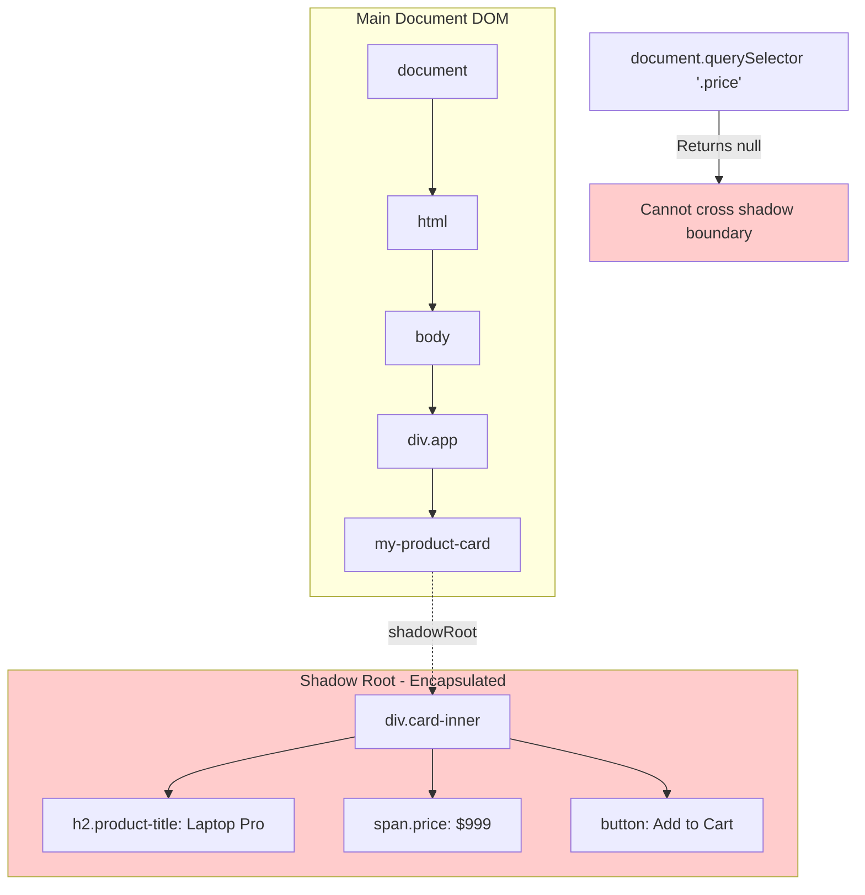
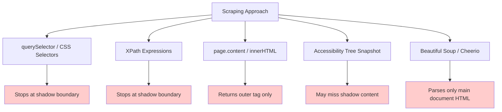
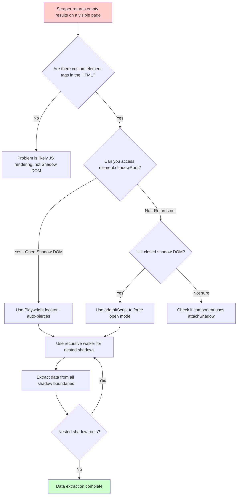

Your AI scraper loads a page, parses the DOM, and returns an empty result. No errors, no timeouts, no blocked requests. The page clearly has content when you open it in a browser, but your scraper sees nothing. If this sounds familiar, there is a good chance you have run into the Shadow DOM.

As modern design systems and component libraries adopt Web Components, more of the web's visible content lives inside shadow roots that are invisible to standard scraping techniques. The accessibility tree snapshots that many AI browser agents rely on cannot reach into these encapsulated subtrees. Your `querySelector` calls return null. Your XPath expressions match nothing. And the page looks perfectly fine to a human user.

## How Shadow DOM Works

The Shadow DOM is a web standard that allows developers to create encapsulated DOM subtrees inside regular HTML elements. These subtrees are isolated from the rest of the document -- their styles do not leak out, and external styles do not leak in. The elements inside a shadow root are invisible to selectors operating on the main document.



When a developer creates a Web Component, they attach a shadow root to their custom element. Everything rendered inside that shadow root is part of the component's internal structure. From the outside, you can see the custom element tag -- something like `<my-product-card>` -- but you cannot see or query its internal elements using standard DOM methods.

```javascript
// How a developer creates a Shadow DOM component
class ProductCard extends HTMLElement {
  constructor() {
    super();
    // Attach a shadow root -- this creates the encapsulation boundary
    const shadow = this.attachShadow({ mode: "open" });

    shadow.innerHTML = `
      <style>
        .card { border: 1px solid #ccc; padding: 16px; }
        .price { font-size: 24px; color: green; }
      </style>
      <div class="card">
        <h2 class="product-title">Laptop Pro</h2>
        <span class="price">$999</span>
        <button>Add to Cart</button>
      </div>
    `;
  }
}

customElements.define("my-product-card", ProductCard);
```

```python
# What a traditional scraper sees when it encounters this component
from playwright.sync_api import sync_playwright

with sync_playwright() as p:
    browser = p.chromium.launch()
    page = browser.new_page()
    page.set_content("""
        <html>
        <body>
            <h1>Products</h1>
            <my-product-card></my-product-card>
        </body>
        </html>
    """)

    # This works -- the h1 is in the main document
    title = page.query_selector("h1")
    print(f"Page title: {title.text_content()}")  # "Products"

    # This returns None -- the price is inside shadow DOM
    price = page.query_selector(".price")
    print(f"Price: {price}")  # None

    browser.close()
```

## Why Traditional Scraping Approaches Fail

The problem is not limited to `querySelector`. Every major scraping approach has a blind spot at shadow DOM boundaries.



CSS selectors and `querySelector` operate on the document's DOM tree. Shadow roots are not part of that tree, so selectors cannot cross into them. `document.querySelector('.price')` will never find an element with class `price` inside a shadow root.

XPath has the same limitation. It navigates the document tree, and shadow roots are separate trees. An XPath like `//span[@class='price']` will not match elements inside shadow DOM.

When you call `page.content()` in Playwright or `page.evaluate(() => document.documentElement.innerHTML)`, you get the serialized HTML of the main document. Custom elements show up as their tags (like `<my-product-card></my-product-card>`) but their shadow DOM content is not serialized.

Accessibility tree snapshots are the approach many AI browser agents use. They request the accessibility tree to understand page structure without processing raw HTML. Many accessibility tree implementations do not fully traverse shadow roots, leaving AI agents blind to parts of the page.

HTML parsers like Beautiful Soup and Cheerio parse the raw HTML string. Since shadow DOM is created by JavaScript at runtime, it does not exist in the HTML source. Parsers that work with the initial HTML will never see shadow DOM content.

```python
# Demonstrating the failure with Beautiful Soup
from bs4 import BeautifulSoup

# This is what the raw HTML looks like
raw_html = """
<html>
<body>
    <h1>Products</h1>
    <my-product-card></my-product-card>
    <my-product-card></my-product-card>
</body>
</html>
"""

soup = BeautifulSoup(raw_html, "html.parser")

# Find all product titles -- returns empty because they are in shadow DOM
titles = soup.select(".product-title")
print(f"Found {len(titles)} titles")  # 0

# Find the custom elements -- they exist but are empty
cards = soup.find_all("my-product-card")
print(f"Found {len(cards)} cards")  # 2
print(f"Card content: '{cards[0].text}'")  # Empty string
```

## Which Component Libraries Use Shadow DOM

Shadow DOM adoption is growing. The major component libraries and design systems that use it:

- Shoelace (now Web Awesome): A popular component library built entirely on Web Components with Shadow DOM
- Lit: Google's library for building Web Components, shadow DOM by default
- Ionic: The mobile UI framework uses Shadow DOM for its component encapsulation
- SAP UI5 Web Components: Enterprise UI components with shadow DOM
- Stencil: A compiler for building Web Components, shadow DOM optional but common
- Material Web: Google's Material Design components for the web, built on Lit

If you are scraping sites that use any of these libraries, you will encounter shadow DOM. Enterprise applications, design system-heavy sites, and modern SPAs are the most likely to use these patterns.

## Piercing Open Shadow DOM

Open shadow DOM -- the most common type -- can be accessed programmatically. When a component uses `attachShadow({ mode: 'open' })`, the shadow root is available via the element's `shadowRoot` property.

```javascript
// Accessing open shadow DOM in the browser console or via evaluate()
const card = document.querySelector("my-product-card");
const shadowRoot = card.shadowRoot; // This works for open shadow DOM

// Now you can query inside the shadow root
const price = shadowRoot.querySelector(".price");
console.log(price.textContent); // "$999"

// You can also use more complex selectors within the shadow root
const title = shadowRoot.querySelector("h2.product-title");
const button = shadowRoot.querySelector("button");
console.log(title.textContent); // "Laptop Pro"
console.log(button.textContent); // "Add to Cart"
```

```python
# Piercing shadow DOM with Playwright's evaluate
from playwright.sync_api import sync_playwright

def extract_from_shadow_dom(page, host_selector, inner_selector):
    """Extract text from an element inside a shadow root."""
    return page.evaluate("""
        ([hostSel, innerSel]) => {
            const host = document.querySelector(hostSel);
            if (!host || !host.shadowRoot) return null;
            const target = host.shadowRoot.querySelector(innerSel);
            return target ? target.textContent : null;
        }
    """, [host_selector, inner_selector])

with sync_playwright() as p:
    browser = p.chromium.launch()
    page = browser.new_page()
    page.goto("https://example.com/products")

    # Extract price from inside a shadow DOM component
    price = extract_from_shadow_dom(page, "my-product-card", ".price")
    print(f"Price: {price}")

    # Extract all products by iterating over host elements
    products = page.evaluate("""
        () => {
            const cards = document.querySelectorAll('my-product-card');
            return Array.from(cards).map(card => {
                const shadow = card.shadowRoot;
                if (!shadow) return null;
                return {
                    title: shadow.querySelector('.product-title')?.textContent,
                    price: shadow.querySelector('.price')?.textContent,
                };
            }).filter(Boolean);
        }
    """)

    for product in products:
        print(f"{product['title']}: {product['price']}")

    browser.close()
```

## Playwright's Built-In Shadow DOM Piercing

Playwright has a notable advantage over other automation tools here. Its `locator` API can automatically pierce shadow DOM boundaries. When you use `page.locator()`, Playwright traverses into open shadow roots by default.

```python
# Playwright's locator pierces shadow DOM automatically
from playwright.sync_api import sync_playwright

with sync_playwright() as p:
    browser = p.chromium.launch()
    page = browser.new_page()
    page.goto("https://example.com/products")

    # This works even though .price is inside shadow DOM
    # Playwright's locator pierces open shadow roots automatically
    prices = page.locator(".price").all_text_contents()
    print(f"Found {len(prices)} prices: {prices}")

    # Role-based locators also pierce shadow DOM
    buttons = page.get_by_role("button", name="Add to Cart").all()
    print(f"Found {len(buttons)} add-to-cart buttons")

    # Text-based locators work across shadow boundaries
    laptop = page.get_by_text("Laptop Pro")
    print(f"Found product: {laptop.text_content()}")

    browser.close()
```

```javascript
// Playwright's JavaScript API with shadow DOM piercing
const { chromium } = require("playwright");

async function scrapeWithShadowPiercing() {
  const browser = await chromium.launch();
  const page = await browser.newPage();
  await page.goto("https://example.com/products");

  // Playwright locators pierce shadow DOM automatically
  const prices = await page.locator(".price").allTextContents();
  console.log(`Found ${prices.length} prices:`, prices);

  // Get all product data using locators that cross shadow boundaries
  const cards = page.locator("my-product-card");
  const count = await cards.count();

  for (let i = 0; i < count; i++) {
    const card = cards.nth(i);
    const title = await card.locator(".product-title").textContent();
    const price = await card.locator(".price").textContent();
    console.log(`${title}: ${price}`);
  }

  await browser.close();
}

scrapeWithShadowPiercing();
```

Playwright is the strongest option for scraping sites with Web Components. Puppeteer does not pierce shadow DOM by default, and most other tools have no shadow DOM support at all.

## The Recursive Shadow DOM Walker

Sometimes you need to go deeper. Shadow DOM can be nested: a component inside a shadow root can itself have a shadow root. And you may not know in advance which elements host shadow roots. For these cases, a recursive walker that traverses the entire tree, crossing every shadow boundary, is the right tool.

```javascript
// Recursive shadow DOM walker -- finds all elements across all shadow roots
function walkShadowDom(root, callback, depth = 0) {
  const elements = root.querySelectorAll("*");

  for (const element of elements) {
    callback(element, depth);

    // If this element has a shadow root, recurse into it
    if (element.shadowRoot) {
      walkShadowDom(element.shadowRoot, callback, depth + 1);
    }
  }
}

// Usage: find all text content across all shadow boundaries
function extractAllText(rootElement) {
  const texts = [];

  walkShadowDom(rootElement || document, (element, depth) => {
    // Only collect text from leaf-like elements
    if (
      element.children.length === 0 &&
      element.textContent.trim() &&
      !["SCRIPT", "STYLE"].includes(element.tagName)
    ) {
      texts.push({
        tag: element.tagName.toLowerCase(),
        text: element.textContent.trim(),
        shadowDepth: depth,
        classes: Array.from(element.classList),
      });
    }
  });

  return texts;
}

// Usage: find specific elements across shadow boundaries
function deepQuerySelectorAll(root, selector) {
  const results = [];

  // Check direct children first
  results.push(...root.querySelectorAll(selector));

  // Then check inside shadow roots
  walkShadowDom(root, (element) => {
    if (element.shadowRoot) {
      results.push(...element.shadowRoot.querySelectorAll(selector));
    }
  });

  return results;
}
```

```python
# Using the recursive walker from Playwright via evaluate
from playwright.sync_api import sync_playwright

def deep_extract(page, selector):
    """Extract all matching elements, piercing all shadow DOM boundaries."""
    return page.evaluate("""
        (selector) => {
            const results = [];

            function walkShadowDom(root) {
                const matches = root.querySelectorAll(selector);
                for (const match of matches) {
                    results.push({
                        tag: match.tagName.toLowerCase(),
                        text: match.textContent.trim(),
                        html: match.outerHTML.slice(0, 200)
                    });
                }

                // Recurse into shadow roots
                const allElements = root.querySelectorAll('*');
                for (const el of allElements) {
                    if (el.shadowRoot) {
                        walkShadowDom(el.shadowRoot);
                    }
                }
            }

            walkShadowDom(document);
            return results;
        }
    """, selector)

with sync_playwright() as p:
    browser = p.chromium.launch()
    page = browser.new_page()
    page.goto("https://example.com")

    # Find all prices, regardless of how deeply nested in shadow DOM
    prices = deep_extract(page, ".price")
    for price in prices:
        print(f"Found price: {price['text']}")

    # Find all buttons across shadow boundaries
    buttons = deep_extract(page, "button")
    for btn in buttons:
        print(f"Found button: {btn['text']}")

    browser.close()
```

## Handling Closed Shadow DOM

Closed shadow DOM is a different beast. When a component uses `attachShadow({ mode: 'closed' })`, the browser does not expose the `shadowRoot` property at all. From JavaScript, there is no standard way to access the internal elements.

```javascript
// Closed shadow DOM -- no standard access
class SecureWidget extends HTMLElement {
  constructor() {
    super();
    // mode: 'closed' means shadowRoot returns null from outside
    const shadow = this.attachShadow({ mode: "closed" });
    shadow.innerHTML = `
      <div class="secure-content">
        <p>This content is hidden from external JavaScript</p>
      </div>
    `;
  }
}

customElements.define("secure-widget", SecureWidget);

// From outside:
const widget = document.querySelector("secure-widget");
console.log(widget.shadowRoot); // null -- no access
```

In practice, closed shadow DOM is rare. Most component libraries use open shadow DOM because developers need to access their own components' internals for testing and debugging. When you do encounter it, there are a few options.

The most reliable approach with Playwright is to intercept the `attachShadow` call before the page loads and force all shadow roots to be open:

```python
# Force all shadow roots to be open by intercepting attachShadow
from playwright.sync_api import sync_playwright

with sync_playwright() as p:
    browser = p.chromium.launch()
    page = browser.new_page()

    # Inject script before any page JavaScript runs
    page.add_init_script("""
        const originalAttachShadow = Element.prototype.attachShadow;
        Element.prototype.attachShadow = function(options) {
            // Force open mode regardless of what the component requests
            return originalAttachShadow.call(this, {
                ...options,
                mode: 'open'
            });
        };
    """)

    page.goto("https://example.com")

    # Now all shadow roots are open and accessible
    # Even components that used mode: 'closed' will be queryable
    content = page.locator(".secure-content").text_content()
    print(f"Extracted from closed shadow DOM: {content}")

    browser.close()
```

```javascript
// JavaScript equivalent: force open shadow DOM
const { chromium } = require("playwright");

async function scrapeClosedShadowDom(url) {
  const browser = await chromium.launch();
  const page = await browser.newPage();

  // Intercept attachShadow before the page loads
  await page.addInitScript(() => {
    const original = Element.prototype.attachShadow;
    Element.prototype.attachShadow = function (options) {
      return original.call(this, { ...options, mode: "open" });
    };
  });

  await page.goto(url);

  // All shadow roots are now open and pierceable
  const content = await page.locator(".secure-content").allTextContents();
  console.log("Extracted content:", content);

  await browser.close();
}
```

This technique works because `addInitScript` runs before any page JavaScript executes. By overriding `attachShadow`, every shadow root created on the page becomes open, regardless of what the original code specified.

## A Decision Flowchart for Shadow DOM Scraping

When your scraper returns empty results on a page that clearly has content, here is how to approach the problem:



## Why AI Agents Struggle the Most

The shadow DOM problem is particularly bad for AI browser agents. Most AI agent frameworks build their understanding of a page through one of two methods: parsing the raw HTML or reading the accessibility tree. Both have shadow DOM blind spots.

When an AI agent calls `page.content()` to get the page HTML, shadow DOM content is missing from the output. The agent sees the custom element tags but not their contents. It cannot reason about elements it cannot see, so it either produces incomplete results or hallucinates content based on context clues.

Accessibility tree snapshots are theoretically better because the browser's accessibility engine does traverse into shadow DOM in some cases. But the implementation is inconsistent. Some shadow DOM components correctly expose their semantics to the accessibility tree, while others do not. An AI agent relying on accessibility snapshots will get partial results at best.

Unlike a 403 error or a CAPTCHA challenge, there is no visible failure. The agent proceeds confidently with incomplete data, and you may not realize the problem until you compare the scraper's output to what a human sees on the page.

## Practical Takeaways

Shadow DOM is not going away. The Web Components standard is gaining adoption, major component libraries are built on it, and the encapsulation it provides is genuinely valuable for frontend development. Scraping tools and techniques need to adapt.

Use Playwright with its built-in shadow DOM piercing for new scraping projects. For pages with closed shadow DOM, the `addInitScript` technique to force open mode is reliable. For complex nested shadow DOM structures, implement a recursive walker that traverses every shadow boundary. And if you are building or evaluating AI browser agents, test them against shadow DOM content explicitly -- do not assume they handle it correctly.

The web is getting more complex structurally even as it becomes more visually consistent. Knowing where your scraper's vision ends and shadow DOM begins is the difference between collecting complete data and silently missing half the page.
