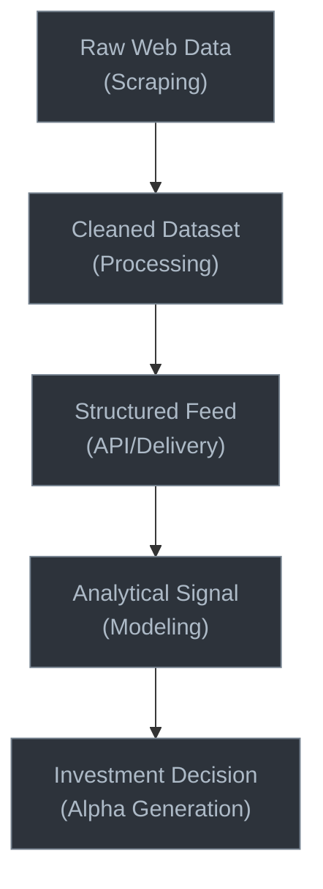
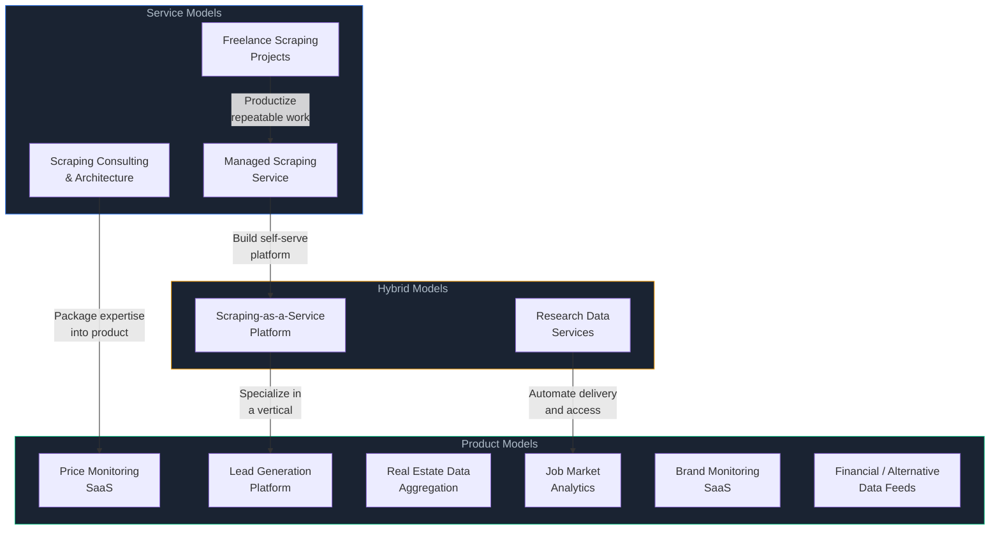
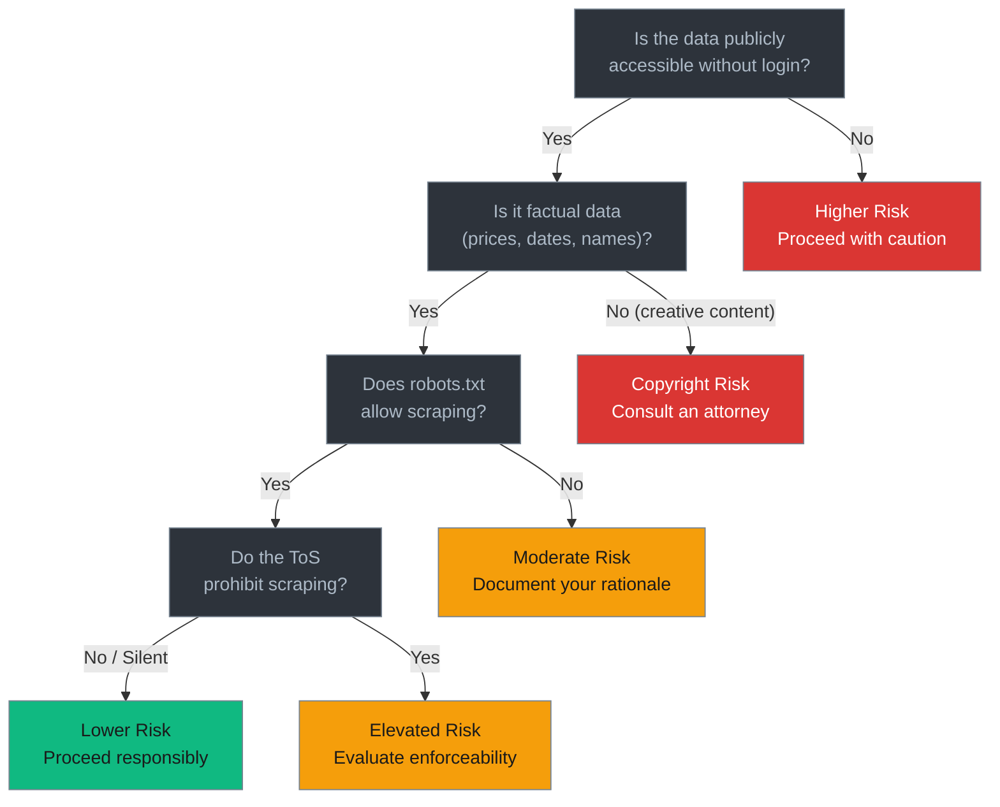

[Web scraping](/posts/web-scraping-explained-what-why-how/) powers billion-dollar businesses. Companies like ZoomInfo, Zillow, Glassdoor, and Similarweb all built their foundations on publicly available web data. The [real-world uses of web scraping](/posts/real-world-uses-web-scraping-beyond-basics/) extend far beyond what most people expect. The scraping-to-revenue pipeline is not a secret, and it is not inherently shady. The difference between a scraping side project and a scraping business comes down to three things: choosing the right data, adding genuine value on top of it, and operating within legal and ethical boundaries. This post lays out the legitimate business models that turn web scraping into profit -- from bootstrappable solo projects to venture-scale SaaS platforms -- along with realistic revenue expectations, legal guardrails, and the ethical lines you should not cross.

## Business Model 1: Price Monitoring and Competitive Intelligence

Price monitoring is the most established commercial application of web scraping. Retailers, brands, and e-commerce sellers need to know what their competitors are charging -- in real time, across thousands of SKUs, across dozens of marketplaces.

The business model is straightforward: build scrapers that track product prices on competitor websites, marketplaces like Amazon and Walmart, and comparison shopping engines. Package the data into dashboards, alerts, and analytics. Sell it as a SaaS subscription.

**Why it works:**

- Pricing data changes constantly, so customers need ongoing access (recurring revenue)
- The value proposition is clear and measurable -- customers can directly tie your data to their pricing decisions
- The data is publicly displayed to any visitor, reducing legal risk
- Enterprise customers (retailers, brands, distributors) have significant budgets for competitive intelligence

**What you would scrape:**

- Product pages on e-commerce sites (price, availability, shipping cost, seller name)
- Marketplace listings (Amazon, eBay, Walmart Marketplace)
- Comparison shopping engines (Google Shopping, PriceGrabber)
- Promotional pages, coupon sites, deal aggregators

**Existing players:** Prisync, Competera, Price2Spy, Keepa (Amazon-focused), and dozens of vertical-specific tools. The market is large enough that niche players thrive by focusing on specific industries -- automotive parts, electronics, grocery, fashion.

**Revenue potential:** SaaS pricing typically ranges from $50-500/month for small businesses tracking a few hundred products, up to $5,000-50,000/month for enterprise customers tracking millions of SKUs across global markets. A solo founder can realistically reach $5,000-15,000 MRR within 12-18 months by focusing on a specific vertical.

```python
# Simplified price monitoring architecture
import hashlib
from dataclasses import dataclass
from datetime import datetime

@dataclass
class PricePoint:
    product_id: str
    source: str
    price: float
    currency: str
    in_stock: bool
    timestamp: datetime
    url: str

class PriceMonitor:
    def __init__(self, storage, alert_engine):
        self.storage = storage
        self.alert_engine = alert_engine

    def process_scraped_price(self, price_point: PricePoint):
        """Store price and check for significant changes."""
        previous = self.storage.get_latest(
            price_point.product_id,
            price_point.source
        )

        self.storage.save(price_point)

        if previous and self.is_significant_change(previous, price_point):
            self.alert_engine.notify(
                product_id=price_point.product_id,
                old_price=previous.price,
                new_price=price_point.price,
                source=price_point.source,
                change_pct=self._calc_change(previous.price, price_point.price)
            )

    def is_significant_change(self, old: PricePoint, new: PricePoint) -> bool:
        if old.in_stock and not new.in_stock:
            return True  # Stock status change
        change = abs(new.price - old.price) / old.price
        return change > 0.02  # More than 2% price change

    def _calc_change(self, old_price: float, new_price: float) -> float:
        return ((new_price - old_price) / old_price) * 100
```

## Business Model 2: Lead Generation

Lead generation through web scraping means aggregating business contact information from publicly available sources -- company websites, business directories, professional networks, government registries, press releases, and industry databases -- then packaging it for sales teams.

**Why it works:**

- Sales teams are desperate for accurate, up-to-date contact data
- Public business information is scattered across hundreds of sources
- The aggregation and deduplication step is where the real value lies
- High willingness to pay -- a single closed deal can justify months of subscription fees

**What you would scrape:**

- Business directories (Yellow Pages, Yelp, industry-specific directories)
- Company websites (about pages, team pages, contact pages)
- Government business registries (state secretary of state filings, FCC databases)
- Press releases and news articles (new hires, expansions, funding rounds)
- Job postings (signals of growth and technology stack)

**Critical boundaries:** Scraping personal email addresses and phone numbers from social media profiles crosses into legally risky territory. Stick to business contact information that companies themselves have made public. Avoid scraping LinkedIn profiles directly -- LinkedIn has aggressively litigated against scrapers, and while the hiQ v. LinkedIn case established some precedents, the legal landscape remains contested.

**Revenue potential:** Lead data platforms typically charge $100-500/month for small teams, $1,000-10,000/month for larger sales organizations. Niche lead databases (e.g., "all dentists in the US with their technology stack" or "newly funded startups with their hiring status") can command premium pricing. A focused solo operation can generate $3,000-10,000 MRR within a year.

## Business Model 3: Real Estate Data Aggregation

Real estate is one of the most data-hungry industries, and much of that data lives on the public web. Property listings, sale prices, tax assessments, zoning records, permit applications, rental rates, and neighborhood statistics are all publicly available but scattered across hundreds of county websites, MLS feeds, listing portals, and government databases.

**Why it works:**

- Real estate professionals (agents, investors, developers, property managers) make high-value decisions based on data
- The data sources are fragmented and inconsistent, creating a strong aggregation opportunity
- Historical data is extremely valuable -- tracking price trends over years or decades
- The market is enormous and the buyers have real budgets

**What you would scrape:**

- Property listing sites (Zillow, Realtor.com, Redfin -- note their ToS restrictions)
- County assessor and recorder websites (tax records, deed transfers, liens)
- Permit and zoning databases (building permits, zoning changes)
- Rental listing sites (Craigslist, Apartments.com, local rental boards)
- Auction and foreclosure listings
- Census and demographic data portals

**Revenue potential:** Real estate data services range from $200/month for individual investors to $10,000+/month for institutional clients. Companies like ATTOM Data, CoreLogic, and HouseCanary operate at massive scale, but there is significant room for niche players focused on specific markets, property types, or use cases. A bootstrapped operation focused on a single metro area can reach $5,000-20,000 MRR.

```python
# Real estate data aggregation pipeline
from dataclasses import dataclass, field
from typing import Optional

@dataclass
class PropertyRecord:
    address: str
    city: str
    state: str
    zip_code: str
    parcel_id: Optional[str] = None

    # Listing data
    list_price: Optional[float] = None
    list_date: Optional[str] = None
    status: Optional[str] = None  # active, pending, sold

    # Assessment data
    assessed_value: Optional[float] = None
    tax_amount: Optional[float] = None
    last_sale_price: Optional[float] = None
    last_sale_date: Optional[str] = None

    # Property details
    bedrooms: Optional[int] = None
    bathrooms: Optional[float] = None
    square_feet: Optional[int] = None
    lot_size: Optional[float] = None
    year_built: Optional[int] = None

    # Enrichment
    sources: list = field(default_factory=list)
    confidence_score: float = 0.0

class PropertyMatcher:
    """
    The core challenge in real estate aggregation:
    matching records across sources that use different
    formats, IDs, and levels of detail.
    """
    def match(self, record_a: PropertyRecord, record_b: PropertyRecord) -> float:
        score = 0.0

        # Parcel ID match is strongest signal
        if record_a.parcel_id and record_b.parcel_id:
            if record_a.parcel_id == record_b.parcel_id:
                return 0.99

        # Address normalization and fuzzy matching
        addr_similarity = self._normalize_and_compare_addresses(
            record_a.address, record_b.address
        )
        score += addr_similarity * 0.6

        # Geographic match
        if record_a.zip_code == record_b.zip_code:
            score += 0.2

        # Property characteristics as confirmation
        if record_a.square_feet and record_b.square_feet:
            if abs(record_a.square_feet - record_b.square_feet) < 50:
                score += 0.1

        if record_a.year_built and record_b.year_built:
            if record_a.year_built == record_b.year_built:
                score += 0.1

        return min(score, 1.0)

    def _normalize_and_compare_addresses(self, addr_a: str, addr_b: str) -> float:
        # Address normalization: St -> Street, Ave -> Avenue, etc.
        # Then fuzzy string matching
        # This is where real complexity lives
        pass
```

<figure>
  
  <figcaption>Data turns raw listings into market intelligence. <span class="img-credit">Photo by Echo Zhang / <a href="https://www.pexels.com" target="_blank" rel="noopener noreferrer">Pexels</a></span></figcaption>
</figure>

## Business Model 4: Job Market Analytics

Job postings are a goldmine of structured data. Every job listing reveals information about which companies are hiring, what skills are in demand, what salaries are being offered, what technologies organizations use, and where growth is happening. Aggregating and analyzing this data serves multiple buyer personas.

**Why it works:**

- Job postings are intentionally public -- companies want them to be found
- The data changes constantly (new postings daily, old ones expiring)
- Multiple buyer segments: recruiters, job seekers, investors, workforce planners, educators
- Salary transparency laws are creating richer data in many jurisdictions

**What you would scrape:**

- Job boards (Indeed, LinkedIn Jobs, Glassdoor, ZipRecruiter)
- Company career pages directly
- Government job databases
- Freelancing platforms (Upwork, Toptal)
- Industry-specific job boards (Dice for tech, Mediabistro for media)

**Value-added analytics you could build:**

- Salary benchmarking by role, location, and industry
- Skill demand trends over time (which programming languages are growing, which are declining)
- Company hiring velocity as a signal of growth or contraction
- Geographic talent demand shifts (remote vs. on-site trends)
- Technology stack intelligence (what tools companies actually use)

**Revenue potential:** Job market analytics platforms sell to HR departments ($500-5,000/month), staffing agencies ($1,000-10,000/month), and investment firms using hiring data as alternative data signals ($5,000-50,000/month). A niche operation focused on a specific industry vertical can reach $3,000-15,000 MRR.

## Business Model 5: Academic and Research Data Services

Researchers across every academic discipline need data, and many of them lack the technical skills or infrastructure to collect it at scale. Social scientists studying online discourse, economists analyzing market dynamics, epidemiologists tracking health information, political scientists monitoring media coverage -- all of them need web data, and many are willing to pay for it.

**Why it works:**

- Academic budgets for data acquisition are real (grant-funded research often has dedicated data budgets)
- Researchers need reproducible, well-documented datasets
- The barrier is technical, not financial -- researchers can afford data but cannot build scrapers
- Longitudinal datasets (data collected over time) become more valuable as they grow

**What you would scrape:**

- News articles and media coverage (for content analysis, sentiment studies)
- Social media posts and discussions (for discourse analysis, trend detection)
- Government data portals (for policy research, economic analysis)
- Scientific publication metadata (for bibliometric analysis)
- Product reviews and ratings (for consumer behavior research)

**Key differentiator:** Academic clients care about data quality, documentation, and methodology more than speed. They need to cite their data sources in publications and defend their methodology in peer review. Providing detailed documentation about collection methods, coverage, and limitations is as important as the data itself.

**Revenue potential:** Individual dataset sales range from $500-5,000. Ongoing data feeds for research groups run $500-3,000/month. University-wide licenses can reach $10,000-50,000/year. This model tends to produce lower but very stable revenue, and it pairs well with other business models.

## Business Model 6: Brand Monitoring

Brand monitoring means tracking what the internet says about a company, product, or person. This includes reviews, social media mentions, news coverage, forum discussions, blog posts, and any other public content where a brand appears. Companies need this data to manage their reputation, respond to crises, understand customer sentiment, and track competitor perception.

**Why it works:**

- Every company with a public presence cares about its reputation
- The data sources are vast and constantly changing
- Sentiment analysis and trend detection add significant analytical value
- Direct connection to business outcomes (a viral negative review can cost millions)

**What you would scrape:**

- Review platforms (Google Reviews, Trustpilot, G2, Capterra, industry-specific review sites)
- Social media (Twitter/X, Reddit, Facebook public pages)
- News sites and blogs
- Forums and community sites
- App store reviews (Apple App Store, Google Play)
- Consumer complaint sites (BBB, Consumer Affairs)

```python
# Brand monitoring pipeline
from dataclasses import dataclass
from datetime import datetime
from enum import Enum

class Sentiment(Enum):
    POSITIVE = "positive"
    NEGATIVE = "negative"
    NEUTRAL = "neutral"
    MIXED = "mixed"

class MentionType(Enum):
    REVIEW = "review"
    NEWS = "news"
    SOCIAL = "social"
    FORUM = "forum"
    BLOG = "blog"

@dataclass
class BrandMention:
    brand: str
    source_url: str
    source_type: MentionType
    content: str
    sentiment: Sentiment
    sentiment_score: float  # -1.0 to 1.0
    author: str
    published_at: datetime
    discovered_at: datetime
    reach_estimate: int  # estimated audience size
    keywords: list

class AlertRule:
    """Configurable alert rules for brand monitoring."""
    def __init__(self, brand: str):
        self.brand = brand
        self.rules = []

    def alert_on_negative_spike(self, threshold_pct: float = 20.0):
        """Alert when negative mentions spike above baseline."""
        self.rules.append({
            "type": "negative_spike",
            "threshold": threshold_pct
        })
        return self

    def alert_on_high_reach_negative(self, min_reach: int = 10000):
        """Alert when a negative mention has high reach."""
        self.rules.append({
            "type": "high_reach_negative",
            "min_reach": min_reach
        })
        return self

    def alert_on_new_source(self):
        """Alert when brand is mentioned on a new source."""
        self.rules.append({"type": "new_source"})
        return self
```

**Revenue potential:** Brand monitoring SaaS typically charges $100-500/month for small businesses, $1,000-5,000/month for mid-market, and $5,000-25,000/month for enterprise with full-service analytics. The market is competitive (Mention, Brandwatch, Brand24 are established players), but vertical-specific monitoring tools (e.g., restaurant review monitoring, healthcare provider review tracking) can carve out profitable niches. A focused solo operation can reach $3,000-10,000 MRR.

<figure>
  
  <figcaption>Monitoring at scale requires automation — there's no manual alternative. <span class="img-credit">Photo by ThisIsEngineering / <a href="https://www.pexels.com" target="_blank" rel="noopener noreferrer">Pexels</a></span></figcaption>
</figure>

## Business Model 7: Financial Data and Alternative Data

The financial industry has an insatiable appetite for data. Traditional financial data (stock prices, SEC filings, earnings reports) is well-served by established providers like Bloomberg and Refinitiv. The opportunity for scraping-based businesses lies in "alternative data" -- non-traditional data sources that provide investment signals ahead of conventional metrics.

**Why it works:**

- Financial firms pay premium prices for any data that provides an informational edge
- Alternative data is a rapidly growing market (projected to exceed $100 billion by 2030)
- Much of the most valuable alternative data lives on the public web
- Even small datasets can be extremely valuable if they provide genuine predictive signal

**What you would scrape:**

- SEC EDGAR filings (10-K, 10-Q, 8-K, insider transaction forms)
- Satellite imagery metadata and shipping data
- Job postings as growth/contraction signals
- App download estimates and usage metrics
- Consumer review trends and sentiment
- Government contract awards and procurement data
- Patent filings and intellectual property databases
- Earnings call transcripts

**The alternative data value chain:**



Most scraping-based businesses operate at the first three levels -- collecting, cleaning, and delivering data. Some move further up the chain into analytics and signal generation, which commands higher prices but requires domain expertise in quantitative finance.

**Revenue potential:** This is the highest-revenue model on this list, but also the hardest to break into. Alternative data feeds sell for $5,000-100,000+/month to hedge funds and asset managers. Even a single institutional client can represent six-figure annual revenue. However, the sales cycle is long (6-12 months), the quality bar is extremely high, and you are competing against well-funded data vendors. Realistic path: start with a niche dataset, prove its value, and grow from there.

## Business Model 8: Scraping-as-a-Service

The most accessible entry point into scraping for profit is offering your scraping skills as a service. This means building custom scrapers for clients who need specific data but lack the technical capability to extract it themselves.

**Why it works:**

- Low startup cost -- you are selling skills, not building a product
- Immediate revenue -- no need to build a full platform before earning
- Every industry has scraping needs, so the addressable market is huge
- Project-based work can evolve into recurring maintenance contracts

**Service models:**

1. **Freelance scraping projects:** One-off data extraction jobs. Client needs a specific dataset, you build a scraper, deliver the data. Typical pricing: $500-5,000 per project.

2. **Managed scraping service:** You build and maintain scrapers that run on a schedule, delivering fresh data to clients regularly. Typical pricing: $500-5,000/month per client.

3. **Scraping agency:** Multiple scraping engineers handling a portfolio of clients. This scales beyond what one person can manage but requires hiring and operational overhead.

4. **Consulting and architecture:** Advising companies on how to build their own scraping infrastructure. Higher hourly rates ($150-300/hour) but requires deep expertise.

```python
# Project scoping template for scraping-as-a-service
PROJECT_SCOPING = {
    "data_requirements": {
        "target_sites": [],         # Which sites to scrape
        "data_fields": [],          # What data points to extract
        "volume": 0,                # How many records
        "frequency": "one-time",    # one-time, daily, weekly, real-time
        "historical_depth": None,   # How far back
    },
    "technical_assessment": {
        "site_complexity": "low",   # low, medium, high
        "anti-bot_measures": "none",# none, basic, advanced, aggressive
        "javascript_required": False,
        "login_required": False,
        "pagination_type": "standard",
        "data_format": "structured",# structured, semi-structured, unstructured
    },
    "delivery": {
        "format": "csv",            # csv, json, api, database
        "delivery_method": "email", # email, s3, api, webhook
        "quality_checks": [],
    },
    "pricing_factors": {
        "estimated_hours": 0,
        "ongoing_maintenance": False,
        "infrastructure_cost": 0,
        "complexity_multiplier": 1.0,
    }
}
```

**Revenue potential:** Freelance scrapers on platforms like Upwork earn $50-150/hour depending on expertise. A solo consultant with direct clients can earn $10,000-30,000/month. An agency with 3-5 engineers can generate $30,000-100,000/month. The ceiling is lower than product businesses, but the floor is higher -- you can start earning within weeks rather than months.

## The Business Model Spectrum

These eight models exist on a spectrum from pure service to pure product. Understanding where each sits helps you choose based on your skills, resources, and goals.



**Service models** (left side) are easier to start, generate revenue faster, but scale linearly with your time. **Product models** (right side) take longer to build, require upfront investment, but scale independently of your time once established. **Hybrid models** sit in between, combining elements of both.

The common progression is: start with services to learn the market, identify a repeatable data need, then productize it. Many successful scraping businesses followed exactly this path.

## Legal Considerations

Profiting from web scraping means taking legal risk seriously. The question is not "is web scraping legal?" (it depends) but "what scraping activities carry what level of legal risk?" For a deeper dive into [what courts have actually said about scraping](/posts/legal-myths-web-scraping-what-courts-actually-say/), see our legal analysis.

**Generally lower risk:**

- Scraping publicly accessible data that anyone can see without logging in
- Scraping government and public records databases
- Scraping data that the site explicitly makes available (e.g., through sitemaps or feeds)
- Aggregating factual data (prices, addresses, business hours) as opposed to creative content
- Respecting robots.txt and rate limits
- Operating within the boundaries of the hiQ v. LinkedIn precedent (public data, no circumvention of access controls)

**Higher risk:**

- Scraping behind login walls or paywalls
- Circumventing technical access controls (CAPTCHAs, IP blocks, bot detection)
- Scraping copyrighted content in bulk (articles, images, creative works)
- Scraping personal data subject to privacy regulations (GDPR, CCPA)
- Violating explicit Terms of Service after receiving a cease-and-desist
- Scraping data from sites that have successfully sued scrapers before (LinkedIn, Craigslist, Facebook)

**Practical legal safeguards:**

1. **Read the Terms of Service** for every site you scrape commercially. Not all ToS are enforceable, but knowingly violating them strengthens legal claims against you.
2. **Respect robots.txt.** Courts have treated it as evidence of a website's intent regarding automated access.
3. **Do not scrape personal data** unless you have a clear legal basis under applicable privacy laws.
4. **Add transformative value.** Selling raw scraped content is far riskier than selling analytics, aggregations, or insights derived from scraped data.
5. **Incorporate a legal entity.** Do not operate a commercial scraping business as a sole proprietorship -- limit your personal liability.
6. **Consult an attorney** before scaling any scraping business beyond side-project revenue. A few thousand dollars in legal advice can save you from six-figure lawsuits.



**Disclaimer:** This article is for educational purposes only. It does not constitute legal advice. Consult a qualified attorney for guidance on your specific situation.

## Getting Started: From Idea to Revenue

If you are reading this and want to start a scraping-based business, here is a practical roadmap.

**Step 1: Pick a niche.** Do not try to build a general-purpose scraping platform on day one. Choose a specific industry and data need. The more specific, the better. "Price monitoring for independent auto parts retailers" is better than "price monitoring."

**Step 2: Validate demand before writing code.** Talk to potential customers. Post in industry forums. Run a small ad campaign. The goal is to confirm that people will pay for the data you plan to collect. The fastest way to validate: offer to manually compile a sample dataset and see if anyone will pay for it.

**Step 3: Build a minimum viable scraper.** You do not need a perfect system. You need a scraper that reliably collects the core data, a basic cleaning pipeline, and a delivery mechanism (even if it is just a CSV emailed weekly). Python with requests/BeautifulSoup or Playwright is sufficient to start.

**Step 4: Get your first paying customer.** Price low enough to remove friction, but not free. Even $50/month proves that someone values your data. Offer manual customization and white-glove onboarding -- things that do not scale, but that build deep understanding of what customers actually need.

**Step 5: Iterate based on real usage.** Watch how customers use your data. What do they ask for? What do they ignore? What would make them pay more? This feedback loop is worth more than any market research.

**Step 6: Invest in reliability.** Once you have paying customers, reliability becomes your top priority. Scrapers break constantly -- sites change their HTML, deploy new bot detection, or restructure their URLs. Build monitoring, alerting, and automated recovery into your pipeline.

**Step 7: Scale deliberately.** Add data sources, improve analytics, build self-serve features, and raise prices as your data becomes more comprehensive and reliable. Growth should be driven by customer demand, not by assumptions about what the market wants.

```python
# Simple scraper health monitoring
from dataclasses import dataclass
from datetime import datetime, timedelta

@dataclass
class ScraperHealth:
    name: str
    last_successful_run: datetime
    last_run_record_count: int
    average_record_count: float
    error_rate_24h: float
    status: str  # healthy, degraded, failing

class ScraperMonitor:
    def __init__(self, scrapers: list, alert_func):
        self.scrapers = scrapers
        self.alert = alert_func

    def check_all(self):
        for scraper in self.scrapers:
            issues = []

            # Check recency
            hours_since_success = (
                datetime.utcnow() - scraper.last_successful_run
            ).total_seconds() / 3600

            if hours_since_success > 24:
                issues.append(f"No successful run in {hours_since_success:.0f}h")

            # Check yield
            if scraper.average_record_count > 0:
                yield_ratio = (
                    scraper.last_run_record_count / scraper.average_record_count
                )
                if yield_ratio < 0.5:
                    issues.append(
                        f"Record count dropped to {yield_ratio:.0%} of average"
                    )

            # Check error rate
            if scraper.error_rate_24h > 0.2:
                issues.append(
                    f"Error rate at {scraper.error_rate_24h:.0%}"
                )

            if issues:
                scraper.status = "failing" if len(issues) > 1 else "degraded"
                self.alert(
                    f"Scraper '{scraper.name}' is {scraper.status}: "
                    + "; ".join(issues)
                )
            else:
                scraper.status = "healthy"
```

## Revenue Expectations: A Realistic View

Here is a consolidated view of what each business model can realistically generate, broken down by operator size. These are not guaranteed numbers -- they represent the range of outcomes for operators who execute well in a validated market.

| Business Model | Solo / Year 1 MRR | Small Team / Year 2-3 MRR | Established / Year 3+ MRR |
|---|---|---|---|
| Price Monitoring SaaS | $2,000 - $15,000 | $15,000 - $50,000 | $50,000 - $500,000 |
| Lead Generation | $3,000 - $10,000 | $10,000 - $40,000 | $40,000 - $200,000 |
| Real Estate Data | $5,000 - $20,000 | $20,000 - $60,000 | $60,000 - $300,000 |
| Job Market Analytics | $3,000 - $15,000 | $15,000 - $50,000 | $50,000 - $250,000 |
| Research Data Services | $1,000 - $5,000 | $5,000 - $20,000 | $20,000 - $100,000 |
| Brand Monitoring | $3,000 - $10,000 | $10,000 - $40,000 | $40,000 - $200,000 |
| Financial / Alt Data | $5,000 - $20,000 | $20,000 - $100,000 | $100,000 - $1,000,000+ |
| Scraping-as-a-Service | $5,000 - $30,000 | $30,000 - $100,000 | $100,000 - $300,000 |

The pattern is clear: service models (scraping-as-a-service) generate revenue faster but hit a ceiling determined by your team's capacity. Product models (SaaS, data feeds) are slower to start but have higher ceilings because revenue can grow independently of headcount.

The biggest variable is not the business model -- it is market selection. A well-executed scraping business in a high-demand niche will outperform a poorly targeted one every time, regardless of which model you choose.

<figure>
  
  <figcaption>Most scraping businesses start small and grow with their data. <span class="img-credit">Photo by Thirdman / <a href="https://www.pexels.com" target="_blank" rel="noopener noreferrer">Pexels</a></span></figcaption>
</figure>

## Ethical Boundaries

Making money from web scraping carries ethical responsibilities that go beyond legal compliance. Operating ethically is not just morally correct -- it is also good business strategy. Unethical scraping practices burn bridges, invite legal action, and damage the broader scraping ecosystem for everyone.

**Do not scrape personal data for profit.** Aggregating and selling personal information -- home addresses, phone numbers, email addresses, social media activity -- without consent is ethically indefensible regardless of whether a specific law prohibits it in your jurisdiction. The privacy expectations of individuals are fundamentally different from those of businesses publishing product prices.

**Respect rate limits and server capacity.** Your scrapers consume bandwidth and server resources that the target site pays for. Slamming a small business website with thousands of requests per minute is not just risky -- it is harmful. Implement reasonable delays, respect Crawl-delay directives, and scale your request rate to what the site can handle without degradation.

**Add genuine value.** The ethical case for commercial scraping is strongest when you are creating something that did not exist before -- aggregating fragmented data, generating new insights, making information more accessible. If your entire business model is copying data from one place and selling it somewhere else with no transformation, you are on thin ethical ice even if you are technically within legal bounds.

**Be transparent with your customers.** Do not misrepresent your data sources or collection methods. If your data comes from web scraping, say so. Customers deserve to understand the provenance of the data they are buying, including its limitations and potential freshness issues.

**Do not undermine the sites you depend on.** Following [responsible scraper etiquette](/posts/responsible-scraper-etiquette-best-practices/) is both an ethical obligation and a business strategy. If your business depends on scraping a particular website, you have a vested interest in that site's continued operation. Scraping so aggressively that you degrade their service, or reselling their data in a way that undermines their business model, is self-destructive as well as unethical.

**Contribute back when possible.** Some of the most successful scraping businesses maintain positive relationships with the sites they scrape. This might mean driving referral traffic back to sources, complying promptly with take-down requests, or even negotiating official data partnerships that replace scraping with API access.

## Conclusion

Web scraping for profit is not a get-rich-quick scheme. It is a legitimate business strategy that requires the same fundamentals as any other business: identifying a real market need, building a reliable solution, operating within legal boundaries, and delivering genuine value to customers. The eight models described here are not theoretical -- they power thousands of businesses ranging from solo consultants to publicly traded companies. For a look at the broader [web scraping industry in 2026](/posts/web-scraping-industry-2026-market-size-trends/), including market size and trends, see our dedicated analysis.

The best starting point depends on where you are now. If you have strong scraping skills but limited capital, start with scraping-as-a-service to generate immediate revenue while you learn what markets need. If you have domain expertise in a specific industry, go straight to building a data product for that vertical. If you have both skills and capital, pick the highest-value model your expertise supports and build toward it.

Whatever you choose, start small, validate quickly, and scale only what works. The scraping business landscape will continue to evolve as websites, laws, and technologies change -- but the fundamental demand for web data is not going away. If anything, it is accelerating.
