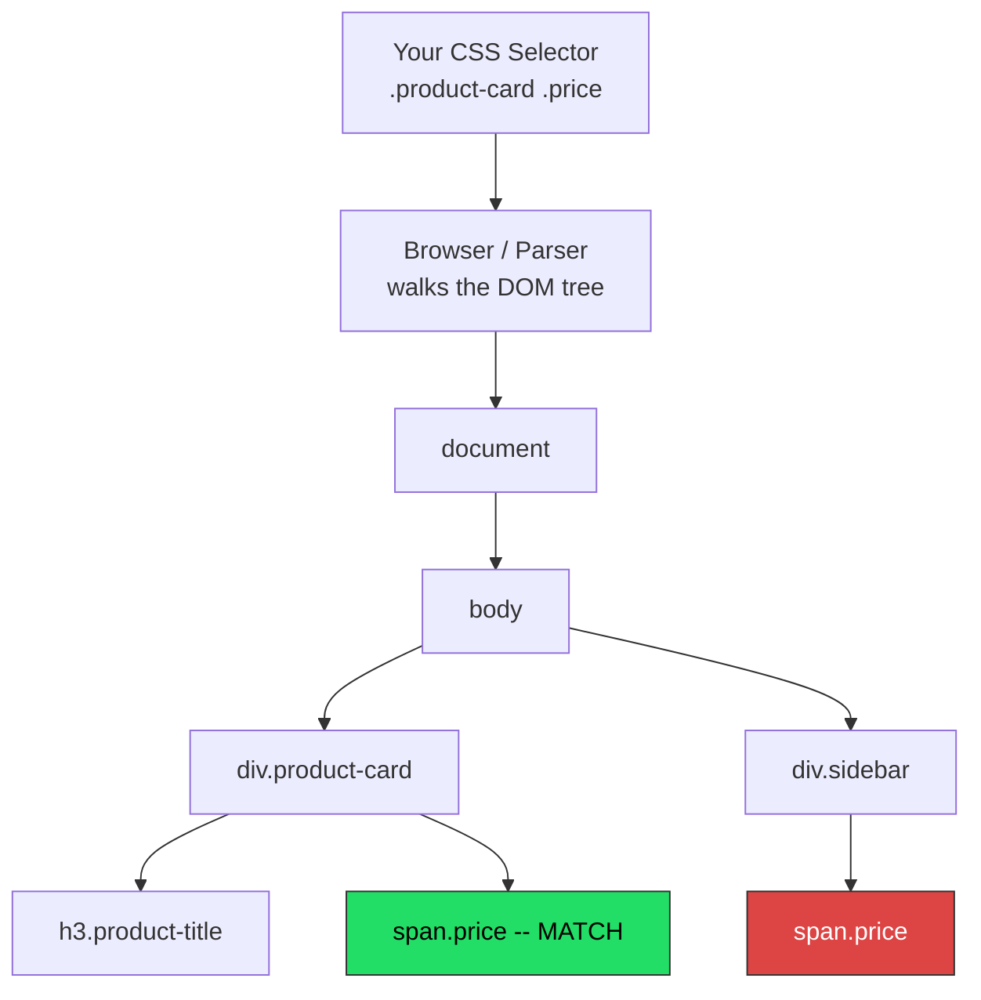
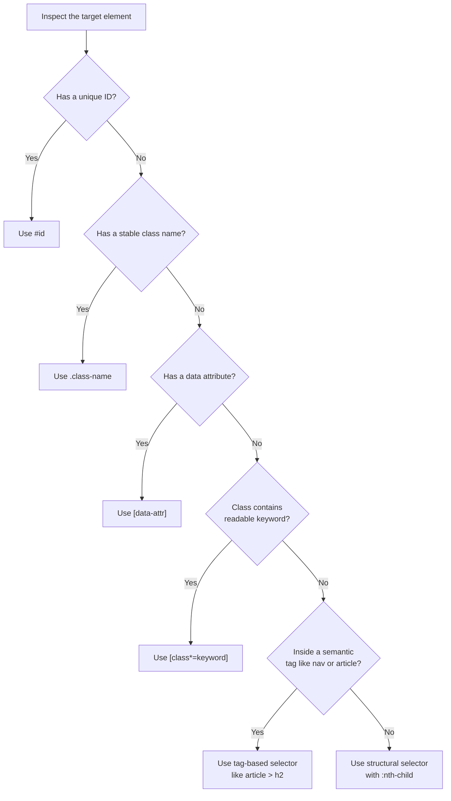

[CSS selectors](/posts/css-selectors-made-simple/) are the most intuitive way to target elements when scraping web pages. Unlike [XPath](/posts/xpath-vs-css-selectors-performance-readability-compared/), which reads like a file system path, CSS selectors use the same syntax you already know from stylesheets. Every browser, every scraping library, and every automation framework supports them. Whether you are using BeautifulSoup in Python or Playwright in JavaScript, the selector string itself stays the same -- only the API call around it changes. This post is a practical cheat sheet covering every CSS selector pattern you will actually use in scraping work, with real code examples and a reference table you can bookmark.

## Basic Selectors

These are the four selectors you will use on almost every scraping project. They target elements by tag name, class, ID, or the presence of an attribute.

### Tag Selector

Matches every element of the given tag type.

```css
h1
```

Given this HTML:

```html
<h1>Product Title</h1>
<h2>Description</h2>
<h1>Another Title</h1>
```

The selector `h1` matches both `<h1>` elements.

### Class Selector

Matches elements with a specific class. Prefix the class name with a dot.

```css
.product-card
```

Given this HTML:

```html
<div class="product-card">Laptop</div>
<div class="sidebar">Filters</div>
<div class="product-card">Phone</div>
```

The selector `.product-card` matches both product card divs but not the sidebar.

### ID Selector

Matches a single element with a specific ID. Prefix with a hash.

```css
#main-content
```

Given this HTML:

```html
<div id="main-content">
  <p>Page content here</p>
</div>
```

The selector `#main-content` matches that one div. IDs should be unique on a page, so this returns at most one element.

### Attribute Selector

Matches elements that have a specific attribute, regardless of its value.

```css
[data-product-id]
```

Given this HTML:

```html
<div data-product-id="101">Laptop</div>
<div data-product-id="102">Phone</div>
<div class="promo">Sale banner</div>
```

The selector `[data-product-id]` matches the first two divs.

## Combinators

Combinators let you express relationships between elements. This is where CSS selectors start to get powerful for scraping, because you can scope your selections to specific parts of the page.

### Descendant Combinator (space)

Matches elements nested anywhere inside an ancestor, at any depth.

```css
.product-card .price
```

Given this HTML:

```html
<div class="product-card">
  <h3>Laptop</h3>
  <div class="details">
    <span class="price">$999</span>
  </div>
</div>
```

The selector `.product-card .price` matches the price span even though it is nested two levels deep inside the product card. The space means "anywhere inside," not just direct children.

### Child Combinator (>)

Matches only direct children, not deeper descendants.

```css
ul > li
```

Given this HTML:

```html
<ul class="menu">
  <li>Home</li>
  <li>Products
    <ul>
      <li>Laptops</li>
      <li>Phones</li>
    </ul>
  </li>
</ul>
```

The selector `ul.menu > li` matches only "Home" and "Products," not "Laptops" or "Phones." Those are children of the nested `<ul>`, not direct children of `ul.menu`.

### Adjacent Sibling Combinator (+)

Matches an element that immediately follows another element at the same level.

```css
h2 + p
```

Given this HTML:

```html
<h2>Description</h2>
<p>This laptop has a 15-inch screen.</p>
<p>It weighs 2.1 kg.</p>
```

The selector `h2 + p` matches only the first paragraph -- the one directly after the `<h2>`. The second paragraph is not an immediate sibling of the heading.

### General Sibling Combinator (~)

Matches all sibling elements that follow, not just the immediate one.

```css
h2 ~ p
```

Using the same HTML above, `h2 ~ p` matches both paragraphs because they are both siblings that come after the `<h2>`.

## Attribute Selectors

Beyond just checking for the presence of an attribute, CSS lets you match attribute values with different comparison operators. These are extremely useful for scraping because many sites use data attributes, dynamic classes, and parameterized URLs.

### Exact Match

```css
[type="submit"]
```

Matches elements where the attribute value is exactly "submit."

### Starts With (^=)

```css
a[href^="https://"]
```

Matches all links whose `href` begins with "https://". This is useful for filtering external links from internal ones:

```html
<a href="https://example.com">External</a>
<a href="/about">Internal</a>
<a href="https://cdn.example.com/image.jpg">CDN Link</a>
```

The selector `a[href^="https://"]` matches the first and third links.

### Ends With ($=)

```css
a[href$=".pdf"]
```

Matches all links pointing to PDF files:

```html
<a href="/docs/report.pdf">Annual Report</a>
<a href="/docs/slides.pptx">Slides</a>
<a href="/docs/invoice.pdf">Invoice</a>
```

The selector `a[href$=".pdf"]` matches the first and third links.

### Contains (*=)

```css
[class*="price"]
```

Matches any element whose class attribute contains the substring "price" anywhere:

```html
<span class="product-price">$29.99</span>
<span class="price-sale">$19.99</span>
<span class="quantity">3</span>
```

The selector `[class*="price"]` matches the first two spans. This is particularly useful when sites use naming conventions like `price-original`, `price-discounted`, `sale-price`, and you want to catch all of them.

### Contains Word (~=)

```css
[class~="featured"]
```

Matches elements where the attribute contains the word "featured" as a space-separated token. This is more precise than `*=` because `[class*="featured"]` would also match a class like `unfeatured`, while `[class~="featured"]` only matches when "featured" is a standalone class name.

## Pseudo-Selectors for Scraping

CSS pseudo-selectors let you target elements based on their position within a parent. These are invaluable when scraping tables, lists, and repeated structures.

### :first-child and :last-child

```css
tr td:first-child
```

Matches the first `<td>` in every table row. Useful for extracting the first column from a table:

```html
<table>
  <tr><td>Laptop</td><td>$999</td><td>In Stock</td></tr>
  <tr><td>Phone</td><td>$699</td><td>Out of Stock</td></tr>
</table>
```

The selector `tr td:first-child` returns "Laptop" and "Phone." The selector `tr td:last-child` returns "In Stock" and "Out of Stock."

### :nth-child(n)

```css
tr td:nth-child(2)
```

Matches the second `<td>` in each row. Using the table above, this returns "$999" and "$699" -- the price column.

You can also use formulas:

- `tr:nth-child(2n)` -- every even row
- `tr:nth-child(2n+1)` -- every odd row
- `tr:nth-child(n+2)` -- all rows starting from the second (useful for skipping a header row)

### :not()

```css
a:not(.nav-link)
```

Matches all links that do not have the class `nav-link`. This is a powerful filter when you want to exclude navigation links and focus on content links:

```html
<a class="nav-link" href="/home">Home</a>
<a class="nav-link" href="/products">Products</a>
<a href="/products/laptop-123">Laptop Pro 15</a>
<a href="/products/phone-456">Phone Ultra</a>
```

The selector `a:not(.nav-link)` matches only the product links.

## Combining Multiple Selectors

You can chain selectors to create precise targeting. Here are patterns that come up regularly in scraping:

```css
/* Element with multiple classes */
div.product-card.featured

/* Element with tag, class, and attribute */
a.product-link[href^="/products/"]

/* Complex nesting */
#search-results .product-card:not(.ad) .price
```

That last selector reads: inside the element with ID `search-results`, find `.product-card` elements that do not have the class `.ad`, then grab the `.price` element inside each of those. This kind of precise targeting is what makes CSS selectors so effective for scraping.


<figure>
  
  <figcaption>CSS selectors are the bridge between what you see and what you can extract. <span class="img-credit">Photo by Bibek ghosh / <a href="https://www.pexels.com" target="_blank" rel="noopener noreferrer">Pexels</a></span></figcaption>
</figure>

## Real Scraping Patterns

Here are practical selector patterns for common scraping scenarios.

### Select All Product Cards

```css
.product-card
```

Most e-commerce sites wrap each product in a container with a class like `product-card`, `product-item`, `product-tile`, or similar. Start by inspecting one product in DevTools and identifying this container class.

### Select Price Inside a Product

```css
.product-card .price
```

Scoping the price selector inside the product card ensures you get the price that belongs to each product, not a price element somewhere else on the page like a cart total.

### Select Links in Navigation Only

```css
nav a[href]
```

This targets only anchor tags inside `<nav>` elements that have an `href` attribute. It filters out anchor tags used as buttons (no `href`) and links outside the navigation.

### Select Data Attributes

```css
[data-product-id]
```

Many modern sites store structured data in `data-*` attributes. Understanding the [HTML basics](/posts/html-basics-for-scrapers-finding-way-around-tags/) behind these attributes helps you know where to look. These are more stable than class names and often contain the exact IDs, SKUs, or metadata you need:

```html
<div class="x7g_t2 Jk99a" data-product-id="12345" data-sku="LP-PRO-15">
  Laptop Pro 15
</div>
```

The class names `x7g_t2 Jk99a` are auto-generated and will change on the next deploy. The `data-product-id` attribute is part of the application logic and far more stable.

### Select by Partial Class Name

```css
[class*="price"]
```

When a site uses CSS-in-JS or utility class frameworks, the actual class names may be obfuscated, but they often still contain recognizable substrings. The `*=` operator lets you match those substrings.

### Select Rows After a Header

```css
table.results tr:nth-child(n+2) td
```

Skips the first row (typically the header) and selects all `<td>` elements from the data rows.

### Select External Links

```css
a[href^="http"]:not([href*="example.com"])
```

Matches links that start with "http" but do not contain the site's own domain. Useful for extracting outbound links from a page.

## Python Examples with BeautifulSoup

[BeautifulSoup](/posts/beautifulsoup-css-selectors-python-parsing-made-easy/) supports CSS selectors through the `select()` and `select_one()` methods. The `select()` method returns a list of all matching elements, while `select_one()` returns the first match or `None`.

```python
from bs4 import BeautifulSoup

html = """
<html>
<body>
  <nav>
    <a href="/">Home</a>
    <a href="/products">Products</a>
  </nav>
  <div id="search-results">
    <div class="product-card" data-product-id="101">
      <h3 class="product-title">Laptop Pro 15</h3>
      <span class="price">$999.00</span>
      <a href="/products/laptop-101">View Details</a>
    </div>
    <div class="product-card" data-product-id="102">
      <h3 class="product-title">Phone Ultra</h3>
      <span class="price">$699.00</span>
      <a href="/products/phone-102">View Details</a>
    </div>
    <div class="product-card ad" data-product-id="promo">
      <h3 class="product-title">Sponsored: Case Deluxe</h3>
      <span class="price">$29.00</span>
    </div>
  </div>
</body>
</html>
"""

soup = BeautifulSoup(html, "html.parser")

# Select all product cards
cards = soup.select(".product-card")
print(f"Found {len(cards)} product cards")
# Found 3 product cards

# Select the first product title
title = soup.select_one(".product-card .product-title")
print(title.text)
# Laptop Pro 15

# Select all prices (excluding ads)
prices = soup.select(".product-card:not(.ad) .price")
for price in prices:
    print(price.text)
# $999.00
# $699.00

# Extract data attributes
for card in soup.select("[data-product-id]"):
    product_id = card["data-product-id"]
    name = card.select_one(".product-title").text
    print(f"ID: {product_id}, Name: {name}")
# ID: 101, Name: Laptop Pro 15
# ID: 102, Name: Phone Ultra
# ID: promo, Name: Sponsored: Case Deluxe

# Select navigation links only
nav_links = soup.select("nav a[href]")
for link in nav_links:
    print(f"{link.text} -> {link['href']}")
# Home -> /
# Products -> /products

# Select product detail links using starts-with
detail_links = soup.select('a[href^="/products/"]')
for link in detail_links:
    print(link["href"])
# /products/laptop-101
# /products/phone-102
```

### Extracting a Table with BeautifulSoup

```python
from bs4 import BeautifulSoup

html = """
<table class="specs">
  <tr><th>Feature</th><th>Value</th></tr>
  <tr><td>Screen</td><td>15 inch</td></tr>
  <tr><td>RAM</td><td>16 GB</td></tr>
  <tr><td>Storage</td><td>512 GB SSD</td></tr>
</table>
"""

soup = BeautifulSoup(html, "html.parser")

# Skip the header row and get data rows
rows = soup.select("table.specs tr:nth-child(n+2)")
for row in rows:
    cells = row.select("td")
    feature = cells[0].text
    value = cells[1].text
    print(f"{feature}: {value}")
# Screen: 15 inch
# RAM: 16 GB
# Storage: 512 GB SSD
```

## JavaScript Examples with Playwright

Playwright provides `locator()` for actionable queries and `querySelector()`/`querySelectorAll()` through `page.evaluate()` for direct DOM access. The `locator()` method is preferred because it includes auto-waiting and retry logic.

```javascript
const { chromium } = require("playwright");

(async () => {
  const browser = await chromium.launch();
  const page = await browser.newPage();

  await page.setContent(`
    <div id="search-results">
      <div class="product-card" data-product-id="101">
        <h3 class="product-title">Laptop Pro 15</h3>
        <span class="price">$999.00</span>
        <a href="/products/laptop-101">View Details</a>
      </div>
      <div class="product-card" data-product-id="102">
        <h3 class="product-title">Phone Ultra</h3>
        <span class="price">$699.00</span>
        <a href="/products/phone-102">View Details</a>
      </div>
    </div>
  `);

  // Select all product cards using locator
  const cards = page.locator(".product-card");
  const count = await cards.count();
  console.log(`Found ${count} product cards`);
  // Found 2 product cards

  // Get text from each price element
  const prices = page.locator(".product-card .price");
  const allPrices = await prices.allTextContents();
  console.log(allPrices);
  // ['$999.00', '$699.00']

  // Extract data attributes with evaluate
  const productIds = await page.$$eval("[data-product-id]", (elements) =>
    elements.map((el) => ({
      id: el.dataset.productId,
      name: el.querySelector(".product-title").textContent,
    }))
  );
  console.log(productIds);
  // [{ id: '101', name: 'Laptop Pro 15' }, { id: '102', name: 'Phone Ultra' }]

  // Use query_selector for a single element
  const firstTitle = await page
    .locator(".product-card .product-title")
    .first()
    .textContent();
  console.log(firstTitle);
  // Laptop Pro 15

  // Select links that start with /products/
  const detailLinks = page.locator('a[href^="/products/"]');
  const hrefs = await detailLinks.evaluateAll((links) =>
    links.map((a) => a.getAttribute("href"))
  );
  console.log(hrefs);
  // ['/products/laptop-101', '/products/phone-102']

  await browser.close();
})();
```

### Playwright with Python

```python
from playwright.sync_api import sync_playwright

with sync_playwright() as p:
    browser = p.chromium.launch()
    page = browser.new_page()
    page.goto("https://example.com/products")

    # Select all product titles using locator
    titles = page.locator(".product-card .product-title").all_text_contents()
    print(titles)

    # Get a single element's text
    first_price = page.locator(".product-card .price").first.text_content()
    print(first_price)

    # Extract data attributes
    product_ids = page.locator("[data-product-id]").evaluate_all(
        "elements => elements.map(el => el.dataset.productId)"
    )
    print(product_ids)

    # Use nth to get a specific match
    second_card_title = page.locator(".product-card .product-title").nth(1).text_content()
    print(second_card_title)

    browser.close()
```

## Cheat Sheet Reference Table

| Selector | What It Does | Example HTML | What It Matches |
|---|---|---|---|
| `h1` | All `<h1>` elements | `<h1>Title</h1>` | The `<h1>` element |
| `.price` | Elements with class "price" | `<span class="price">$10</span>` | The span |
| `#main` | Element with ID "main" | `<div id="main">...</div>` | The div |
| `[href]` | Elements with an `href` attribute | `<a href="/page">Link</a>` | The anchor |
| `[type="text"]` | Attribute equals value | `<input type="text">` | The input |
| `[href^="/products"]` | Attribute starts with value | `<a href="/products/1">` | The anchor |
| `[href$=".pdf"]` | Attribute ends with value | `<a href="/doc.pdf">` | The anchor |
| `[class*="price"]` | Attribute contains substring | `<span class="sale-price">` | The span |
| `.card .price` | Descendant (any depth) | `<div class="card"><p><span class="price">` | The span |
| `ul > li` | Direct child only | `<ul><li>Item</li></ul>` | The `<li>` |
| `h2 + p` | Immediately following sibling | `<h2>...</h2><p>Text</p>` | The `<p>` |
| `h2 ~ p` | Any following sibling | `<h2>...</h2><div>...</div><p>Text</p>` | The `<p>` |
| `td:first-child` | First child element | `<tr><td>A</td><td>B</td></tr>` | First `<td>` ("A") |
| `td:last-child` | Last child element | `<tr><td>A</td><td>B</td></tr>` | Last `<td>` ("B") |
| `td:nth-child(2)` | Nth child element | `<tr><td>A</td><td>B</td><td>C</td></tr>` | Second `<td>` ("B") |
| `tr:nth-child(n+2)` | All from 2nd onward | `<table><tr>header</tr><tr>data</tr>` | Data rows |
| `a:not(.nav)` | Elements not matching | `<a class="nav">` `<a class="link">` | Second anchor only |
| `div.card.featured` | Multiple classes | `<div class="card featured">` | The div |


<figure>
  
  <figcaption>Selecting the right element is half the battle in web scraping. <span class="img-credit">Photo by Mikhail Nilov / <a href="https://www.pexels.com" target="_blank" rel="noopener noreferrer">Pexels</a></span></figcaption>
</figure>

## How CSS Selectors Connect to the DOM

When you write a CSS selector, the browser (or parser) walks the DOM tree to find matching elements. Understanding this flow helps you write selectors that are both accurate and efficient.



The selector `.product-card .price` matches the price span inside the product card but not the one inside the sidebar, even though both have the class `price`. Scoping your selectors with a parent context is how you avoid picking up stray matches from other parts of the page.

## Testing Selectors with Browser DevTools

Before writing any scraping code, test your selectors in the browser. This saves significant time and debugging effort.

**Step 1:** Open DevTools (F12 or right-click and Inspect).

**Step 2:** Open the Console tab.

**Step 3:** Use `document.querySelectorAll()` to test your selector:

```javascript
// Count matches
document.querySelectorAll(".product-card").length

// Preview matched elements
document.querySelectorAll(".product-card .price")

// Extract text from matches
[...document.querySelectorAll(".product-card .price")].map(el => el.textContent)
```

**Step 4:** Use the Elements panel shortcut. For a more detailed walkthrough, see [how to find CSS selectors for any website element](/posts/how-to-find-css-selectors-any-website-element/). Right-click any element and select "Copy > Copy selector" to get a CSS selector for that specific element. This gives you a starting point, but the auto-generated selector is usually overly specific and needs simplification.

Another useful technique is the `$$()` shortcut available in most browser consoles:

```javascript
// Shorthand for document.querySelectorAll()
$$(".product-card .price")

// Quick check if your selector finds anything
$$("[data-product-id]").length
```

## Common Mistakes

### Overly Specific Selectors

The "Copy selector" feature in DevTools generates paths like this:

```css
#root > div > div:nth-child(2) > div > div:nth-child(1) > div > span
```

This selector is brittle. If the site adds a wrapper div or reorders elements, it breaks immediately. Instead, identify the meaningful class or attribute and use that:

```css
.product-card .price
```

### Relying on Auto-Generated Class Names

Sites using CSS-in-JS frameworks (styled-components, CSS Modules, Tailwind with JIT) produce class names like `_3xK9d`, `css-1a2b3c`, or `sc-bdVTJa`. These change every time the site rebuilds. Instead of targeting these classes directly, look for:

- **Data attributes** like `[data-testid="product-price"]` or `[data-product-id]`
- **Semantic HTML tags** like `<article>`, `<nav>`, `<main>`, `<header>`
- **Attribute substrings** like `[class*="price"]` when the obfuscated class still contains a readable keyword
- **Structural selectors** like `article > h2` that rely on tag hierarchy rather than class names

### Forgetting That select() Returns a List

In BeautifulSoup, `select()` always returns a list, even if there is only one match:

```python
# Wrong -- this is a list, not an element
price = soup.select(".price")
print(price.text)  # AttributeError

# Correct -- use select_one() for a single element
price = soup.select_one(".price")
print(price.text)

# Or index into the list
price = soup.select(".price")[0]
print(price.text)
```

### Not Handling Missing Elements

A selector might return `None` (in `select_one()`) or an empty list (in `select()`). Always check:

```python
price_element = soup.select_one(".product-card .price")
if price_element:
    price = price_element.text.strip()
else:
    price = "N/A"
```

In Playwright, using `locator()` with assertions or `count()` prevents errors on missing elements:

```javascript
const priceLocator = page.locator(".product-card .price");
if ((await priceLocator.count()) > 0) {
  const price = await priceLocator.first().textContent();
  console.log(price);
}
```

## Selector Strategy Decision Flow

When you are looking at a page and trying to decide which selector to use, follow this flow:



Start from the top and use the first strategy that gives you a reliable, stable selector. IDs and data attributes are the most resilient to site changes. Class names are next, as long as they are human-readable and not auto-generated. Structural selectors are the last resort because they depend on the exact DOM layout.

## Putting It All Together

Here is a complete scraping script that uses multiple selector strategies to extract product data:

```python
import requests
from bs4 import BeautifulSoup

response = requests.get("https://example.com/products")
soup = BeautifulSoup(response.text, "html.parser")

products = []

# Select all real product cards, excluding ads
for card in soup.select(".product-card:not(.ad):not(.sponsored)"):
    product = {}

    # Use data attribute for ID
    product["id"] = card.get("data-product-id", "unknown")

    # Use class selector for title
    title_el = card.select_one(".product-title")
    product["title"] = title_el.text.strip() if title_el else "N/A"

    # Use attribute substring match for price (handles price, sale-price, etc.)
    price_el = card.select_one("[class*='price']")
    product["price"] = price_el.text.strip() if price_el else "N/A"

    # Use starts-with for product detail links
    link_el = card.select_one("a[href^='/products/']")
    product["url"] = link_el["href"] if link_el else None

    # Use nth-child for spec table inside the card
    specs = {}
    for row in card.select("table.specs tr:nth-child(n+2)"):
        cells = row.select("td")
        if len(cells) == 2:
            specs[cells[0].text.strip()] = cells[1].text.strip()
    product["specs"] = specs

    products.append(product)

for p in products:
    print(f"{p['id']}: {p['title']} - {p['price']}")
```

CSS selectors cover the vast majority of element targeting needs in web scraping. They are readable, well-supported, and fast. For the rare cases where you need to traverse upward in the DOM (selecting a parent based on a child), XPath is the better tool. But for everything else -- extracting products, prices, links, tables, and structured data -- CSS selectors are the right default choice.
