Modern web applications store an enormous amount of data that never appears in the HTML source. User preferences, authentication tokens, cached API responses, shopping cart contents, feature flags, and pagination state all live inside the browser's [client-side storage](/posts/session-management-cookies-storage-user-state/). If your scraper only parses the DOM, it is missing a significant layer of information. localStorage in particular has become a dumping ground for data that single-page applications need between page loads, and knowing how to read it -- and write to it -- opens up scraping strategies that are faster and more reliable than parsing rendered markup.

## What Is localStorage

localStorage is a synchronous key-value storage API built into every modern browser. It stores string data under string keys, scoped to the page's origin (protocol + domain + port). Unlike cookies, localStorage data is never sent to the server automatically with HTTP requests. It simply sits in the browser, available to any JavaScript running on the same origin.

The core API is small:

```javascript
// Set a value
localStorage.setItem("theme", "dark");

// Get a value
localStorage.getItem("theme"); // "dark"

// Remove a value
localStorage.removeItem("theme");

// Clear everything for this origin
localStorage.clear();

// Get the number of stored items
localStorage.length; // 0 after clear()
```

Key characteristics:

- **Capacity**: typically 5-10 MB per origin, depending on the browser
- **Persistence**: data survives page reloads, tab closures, and browser restarts
- **Scope**: same-origin only -- `https://example.com` cannot read storage from `https://other.com`
- **Data type**: strings only -- objects are stored by calling `JSON.stringify()` and retrieved with `JSON.parse()`
- **Synchronous**: all operations block the main thread, which is why sites with heavy storage use sometimes feel sluggish

## Why Scrape localStorage

There are several reasons to look beyond the DOM when extracting data from a web application.

**Cached API responses.** Many SPAs fetch data from their backend API on first load, then cache the entire JSON response in localStorage to avoid redundant network requests. This cached payload often contains structured data that is cleaner and more complete than whatever the front-end renders into the DOM. Instead of parsing a table with 50 rows, you can grab the full API response object in one call.

**User and session state.** Authentication tokens (JWTs, session IDs), user profile data, and account settings are frequently stored in localStorage. When building scrapers that need to maintain authenticated sessions across runs, extracting and replaying these tokens can be faster than performing a full login flow every time.

**Application configuration.** Feature flags, A/B test assignments, locale preferences, and API endpoint URLs are often written to localStorage when the page initializes. Extracting these can help you understand how the application behaves and which API endpoints to target directly.

**Data that never hits the DOM.** Some applications store intermediate computation results, form draft state, or analytics payloads in localStorage without ever rendering them. This data is invisible to DOM-based scraping but fully accessible through JavaScript evaluation.

## Where localStorage Fits in the Browser Storage Landscape

Browsers offer several client-side storage mechanisms, each with different characteristics. Understanding the differences helps you know where to look for the data you need.

```mermaid
flowchart TD
    A["Browser Client-Side Storage"] --> B["Cookies"]
    A --> C["localStorage"]
    A --> D["sessionStorage"]
    A --> E["IndexedDB"]

    B --> B1["Sent with every<br>HTTP request"]
    B --> B2["4 KB limit per cookie"]
    B --> B3["Can be httpOnly<br>and secure"]
    B --> B4["Expiry-based<br>persistence"]

    C --> C1["Never sent to<br>server automatically"]
    C --> C2["5-10 MB per origin"]
    C --> C3["Persists across<br>sessions"]
    C --> C4["Synchronous<br>string key-value"]

    D --> D1["Never sent to<br>server automatically"]
    D --> D2["5-10 MB per origin"]
    D --> D3["Cleared when<br>tab closes"]
    D --> D4["Synchronous<br>string key-value"]

    E --> E1["Never sent to<br>server automatically"]
    E --> E2["Large storage<br>quota - hundreds of MB"]
    E --> E3["Persists across<br>sessions"]
    E --> E4["Asynchronous<br>structured data"]

    style C fill:#d4edda
    style D fill:#fff3cd
```



For scraping purposes, localStorage and sessionStorage are the most commonly targeted because they use a simple key-value API that is trivial to dump. IndexedDB requires more complex asynchronous queries, and cookies are usually easier to capture through network-level interception.

## Reading localStorage With Playwright (Python)

Playwright's `page.evaluate()` method lets you execute arbitrary JavaScript in the page context and return the result to Python. Since localStorage only stores strings, you can dump the entire contents with a single call.

```python
from playwright.sync_api import sync_playwright
import json

with sync_playwright() as p:
    browser = p.chromium.launch(headless=True)
    context = browser.new_context()
    page = context.new_page()

    page.goto("https://example.com/app")
    page.wait_for_load_state("networkidle")

    # Dump all of localStorage as a JSON string
    raw = page.evaluate("JSON.stringify(localStorage)")
    data = json.loads(raw)

    print(f"Found {len(data)} keys in localStorage")
    for key, value in data.items():
        print(f"  {key}: {value[:80]}...")

    browser.close()
```

To read a specific key:

```python
# Read a single key
token = page.evaluate("localStorage.getItem('auth_token')")

if token:
    print(f"Auth token: {token}")
else:
    print("No auth token found in localStorage")
```

To read multiple specific keys at once:

```python
# Read multiple keys in a single evaluate call
keys_to_read = ["auth_token", "user_profile", "cart_items", "api_cache"]

result = page.evaluate("""
    (keys) => {
        const data = {};
        keys.forEach(key => {
            const value = localStorage.getItem(key);
            if (value !== null) {
                data[key] = value;
            }
        });
        return JSON.stringify(data);
    }
""", keys_to_read)

storage_data = json.loads(result)
```


<figure>
  
  <figcaption>Browsers are the universal interface to the web — and to its data. <span class="img-credit">Photo by cottonbro studio / <a href="https://www.pexels.com" target="_blank" rel="noopener noreferrer">Pexels</a></span></figcaption>
</figure>

## Reading localStorage With Selenium (Python)

Selenium uses `driver.execute_script()` for the same purpose. The syntax differs slightly, but the concept is identical.

```python
from selenium import webdriver
from selenium.webdriver.chrome.options import Options
from selenium.webdriver.support.ui import WebDriverWait
from selenium.webdriver.support import expected_conditions as EC
import json

options = Options()
options.add_argument("--headless=new")

driver = webdriver.Chrome(options=options)
driver.get("https://example.com/app")

# Wait for the page to finish loading
WebDriverWait(driver, 10).until(
    lambda d: d.execute_script("return document.readyState") == "complete"
)

# Dump all of localStorage
raw = driver.execute_script("return JSON.stringify(localStorage);")
data = json.loads(raw)

print(f"Found {len(data)} keys in localStorage")
for key, value in data.items():
    print(f"  {key}: {value[:80]}...")

driver.quit()
```

Reading a specific key:

```python
# Read a single key
token = driver.execute_script("return localStorage.getItem('auth_token');")

if token:
    print(f"Auth token: {token}")
```

Reading multiple keys:

```python
# Read multiple keys
keys = ["auth_token", "user_profile", "cart_items"]

result = driver.execute_script("""
    var data = {};
    arguments[0].forEach(function(key) {
        var value = localStorage.getItem(key);
        if (value !== null) {
            data[key] = value;
        }
    });
    return JSON.stringify(data);
""", keys)

storage_data = json.loads(result)
```

## Reading Specific Keys

In practice, you rarely need the entire contents of localStorage. Most scraping tasks target specific keys. The challenge is figuring out which keys hold the data you need.

A useful first step is to enumerate all keys and inspect their values:

```python
# Playwright -- enumerate keys and preview values
key_preview = page.evaluate("""
    () => {
        const entries = [];
        for (let i = 0; i < localStorage.length; i++) {
            const key = localStorage.key(i);
            const value = localStorage.getItem(key);
            entries.push({
                key: key,
                type: (() => {
                    try { JSON.parse(value); return 'json'; }
                    catch { return 'string'; }
                })(),
                length: value.length,
                preview: value.substring(0, 200)
            });
        }
        return entries;
    }
""")

for entry in key_preview:
    print(f"Key: {entry['key']}")
    print(f"  Type: {entry['type']}, Length: {entry['length']}")
    print(f"  Preview: {entry['preview']}")
    print()
```

Common key naming patterns to look for:

- `*token*`, `*auth*`, `*session*` -- authentication data
- `*cache*`, `*api*`, `*response*` -- cached API responses
- `*user*`, `*profile*`, `*account*` -- user information
- `*cart*`, `*basket*`, `*order*` -- e-commerce state
- `*config*`, `*settings*`, `*prefs*` -- application configuration

## Writing to localStorage

Writing to localStorage is useful when you need to inject authentication tokens, set user preferences, or configure application state before the page loads. This can be significantly faster than performing a full login flow through the UI.

### Playwright

```python
from playwright.sync_api import sync_playwright
import json

with sync_playwright() as p:
    browser = p.chromium.launch(headless=True)
    context = browser.new_context()
    page = context.new_page()

    # Navigate to the origin first -- localStorage is origin-scoped
    page.goto("https://example.com")

    # Set an auth token
    page.evaluate("localStorage.setItem('token', 'eyJhbGciOiJIUzI1NiIsInR5cCI6IkpXVCJ9...')")

    # Set a complex object
    user_prefs = {
        "theme": "dark",
        "language": "en",
        "notifications": True
    }
    page.evaluate(
        f"localStorage.setItem('user_prefs', '{json.dumps(user_prefs)}')"
    )

    # Now navigate to the protected page -- the app reads the token on load
    page.goto("https://example.com/dashboard")

    # The page should now render as if you are logged in
    print(page.title())

    browser.close()
```

### Selenium

```python
import json

driver.get("https://example.com")

# Set an auth token
driver.execute_script(
    "localStorage.setItem('token', arguments[0]);",
    "eyJhbGciOiJIUzI1NiIsInR5cCI6IkpXVCJ9..."
)

# Set a complex object
user_prefs = {
    "theme": "dark",
    "language": "en",
    "notifications": True
}
driver.execute_script(
    "localStorage.setItem('user_prefs', arguments[0]);",
    json.dumps(user_prefs)
)

# Navigate to the protected page
driver.get("https://example.com/dashboard")
```

A common pattern for session reuse across scraper runs is to dump localStorage at the end of a session and restore it at the beginning of the next one. For long-running jobs, see [cookie and state management](/posts/cookie-state-management-long-running-scraping-jobs/) for additional persistence strategies:

```python
import json
from pathlib import Path

STORAGE_FILE = Path("storage_state.json")

def save_storage(page):
    """Save localStorage to a file for reuse."""
    raw = page.evaluate("JSON.stringify(localStorage)")
    data = json.loads(raw)
    STORAGE_FILE.write_text(json.dumps(data, indent=2))
    print(f"Saved {len(data)} localStorage entries")

def restore_storage(page, url):
    """Restore localStorage from a file."""
    if not STORAGE_FILE.exists():
        return False

    data = json.loads(STORAGE_FILE.read_text())

    # Must navigate to the origin first
    page.goto(url)

    for key, value in data.items():
        page.evaluate(
            "([k, v]) => localStorage.setItem(k, v)",
            [key, value]
        )

    print(f"Restored {len(data)} localStorage entries")
    return True
```


<figure>
  
  <figcaption>Headless or headed, browsers remain the most reliable way to render the modern web. <span class="img-credit">Photo by cottonbro studio / <a href="https://www.pexels.com" target="_blank" rel="noopener noreferrer">Pexels</a></span></figcaption>
</figure>

## Monitoring localStorage Changes

Some applications write to localStorage asynchronously as data arrives from API calls or WebSocket connections. You can [monitor these changes](/posts/sessionstorage-monitoring-watching-dynamic-state-changes/) using the `storage` event or by polling.

### Using the storage Event

The `storage` event fires on other tabs and windows when localStorage changes on the same origin. To capture changes within the same page, you need to override the localStorage methods:

```python
# Playwright -- intercept localStorage writes in the current page
page.evaluate("""
    window.__storageLog = [];

    const originalSetItem = localStorage.setItem.bind(localStorage);
    localStorage.setItem = function(key, value) {
        window.__storageLog.push({
            action: 'set',
            key: key,
            value: value,
            timestamp: Date.now()
        });
        return originalSetItem(key, value);
    };

    const originalRemoveItem = localStorage.removeItem.bind(localStorage);
    localStorage.removeItem = function(key) {
        window.__storageLog.push({
            action: 'remove',
            key: key,
            timestamp: Date.now()
        });
        return originalRemoveItem(key);
    };
""")

# Let the page do its work
page.wait_for_timeout(5000)

# Retrieve the log
changes = page.evaluate("JSON.stringify(window.__storageLog)")
change_log = json.loads(changes)

for change in change_log:
    print(f"[{change['action']}] {change['key']}: {change.get('value', 'N/A')[:100]}")
```

### Polling Approach

A simpler approach that works in both Playwright and Selenium is to poll localStorage at intervals and diff the results:

```python
import time

def poll_storage_changes(page, duration_seconds=10, interval=0.5):
    """Poll localStorage and report changes."""
    previous = json.loads(page.evaluate("JSON.stringify(localStorage)"))
    changes = []
    end_time = time.time() + duration_seconds

    while time.time() < end_time:
        time.sleep(interval)
        current = json.loads(page.evaluate("JSON.stringify(localStorage)"))

        # Check for new or changed keys
        for key in current:
            if key not in previous:
                changes.append(("added", key, current[key]))
            elif current[key] != previous[key]:
                changes.append(("changed", key, current[key]))

        # Check for removed keys
        for key in previous:
            if key not in current:
                changes.append(("removed", key, None))

        previous = current

    return changes
```

## Practical Example: Extracting Cached API Data From a SPA

Single-page applications commonly fetch data from a REST or GraphQL API, then cache the response in localStorage to avoid refetching on subsequent visits. This pattern is especially common in e-commerce product listings, dashboard analytics, and search results.

Here is a complete example that loads a SPA, waits for it to populate its cache, and extracts the cached data:

```python
from playwright.sync_api import sync_playwright
import json

def extract_cached_api_data(url, cache_key_pattern="api_cache"):
    with sync_playwright() as p:
        browser = p.chromium.launch(headless=True)
        page = browser.new_page()

        page.goto(url)
        page.wait_for_load_state("networkidle")

        # Give the SPA time to process and cache data
        page.wait_for_timeout(2000)

        # Find all localStorage keys that match the cache pattern
        cached_data = page.evaluate("""
            (pattern) => {
                const results = {};
                for (let i = 0; i < localStorage.length; i++) {
                    const key = localStorage.key(i);
                    if (key.includes(pattern)) {
                        try {
                            results[key] = JSON.parse(localStorage.getItem(key));
                        } catch {
                            results[key] = localStorage.getItem(key);
                        }
                    }
                }
                return results;
            }
        """, cache_key_pattern)

        browser.close()
        return cached_data


# Usage
data = extract_cached_api_data(
    "https://example.com/products",
    cache_key_pattern="products"
)

# The cached data is often a complete API response
for key, value in data.items():
    if isinstance(value, dict) and "data" in value:
        products = value["data"]
        print(f"Found {len(products)} products in cache key '{key}'")
        for product in products[:5]:
            print(f"  - {product.get('name')}: {product.get('price')}")
```

This approach has a major advantage over DOM scraping: the cached data is typically the raw API response, which contains fields that the front-end may not render. You get the full data model instead of a subset chosen for display.

## sessionStorage vs localStorage

[sessionStorage](/posts/playwright-sessionstorage-reading-writing-session-data/) shares the same API as localStorage, but its persistence model is different.

| Feature | localStorage | sessionStorage |
|---|---|---|
| Persistence | Until explicitly cleared | Until the tab or window closes |
| Scope | Same origin, all tabs | Same origin, same tab only |
| Capacity | 5-10 MB | 5-10 MB |
| API | Identical | Identical |
| Use case | Long-lived data, tokens | Temporary state, form drafts |

Accessing sessionStorage uses the exact same techniques. Just replace `localStorage` with `sessionStorage` in your JavaScript:

```python
# Playwright -- dump sessionStorage
raw = page.evaluate("JSON.stringify(sessionStorage)")
session_data = json.loads(raw)

# Playwright -- read a specific sessionStorage key
form_draft = page.evaluate("sessionStorage.getItem('checkout_form_draft')")

# Selenium -- dump sessionStorage
raw = driver.execute_script("return JSON.stringify(sessionStorage);")
session_data = json.loads(raw)
```

One important difference for scraping: sessionStorage is scoped to the specific browser tab. If you open a new page in Playwright (using `context.new_page()`), that new page gets its own empty sessionStorage even for the same origin. This means you cannot share sessionStorage between pages the way you can with localStorage.

```python
# sessionStorage is tab-scoped -- this matters for scraping
page1 = context.new_page()
page1.goto("https://example.com/app")

# Set sessionStorage in page1
page1.evaluate("sessionStorage.setItem('key', 'value')")

page2 = context.new_page()
page2.goto("https://example.com/app")

# This returns null -- page2 has its own sessionStorage
result = page2.evaluate("sessionStorage.getItem('key')")
print(result)  # None
```

## Dumping All Client-Side Storage at Once

For thorough reconnaissance, you may want to dump every storage mechanism at once. Here is a helper that captures localStorage, sessionStorage, and cookies in a single function:

```python
from playwright.sync_api import sync_playwright
import json

def dump_all_storage(page):
    """Capture all client-side storage for the current page."""
    local_storage = json.loads(
        page.evaluate("JSON.stringify(localStorage)")
    )
    session_storage = json.loads(
        page.evaluate("JSON.stringify(sessionStorage)")
    )
    cookies = page.context.cookies()

    return {
        "localStorage": local_storage,
        "sessionStorage": session_storage,
        "cookies": cookies,
        "origin": page.evaluate("window.location.origin")
    }

# Usage
with sync_playwright() as p:
    browser = p.chromium.launch(headless=True)
    page = browser.new_page()
    page.goto("https://example.com/app")
    page.wait_for_load_state("networkidle")

    storage = dump_all_storage(page)

    print(f"Origin: {storage['origin']}")
    print(f"localStorage keys: {len(storage['localStorage'])}")
    print(f"sessionStorage keys: {len(storage['sessionStorage'])}")
    print(f"Cookies: {len(storage['cookies'])}")

    # Save for analysis
    with open("storage_dump.json", "w") as f:
        json.dump(storage, f, indent=2, default=str)

    browser.close()
```

## Security Considerations

Scraping localStorage often involves handling sensitive data. Here are the security aspects you should be aware of.

**Tokens in localStorage.** Many applications store JWTs and API keys in localStorage. While this is a known security concern (localStorage is vulnerable to XSS attacks), it remains common practice. When you extract these tokens, treat them as credentials. Do not log them to shared systems, commit them to version control, or store them in plain text on disk without access controls.

**Same-origin policy.** localStorage is strictly scoped to the origin. Your scraper can only read localStorage for the domain the page is currently on. You cannot navigate to `https://site-a.com` and read `https://site-b.com`'s localStorage. This is enforced by the browser, not by JavaScript, so there is no workaround through `evaluate()`.

**Token expiration.** Extracted auth tokens have limited lifespans. JWTs typically contain an `exp` claim with a Unix timestamp. Before reusing a cached token, check whether it has expired:

```python
import json
import base64
import time

def is_jwt_expired(token):
    """Check if a JWT has expired."""
    try:
        # JWT payload is the second segment, base64url-encoded
        payload_b64 = token.split(".")[1]
        # Add padding if needed
        padding = 4 - len(payload_b64) % 4
        if padding != 4:
            payload_b64 += "=" * padding
        payload = json.loads(base64.urlsafe_b64decode(payload_b64))
        exp = payload.get("exp")
        if exp is None:
            return False
        return time.time() > exp
    except Exception:
        return True  # Assume expired if we cannot parse it
```

**Cross-context isolation.** In Playwright, each browser context has its own isolated storage. This is useful for parallel scraping with different sessions, but it also means you need to be deliberate about which context you are reading from.

localStorage is one of the most overlooked data sources in web scraping. While most scrapers focus on parsing the DOM or intercepting network requests, the browser's own storage layer often contains the cleanest, most complete data available -- already structured, already serialized, waiting to be read with a single line of JavaScript.
