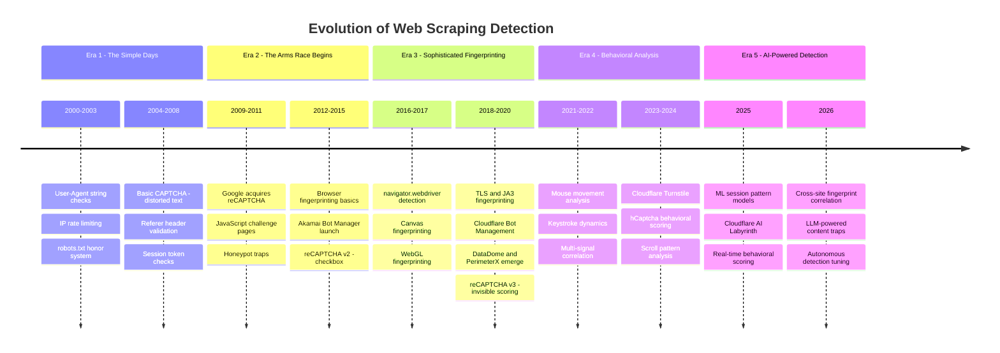
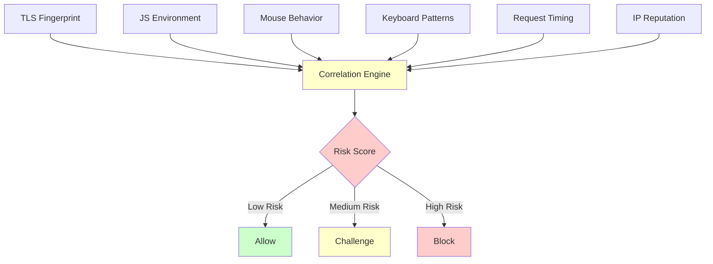
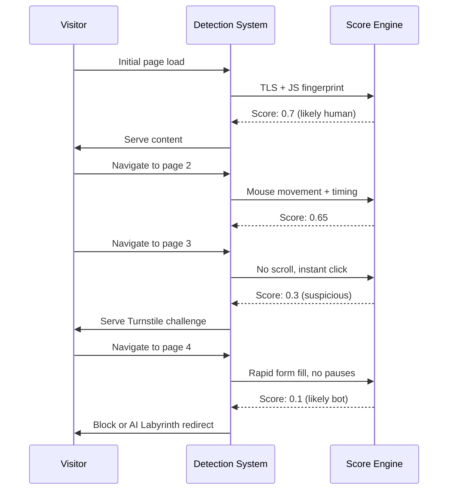
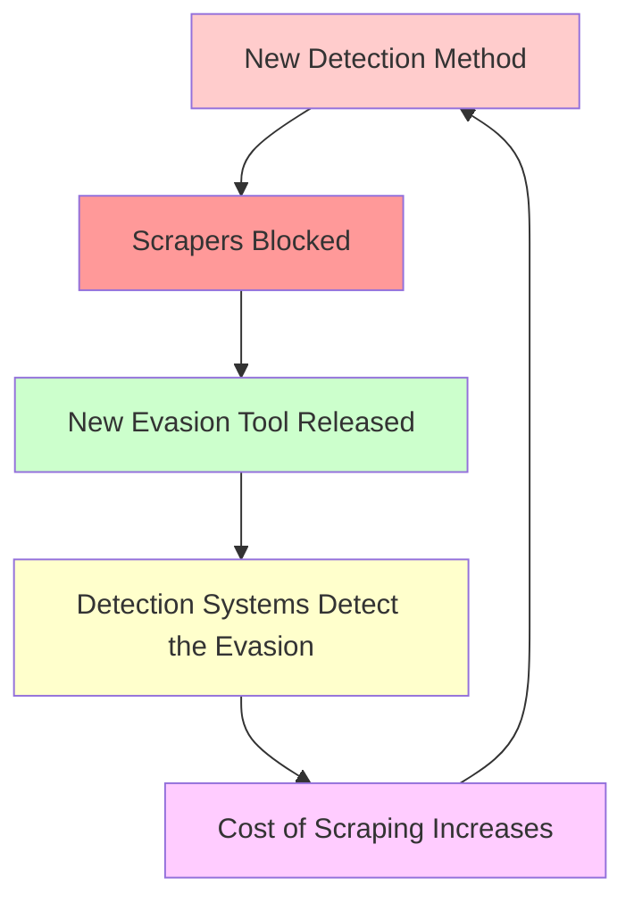

Bot detection has evolved from simple user-agent checks to AI-powered behavioral analysis over two decades. What started as a handful of server-side rules in the early 2000s has become a multi-billion-dollar industry involving machine learning, cryptographic fingerprinting, and real-time behavioral scoring. If you scrape the web today, you are operating against detection systems that would have been unimaginable ten years ago. Understanding how we got here is not just historical curiosity -- it is the foundation for understanding what works now and what will stop working next.

This post traces the full arc of web scraping detection from 2000 to 2026, covering the specific technologies, the companies that built them, and what each era means for scrapers building tools today.

## The Five Eras at a Glance



## Era 1: 2000-2008 -- The Simple Days

The earliest web scraping detection methods were not detection systems at all. They were basic access controls that assumed good faith from visitors.

### User-Agent String Checking

The User-Agent header was the first line of defense. Web servers would inspect the `User-Agent` string sent with each HTTP request and block anything that did not look like a real browser. Early scrapers using tools like `wget`, `curl`, or Python's `urllib` sent distinctive User-Agent strings that servers could trivially identify.

```
# A typical wget User-Agent in 2003
Wget/1.9

# What servers expected to see
Mozilla/4.0 (compatible; MSIE 6.0; Windows NT 5.1)
```

The countermeasure was obvious: set a fake User-Agent string. This arms race lasted about five minutes. Every scraping tutorial from this era included a line about spoofing the User-Agent, and for good reason -- it was the only check most servers performed.

### IP Rate Limiting

The next step was rate limiting. Servers tracked requests per IP address over a time window and blocked or throttled addresses that exceeded a threshold. A human visitor might load 30 pages per hour. A scraper might load 3,000. The math was straightforward.

```python
# Early server-side rate limiting logic (pseudocode)
request_counts = {}  # ip -> (count, window_start)

def check_rate_limit(ip, max_requests=100, window_seconds=3600):
    now = time.time()
    if ip in request_counts:
        count, start = request_counts[ip]
        if now - start > window_seconds:
            request_counts[ip] = (1, now)
            return True
        if count >= max_requests:
            return False  # blocked
        request_counts[ip] = (count + 1, start)
    else:
        request_counts[ip] = (1, now)
    return True
```

Scrapers responded with delays between requests and rotating proxy lists. The concept of proxy rotation as an anti-detection measure dates back to this period.

### robots.txt and the Honor System

The Robots Exclusion Protocol, formalized in 1994 and widely adopted through the 2000s, was never a detection mechanism. It was a request. Sites published a `robots.txt` file listing paths they preferred crawlers not to visit, and legitimate bots like Googlebot honored those preferences. Scrapers who ignored `robots.txt` faced no technical barrier -- the file was advisory only.

```
# Typical robots.txt from the mid-2000s
User-agent: *
Disallow: /admin/
Disallow: /private/
Disallow: /search/

User-agent: Googlebot
Allow: /
```

This honor system worked for search engines but did nothing against scrapers who simply chose not to read the file. For a deeper look at the legal standing of robots.txt and whether ignoring it carries legal risk, see our posts on [whether robots.txt is legally binding](/posts/is-robots-txt-legally-binding-scraping-law-explained/) and the [IETF AIPref proposal that aims to modernize it for the AI era](/posts/ietf-aipref-the-new-robots-txt-for-the-ai-era/).

### Basic CAPTCHA

The CAPTCHA -- Completely Automated Public Turing test to tell Computers and Humans Apart -- appeared in the late 1990s and became common by the mid-2000s. Early CAPTCHAs displayed distorted text that humans could read but OCR software of the era could not.

These were effective for a time. The distortion made automated reading difficult, and CAPTCHA-solving services had not yet emerged at scale. But the arms race was already visible: researchers at Carnegie Mellon demonstrated in 2003 that many common CAPTCHA implementations could be broken with relatively simple image processing techniques.

### What Scrapers Did

The countermeasures of Era 1 were simple because the detection was simple:

- Spoof the User-Agent header
- Add random delays between requests
- Rotate through a pool of proxy IPs
- Ignore robots.txt when needed
- Use OCR libraries for basic CAPTCHAs

These techniques still work against sites that have not updated their defenses, which is a surprising number even today.

<figure>
  
  <figcaption>In the early days, a simple user-agent string was enough to blend in. <span class="img-credit">Photo by Tuur  Tisseghem / <a href="https://www.pexels.com" target="_blank" rel="noopener noreferrer">Pexels</a></span></figcaption>
</figure>

## Era 2: 2009-2015 -- The Arms Race Begins

The second era brought a qualitative shift. Detection moved from examining HTTP headers to requiring JavaScript execution and analyzing the browser environment. This separated simple HTTP scrapers from those capable of running a full browser.

### Google Acquires reCAPTCHA (2009)

Google's acquisition of reCAPTCHA in September 2009 was a turning point for CAPTCHA technology. The original reCAPTCHA served two purposes: it protected websites from bots while using human solvers to digitize text from books and newspapers that OCR had failed to read. Google later redirected this dual purpose toward digitizing Google Books and street addresses from Google Street View.

reCAPTCHA v1 presented users with two distorted words -- one known and one unknown. The known word verified the user was human; the unknown word contributed to digitization. This was harder to solve programmatically than earlier CAPTCHAs because the distortion was more sophisticated and the word pairs changed constantly.

### JavaScript Challenge Pages

Around 2010-2012, services like Cloudflare and Sucuri began deploying JavaScript challenge pages. Instead of serving content directly, the server returned a page containing a JavaScript computation. The browser had to execute the script, solve a mathematical challenge, and submit the result to receive a clearance cookie. Only then would subsequent requests receive actual content.

```html
<!-- Simplified example of a JS challenge page -->
<html>
<body>
<script>
  // Obfuscated in practice, simplified here
  var answer = (function() {
    var t = "example.com";
    var a = 47;
    a += 12;
    a *= 3;
    return a;
  })();

  // Submit answer to get clearance cookie
  document.cookie = "cf_clearance=" + answer + "; path=/";
  location.reload();
</script>
</body>
</html>
```

This was the first detection method that fundamentally required a JavaScript runtime. Simple HTTP libraries like Python's `requests` or Ruby's `Net::HTTP` could not pass these challenges. Scrapers now needed either a headless browser or a custom JavaScript engine to proceed.

### Honeypot Traps

Honeypot links became a popular detection technique during this period. The idea was simple: place links on the page that are invisible to human visitors (hidden with CSS `display: none`, zero-pixel dimensions, or text matching the background color) but visible to scrapers that parse the raw HTML. Any visitor that followed a honeypot link was flagged as a bot.

```html
<!-- Honeypot link hidden from visual rendering -->
<a href="/trap/identify-bot"
   style="display: none; position: absolute; left: -9999px;">
  Click here for special offers
</a>
```

Honeypot form fields used the same principle. A hidden field named something tempting like `email2` or `url` would be left empty by humans using a real browser but filled in by bots that automatically completed every form field.

### Browser Fingerprinting Basics

The first generation of browser fingerprinting checked a handful of browser properties to distinguish real browsers from automation tools. Detection scripts queried `screen.width`, `screen.height`, `navigator.plugins`, `navigator.languages`, and the list of installed fonts via Flash or Java applets.

The checks were rudimentary by today's standards. A real Internet Explorer 8 on Windows XP had a specific set of plugins and a particular screen resolution distribution. A scraper running PhantomJS had none of these. The mismatch was easy to spot.

```javascript
// Early fingerprinting checks (circa 2012)
var checks = {
  hasPlugins: navigator.plugins.length > 0,
  hasLanguages: navigator.languages && navigator.languages.length > 0,
  screenDepth: screen.colorDepth,
  timezoneOffset: new Date().getTimezoneOffset(),
  hasFlash: (function() {
    try {
      return !!new ActiveXObject("ShockwaveFlash.ShockwaveFlash");
    } catch(e) {
      return navigator.plugins["Shockwave Flash"] !== undefined;
    }
  })()
};
```

### reCAPTCHA v2: "I'm Not a Robot" (2014)

Google launched reCAPTCHA v2 in December 2014 with the now-iconic "I'm not a robot" checkbox. Behind the checkbox, Google analyzed a range of signals: the movement of the mouse cursor toward the checkbox, the speed and trajectory of the click, the user's browsing history (via Google cookies), and various browser environment properties. Low-risk users passed with a single click. Higher-risk users were presented with image selection challenges.

This was the first widely deployed detection system that used behavioral signals as a primary classification mechanism rather than just a visual puzzle.

### What Scrapers Did

Era 2 forced a fundamental shift in scraping architecture:

- Headless browsers (PhantomJS, later headless Chrome) became necessary for JS challenges
- Scrapers began checking link visibility before following URLs
- CAPTCHA-solving services like 2Captcha and Anti-Captcha launched, providing human solvers at scale
- Browser property spoofing became routine, though it was still basic

## Era 3: 2016-2020 -- Sophisticated Fingerprinting

The third era transformed detection from a set of binary checks into a continuous fingerprinting process. Detection systems no longer asked "is this a bot?" with a yes/no test. They built a comprehensive profile of each visitor and compared it against known browser signatures, looking for inconsistencies that no amount of header spoofing could hide.

### navigator.webdriver Detection

When Google shipped headless Chrome in 2017 (Chrome 59), it opened the floodgates for browser-based scraping. But it also introduced a key detection vector: the `navigator.webdriver` property. Browsers controlled by automation frameworks like Selenium, [Puppeteer, or Playwright](/posts/playwright-vs-puppeteer-speed-stealth-developer-experience/) set this property to `true`. Detection scripts could check it with a single line.

```javascript
// The simplest automation detection check
if (navigator.webdriver) {
  // Flag as bot
}
```

This property became the most widely checked fingerprint signal on the web. Scrapers responded by deleting or overriding the property before page load:

```javascript
// Early webdriver evasion
Object.defineProperty(navigator, 'webdriver', {
  get: () => false,
});
```

But detection systems evolved to check not just the value but how it was defined. Was the property a native getter or a redefined one? Did `Object.getOwnPropertyDescriptor(navigator, 'webdriver')` return results consistent with a real browser? The simple override stopped working.

### Canvas Fingerprinting

Canvas fingerprinting exploits the fact that different hardware, drivers, and browser versions render the same drawing commands with subtle pixel-level differences. A detection script draws specific shapes, text, and gradients to an invisible HTML5 canvas, then reads the rendered pixels as a hash.

```javascript
// Simplified canvas fingerprinting
var canvas = document.createElement('canvas');
var ctx = canvas.getContext('2d');
ctx.textBaseline = 'top';
ctx.font = '14px Arial';
ctx.fillStyle = '#f60';
ctx.fillRect(125, 1, 62, 20);
ctx.fillStyle = '#069';
ctx.fillText('ByteTunnels', 2, 15);

var fingerprint = canvas.toDataURL();
// Hash this to get a device fingerprint
```

The fingerprint from a real Chrome on a MacBook with an M1 chip is different from Chrome on a Windows desktop with an NVIDIA GPU, which is different from headless Chrome running on a Linux server. Spoofing canvas output requires either intercepting the rendering pipeline or returning pre-recorded values, and detection systems check for both.

### WebGL Fingerprinting

WebGL fingerprinting works on the same principle as canvas but with 3D rendering. Detection scripts query the WebGL renderer and vendor strings, then render 3D scenes and hash the output. The renderer string alone reveals the GPU model and driver version.

```javascript
var gl = document.createElement('canvas').getContext('webgl');
var debugInfo = gl.getExtension('WEBGL_debug_renderer_info');
var vendor = gl.getParameter(debugInfo.UNMASKED_VENDOR_WEBGL);
var renderer = gl.getParameter(debugInfo.UNMASKED_RENDERER_WEBGL);

// Real Chrome on Mac: "Apple" / "Apple M1 Pro"
// Headless on server: "Google Inc. (Google)" / "ANGLE (Google, Vulkan ...)"
```

A headless browser running on a cloud server has a completely different WebGL profile than a consumer laptop. Matching these profiles requires deep knowledge of target hardware configurations.

### TLS/JA3 Fingerprinting

In 2017, researchers at Salesforce published the JA3 method for fingerprinting TLS client handshakes. Every TLS client -- whether a browser, a Python script, or a curl command -- sends a Client Hello message during the TLS handshake. This message contains a specific combination of TLS version, cipher suites, extensions, elliptic curves, and point formats. JA3 hashes these values into a 32-character fingerprint.

```
# JA3 fingerprint examples (simplified)
Chrome 120:  cd08e31494f9531f560d64c695473da9
Firefox 121: b32309a26951912be7dba376398abc3b
Python requests: 6734f37431670b3ab4292b8f60f29984
curl/8.0:    456523fc94726331a8d05d515f2d7829
```

This was a game-changer. No amount of JavaScript patching could alter the TLS fingerprint because it happened at the network layer, before any page code executed. A Python `requests` library has a [completely different TLS fingerprint than Chrome](/posts/python-requests-vs-selenium-speed-performance-comparison/), and there is no way to change that without modifying the TLS implementation itself. Tools like `curl-impersonate` and later `httpmorph` emerged specifically to address this gap.

The JA4 fingerprint followed in 2023, adding more granularity including HTTP/2 settings and ALPN protocol preferences.

### The Rise of Commercial Anti-Bot Platforms

This era saw the launch and growth of the major anti-bot platforms:

- **Cloudflare Bot Management** (2019): Leveraged data from millions of websites on its network to build global threat models. A bot detected on one Cloudflare site could be flagged across all of them.
- **DataDome** (2015, gained prominence ~2018): Focused on real-time detection with a lightweight JavaScript agent that collected browser signals and sent them to a cloud-based decision engine.
- **PerimeterX** (now HUMAN Security, founded 2014): Pioneered the combination of device fingerprinting with behavioral analysis, processing signals from keyboard, mouse, and touch interactions.
- **Akamai Bot Manager** (2014): Built on Akamai's CDN infrastructure, combining network-level signals with client-side fingerprinting.

### reCAPTCHA v3: Invisible and Score-Based (2018)

Google launched reCAPTCHA v3 in October 2018, eliminating the user-facing challenge entirely. Instead of asking users to click a checkbox or select images, v3 ran silently in the background, analyzing page interactions and returning a score between 0.0 (likely bot) and 1.0 (likely human). Site owners decided what to do with the score.

```javascript
// reCAPTCHA v3 integration
grecaptcha.ready(function() {
  grecaptcha.execute('site_key', { action: 'submit' }).then(function(token) {
    // Send token to server for verification
    // Server receives a score: 0.0 to 1.0
  });
});
```

This shifted the detection paradigm from challenge-response to continuous scoring. The bot never knew whether it had passed or failed -- it just received content or was silently degraded.

### What Scrapers Did

Era 3 forced scrapers to operate on multiple fronts simultaneously:

- **TLS fingerprint spoofing**: Tools like `curl-impersonate` compiled custom builds of curl with Chrome's TLS settings
- **Stealth plugins**: `puppeteer-extra-plugin-stealth` patched dozens of browser properties to match real Chrome -- for a comparison of how well these plugins hold up, see our [Playwright vs Selenium stealth analysis](/posts/playwright-vs-selenium-stealth-which-evades-detection-better/) and [Puppeteer alternatives roundup](/posts/top-puppeteer-alternatives-what-to-use-instead/)
- **Residential proxies**: Datacenter IP ranges became easy to block, so scrapers moved to residential proxy networks where traffic appeared to come from real ISP customers
- **Full browser emulation**: PhantomJS was abandoned. Real Chromium browsers (headless Chrome, [Puppeteer, Playwright](/posts/selenium-vs-puppeteer-definitive-comparison-web-scraping/)) became the standard, and choosing between them became a [multi-dimensional comparison](/posts/playwright-vs-puppeteer-vs-selenium-vs-scrapy-2026-mega-comparison/)

<figure>
  
  <figcaption>Browser fingerprinting changed the rules of engagement. <span class="img-credit">Photo by Efe Burak Baydar / <a href="https://www.pexels.com" target="_blank" rel="noopener noreferrer">Pexels</a></span></figcaption>
</figure>

## Era 4: 2021-2024 -- Behavioral Analysis

The fourth era shifted detection focus from what the browser is to what the user does. Even a perfectly fingerprinted browser can be unmasked by inhuman behavior. Detection systems began analyzing interaction patterns in real time, looking for the telltale signs of automation in mouse movements, keystrokes, and scrolling behavior.

### Mouse Movement Analysis

Human mouse movements are messy. They follow curved paths with natural acceleration and deceleration. They overshoot targets and correct. They exhibit micro-tremors from hand instability. They pause at unpredictable intervals.

Automated tools, by contrast, move the cursor in straight lines at constant velocity, or teleport it directly to click targets. Detection systems began recording mouse event streams and analyzing them for human-like characteristics.

```javascript
// What detection systems capture from mouse events
document.addEventListener('mousemove', function(e) {
  mouseEvents.push({
    x: e.clientX,
    y: e.clientY,
    t: performance.now(),
    type: 'move'
  });
});

// Analyzed features:
// - Path curvature (straight lines = bot)
// - Velocity distribution (constant speed = bot)
// - Acceleration patterns (instant start/stop = bot)
// - Micro-movements between major actions (absence = bot)
// - Bezier curve fitting (perfect curves = bot library)
```

Tools like Ghost Cursor and bezier-based mouse movement libraries became common in scraping stacks, generating curved paths with randomized control points. But detection systems responded by looking for the statistical signatures of these specific libraries -- the "too perfect randomness" problem.

### Keystroke Dynamics

When bots [fill in form fields](/posts/how-to-automate-web-form-filling-complete-guide/), they typically type all characters at once or at perfectly uniform intervals. Human typing has a distinctive rhythm: faster for common letter combinations, slower for unfamiliar words, with occasional pauses for thought.

```javascript
// Keystroke timing analysis
var keyTimings = [];
var lastKeyTime = null;

document.addEventListener('keydown', function(e) {
  var now = performance.now();
  if (lastKeyTime) {
    keyTimings.push({
      key: e.key,
      interval: now - lastKeyTime,
      holdDuration: null  // measured on keyup
    });
  }
  lastKeyTime = now;
});

// Human typing: intervals range from 50ms to 300ms+
// with standard deviation > 40ms
// Bot typing: intervals are 0ms (instant) or uniform (e.g., exactly 100ms each)
```

### Scroll Pattern Analysis

Scrolling behavior is another signal. Humans scroll in bursts -- quick scrolls to scan, slow scrolls to read, pauses to absorb content. The scroll speed varies with content density. Automated scrolling typically moves at constant velocity or in fixed pixel increments.

Detection systems analyze scroll event streams for:

- Variable scroll velocities
- Pauses at content boundaries (headings, images)
- Inertial scrolling patterns (characteristic of trackpads and touchscreens)
- Correlation between scroll position and time-on-page

### Multi-Signal Correlation

The most important development of Era 4 was not any single signal but the correlation of multiple signals into a unified risk score. Detection systems began combining:

- TLS fingerprint (network layer)
- JavaScript environment fingerprint (browser layer)
- Mouse, keyboard, and scroll behavior (interaction layer)
- Request timing and navigation patterns (session layer)
- IP reputation and geolocation (network reputation layer)



A visitor with a Chrome TLS fingerprint, Chrome JavaScript environment, but no mouse movements and perfectly timed requests would score as high risk even though each individual layer (except behavior) looked legitimate. The signals had to be internally consistent.

### Cloudflare Turnstile (2022)

Cloudflare launched Turnstile in September 2022 as a replacement for traditional CAPTCHAs. Turnstile runs a series of lightweight, non-interactive browser challenges in the background -- checking the browser environment, running small proof-of-work computations, and analyzing visitor behavior. The user sees a small widget that either automatically passes or briefly shows a loading animation.

Turnstile was significant because it made invisible behavioral challenges accessible to any website for free, not just premium Cloudflare customers. It also integrated with Cloudflare's global threat intelligence, so behavioral patterns detected on one site informed risk scores across the entire network.

### hCaptcha Behavioral Scoring

hCaptcha evolved from a simple image CAPTCHA into a behavioral analysis platform. By 2023, its enterprise product analyzed over 100 signals per visitor, including device fingerprinting, interaction patterns, and network characteristics. The image challenges that users sometimes see are not the primary detection mechanism -- they are a fallback for ambiguous cases.

### What Scrapers Did

Behavioral detection forced the most sophisticated countermeasures yet:

- **Human-like interaction libraries**: Tools that generated realistic mouse paths with variable velocity and micro-movements
- **Typing simulators**: Character-by-character input with randomized inter-key delays matching human distributions
- **Session warm-up**: Loading multiple pages, scrolling naturally, and spending realistic time on content before scraping target pages
- **Stealth browsers**: Purpose-built tools like [Camoufox and Nodriver](/posts/stealth-browsers-in-2026-camoufox-nodriver-and-the-anti-detection-arms-race/) that addressed fingerprinting at the deepest possible level -- see our [complete nodriver guide](/posts/nodriver-complete-guide-undetected-browser-automation-python/) and [getting started tutorial](/posts/getting-started-nodriver-python-installation-first-script/) for hands-on walkthroughs
- **Browser agent frameworks**: Tools like [Browser Use, Stagehand, and Skyvern](/posts/browser-agent-frameworks-compared-browser-use-vs-stagehand-vs-skyvern/) that use AI to navigate sites autonomously
- **CAPTCHA solver APIs**: Services like CapSolver integrating directly with hCaptcha and Turnstile challenge flows

## Era 5: 2025-2026 -- AI-Powered Detection

The current era has brought machine learning into the core of detection systems. The sheer scale of [bot traffic -- roughly one bot per every 31 humans](/posts/the-ai-bot-traffic-explosion-what-1-bot-per-31-humans-means-for-the-web/) -- has made automated detection essential. Rather than relying on hand-crafted rules, detection platforms now train models on billions of sessions to identify bot patterns that human engineers would never spot. The detection systems themselves are becoming autonomous.

### ML Models for Session Pattern Analysis

Modern anti-bot platforms ingest entire session histories -- every request, every mouse event, every scroll -- and feed them into machine learning models trained on labeled datasets of human and bot sessions. These models identify patterns that are invisible to rule-based systems.

For example, a model might learn that bot sessions tend to:

- Visit pages in a specific order that correlates with sitemap structure
- Have unnaturally low variance in time-between-requests
- Skip auxiliary resources (fonts, favicons) that real browsers load automatically
- Exhibit TCP connection patterns inconsistent with their claimed geographic location

The specific features matter less than the approach: instead of human analysts writing detection rules, the system discovers them from data.

### Cloudflare AI Labyrinth (2025)

[Cloudflare AI Labyrinth](/posts/cloudflare-ai-labyrinth-how-honeypot-pages-are-trapping-scrapers/), launched in early 2025, represents a philosophical shift from detection to deception. Instead of blocking suspected bots, it redirects them into an infinite maze of AI-generated pages. These pages have realistic HTML structure, plausible text content, and internal links that lead deeper into the labyrinth. A scraper following links four or more levels deep is almost certainly a bot -- real humans rarely click that far into unfamiliar content.

The genius of the approach is that scrapers do not know they have been caught. They continue burning compute and bandwidth on worthless content while their behavioral patterns are logged and used to improve detection across Cloudflare's entire network. We covered AI Labyrinth in detail in a [previous post](/posts/cloudflare-ai-labyrinth-how-honeypot-pages-are-trapping-scrapers/).

### Real-Time Behavioral Scoring

Detection systems in 2025-2026 score visitor behavior continuously throughout a session, not just at entry. A visitor who passes initial challenges but later exhibits bot-like behavior mid-session can be re-challenged or blocked. The score updates with every interaction.



### Cross-Site Fingerprint Correlation

With anti-bot platforms deployed across millions of websites, detection systems now correlate fingerprints across sites. A browser that scrapes three different Cloudflare-protected e-commerce sites in the same hour, using the same TLS fingerprint and similar behavioral patterns, gets flagged even if its behavior on each individual site looks reasonable.

This network effect is one of the strongest advantages large anti-bot vendors hold. No amount of per-site evasion can hide patterns that emerge when your traffic is visible across the vendor's entire customer base.

### LLM-Powered Content Validation

An emerging technique in 2026 uses large language models to analyze whether visitor interactions with page content are semantically meaningful. This is particularly relevant as scrapers increasingly rely on LLMs for structured data extraction -- and as [shadow DOM structures](/posts/shadow-dom-the-silent-killer-of-ai-web-scraping/) create additional complexity for automated content parsing. Does the visitor's navigation path make logical sense given the content? Does the search query correlate with the pages visited? A human researching laptop prices will naturally navigate from a search to product listings to comparison pages. A bot will follow a mechanical pattern that ignores semantic relationships between pages.

### What Scrapers Are Doing Now

The countermeasures of Era 5 are the most complex yet:

- **Residential proxy networks with session persistence**: Maintaining consistent IP/fingerprint pairings across sessions to avoid cross-request anomaly detection
- **Engine-level stealth browsers**: Tools like Camoufox that modify browser source code rather than patching JavaScript properties
- **AI-generated behavioral profiles**: Using machine learning to generate interaction patterns that match human distributions
- **Labyrinth detection**: Content validation systems that identify AI-generated honeypot pages before wasting resources on them
- **TLS fingerprint matching**: Libraries like [`httpmorph`](/posts/httpmorph-solving-tls-fingerprinting-with-a-c-native-python-http-client/) and `curl-impersonate` that replicate exact browser TLS handshakes at the network level
- **Distributed scraping**: Spreading requests across many residential IPs to avoid cross-site correlation patterns

<figure>
  
  <figcaption>Machine learning now watches for patterns no human could spot manually. <span class="img-credit">Photo by Google DeepMind / <a href="https://www.pexels.com" target="_blank" rel="noopener noreferrer">Pexels</a></span></figcaption>
</figure>

## The Detection-Evasion Cycle

Every era follows the same pattern. Detection systems introduce a new signal, scrapers find a way to spoof it, and detection systems respond by adding more signals or detecting the spoofing itself. The cost of scraping increases with each cycle.



Here is a summary of detection methods and their countermeasures across all five eras:

| Era | Detection Method | Year | Countermeasure |
|-----|-----------------|------|----------------|
| 1 | User-Agent checking | ~2000 | Spoof UA string |
| 1 | IP rate limiting | ~2001 | Proxy rotation, delays |
| 1 | robots.txt | ~1994 | Ignore it |
| 1 | Basic CAPTCHA | ~2004 | OCR, solving services |
| 2 | reCAPTCHA v1 | 2009 | CAPTCHA-solving APIs |
| 2 | JS challenge pages | ~2011 | Headless browsers |
| 2 | Honeypot traps | ~2010 | Check element visibility |
| 2 | Basic fingerprinting | ~2012 | Spoof browser properties |
| 3 | navigator.webdriver | 2017 | Property override patches |
| 3 | Canvas fingerprinting | ~2016 | Canvas spoofing plugins |
| 3 | TLS/JA3 fingerprinting | 2017 | curl-impersonate, custom TLS |
| 3 | reCAPTCHA v3 | 2018 | Behavioral warm-up, solver APIs |
| 4 | Mouse analysis | ~2021 | Bezier curve libraries |
| 4 | Keystroke dynamics | ~2022 | Randomized typing simulators |
| 4 | Multi-signal correlation | ~2023 | Full-stack stealth (Camoufox, Nodriver) |
| 4 | Turnstile | 2022 | Turnstile solver services |
| 5 | ML session models | 2025 | AI-generated behavioral profiles |
| 5 | AI Labyrinth | 2025 | Content validation, depth tracking |
| 5 | Cross-site correlation | 2026 | Distributed residential proxies |

## Where Detection Is Heading

Several trends point to where bot detection will go next.

### Hardware-Level Attestation

Google's Web Environment Integrity proposal, although shelved in late 2023 after public backlash, signaled a direction the industry is moving toward. The idea is that the device itself -- not just the browser -- attests that it is a legitimate, unmodified platform. Apple's Private Access Tokens already implement a version of this for iOS and macOS. [Google's Chrome Auto Browse feature](/posts/google-chrome-auto-browse-what-it-means-for-web-scraping/) hints at a future where the browser itself becomes the agent, further blurring the line between human and automated browsing. If hardware attestation becomes standard in browsers, spoofing browser properties will become meaningless because the server will verify the hardware directly.

### Federated Bot Intelligence

Anti-bot vendors are already sharing threat intelligence, but the next step is real-time federated detection. When a new bot pattern is identified on one site, every site in the network learns about it within seconds. This reduces the window of opportunity for new evasion techniques from weeks to hours.

### Passive Biometric Signals

Future detection may incorporate passive biometric signals like gyroscope and accelerometer data from mobile devices, ambient light sensor readings that correlate with claimed time zones, and battery status patterns. Each signal individually provides weak identification, but combined, they create a behavioral fingerprint that is extremely difficult to forge.

### The Economic Equilibrium

The ultimate trajectory is economic. Each generation of detection makes scraping more expensive -- more compute for stealth browsers, more cost for residential proxies, more engineering time for evasion. Detection does not need to be perfect. It just needs to make unauthorized scraping more expensive than legitimate data access. When the cost of scraping exceeds the cost of licensing data through official APIs or marketplaces, the economic incentive to scrape diminishes.

This is already happening at scale. Major platforms are offering paid API access specifically because they know some users would otherwise scrape -- a trend exemplified by [Microsoft's content marketplace approach](/posts/microsofts-content-marketplace-from-scraping-to-licensing/). The detection arms race is as much an economic negotiation as a technical one.

## Key Takeaways

The evolution of web scraping detection can be summarized in three observations.

First, detection has moved from single signals to multi-layered correlation. Spoofing one property is no longer sufficient when systems analyze dozens of signals simultaneously and flag inconsistencies between them.

Second, detection has moved from challenge-response to continuous scoring. Modern systems do not ask "are you human?" once at the gate. They evaluate behavior throughout the entire session.

Third, the network effects of large anti-bot vendors (Cloudflare, Akamai, HUMAN Security) are the most powerful detection mechanism of all. When your fingerprint is visible across millions of sites, per-site evasion strategies become inadequate.

For scrapers, the implication is clear: the days of simple HTTP requests with spoofed headers are over for any site with modern protection. Effective scraping in 2026 requires understanding all five eras of detection and addressing every layer simultaneously -- network, browser, behavioral, and session.
