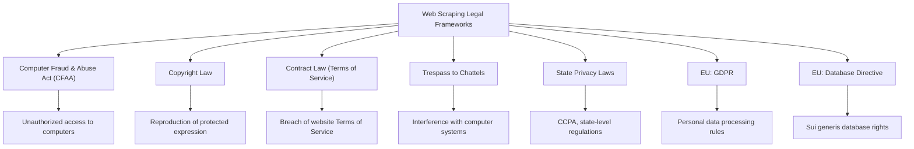
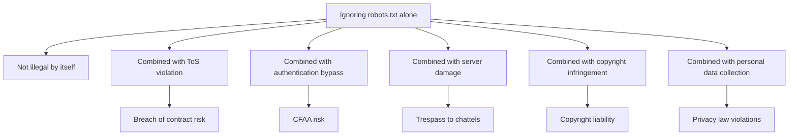
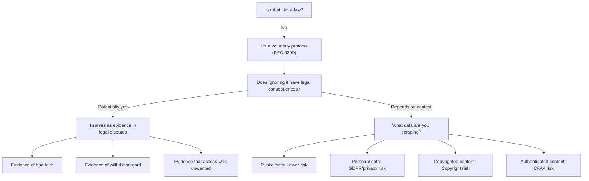

The short answer is no -- robots.txt is not legally binding. It is not a law, not a contract, and not an enforceable directive. But the longer answer matters far more: ignoring robots.txt can still land you in serious legal trouble, depending on what you scrape, how you scrape it, and what you do with the data afterward. The legal landscape around web scraping is a patchwork of computer fraud statutes, copyright law, privacy regulations, and contract claims -- and robots.txt sits at the intersection of all of them, serving as evidence of intent rather than a legal instrument in its own right.

**Disclaimer:** This article is for educational purposes only and does not constitute legal advice. If you are facing a legal question about web scraping, consult a qualified attorney in your jurisdiction.

## What robots.txt Actually Is

The robots.txt file is a voluntary protocol defined in [RFC 9309](https://www.rfc-editor.org/rfc/rfc9309), published by the IETF in September 2022. It formalizes a convention that has existed since 1994, when Martijn Koster proposed the Robots Exclusion Protocol as a way for websites to communicate crawling preferences to automated agents.

The key word is "voluntary." The specification itself makes this clear -- robots.txt is a request from a website operator, not a command. There is no technical enforcement mechanism built into the protocol. Any HTTP client can fetch any URL regardless of what robots.txt says. The file relies entirely on the good faith of the crawler to read it and comply.

```
# Example robots.txt
User-agent: *
Disallow: /private/
Disallow: /api/
Crawl-delay: 10

User-agent: GPTBot
Disallow: /

User-agent: Googlebot
Allow: /
```

This is a text file sitting at the root of a domain. It does not create a legal obligation. It does not form a contract -- there is no offer, acceptance, or consideration. It is closer to a "please do not disturb" sign on a hotel door than to a lock on the door itself.

That said, courts have treated robots.txt as a relevant signal when evaluating scraping disputes. Ignoring it can demonstrate willfulness, bad faith, or knowledge that access was unwanted -- all factors that influence how judges and juries evaluate claims under various legal theories.

## The Legal Frameworks That Actually Apply

No single law governs web scraping. Instead, several overlapping legal frameworks determine whether a particular scraping activity is lawful. Understanding these frameworks is essential because robots.txt violations are never the primary claim -- they are evidence used to support claims under one or more of these theories.



Each of these frameworks asks different questions. The CFAA asks whether you accessed a computer without authorization. Copyright law asks whether you reproduced protected expression. Contract law asks whether you agreed to and then violated terms of service. Trespass to chattels asks whether your scraping materially interfered with the website's servers. Privacy laws ask whether you collected personal data in violation of applicable regulations.

Robots.txt is not the subject of any of these inquiries. But it frequently appears as supporting evidence.

## Key US Court Cases

Several landmark cases have shaped how US courts view web scraping and, by extension, the role of robots.txt in legal disputes.

### hiQ Labs v. LinkedIn (2022)

This is the most important web scraping case in US law. hiQ Labs scraped publicly available LinkedIn profiles to provide workforce analytics services. LinkedIn sent a cease-and-desist letter and began blocking hiQ's access. hiQ sued for declaratory relief, and the case eventually reached the Ninth Circuit twice, with the Supreme Court weighing in between.

The Ninth Circuit held that scraping publicly available data likely does not violate the CFAA. The court reasoned that the CFAA's "without authorization" language applies to systems that require authentication -- not to publicly accessible websites. LinkedIn's cease-and-desist letter and technical blocking measures did not transform public data into protected data under the CFAA.

The key takeaway: accessing publicly available information on the open web is unlikely to constitute a CFAA violation, even if the website operator objects. This case did not address robots.txt directly, but the logic extends naturally -- a robots.txt Disallow directive, like a cease-and-desist letter, does not make public data "authorized access only" under the CFAA.

### Meta v. Bright Data (2024)

In January 2024, a federal court in California largely sided with Bright Data in a dispute with Meta over scraping publicly available data from Facebook and Instagram. The court found that Bright Data's scraping of public pages did not violate the CFAA or California's computer fraud statute because the data was publicly accessible without logging in.

Meta's claims that survived were narrower -- related to scraping by authenticated users who had agreed to Meta's Terms of Service. The court drew a clear line: public data accessed without authentication is treated differently from data behind a login wall.

This case reinforced the hiQ principle and added an important nuance: even a company as large and legally aggressive as Meta cannot use the CFAA to prevent scraping of its public content.

### Clearview AI Litigation

Clearview AI scraped billions of photos from social media platforms, news sites, and other sources to build a facial recognition database. The company faced lawsuits from the ACLU, multiple state attorneys general, and regulatory actions in the EU, UK, Australia, and Canada.

The legal trouble for Clearview was not primarily about ignoring robots.txt. The claims centered on privacy violations (scraping biometric data), violations of state biometric privacy laws like the Illinois BIPA, and the commercial use of personal data without consent. Clearview settled the ACLU lawsuit in 2022, agreeing to significant restrictions on selling its database to private entities.

This case illustrates an important principle: the legality of scraping depends heavily on what data you collect and what you do with it. Even if the data is publicly visible, scraping personal biometric information at scale for commercial facial recognition raises legal issues that go far beyond robots.txt compliance.

### Van Buren v. United States (2021)

While not a scraping case, the Supreme Court's decision in Van Buren v. United States significantly narrowed the CFAA. The Court held that the CFAA's "exceeds authorized access" provision applies only to those who access information to which their computer access does not extend -- not to those who misuse information they are otherwise authorized to access.

This ruling undermined the "terms of service violation equals CFAA violation" theory that some plaintiffs had advanced. Under Van Buren, merely violating a website's terms of service while accessing otherwise public data is unlikely to constitute a CFAA crime.

## Key EU Considerations

The European legal landscape adds additional layers of complexity, particularly around personal data and database rights.

### GDPR

The General Data Protection Regulation applies whenever you process personal data of EU residents, regardless of where you are located. Critically, GDPR compliance is entirely independent of robots.txt. A website can allow scraping in its robots.txt while the data you collect is still subject to GDPR requirements.

Under GDPR, scraping personal data requires a lawful basis for processing. The most commonly invoked basis for scraping is "legitimate interest" (Article 6(1)(f)), but this requires a balancing test against the rights and freedoms of the data subjects. Scraping publicly available personal data does not automatically satisfy GDPR requirements.

GDPR enforcement in the scraping context has teeth. Clearview AI was fined 20 million euros by both the Italian and Greek data protection authorities for scraping photos of EU residents.

### Database Directive

The EU's Database Directive (96/9/EC) grants sui generis rights to database creators who have made a "substantial investment" in obtaining, verifying, or presenting the contents of a database. This means that even if the individual data points are not copyrightable, the database as a whole may be protected. The [evolution of web scraping detection methods](/posts/evolution-web-scraping-detection-methods-timeline/) shows how enforcement of these protections has grown increasingly sophisticated over time.

This has no equivalent in US law and creates an additional risk for scraping EU-based websites. Extracting a substantial portion of a protected database can constitute infringement regardless of what robots.txt says.


<figure>
  
  <figcaption>The law doesn't deal in absolutes — context decides everything. <span class="img-credit">Photo by www.kaboompics.com / <a href="https://www.pexels.com" target="_blank" rel="noopener noreferrer">Pexels</a></span></figcaption>
</figure>

## When Ignoring robots.txt Becomes Legally Risky

Ignoring robots.txt is not itself illegal, but it can significantly increase your legal exposure in several scenarios.

### Combined with Terms of Service Violations

If you create an account on a website and agree to its Terms of Service, you may be entering a contractual relationship. Many ToS explicitly prohibit automated access, scraping, or data collection. Ignoring robots.txt while also violating a ToS you agreed to creates a breach of contract claim. The robots.txt violation becomes evidence that you knew your access was unwanted and proceeded anyway.



### Accessing Authenticated or Private Content

If robots.txt blocks a path that requires authentication, and you bypass that authentication to scrape the content -- perhaps using [stealth browsers or anti-detection tools](/posts/stealth-browsers-in-2026-camoufox-nodriver-and-the-anti-detection-arms-race/) -- you are likely violating the CFAA. The combination of technical access controls (login requirements) and explicit exclusion signals (robots.txt) creates a strong case that your access was "without authorization."

### Causing Server Damage

Aggressive scraping that ignores `Crawl-delay` directives or rate limits in robots.txt and causes server performance degradation can support a trespass to chattels claim. Courts have found liability when scraping causes measurable harm to a website's infrastructure. The ignored robots.txt becomes evidence that you disregarded the operator's stated resource constraints.

### Scraping Copyrighted Content for Commercial Use

Copyright law protects original expression regardless of robots.txt. If you scrape copyrighted articles, images, or creative works and republish or commercially exploit them, you face copyright infringement claims. Ignoring robots.txt that specifically blocks the paths containing this content undermines any fair use defense you might raise, because it demonstrates awareness that the content owner objected to automated copying.

## When Scraping Is Generally Safe Despite robots.txt

There are scenarios where scraping is generally considered low-risk even if robots.txt restricts access.

### Public Data for Academic Research

Academic research using publicly available data has strong legal protection, particularly in the US where fair use considerations favor non-commercial research. Several courts have recognized the value of research uses of scraped data. The hiQ case itself was partly sympathetic because hiQ argued its analytics served workforce transparency interests.

### Publicly Available Facts

Facts are not copyrightable. This is a foundational principle of copyright law established in Feist Publications v. Rural Telephone Service (1991). Scraping factual information -- product prices, business addresses, stock tickers, weather data -- is generally low-risk because the underlying data cannot be protected by copyright, regardless of robots.txt settings. Even extracting structured data like [email addresses using regex patterns](/posts/email-regex-patterns-web-scraping-reliable-extraction/) from public pages falls into this category when the data itself is factual.

### Competitive Intelligence from Public Pages

Gathering competitive intelligence from publicly accessible business information has long been recognized as a legitimate business practice. Scraping publicly visible pricing, product listings, or service descriptions for competitive analysis is generally permissible, particularly after the hiQ and Bright Data rulings.

That said, "generally safe" does not mean "risk-free." Context always matters. The volume of data collected, the impact on the source website, the nature of the data, and your jurisdiction all affect the analysis.

## Best Practices: Professional Etiquette Matters

Even though robots.txt is not legally binding, respecting it is widely considered professional best practice. Here is why.

First, it demonstrates good faith. If a dispute ever arises, showing that you respected robots.txt signals that you acted reasonably and ethically. Courts notice this.

Second, it reduces the chance of conflict in the first place. Website operators who see that your crawler respects their robots.txt are less likely to pursue legal action or implement aggressive blocking measures like [AI honeypot pages designed to trap scrapers](/posts/cloudflare-ai-labyrinth-how-honeypot-pages-are-trapping-scrapers/).

Third, it is part of being a responsible member of the web ecosystem. The web works because of shared norms and mutual respect between operators and automated agents. Undermining these norms has consequences beyond the legal realm -- it contributes to the erosion of the open web.

```python
# Best practice checklist before scraping
SCRAPING_CHECKLIST = {
    "check_robots_txt": "Parse and respect robots.txt directives",
    "read_terms_of_service": "Review ToS for scraping restrictions",
    "identify_data_type": "Determine if data is public, personal, or copyrighted",
    "set_rate_limits": "Implement reasonable request intervals",
    "set_user_agent": "Use an identifiable, honest user-agent string",
    "assess_jurisdiction": "Consider laws in both your and the target's jurisdiction",
    "document_purpose": "Record the legitimate purpose of your data collection",
    "minimize_data": "Collect only what you need",
    "check_for_api": "Use an official API if one is available",
    "consult_legal": "Get legal advice for large-scale or commercial projects",
}
```


<figure>
  
  <figcaption>Legal risk is real, but it's manageable with the right approach. <span class="img-credit">Photo by dp singh Bhullar / <a href="https://www.pexels.com" target="_blank" rel="noopener noreferrer">Pexels</a></span></figcaption>
</figure>

## Parsing robots.txt Programmatically

Python's standard library includes `urllib.robotparser`, a module specifically designed for parsing and respecting robots.txt files. If you are deciding between [Python requests and Selenium for your scraping stack](/posts/python-requests-vs-selenium-speed-performance-comparison/), note that both can integrate robots.txt compliance. Using this module demonstrates that you are making a deliberate effort to comply with site operator preferences.

```python
from urllib.robotparser import RobotFileParser
from urllib.parse import urljoin
import time


def check_scraping_allowed(base_url: str, paths: list[str], user_agent: str = "*") -> dict:
    """
    Check whether scraping is allowed for a list of paths
    on a given domain according to its robots.txt.

    Args:
        base_url: The root URL of the target site (e.g., "https://example.com")
        paths: List of paths to check (e.g., ["/products/", "/api/data"])
        user_agent: The user-agent string your crawler uses

    Returns:
        Dictionary mapping each path to its allowed/disallowed status
    """
    robots_url = urljoin(base_url, "/robots.txt")

    rp = RobotFileParser()
    rp.set_url(robots_url)

    try:
        rp.read()
    except Exception as e:
        print(f"Could not fetch robots.txt from {robots_url}: {e}")
        # If robots.txt is unreachable, the convention is to assume
        # all paths are allowed. But proceed with caution.
        return {path: True for path in paths}

    results = {}
    for path in paths:
        full_url = urljoin(base_url, path)
        allowed = rp.can_fetch(user_agent, full_url)
        results[path] = allowed

    # Also check for crawl-delay
    crawl_delay = rp.crawl_delay(user_agent)
    if crawl_delay:
        print(f"Crawl-delay for '{user_agent}': {crawl_delay} seconds")

    return results


def respectful_scrape(base_url: str, paths: list[str], user_agent: str = "MyResearchBot/1.0"):
    """
    Only scrape paths that are permitted by robots.txt,
    respecting any crawl-delay directives.
    """
    import requests

    # Step 1: Check robots.txt
    permissions = check_scraping_allowed(base_url, paths, user_agent)

    # Step 2: Determine crawl delay
    rp = RobotFileParser()
    rp.set_url(urljoin(base_url, "/robots.txt"))
    try:
        rp.read()
    except Exception:
        pass
    delay = rp.crawl_delay(user_agent) or 1  # Default to 1 second

    # Step 3: Only fetch allowed paths
    results = {}
    for path, allowed in permissions.items():
        if not allowed:
            print(f"SKIPPING {path} -- blocked by robots.txt")
            continue

        url = urljoin(base_url, path)
        print(f"FETCHING {path} -- allowed by robots.txt")

        try:
            response = requests.get(
                url,
                headers={"User-Agent": user_agent},
                timeout=30,
            )
            results[path] = {
                "status": response.status_code,
                "length": len(response.content),
            }
        except requests.RequestException as e:
            results[path] = {"error": str(e)}

        # Respect crawl delay between requests
        time.sleep(delay)

    return results


# Example usage
if __name__ == "__main__":
    target = "https://example.com"
    paths_to_check = [
        "/products/",
        "/api/internal/",
        "/blog/",
        "/private/user-data/",
        "/public/catalog/",
    ]

    print("=== Checking robots.txt permissions ===\n")
    permissions = check_scraping_allowed(target, paths_to_check, "MyResearchBot/1.0")

    for path, allowed in permissions.items():
        status = "ALLOWED" if allowed else "BLOCKED"
        print(f"  {path}: {status}")
```

The code above does two important things. First, it checks robots.txt before making any requests, which is the correct order of operations. Second, it respects the `Crawl-delay` directive, which controls how quickly you send requests. Many scrapers check `Disallow` rules but ignore `Crawl-delay`, which can still cause server strain issues.

## The Emerging Landscape

The legal and technical frameworks around scraping are evolving rapidly, driven primarily by the [AI training data debate](/posts/the-ai-bot-traffic-explosion-what-1-bot-per-31-humans-means-for-the-web/).

### AI Training and Content Licensing

The explosion of AI model training has created enormous demand for web-scraped data, with [LLM-powered structured extraction](/posts/best-llm-structured-data-extraction-html-2026/) making it easier than ever to harvest and process content at scale. Companies like OpenAI, Google, Anthropic, and Meta have scraped vast portions of the public web to train their models. This has triggered a wave of lawsuits from content creators, publishers, and artists who argue that using their work for AI training constitutes copyright infringement.

The New York Times v. OpenAI lawsuit, filed in December 2023, is perhaps the most prominent example. The outcome of this case and others like it will significantly shape the legal framework for large-scale web scraping for years to come.

In response to these tensions, a [content licensing ecosystem is beginning to emerge](/posts/microsofts-content-marketplace-from-scraping-to-licensing/). Some companies are now paying publishers for the right to use their content in training data, which suggests a future where scraping and licensing coexist rather than scraping serving as a replacement for licensing.

### IETF AIPREF

The Internet Engineering Task Force chartered the [AI Preferences (AIPREF) working group](/posts/ietf-aipref-the-new-robots-txt-for-the-ai-era/) in January 2026 to develop a new standard that extends beyond robots.txt. While robots.txt controls whether a crawler can access a page, AIPREF aims to let site operators express preferences about how their content is used -- for example, allowing indexing for search but prohibiting use in AI training datasets.

AIPREF is still in its early stages, but it signals a future where the distinction between "access" and "use" becomes a first-class concept in web standards -- one of several [unsolved problems of AI web scraping](/posts/the-unsolved-problems-of-ai-web-scraping-in-2026/). Whether AIPREF directives will carry any legal weight remains to be seen, but they will likely serve the same evidentiary role that robots.txt currently plays -- demonstrating what the content owner intended.

### The Regulatory Trajectory

Legislatures around the world are considering new regulations that specifically address AI training data and automated data collection. The EU AI Act, which entered into force in 2024, imposes transparency obligations on AI model providers regarding their training data. Similar legislation is under consideration in the US, UK, and other jurisdictions.

The trend is toward more regulation, not less. Scrapers who build their practices around ethical norms today -- including respecting robots.txt -- are better positioned to comply with whatever regulatory framework emerges tomorrow.

## Summary: The Role of robots.txt in Scraping Law



Robots.txt is not a law. It is not a contract. It is not enforceable on its own. But it is a well-established convention that courts recognize as a signal of intent. Ignoring it does not automatically make your scraping illegal, but it can make a bad legal position worse and a defensible position harder to defend.

The pragmatic approach is straightforward: treat robots.txt as professional etiquette, not as an optional inconvenience. Respect it when you can. When you have a legitimate reason to scrape content that robots.txt restricts -- such as academic research on public factual data -- document your reasoning, minimize your impact, and consult a lawyer if the stakes are high.

The legal landscape of web scraping is still being written. The cases, regulations, and standards that emerge over the next few years will define the rules for a generation. Building your scraping practices on a foundation of respect, transparency, and legal awareness is not just good ethics -- it is good strategy.
