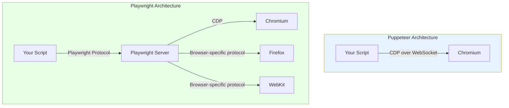
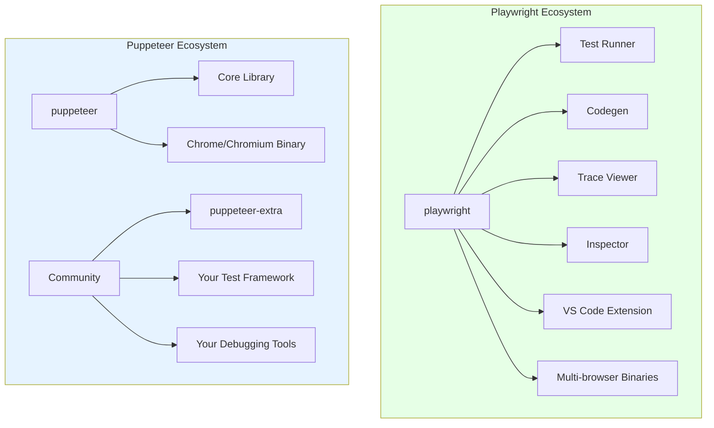

Playwright and Puppeteer share the same DNA. Both were born from the Chrome DevTools Protocol, and the core engineers who built Puppeteer at Google later left to build Playwright at Microsoft. That shared lineage means the two libraries look similar on the surface -- same async patterns, same page objects, same general approach to controlling a browser from code. But they have diverged significantly since 2020, and the gap continues to widen. If you are choosing between them for a new scraping or automation project, the differences matter more than the similarities.

This post compares Playwright and Puppeteer across the dimensions that matter most for browser automation work: architecture, speed, stealth, multi-browser support, API design, and developer tooling.

## Architecture and the CDP Foundation

Both libraries communicate with browsers through the Chrome DevTools Protocol. Puppeteer connects directly to a Chromium instance over a WebSocket, sending CDP commands and receiving events. Playwright adds an intermediate server layer -- the Playwright Server -- that sits between your code and the browser. This server translates Playwright's own protocol into browser-specific commands, which is how Playwright supports multiple browser engines through a single API.



This architectural difference has real consequences. Puppeteer's direct CDP connection means zero translation overhead for Chrome-specific work. If you need raw access to CDP domains like `Network`, `Runtime`, or `DOM`, Puppeteer gives you an unmediated pipe. Playwright's server layer adds a thin abstraction, but that abstraction is what enables it to drive Firefox and WebKit with the same script.

Both libraries let you send raw CDP commands when needed:

```javascript
// Puppeteer -- direct CDP session
const client = await page.createCDPSession();
await client.send('Network.enable');
await client.send('Network.setExtraHTTPHeaders', {
  headers: { 'X-Custom-Header': 'scraper-v1' }
});

// Playwright -- CDP session on Chromium only
const client = await page.context().newCDPSession(page);
await client.send('Network.enable');
await client.send('Network.setExtraHTTPHeaders', {
  headers: { 'X-Custom-Header': 'scraper-v1' }
});
```

The key takeaway is that Playwright's extra layer is not a disadvantage in most scenarios. It is the cost of multi-browser support, and that cost is small.

## Speed Comparison

Speed benchmarks between Playwright and Puppeteer are close enough that the difference rarely matters for real scraping workloads. The bottleneck in browser automation is almost always network latency, page rendering, and JavaScript execution on the target site -- not the overhead of the automation library itself.

That said, Puppeteer does have a slight edge in raw CDP throughput for Chromium-only work. Without the Playwright Server in the middle, each CDP command has one less hop. In synthetic benchmarks that fire thousands of CDP calls in tight loops, Puppeteer can be 5-15% faster. In real-world scraping where you are waiting for pages to load and elements to render, the difference vanishes.

Here is a rough comparison for common operations:

| Operation | Puppeteer | Playwright |
|---|---|---|
| Browser launch (cold) | ~800ms | ~900ms |
| New page creation | ~50ms | ~60ms |
| Navigation (page.goto) | Network-bound | Network-bound |
| Element query | ~1ms | ~1-2ms |
| Screenshot (full page) | ~200ms | ~200ms |
| PDF generation | ~300ms | ~300ms |

The numbers above are approximate and vary by machine, browser version, and page complexity. The point is that both libraries are fast, and neither will be the bottleneck in your pipeline.

Where Playwright does gain a meaningful speed advantage is in parallel execution. Its browser context model makes it trivial to run dozens of isolated sessions within a single browser process. Puppeteer can do this too with incognito contexts, but Playwright's context isolation is more robust and its parallelism story is better supported by the API.

## Multi-Browser Support

This is where the two libraries diverge most sharply. Playwright supports three browser engines out of the box:

- **Chromium** -- the same engine that powers Chrome, Edge, Brave, and Opera
- **Firefox** -- a patched build maintained by the Playwright team
- **WebKit** -- the engine behind Safari, also maintained as a patched build

Puppeteer is Chromium-first. It has experimental Firefox support that has been in various states of completeness for years, but it is not production-ready for most use cases.

For web scraping, multi-browser support matters in specific scenarios. Some anti-bot systems check the browser engine and flag automation more aggressively on Chromium. Running your scraper on WebKit through Playwright can sometimes bypass detections that are tuned for Chrome-based automation. Firefox through Playwright is another option that presents a different fingerprint.

```javascript
// Playwright -- same script, three browsers
const { chromium, firefox, webkit } = require('playwright');

for (const browserType of [chromium, firefox, webkit]) {
  const browser = await browserType.launch();
  const page = await browser.newPage();
  await page.goto('https://example.com');
  console.log(`${browserType.name()}: ${await page.title()}`);
  await browser.close();
}
```

```javascript
// Puppeteer -- Chromium only (in practice)
const puppeteer = require('puppeteer');

const browser = await puppeteer.launch();
const page = await browser.newPage();
await page.goto('https://example.com');
console.log(await page.title());
await browser.close();
```

If your scraping targets are all standard websites and you do not need to test across engines, Puppeteer's Chromium-only approach is not a limitation. But if you want the flexibility to switch engines for stealth or compatibility reasons, Playwright is the only serious option.


<figure>
  
  <figcaption>Browser automation turns repetitive tasks into reliable scripts. <span class="img-credit">Photo by ThisIsEngineering / <a href="https://www.pexels.com" target="_blank" rel="noopener noreferrer">Pexels</a></span></figcaption>
</figure>

## API Comparison: Ergonomics Matter

Both libraries let you do the same things, but Playwright's API is more ergonomic for common automation tasks. The biggest difference is auto-waiting. Playwright's action methods -- `click()`, `fill()`, `textContent()` -- automatically wait for elements to be visible, enabled, and stable before acting. This matters especially for tasks like [automating web form filling](/posts/how-to-automate-web-form-filling-complete-guide/), where reliable element interaction is critical. Puppeteer requires you to manage waits explicitly in many cases.

Here is the same task in both libraries: navigating to a page, waiting for a search input, typing a query, clicking a button, and extracting results.

```javascript
// Puppeteer
const puppeteer = require('puppeteer');

(async () => {
  const browser = await puppeteer.launch({ headless: true });
  const page = await browser.newPage();
  await page.goto('https://example.com/search');

  // Wait for the input to appear
  await page.waitForSelector('input[name="q"]');
  await page.type('input[name="q"]', 'web scraping');

  // Click search and wait for results
  await Promise.all([
    page.waitForNavigation(),
    page.click('button[type="submit"]')
  ]);

  // Extract results
  const results = await page.$$eval('.result-title', els =>
    els.map(el => el.textContent)
  );
  console.log(results);

  await browser.close();
})();
```

```javascript
// Playwright
const { chromium } = require('playwright');

(async () => {
  const browser = await chromium.launch({ headless: true });
  const page = await browser.newPage();
  await page.goto('https://example.com/search');

  // Auto-waits for the input, then fills it
  await page.locator('input[name="q"]').fill('web scraping');

  // Auto-waits for navigation after click
  await page.locator('button[type="submit"]').click();

  // Auto-waits for elements, then extracts text
  const results = await page.locator('.result-title').allTextContents();
  console.log(results);

  await browser.close();
})();
```

The Playwright version is shorter and handles timing automatically. The `locator` API is the key difference. Locators are lazy -- they do not resolve to a specific DOM element until an action is performed. This means they are resilient to DOM changes between when you create the locator and when you use it -- an advantage that also helps when dealing with [shadow DOM elements that break many automation tools](/posts/shadow-dom-the-silent-killer-of-ai-web-scraping/).

Puppeteer's `page.$()` and `page.$$()` resolve immediately, returning `ElementHandle` objects that hold a reference to a specific DOM node. If the DOM updates and that node is replaced, the handle goes stale. You end up writing defensive code with retries and waits.

Playwright's locator approach also integrates well with its built-in assertions:

```javascript
// Playwright -- built-in assertion that auto-retries
const { expect } = require('@playwright/test');

await expect(page.locator('.result-count')).toHaveText('42 results');
// This retries for up to 5 seconds by default, checking the text repeatedly
```

Puppeteer has no built-in assertion library. You pull in your own (`chai`, `jest`, etc.) and manually implement retry logic if you need it.

## Stealth: Both Detectable by Default

Neither Playwright nor Puppeteer is stealthy out of the box. Both inject automation markers that anti-bot systems detect: the `navigator.webdriver` flag, missing browser plugins, headless-mode indicators, and altered JavaScript prototypes. If you run either library against a site protected by Cloudflare, DataDome, or PerimeterX -- systems that have [evolved significantly over the past decade](/posts/evolution-web-scraping-detection-methods-timeline/) -- you will get blocked almost immediately. Cloudflare's [AI Labyrinth](/posts/cloudflare-ai-labyrinth-how-honeypot-pages-are-trapping-scrapers/) can even trap scrapers in infinite loops of AI-generated pages rather than blocking them outright. For a deeper look at how both tools compare on anti-detection specifically, see our [Playwright vs Selenium stealth comparison](/posts/playwright-vs-selenium-stealth-which-evades-detection-better/).

The community has developed stealth plugins for both:

**Puppeteer stealth** uses `puppeteer-extra` with the stealth plugin:

```javascript
const puppeteer = require('puppeteer-extra');
const StealthPlugin = require('puppeteer-extra-plugin-stealth');

puppeteer.use(StealthPlugin());

const browser = await puppeteer.launch({ headless: true });
const page = await browser.newPage();

// The stealth plugin patches many automation indicators:
// - navigator.webdriver = false
// - Passes chrome.runtime checks
// - Fixes iframe contentWindow inconsistencies
// - Spoofs plugins and languages
// - Patches WebGL vendor/renderer strings
```

**Playwright stealth** is available through `playwright-extra` (a community port of the puppeteer-extra ecosystem) or through standalone patches:

```javascript
const { chromium } = require('playwright-extra');
const stealth = require('puppeteer-extra-plugin-stealth');

chromium.use(stealth());

const browser = await chromium.launch({ headless: true });
const page = await browser.newPage();
// Same stealth patches applied to Playwright
```

There is also `playwright-stealth`, a simpler standalone package:

```javascript
const { chromium } = require('playwright');
const { newInjectedContext } = require('playwright-stealth');

const browser = await chromium.launch();
const context = await newInjectedContext(browser, {
  // Stealth options
});
const page = await context.newPage();
```

In practice, `puppeteer-extra-plugin-stealth` has been around longer and is more battle-tested. The Playwright stealth ecosystem is catching up but is still more fragmented. If stealth is your primary concern, Puppeteer's stealth plugin has a slight maturity advantage. However, both approaches have diminishing effectiveness against modern anti-bot systems that use behavioral analysis, TLS fingerprinting, and HTTP/2 frame analysis rather than just checking JavaScript properties.

For serious stealth work in 2026, dedicated [anti-detection browsers like Camoufox and nodriver](/posts/stealth-browsers-in-2026-camoufox-nodriver-and-the-anti-detection-arms-race/) often outperform both Playwright and Puppeteer stealth plugins. If you are interested in nodriver specifically, our [complete guide](/posts/nodriver-complete-guide-undetected-browser-automation-python/) and [getting started tutorial](/posts/getting-started-nodriver-python-installation-first-script/) cover it in depth. The stealth plugins are a good starting point, not a complete solution.


<figure>
  
  <figcaption>Modern tooling makes browser control accessible to every developer. <span class="img-credit">Photo by MASUD GAANWALA / <a href="https://www.pexels.com" target="_blank" rel="noopener noreferrer">Pexels</a></span></figcaption>
</figure>

## Developer Experience and Tooling

Playwright ships with an integrated developer experience that Puppeteer cannot match. The gap is wide and continues to grow.

**Playwright's built-in tools:**

- **Codegen** (`npx playwright codegen`) -- opens a browser and records your interactions, generating Playwright script code in real time. Point, click, and get working code. This is invaluable for quickly prototyping scrapers.
- **Trace Viewer** -- records a detailed trace of your automation session including screenshots at every step, DOM snapshots, network requests, and console logs. You can replay the entire session in a visual timeline.
- **Inspector** -- a step-through debugger for Playwright scripts. Pause at any point, inspect the page, and modify locators interactively.
- **Test Runner** (`@playwright/test`) -- a full test framework with parallel execution, fixtures, retries, and HTML reports.
- **VS Code Extension** -- first-party integration with IntelliSense, test running, and debugging.

```bash
# Generate a script by recording browser interactions
npx playwright codegen https://example.com

# Run with trace recording
npx playwright test --trace on

# Open the trace viewer
npx playwright show-trace trace.zip
```

**Puppeteer's tooling** is leaner by design. Puppeteer is a library, not a framework. It does not ship with a test runner, code generator, or trace viewer. You bring your own test framework, your own debugging approach, and your own reporting.

This is not necessarily a disadvantage. If you already have a Node.js toolchain you are happy with -- Jest for testing, your own logging, Chrome DevTools for debugging -- Puppeteer integrates without imposing its own opinions. Playwright's batteries-included approach is more productive for new projects but can feel heavy if you only need a browser control library.



For scraping specifically, Playwright's codegen tool deserves special mention. When you need to figure out the right selectors and interaction sequence for a complex site, recording it in a browser is far faster than writing code from scratch. Playwright's tooling story extends further with [MCP and CLI integrations that make it AI-agent-friendly](/posts/playwright-mcp-and-cli-making-browser-automation-ai-agent-friendly/). Puppeteer has no equivalent.

## Language Support

Playwright has official, Microsoft-maintained bindings for four languages:

- **JavaScript / TypeScript** -- the primary API
- **Python** -- full feature parity with the JS API
- **Java** -- full feature parity
- **.NET (C#)** -- full feature parity

All four are maintained in the same monorepo, released on the same schedule, and support the same features. The Python API is particularly popular in the scraping community:

```python
# Playwright in Python
from playwright.sync_api import sync_playwright

with sync_playwright() as p:
    browser = p.chromium.launch(headless=True)
    page = browser.new_page()
    page.goto("https://example.com/search")

    page.locator("input[name='q']").fill("web scraping")
    page.locator("button[type='submit']").click()

    results = page.locator(".result-title").all_text_contents()
    print(results)

    browser.close()
```

Playwright also provides an async Python API for integration with `asyncio`:

```python
# Playwright async Python API
import asyncio
from playwright.async_api import async_playwright

async def scrape():
    async with async_playwright() as p:
        browser = await p.chromium.launch(headless=True)
        page = await browser.new_page()
        await page.goto("https://example.com")
        title = await page.title()
        print(title)
        await browser.close()

asyncio.run(scrape())
```

Puppeteer is JavaScript and TypeScript only. The community-maintained `pyppeteer` project attempted to port Puppeteer to Python, but it has been largely abandoned and lags far behind Puppeteer's current API. If you are a Python shop, Playwright is the clear choice -- and if you are weighing lighter-weight options, our [Python requests vs Selenium performance comparison](/posts/python-requests-vs-selenium-speed-performance-comparison/) covers when a full browser is even necessary. If you work in Java or .NET, Playwright is your only option among these two.

## Context Isolation

Browser contexts are isolated browser sessions that share a single browser process. They are lighter than launching separate browser instances but provide meaningful isolation -- separate cookies, separate local storage, separate cache. Both libraries support them, but Playwright's implementation is more capable.

```javascript
// Playwright -- browser contexts with full configuration
const browser = await chromium.launch();

const context1 = await browser.newContext({
  viewport: { width: 1920, height: 1080 },
  userAgent: 'Mozilla/5.0 (Windows NT 10.0; Win64; x64)...',
  locale: 'en-US',
  timezoneId: 'America/New_York',
  geolocation: { longitude: -73.935242, latitude: 40.730610 },
  permissions: ['geolocation'],
  httpCredentials: { username: 'user', password: 'pass' },
  storageState: 'auth-state.json'  // Reuse saved cookies/storage
});

const page1 = await context1.newPage();

const context2 = await browser.newContext({
  viewport: { width: 375, height: 812 },
  userAgent: 'Mozilla/5.0 (iPhone; CPU iPhone OS 16_0)...',
  locale: 'de-DE',
  timezoneId: 'Europe/Berlin',
  isMobile: true
});

const page2 = await context2.newPage();
// page1 and page2 are fully isolated sessions
```

```javascript
// Puppeteer -- incognito context with less configuration
const browser = await puppeteer.launch();

const context1 = await browser.createBrowserContext();
const page1 = await context1.newPage();
await page1.setViewport({ width: 1920, height: 1080 });
await page1.setUserAgent('Mozilla/5.0 (Windows NT 10.0; Win64; x64)...');

const context2 = await browser.createBrowserContext();
const page2 = await context2.newPage();
await page2.setViewport({ width: 375, height: 812 });
await page2.setUserAgent('Mozilla/5.0 (iPhone; CPU iPhone OS 16_0)...');
// Contexts are isolated but configuration requires separate API calls
```

The difference is not just syntactic. Playwright's contexts support features that Puppeteer's do not:

- **Storage state serialization** -- save and restore the complete session state (cookies, localStorage, sessionStorage) to a JSON file. This is essential for scraping sites that require authentication.
- **Route interception per context** -- intercept and modify network requests at the context level, not just per page.
- **Timezone and locale overrides** -- built into the context configuration.
- **Geolocation, permissions, and color scheme** -- all configurable per context.

For scraping at scale, context isolation is how you run multiple concurrent sessions efficiently. Playwright's richer context configuration means less boilerplate code and more reliable isolation.

```python
# Playwright Python -- saving and restoring session state
from playwright.sync_api import sync_playwright

with sync_playwright() as p:
    browser = p.chromium.launch()

    # Login once and save state
    context = browser.new_context()
    page = context.new_page()
    page.goto("https://example.com/login")
    page.locator("#username").fill("user@example.com")
    page.locator("#password").fill("password123")
    page.locator("button[type='submit']").click()
    page.wait_for_url("**/dashboard")

    # Save the authenticated state
    context.storage_state(path="auth.json")
    context.close()

    # Reuse the authenticated state in new contexts
    for i in range(10):
        ctx = browser.new_context(storage_state="auth.json")
        pg = ctx.new_page()
        pg.goto(f"https://example.com/data/page/{i}")
        # Already logged in -- no need to re-authenticate
        data = pg.locator(".data-row").all_text_contents()
        print(data)
        ctx.close()

    browser.close()
```

This pattern -- login once, save state, reuse across many contexts -- is something Playwright makes trivial. In Puppeteer, you would need to manually extract cookies and inject them into each new context, handling localStorage separately.

## When to Choose Which

The decision between Playwright and Puppeteer comes down to what you need and what you already have.

**Choose Playwright when:**

- You are starting a new project with no existing Puppeteer codebase
- You need multi-browser support (Chromium, Firefox, WebKit)
- You want built-in tooling (codegen, trace viewer, inspector)
- You work in Python, Java, or .NET
- You need robust context isolation for parallel scraping
- You want auto-waiting and locators to simplify your code

**Choose Puppeteer when:**

- You have an existing Puppeteer codebase that works well
- You need direct, unmediated CDP access for advanced Chrome-specific features
- You want a lightweight library without framework opinions
- You are building Chrome extensions or Chrome-specific tooling
- You prefer the puppeteer-extra ecosystem for stealth and plugins (though you may also want to explore [other Puppeteer alternatives](/posts/top-puppeteer-alternatives-what-to-use-instead/))

For a broader view of how these two stack up against other options, see our [Playwright vs Puppeteer vs Selenium vs Scrapy mega comparison](/posts/playwright-vs-puppeteer-vs-selenium-vs-scrapy-2026-mega-comparison/). You can also read our focused comparisons of [Selenium vs Puppeteer](/posts/selenium-vs-puppeteer-definitive-comparison-web-scraping/) and [Puppeteer vs Selenium](/posts/puppeteer-vs-selenium-which-should-you-pick/) for different angles on the same decision. For most new browser automation and web scraping projects in 2026, Playwright is the stronger choice. Its API is more productive, its tooling is more complete, and its multi-language support opens it to a wider range of teams and codebases. The speed difference is negligible, and the stealth story is roughly comparable (neither is sufficient alone against modern anti-bot systems).

Puppeteer is not obsolete. It remains the better choice for Chrome-specific CDP work, and its lighter footprint is an advantage in environments where you want a library, not a framework. But for general-purpose browser automation -- especially as [AI agent frameworks](/posts/browser-agent-frameworks-compared-browser-use-vs-stagehand-vs-skyvern/) increasingly adopt [Playwright as their browser layer](/posts/playwright-for-browser-automation-in-ai-agents/) -- Playwright has pulled ahead and continues to extend its lead with every release.
