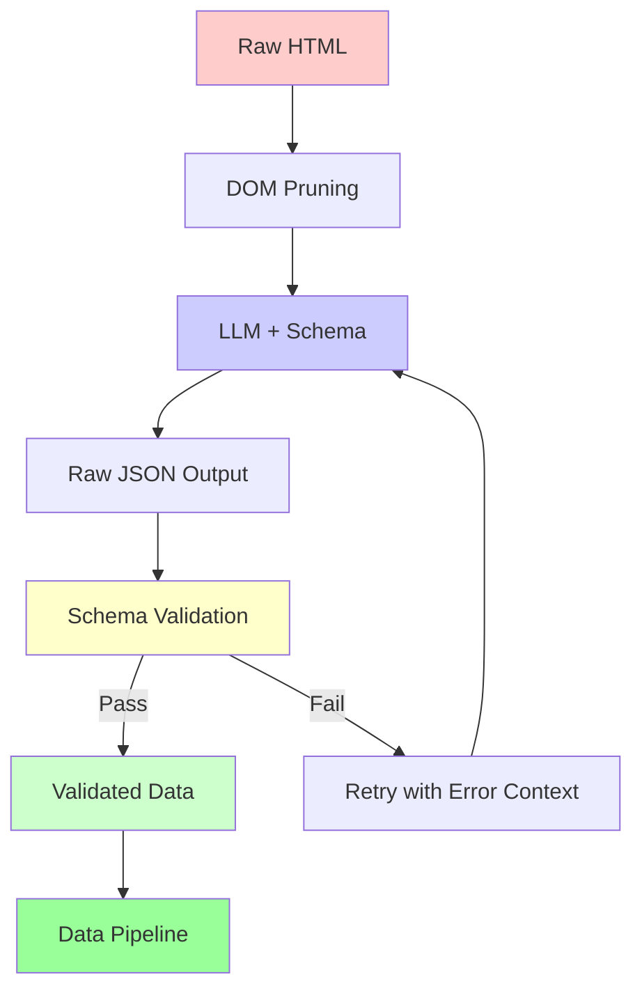

Schema-driven extraction is the pattern where you define a data model up front, hand it to an LLM alongside raw HTML, and get back validated, structured JSON. Instead of writing fragile CSS selectors or XPath expressions, you describe the shape of the output and let the model figure out where each field lives in the markup. For a comparison of which LLM performs best at this task, see our [guide to the best LLMs for structured data extraction](/posts/best-llm-structured-data-extraction-html-2026/). Both Python and JavaScript ecosystems have mature tools for this now -- Pydantic on the Python side, Zod on the TypeScript side -- and the major LLM providers have built native support for constrained JSON output. This post walks through the practical implementation of [schema-driven scraping](/posts/llm-powered-data-extraction-schema-driven-scraping-with-structured-output/) in both languages, covers how OpenAI and Claude handle structured output differently, and addresses the real-world problems you will hit when running this pattern at scale.

## The Core Concept

The idea is straightforward. You have a page full of HTML. You know what data you want from it. Instead of writing imperative extraction code, you declare the expected output structure as a schema, send the HTML and schema to an LLM, and validate what comes back.

This works because modern LLMs are remarkably good at understanding HTML structure. They can identify product names, prices, ratings, and descriptions even when the underlying markup varies across sites. The schema acts as a contract: it tells the model exactly what fields to extract, what types they should be, and which ones are optional.



The validation step is critical. LLMs are probabilistic -- one of the [unsolved problems of AI web scraping](/posts/the-unsolved-problems-of-ai-web-scraping-in-2026/) -- and even with structured output constraints, the data can be wrong -- a price extracted as a string instead of a float, a missing required field, or a hallucinated value. Schema validation catches these before bad data enters your pipeline.

## Python Approach with Pydantic

Pydantic v2 is the standard for data validation in Python. Its `BaseModel` class lets you define schemas that serve three purposes simultaneously: they document the expected data, they instruct the LLM on what to extract, and they validate the output.

```python
from pydantic import BaseModel, Field, field_validator
from typing import Optional


class ProductListing(BaseModel):
    """A single product extracted from an e-commerce page."""

    name: str = Field(description="The full product name or title")
    price: float = Field(gt=0, description="Current price in USD")
    original_price: Optional[float] = Field(
        default=None,
        gt=0,
        description="Original price before any discount, if displayed",
    )
    currency: str = Field(
        default="USD",
        description="ISO 4217 currency code",
    )
    rating: Optional[float] = Field(
        default=None,
        ge=0,
        le=5,
        description="Average customer rating out of 5",
    )
    review_count: Optional[int] = Field(
        default=None,
        ge=0,
        description="Total number of customer reviews",
    )
    in_stock: bool = Field(description="Whether the item is currently available")
    url: Optional[str] = Field(
        default=None,
        description="Product detail page URL, absolute or relative",
    )
    image_url: Optional[str] = Field(
        default=None,
        description="Main product image URL",
    )

    @field_validator("price", "original_price", mode="before")
    @classmethod
    def clean_price(cls, v):
        if isinstance(v, str):
            v = v.replace("$", "").replace(",", "").strip()
            return float(v) if v else None
        return v


class ProductPage(BaseModel):
    """Top-level schema for a page of product listings."""

    products: list[ProductListing] = Field(
        description="All product listings found on the page"
    )
    page_title: Optional[str] = Field(
        default=None,
        description="The page title or heading",
    )
    total_results: Optional[int] = Field(
        default=None,
        description="Total number of results indicated on the page",
    )
```

The `Field(description=...)` values are not just for documentation. When you generate a JSON Schema from this model, those descriptions become part of the schema that the LLM sees. They guide the model toward the right fields in the HTML. The `field_validator` on price handles a common issue: the LLM sometimes returns prices as strings like "$29.99" instead of the numeric 29.99.

Now wire it up to an LLM. Here is a complete extraction function using the OpenAI API:

```python
import requests
from openai import OpenAI
from pydantic import ValidationError

client = OpenAI()


def extract_products(html: str, model: str = "gpt-4o") -> ProductPage:
    """Extract product data from HTML using schema-driven LLM extraction."""

    schema = ProductPage.model_json_schema()

    response = client.chat.completions.create(
        model=model,
        messages=[
            {
                "role": "system",
                "content": (
                    "You are a precise data extraction assistant. "
                    "Extract structured product data from the provided HTML. "
                    "Return only valid JSON matching the given schema. "
                    "Use null for fields that cannot be determined from the page. "
                    "Do not invent or guess values that are not present."
                ),
            },
            {
                "role": "user",
                "content": (
                    "Extract all product listings from this HTML:\n\n"
                    f"{html[:12000]}"
                ),
            },
        ],
        response_format={
            "type": "json_schema",
            "json_schema": {
                "name": "product_page_extraction",
                "schema": schema,
                "strict": True,
            },
        },
    )

    raw_json = response.choices[0].message.content
    return ProductPage.model_validate_json(raw_json)


# Usage
html = requests.get("https://example.com/products").text
page = extract_products(html)

for p in page.products:
    stock = "In stock" if p.in_stock else "Out of stock"
    print(f"{p.name}: ${p.price:.2f} ({stock})")
```

Setting `"strict": True` in the JSON schema response format tells OpenAI to constrain the model's output to valid JSON that matches the schema exactly. This eliminates most structural errors, though the values themselves can still be wrong.

## JavaScript and TypeScript Approach with Zod

Zod is the TypeScript equivalent of Pydantic. It defines schemas that validate at runtime and provide full type inference at compile time. The OpenAI Node SDK has built-in support for Zod schemas through its `zodResponseFormat` helper.

```typescript
import { z } from "zod";
import OpenAI from "openai";
import { zodResponseFormat } from "openai/helpers/zod";

// Define the extraction schema
const ProductListingSchema = z.object({
  name: z.string().describe("The full product name or title"),
  price: z.number().positive().describe("Current price in USD"),
  originalPrice: z
    .number()
    .positive()
    .nullable()
    .describe("Original price before discount, if displayed"),
  currency: z.string().default("USD").describe("ISO 4217 currency code"),
  rating: z
    .number()
    .min(0)
    .max(5)
    .nullable()
    .describe("Average customer rating out of 5"),
  reviewCount: z
    .number()
    .int()
    .nonnegative()
    .nullable()
    .describe("Total number of customer reviews"),
  inStock: z.boolean().describe("Whether the item is currently available"),
  url: z.string().url().nullable().describe("Product detail page URL"),
  imageUrl: z.string().url().nullable().describe("Main product image URL"),
});

const ProductPageSchema = z.object({
  products: z
    .array(ProductListingSchema)
    .describe("All product listings found on the page"),
  pageTitle: z.string().nullable().describe("The page title or heading"),
  totalResults: z
    .number()
    .int()
    .nullable()
    .describe("Total number of results indicated on the page"),
});

// Infer the TypeScript type from the schema
type ProductPage = z.infer<typeof ProductPageSchema>;

const client = new OpenAI();

async function extractProducts(html: string): Promise<ProductPage> {
  const completion = await client.beta.chat.completions.parse({
    model: "gpt-4o",
    messages: [
      {
        role: "system",
        content:
          "You are a precise data extraction assistant. " +
          "Extract structured product data from the provided HTML. " +
          "Use null for fields not present on the page. " +
          "Do not invent or guess values.",
      },
      {
        role: "user",
        content: `Extract all product listings from this HTML:\n\n${html.slice(0, 12000)}`,
      },
    ],
    response_format: zodResponseFormat(ProductPageSchema, "product_page"),
  });

  const result = completion.choices[0].message.parsed;
  if (!result) {
    throw new Error("Failed to parse structured output");
  }
  return result;
}

// Usage
const response = await fetch("https://example.com/products");
const html = await response.text();
const page = await extractProducts(html);

for (const product of page.products) {
  const stock = product.inStock ? "In stock" : "Out of stock";
  console.log(`${product.name}: $${product.price.toFixed(2)} (${stock})`);
}
```

The `zodResponseFormat` helper converts your Zod schema to the JSON Schema format that OpenAI expects and handles the response parsing automatically. The `completion.choices[0].message.parsed` gives you a fully typed object -- no manual JSON parsing or type casting needed.


<figure>
  
  <figcaption>LLMs can extract structured data from unstructured HTML with surprising accuracy. <span class="img-credit">Photo by Google DeepMind / <a href="https://www.pexels.com" target="_blank" rel="noopener noreferrer">Pexels</a></span></figcaption>
</figure>

## OpenAI Native Structured Output

OpenAI offers two mechanisms for structured output beyond the response format approach shown above.

**JSON mode** is the simpler option. It guarantees valid JSON but does not enforce a specific schema:

```python
response = client.chat.completions.create(
    model="gpt-4o",
    messages=[
        {
            "role": "system",
            "content": "Extract product data. Return a JSON object with a 'products' array.",
        },
        {"role": "user", "content": f"HTML:\n\n{html[:8000]}"},
    ],
    response_format={"type": "json_object"},
)

# You get valid JSON, but must validate the structure yourself
import json
data = json.loads(response.choices[0].message.content)
page = ProductPage.model_validate(data)  # Pydantic validates the structure
```

**Function calling with schema** is the other approach. You define a tool with `ProductPage.model_json_schema()` as its parameters and set `"strict": True`. The model returns arguments matching the schema, which you parse with `ProductPage.model_validate()`. The function calling approach is useful when you want to integrate extraction into an [agent workflow](/posts/browser-agent-frameworks-compared-browser-use-vs-stagehand-vs-skyvern/) where the model decides when and how to extract data. This pairs naturally with [Playwright for browser automation in AI agents](/posts/playwright-for-browser-automation-in-ai-agents/) and [MCP-based tool integration](/posts/playwright-mcp-and-cli-making-browser-automation-ai-agent-friendly/).

## Claude's Approach: Tool Use for Structured Output

Anthropic's Claude does not have a native JSON mode or `response_format` parameter like OpenAI. Instead, Claude uses tool use (function calling) as its mechanism for structured output. You define a tool with a JSON Schema for its input, and Claude returns structured data as the tool's arguments.

```python
import anthropic
import json

client = anthropic.Anthropic()


def extract_with_claude(html: str) -> ProductPage:
    """Extract product data using Claude's tool use for structured output."""

    schema = ProductPage.model_json_schema()

    # Remove Pydantic-specific keys that Claude does not need
    def clean_schema(s):
        s.pop("title", None)
        if "properties" in s:
            for prop in s["properties"].values():
                clean_schema(prop)
        if "items" in s:
            clean_schema(s["items"])
        if "$defs" in s:
            for defn in s["$defs"].values():
                clean_schema(defn)
        return s

    response = client.messages.create(
        model="claude-sonnet-4-20250514",
        max_tokens=4096,
        tools=[
            {
                "name": "extract_product_data",
                "description": (
                    "Extract structured product listing data from HTML content. "
                    "Call this tool with the extracted data."
                ),
                "input_schema": clean_schema(schema),
            }
        ],
        tool_choice={"type": "tool", "name": "extract_product_data"},
        messages=[
            {
                "role": "user",
                "content": (
                    "Extract all product listings from this HTML page. "
                    "Use the extract_product_data tool to return the results.\n\n"
                    f"{html[:12000]}"
                ),
            }
        ],
    )

    # Find the tool use block in the response
    for block in response.content:
        if block.type == "tool_use":
            return ProductPage.model_validate(block.input)

    raise ValueError("Claude did not return a tool use response")


# Usage
import requests

html = requests.get("https://example.com/products").text
page = extract_with_claude(html)

for p in page.products:
    print(f"{p.name}: ${p.price:.2f}")
```

The key difference from OpenAI: setting `tool_choice` to a specific tool name forces Claude to call that tool, which guarantees you get structured output. This mechanism is the same one powering [Claude's file agents and automation workflows](/posts/ai-file-agents-claude-cowork-and-the-new-automation-frontier/). Without this, Claude might respond with plain text instead.

The `clean_schema` function strips Pydantic-specific metadata like `title` fields from the JSON Schema. Claude's tool use works with standard JSON Schema, and the extra Pydantic metadata can occasionally confuse the model about what is expected.

## Handling Extraction Errors

Three categories of errors come up consistently in schema-driven extraction.

**Validation failures** happen when the LLM returns JSON that does not match your schema. A required field is missing, a type is wrong, or a value falls outside the allowed range. The fix is retry logic with error context:

```python
from pydantic import ValidationError


def extract_with_retry(
    html: str,
    schema_class,
    max_retries: int = 3,
    model: str = "gpt-4o",
) -> dict:
    """Extract with automatic retry on validation failure."""

    schema = schema_class.model_json_schema()
    messages = [
        {
            "role": "system",
            "content": (
                "Extract structured data from HTML. "
                "Return valid JSON matching the schema. "
                "Use null for fields not present on the page."
            ),
        },
        {"role": "user", "content": f"HTML:\n\n{html[:12000]}"},
    ]
    last_error = None

    for attempt in range(max_retries):
        if last_error:
            messages.append({
                "role": "user",
                "content": (
                    f"Your previous response had validation errors:\n"
                    f"{last_error}\n\n"
                    f"Please fix these issues and try again."
                ),
            })

        response = client.chat.completions.create(
            model=model,
            messages=messages,
            response_format={
                "type": "json_schema",
                "json_schema": {"name": "extraction", "schema": schema},
            },
        )

        raw = response.choices[0].message.content

        try:
            return schema_class.model_validate_json(raw)
        except ValidationError as e:
            last_error = str(e)
            print(f"Attempt {attempt + 1}/{max_retries} failed: {last_error}")

    raise ValueError(f"Extraction failed after {max_retries} retries: {last_error}")
```

**Missing fields** are the most common issue. The LLM cannot find a rating because the page does not show one, or the price is embedded in JavaScript that was not rendered. Mark optional fields as `Optional` with `default=None` in Pydantic or `.nullable()` in Zod. Only require fields that truly must be present.

**Type mismatches** happen when the LLM returns a price as `"$29.99"` instead of `29.99`, or a review count as `"1,234"` instead of `1234`. Pydantic's `field_validator` with `mode="before"` can clean these up automatically:

```python
from pydantic import field_validator


class RobustProduct(BaseModel):
    name: str
    price: float
    review_count: Optional[int] = None

    @field_validator("price", mode="before")
    @classmethod
    def parse_price(cls, v):
        if isinstance(v, str):
            cleaned = v.replace("$", "").replace(",", "").strip()
            return float(cleaned)
        return v

    @field_validator("review_count", mode="before")
    @classmethod
    def parse_review_count(cls, v):
        if isinstance(v, str):
            cleaned = v.replace(",", "").strip()
            return int(cleaned) if cleaned else None
        return v
```

In Zod, use `.transform()` for the same purpose:

```typescript
const RobustProductSchema = z.object({
  name: z.string(),
  price: z.union([
    z.number(),
    z.string().transform((v) => parseFloat(v.replace(/[$,]/g, ""))),
  ]),
  reviewCount: z
    .union([
      z.number().int(),
      z.string().transform((v) => {
        const cleaned = v.replace(/,/g, "").trim();
        return cleaned ? parseInt(cleaned, 10) : null;
      }),
    ])
    .nullable(),
});
```

## Scaling: Batching, Rate Limits, and Cost

Running schema-driven extraction across thousands of pages requires attention to three constraints: API rate limits, cost per extraction, and throughput.

**Batching with concurrency control** keeps you under rate limits while maximizing throughput:

```python
import asyncio
from openai import AsyncOpenAI

async_client = AsyncOpenAI()
CONCURRENCY = 5  # Max parallel API calls


async def extract_batch(
    pages: list[dict],
    schema_class,
    model: str = "gpt-4o-mini",
) -> list:
    """Extract from multiple pages with controlled concurrency."""

    semaphore = asyncio.Semaphore(CONCURRENCY)
    schema = schema_class.model_json_schema()

    async def extract_one(page: dict):
        async with semaphore:
            response = await async_client.chat.completions.create(
                model=model,
                messages=[
                    {
                        "role": "system",
                        "content": "Extract structured data from HTML.",
                    },
                    {
                        "role": "user",
                        "content": f"HTML:\n\n{page['html'][:8000]}",
                    },
                ],
                response_format={
                    "type": "json_schema",
                    "json_schema": {"name": "extraction", "schema": schema},
                },
            )
            raw = response.choices[0].message.content
            result = schema_class.model_validate_json(raw)
            return {"url": page["url"], "data": result}

    tasks = [extract_one(page) for page in pages]
    return await asyncio.gather(*tasks, return_exceptions=True)
```

**Cost optimization** comes down to three levers. First, prune the DOM before sending it to the LLM -- stripping scripts, styles, navigation, and whitespace can reduce token count by 90% or more. Be aware that [shadow DOM elements can silently survive pruning](/posts/shadow-dom-the-silent-killer-of-ai-web-scraping/) and inflate your token count. Second, use a smaller model where accuracy permits. GPT-4o-mini or Claude Haiku handle straightforward extraction tasks well at a fraction of the cost. Tools like [Crawl4AI](/posts/crawl4ai-v08-crash-recovery-prefetch-mode-and-whats-new/) can handle the fetching and preprocessing stages efficiently. Third, cache results and avoid re-extracting pages whose content has not changed.

**Rough cost estimates** for extracting product data from 10,000 pages:

| Model | Avg Input Tokens | Avg Output Tokens | Est. Cost per Page | Est. Total |
|---|---|---|---|---|
| GPT-4o | 4,000 | 500 | ~$0.025 | ~$250 |
| GPT-4o-mini | 4,000 | 500 | ~$0.003 | ~$30 |
| Claude Sonnet | 4,000 | 500 | ~$0.018 | ~$180 |
| Claude Haiku | 4,000 | 500 | ~$0.004 | ~$40 |

These assume pruned HTML. Without pruning, input tokens can be 10-20x higher, and costs scale accordingly.


<figure>
  
  <figcaption>Schema-driven extraction with LLMs is the next evolution in scraping. <span class="img-credit">Photo by Steve Johnson / <a href="https://www.pexels.com" target="_blank" rel="noopener noreferrer">Pexels</a></span></figcaption>
</figure>

## Pydantic vs Zod vs JSON Schema: When to Use Each

| Aspect | Pydantic (Python) | Zod (TypeScript) | Raw JSON Schema |
|---|---|---|---|
| **Language** | Python | TypeScript / JavaScript | Any |
| **Type Safety** | Runtime validation | Runtime + compile-time types | Runtime only (with validators) |
| **LLM Integration** | Generate JSON Schema via `model_json_schema()` | Native OpenAI SDK support via `zodResponseFormat` | Direct use with any API |
| **Validation** | Built-in with rich error messages | Built-in with `.parse()` and `.safeParse()` | Requires a separate library (ajv, jsonschema) |
| **Custom Transforms** | `field_validator`, `model_validator` | `.transform()`, `.refine()` | Not supported natively |
| **Nested Schemas** | Nested `BaseModel` classes | Nested `z.object()` calls | Nested objects with `$ref` |
| **Best For** | Python scraping pipelines, data science workflows | Node.js / TypeScript extraction, frontend integration | Polyglot systems, API contracts, language-agnostic tools |
| **Ecosystem** | FastAPI, LangChain, Instructor | LLM Scraper, Vercel AI SDK | OpenAPI, any HTTP client |

Use Pydantic when your pipeline is Python. Use Zod when you are working in TypeScript or need compile-time type safety. Use raw JSON Schema when you need language independence or are working with a system that does not support either library directly.

## Real-World Example: E-Commerce Product Extraction

Here is a complete, end-to-end example that fetches an e-commerce page (using [requests, which remains the simplest option for static pages](/posts/python-requests-vs-selenium-speed-performance-comparison/)), prunes the DOM, extracts product data with an LLM, validates the output, and handles errors.

```python
import requests
import re
from bs4 import BeautifulSoup
from pydantic import BaseModel, Field, field_validator, ValidationError
from typing import Optional
from openai import OpenAI

client = OpenAI()


# -- Schema --

class Product(BaseModel):
    name: str = Field(description="Product name")
    price: float = Field(gt=0, description="Current price in USD")
    original_price: Optional[float] = Field(
        default=None, description="Price before discount"
    )
    rating: Optional[float] = Field(
        default=None, ge=0, le=5, description="Rating out of 5"
    )
    review_count: Optional[int] = Field(
        default=None, ge=0, description="Number of reviews"
    )
    in_stock: bool = Field(description="Availability status")

    @field_validator("price", "original_price", mode="before")
    @classmethod
    def clean_price(cls, v):
        if isinstance(v, str):
            return float(v.replace("$", "").replace(",", "").strip() or 0)
        return v


class ExtractionResult(BaseModel):
    products: list[Product]
    page_title: Optional[str] = None


# -- DOM Pruning --

def prune(html: str) -> str:
    soup = BeautifulSoup(html, "html.parser")

    for tag in ["script", "style", "noscript", "iframe", "svg", "nav", "footer"]:
        for el in soup.find_all(tag):
            el.decompose()

    for el in soup.find_all(attrs={"style": re.compile(r"display:\s*none")}):
        el.decompose()
    for el in soup.find_all(attrs={"hidden": True}):
        el.decompose()

    noise = re.compile(r"cookie|consent|popup|modal|sidebar|advert|newsletter", re.I)
    for el in soup.find_all(attrs={"class": noise}):
        el.decompose()
    for el in soup.find_all(attrs={"id": noise}):
        el.decompose()

    for el in soup.find_all(True):
        keep = {"href", "src", "alt", "class", "id"}
        for attr in list(el.attrs):
            if attr not in keep:
                del el[attr]

    text = re.sub(r"\s+", " ", str(soup))
    return re.sub(r">\s+<", "><", text).strip()


# -- Extraction with Retry --

def extract(url: str, max_retries: int = 3) -> ExtractionResult:
    html = requests.get(url, timeout=15).text
    pruned = prune(html)

    print(f"Pruned HTML: {len(pruned)} chars (from {len(html)})")

    schema = ExtractionResult.model_json_schema()
    messages = [
        {
            "role": "system",
            "content": (
                "Extract product listings from the HTML. "
                "Return valid JSON matching the schema. "
                "Use null for unknown fields. Do not hallucinate values."
            ),
        },
        {"role": "user", "content": f"HTML:\n\n{pruned[:12000]}"},
    ]

    for attempt in range(max_retries):
        response = client.chat.completions.create(
            model="gpt-4o-mini",
            messages=messages,
            response_format={
                "type": "json_schema",
                "json_schema": {
                    "name": "product_extraction",
                    "schema": schema,
                    "strict": True,
                },
            },
        )

        raw = response.choices[0].message.content
        try:
            result = ExtractionResult.model_validate_json(raw)
            print(f"Extracted {len(result.products)} products (attempt {attempt + 1})")
            return result
        except ValidationError as e:
            print(f"Validation error (attempt {attempt + 1}): {e}")
            messages.append({
                "role": "assistant",
                "content": raw,
            })
            messages.append({
                "role": "user",
                "content": f"Validation failed:\n{e}\nPlease fix and try again.",
            })

    raise ValueError(f"Extraction failed after {max_retries} attempts")


# -- Run --
if __name__ == "__main__":
    result = extract("https://example.com/products")
    for p in result.products:
        discount = ""
        if p.original_price and p.original_price > p.price:
            pct = (1 - p.price / p.original_price) * 100
            discount = f" ({pct:.0f}% off)"
        stock = "In stock" if p.in_stock else "Out of stock"
        print(f"  {p.name}: ${p.price:.2f}{discount} - {stock}")
```

The equivalent TypeScript implementation follows the same pattern: define a Zod schema matching `ExtractionResultSchema`, use `cheerio` for DOM pruning (removing scripts, styles, hidden elements, and noise like cookie banners), and call `client.beta.chat.completions.parse()` with `zodResponseFormat`. The schema does the heavy lifting -- it tells the LLM what to look for, constrains the output format, and validates the result in a single declaration.

Schema-driven extraction does not replace traditional scraping for every use case. For high-volume, recurring extraction from stable sites, [CSS selectors and regex-based approaches](/posts/regex-for-web-scraping-extracting-data-without-parser/) remain faster and cheaper. But for new sites, inconsistent layouts, or rapid prototyping, defining a schema and letting an LLM handle the extraction logic is now the most practical starting point -- though for targeted tasks like [email extraction, regex patterns still outperform LLMs](/posts/email-regex-patterns-web-scraping-reliable-extraction/). With developments like [Google Chrome's Auto Browse](/posts/google-chrome-auto-browse-what-it-means-for-web-scraping/), the line between browsing and extraction continues to blur.
