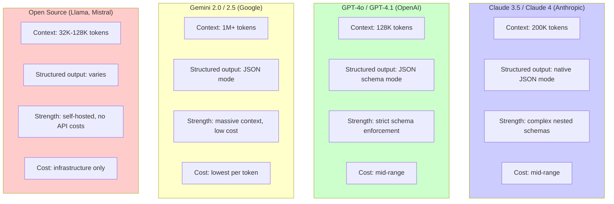
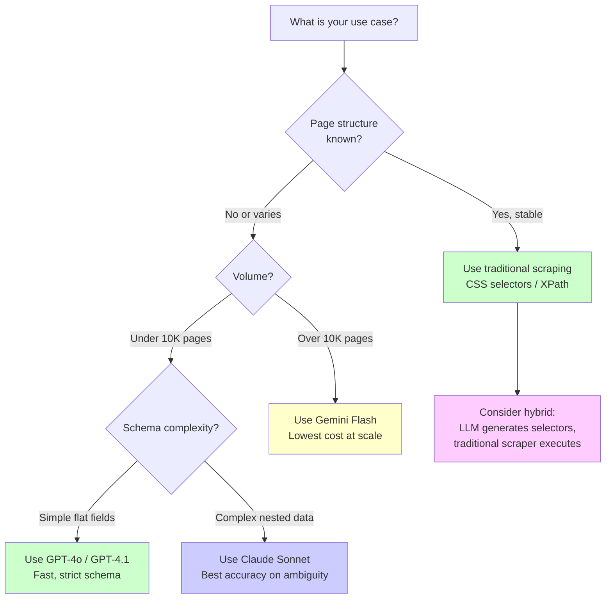

[LLMs can now extract structured data](/posts/llm-powered-data-extraction-schema-driven-scraping-with-structured-output/) from messy, unpredictable HTML without writing a single CSS selector or XPath expression. You define a schema, pass in the page, and get back clean JSON. The pattern works. But the question that matters for anyone building a production pipeline in 2026 is: which model does it best? Claude, GPT-4o, Gemini, and a growing roster of open-source alternatives all support structured output. They differ in accuracy, cost, speed, context window size, and how reliably they stick to your schema. This post is a practical comparison based on real extraction tasks, with code you can run today.

## The Task: HTML to Structured JSON

The benchmark is straightforward. Given a raw HTML page -- an e-commerce product listing, a job board, a real estate site -- extract structured JSON that matches a predefined schema. The schema includes typed fields like product name (string), price (float), availability (boolean), ratings (optional float), and nested objects like seller information.

This is not a toy problem. Real-world HTML is full of noise: navigation menus, ad scripts, tracking pixels, cookie banners, and deeply nested divs that exist only for layout. The LLM needs to ignore all of that and find the data that matters.

We will use this [Pydantic schema](/posts/schema-driven-scraping-llms-pydantic-zod-structured-output/) throughout the examples:

```python
from pydantic import BaseModel, Field
from typing import Optional

class SellerInfo(BaseModel):
    name: str = Field(description="The seller or merchant name")
    rating: Optional[float] = Field(
        default=None,
        description="The seller rating out of 5"
    )

class Product(BaseModel):
    name: str = Field(description="The product name or title")
    price: float = Field(description="The current price in the listed currency")
    currency: str = Field(default="USD", description="ISO 4217 currency code")
    original_price: Optional[float] = Field(
        default=None,
        description="The original price before any discount"
    )
    in_stock: bool = Field(description="Whether the product is available for purchase")
    rating: Optional[float] = Field(
        default=None,
        description="The average customer rating out of 5"
    )
    review_count: Optional[int] = Field(
        default=None,
        description="Total number of customer reviews"
    )
    description: str = Field(description="The product description or summary text")
    seller: Optional[SellerInfo] = Field(
        default=None,
        description="Information about the seller, if listed"
    )

class ProductPage(BaseModel):
    products: list[Product]
    page_title: str = Field(description="The page title or heading")
    total_results: Optional[int] = Field(
        default=None,
        description="Total number of results if shown on the page"
    )
```

## Key Evaluation Criteria

Five factors determine which model wins for a given use case.

**Accuracy.** Does the model extract the correct values? A model that returns `49.99` when the page says `$49.99` is accurate. One that returns `49.00` or hallucinates a price that does not appear on the page is not.

**Schema adherence.** Does the output actually match the schema? Are types correct? Are required fields present? Does the model respect `Optional` fields by returning `null` instead of making something up?

**Cost per page.** LLM extraction bills by the token. A typical product page runs 10,000 to 50,000 tokens of raw HTML. After pruning -- using tools like [Playwright](/posts/playwright-vs-puppeteer-speed-stealth-developer-experience/) to render and then strip the DOM -- that drops to 2,000 to 8,000 tokens. The price difference between models at these volumes is significant.

**Speed.** Time-to-first-token and total generation time both matter. For batch extraction of thousands of pages, a model that takes 8 seconds per page versus 3 seconds per page means the difference between a pipeline that finishes in an hour and one that takes all night.

**Context window.** Some pages are enormous. Category pages with 50 or 100 products can exceed 200,000 tokens of raw HTML. A model with a small context window forces you to chunk the input, adding complexity and risking missed data at chunk boundaries.

## Model Comparison Overview



## Claude (Anthropic): Best for Complex Schemas

Claude models -- currently Claude 3.5 Sonnet and Claude 4 Opus -- consistently excel at extracting data that requires understanding context and handling ambiguity. Claude's capabilities extend beyond extraction into [file-based AI agents and automation workflows](/posts/ai-file-agents-claude-cowork-and-the-new-automation-frontier/). When the HTML uses unusual markup, when prices are formatted inconsistently, or when nested data needs to be correctly associated (this seller with that product), Claude tends to get it right more often than alternatives.

The 200K token context window is large enough for virtually any single page without chunking. Claude's structured output mode, combined with detailed field descriptions in your schema, produces reliable JSON with minimal hallucination.

Where Claude falls short is speed. It is not the fastest model for simple extraction tasks, and the cost per token is higher than Gemini. For straightforward schemas on clean HTML, you are paying a premium for capability you may not need.

```python
import anthropic
import json
from pydantic import ValidationError

client = anthropic.Anthropic()

def extract_with_claude(html: str, schema_class):
    """Extract structured data from HTML using Claude."""

    schema = schema_class.model_json_schema()

    message = client.messages.create(
        model="claude-sonnet-4-20250514",
        max_tokens=4096,
        messages=[
            {
                "role": "user",
                "content": (
                    "Extract structured product data from the following HTML. "
                    "Return only valid JSON matching this schema exactly:\n\n"
                    f"Schema:\n{json.dumps(schema, indent=2)}\n\n"
                    "Rules:\n"
                    "- Use null for any field you cannot determine from the HTML\n"
                    "- Do not hallucinate or infer data that is not present\n"
                    "- Extract prices as numeric values without currency symbols\n"
                    "- Set in_stock to true unless the page explicitly says otherwise\n\n"
                    f"HTML:\n{html}"
                ),
            }
        ],
    )

    raw_text = message.content[0].text

    # Claude may wrap JSON in markdown code blocks -- strip them
    if raw_text.startswith("```"):
        raw_text = raw_text.split("```")[1]
        if raw_text.startswith("json"):
            raw_text = raw_text[4:]
        raw_text = raw_text.strip()

    try:
        return schema_class.model_validate_json(raw_text)
    except ValidationError as e:
        print(f"Validation error: {e}")
        raise


# Usage
products = extract_with_claude(pruned_html, ProductPage)
for p in products.products:
    print(f"{p.name}: {p.currency} {p.price}")
```

For higher reliability with Claude, you can use tool use to enforce structured output. This approach pairs well with [Playwright for browser automation in AI agents](/posts/playwright-for-browser-automation-in-ai-agents/) and [Playwright's MCP integration](/posts/playwright-mcp-and-cli-making-browser-automation-ai-agent-friendly/) for end-to-end pipelines. Define the schema as a tool and Claude will return the data as a tool call, guaranteeing valid JSON structure:

```python
def extract_with_claude_tools(html: str, schema_class):
    """Use Claude's tool use for guaranteed structured output."""

    schema = schema_class.model_json_schema()

    message = client.messages.create(
        model="claude-sonnet-4-20250514",
        max_tokens=4096,
        tools=[
            {
                "name": "extract_product_data",
                "description": "Extract and return structured product data from HTML",
                "input_schema": schema,
            }
        ],
        tool_choice={"type": "tool", "name": "extract_product_data"},
        messages=[
            {
                "role": "user",
                "content": (
                    "Extract all product data from this HTML page. "
                    "Use null for fields that cannot be determined.\n\n"
                    f"HTML:\n{html}"
                ),
            }
        ],
    )

    # The response is a tool call with structured JSON input
    tool_input = message.content[0].input
    return schema_class.model_validate(tool_input)
```


<figure>
  
  <figcaption>LLMs can extract structured data from unstructured HTML with surprising accuracy. <span class="img-credit">Photo by Google DeepMind / <a href="https://www.pexels.com" target="_blank" rel="noopener noreferrer">Pexels</a></span></figcaption>
</figure>

## GPT-4o (OpenAI): Best for Strict Schema Enforcement

OpenAI's structured output mode is the most battle-tested in production. When you pass a JSON schema via `response_format`, GPT-4o is constrained at the token generation level to produce valid JSON matching your schema. This is not prompt engineering -- it is a hard constraint on the output grammar. The model cannot return malformed JSON or missing required fields.

This makes GPT-4o the safest choice when schema adherence is your top priority. If your downstream pipeline will break on a missing field or a wrong type, GPT-4o's structured output mode provides the strongest guarantee.

The 128K context window is sufficient for most pages after pruning, though it can be tight for very large category pages. GPT-4o is also consistently fast, often returning results 30-50% quicker than Claude for comparable extraction tasks.

```python
from openai import OpenAI

client = OpenAI()

def extract_with_gpt4o(html: str, schema_class):
    """Extract structured data from HTML using GPT-4o with strict schema."""

    schema = schema_class.model_json_schema()

    response = client.chat.completions.create(
        model="gpt-4o",
        messages=[
            {
                "role": "system",
                "content": (
                    "You are a precise data extraction assistant. "
                    "Extract structured data from HTML content. "
                    "Return only the data present in the HTML. "
                    "Use null for fields that cannot be determined. "
                    "Never hallucinate or infer missing data."
                ),
            },
            {
                "role": "user",
                "content": f"Extract product data from this HTML:\n\n{html}",
            },
        ],
        response_format={
            "type": "json_schema",
            "json_schema": {
                "name": "product_extraction",
                "strict": True,
                "schema": schema,
            },
        },
    )

    raw_output = response.choices[0].message.content
    return schema_class.model_validate_json(raw_output)


# Usage
products = extract_with_gpt4o(pruned_html, ProductPage)
for p in products.products:
    print(f"{p.name}: {p.currency} {p.price} - {'In stock' if p.in_stock else 'Out of stock'}")
```

You can also use function calling for extraction, which gives you the same structured output guarantees while allowing the model to decide whether extraction is possible:

```python
def extract_with_function_calling(html: str, schema_class):
    """Use OpenAI function calling for structured extraction."""

    schema = schema_class.model_json_schema()

    response = client.chat.completions.create(
        model="gpt-4o",
        messages=[
            {
                "role": "system",
                "content": "Extract product data from HTML. Call the function with the extracted data.",
            },
            {
                "role": "user",
                "content": f"HTML:\n\n{html}",
            },
        ],
        tools=[
            {
                "type": "function",
                "function": {
                    "name": "save_extracted_products",
                    "description": "Save the extracted product data",
                    "parameters": schema,
                },
            }
        ],
        tool_choice={"type": "function", "function": {"name": "save_extracted_products"}},
    )

    import json
    tool_call = response.choices[0].message.tool_calls[0]
    data = json.loads(tool_call.function.arguments)
    return schema_class.model_validate(data)
```

## Gemini (Google): Best for Large Pages and Budget Pipelines

Gemini 2.0 Flash and Gemini 2.5 Pro are the cost leaders. Google's pricing undercuts both OpenAI and Anthropic, often by 50% or more per million tokens. Combined with a context window that exceeds 1 million tokens, Gemini is the clear choice when you need to process massive pages without chunking or when you are running extraction at scale and cost is the primary concern.

Gemini's extraction accuracy is competitive with GPT-4o for straightforward schemas. It handles product names, prices, and basic attributes well. Where it occasionally stumbles is on deeply nested or ambiguous data -- associating the right specifications with the right variant of a product, for example, or parsing complex pricing structures with multiple tiers and conditions.

The massive context window is Gemini's killer feature for scraping. You can send an entire category page with 100 products in a single request without any pruning at all, though pruning still saves money and improves accuracy.

## Open Source: Llama, Mistral, and Self-Hosted Options

Open-source models like Llama 3.1 (70B and 405B) and Mistral Large can handle structured extraction, but they require more work. You need to host them yourself or use an inference provider, and their structured output support varies. Some providers offer JSON mode, but the grammar-constrained decoding that makes GPT-4o's structured output so reliable is not universally available.

The 70B parameter Llama models can handle simple extraction tasks -- flat schemas with clear, unambiguous fields. For complex nested schemas or pages with unusual formatting, accuracy drops noticeably compared to the frontier models. The 405B variants close much of that gap but are expensive to host.

The main advantage is cost at extreme scale. If you are extracting data from millions of pages per month, self-hosting a Llama 70B model on your own GPUs can reduce per-page costs by an order of magnitude compared to API calls. The trade-off is infrastructure complexity and lower accuracy on edge cases.


<figure>
  
  <figcaption>Natural language understanding gives scrapers a new kind of intelligence. <span class="img-credit">Photo by Pixabay / <a href="https://www.pexels.com" target="_blank" rel="noopener noreferrer">Pexels</a></span></figcaption>
</figure>

## Cost Comparison

The numbers below assume a typical e-commerce product page that has been pruned to approximately 3,000 input tokens, with roughly 500 output tokens per extraction. Pricing reflects published rates as of early 2026.

| Model | Input Cost (per 1M tokens) | Output Cost (per 1M tokens) | Cost per Page | Cost per 1,000 Pages |
|---|---|---|---|---|
| Claude 3.5 Sonnet | $3.00 | $15.00 | $0.0165 | $16.50 |
| Claude 4 Opus | $15.00 | $75.00 | $0.0825 | $82.50 |
| GPT-4o | $2.50 | $10.00 | $0.0125 | $12.50 |
| GPT-4.1 | $2.00 | $8.00 | $0.0100 | $10.00 |
| Gemini 2.0 Flash | $0.10 | $0.40 | $0.0005 | $0.50 |
| Gemini 2.5 Pro | $1.25 | $10.00 | $0.0088 | $8.75 |
| Llama 3.1 70B (hosted) | $0.50 | $0.75 | $0.0019 | $1.88 |

The difference is stark. Gemini 2.0 Flash costs roughly $0.50 to extract data from 1,000 pages. Claude 3.5 Sonnet costs $16.50 for the same workload. At 100,000 pages, that gap becomes $50 versus $1,650. Cost matters at scale.

These numbers change significantly with page size. An unpruned page at 50,000 tokens of raw HTML would multiply input costs by roughly 17x. DOM pruning is not optional for cost-conscious pipelines regardless of which model you choose.

## Tips for Better Extraction

Eight practices consistently improve extraction quality across all models.

**Prune the HTML before sending it.** Remove `<script>`, `<style>`, `<nav>`, `<footer>`, `<header>`, and `<svg>` tags. Watch out for [shadow DOM elements that can silently break extraction](/posts/shadow-dom-the-silent-killer-of-ai-web-scraping/). Strip hidden elements, cookie banners, and ad containers. This alone can reduce tokens by 90% or more and improve accuracy by removing distracting noise.

```python
from bs4 import BeautifulSoup
import re

def prune_html(html: str) -> str:
    """Strip non-content elements to reduce tokens and improve extraction."""
    soup = BeautifulSoup(html, "html.parser")

    for tag in ["script", "style", "noscript", "iframe", "svg",
                "link", "meta", "header", "footer", "nav"]:
        for el in soup.find_all(tag):
            el.decompose()

    for el in soup.find_all(attrs={"style": re.compile(r"display:\s*none")}):
        el.decompose()
    for el in soup.find_all(attrs={"hidden": True}):
        el.decompose()

    # Strip unnecessary attributes
    for el in soup.find_all(True):
        keep = {"href", "src", "alt", "title", "class", "id", "data-price",
                "data-name", "data-sku", "itemprop", "content"}
        for attr in list(el.attrs):
            if attr not in keep:
                del el[attr]

    text = re.sub(r"\s+", " ", str(soup))
    return re.sub(r">\s+<", "><", text).strip()
```

**Send only the relevant section.** If you know the products are inside `<main>` or `<div class="product-grid">`, extract just that section before sending to the LLM.

**Write detailed field descriptions.** The `description` parameter in Pydantic fields directly guides the model. "The current price in USD as a float" is better than "price."

**Use few-shot examples for tricky fields.** If a field is ambiguous, include one or two examples in the prompt showing the expected extraction for similar HTML.

```python
FEW_SHOT_EXAMPLE = """
Example extraction:
HTML: <span class="price-was">$89.99</span><span class="price-now">$59.99</span>
Result: {"price": 59.99, "original_price": 89.99}
"""
```

**Validate and retry.** Always validate the output against your Pydantic model. On failure, retry with the validation error included in the prompt so the model can self-correct.

**Set explicit rules for edge cases.** Tell the model what to do when a field is missing: "Use null, do not guess." Tell it how to handle prices: "Extract as float, no currency symbols." Tell it about stock status: "Assume in stock unless the page explicitly says otherwise."

**Prefer smaller, faster models for simple schemas.** If you are extracting just a name and price, Gemini Flash or GPT-4.1 mini will do the job at a fraction of the cost of a frontier model.

**Test on representative samples before scaling.** Run extraction on 20-50 pages from your target site and manually verify the results before committing to a model for a full pipeline run.

## When LLM Extraction Beats Traditional Scraping

LLM extraction is the right tool when one or more of these conditions apply.

**Unknown page structures.** You are scraping a new site for the first time and do not know where the data lives in the DOM. An LLM can figure it out from the raw HTML without any upfront analysis.

**Varied layouts across pages.** The same site uses different templates for different product categories. A single CSS selector strategy breaks on half the pages. The LLM handles variation naturally.

**One-off or infrequent extractions.** You need data from 50 pages once. Writing and debugging a custom scraper takes longer than the extraction itself. An LLM call takes seconds per page with zero setup.

**Rapidly changing sites.** Sites that redesign frequently break brittle selectors. LLM extraction does not depend on specific DOM structure and survives redesigns without code changes.

**Complex or semi-structured data.** Product descriptions that embed specifications in prose, reviews that mix ratings with text, job listings where salary is mentioned in a paragraph rather than a structured field -- LLMs parse these naturally. These are among the [unsolved problems of AI web scraping](/posts/the-unsolved-problems-of-ai-web-scraping-in-2026/) that the community is still working through.

## When Traditional Scraping Beats LLMs

Traditional CSS selector and XPath-based scraping still wins in several common scenarios.

**Known, stable structures.** If the site has a consistent DOM and rarely changes, a [well-written scraper using requests or Selenium](/posts/python-requests-vs-selenium-speed-performance-comparison/) is faster, cheaper, and more predictable than any LLM.

**High volume.** At millions of pages per day, even Gemini Flash adds up. A traditional scraper hitting the same site structure costs effectively nothing per page beyond infrastructure.

**Cost sensitivity.** If your budget is tight and the pages are well-structured, there is no reason to pay for LLM tokens.

**Speed requirements.** A BeautifulSoup scraper extracts data from a page in milliseconds -- and for specific patterns like [email extraction, regex remains unbeatable](/posts/email-regex-patterns-web-scraping-reliable-extraction/). An LLM call takes seconds. For real-time or near-real-time pipelines, the latency difference matters.

**Deterministic output.** Traditional scrapers produce the same output for the same input every time -- even simple [regex-based extraction](/posts/regex-for-web-scraping-extracting-data-without-parser/) is fully reproducible. LLMs are probabilistic. If you need guaranteed reproducibility, traditional scraping is safer.

The hybrid approach -- using an LLM to generate selectors from a sample page, then running those selectors at scale with a traditional scraper -- often gives you the best of both worlds. Tools like [Crawl4AI](/posts/crawl4ai-v08-crash-recovery-prefetch-mode-and-whats-new/) and [browser agent frameworks](/posts/browser-agent-frameworks-compared-browser-use-vs-stagehand-vs-skyvern/) are making this pattern increasingly accessible.

## Recommendations by Use Case



**For complex schemas with nested data and ambiguous fields:** Claude 3.5 Sonnet. It handles nuance better than alternatives and the 200K context window means you rarely need to chunk input.

**For strict schema compliance and production reliability:** GPT-4o or GPT-4.1. The grammar-constrained structured output mode is the strongest guarantee that your output will match the schema. Fast response times make it practical for interactive applications.

**For high-volume extraction where cost matters most:** Gemini 2.0 Flash. At $0.50 per 1,000 pages, it is an order of magnitude cheaper than the alternatives. Accuracy is good enough for straightforward schemas, and the million-token context window means you never worry about page size.

**For maximum control and lowest marginal cost:** Self-hosted Llama 3.1 70B or 405B. Only worth the infrastructure investment if you are processing millions of pages monthly and have the engineering team to manage model serving.

**For most teams starting out:** GPT-4o with pruned HTML. It offers the best balance of accuracy, speed, schema enforcement, and developer experience. The OpenAI SDK is well-documented, structured output works out of the box, and the cost is reasonable for moderate volumes. Start here, then optimize toward Gemini for cost or Claude for accuracy as your needs become clearer.

With [Google Chrome's Auto Browse feature](/posts/google-chrome-auto-browse-what-it-means-for-web-scraping/) changing the browser landscape, no single model is best for every extraction task. The right choice depends on your schema complexity, page volume, cost constraints, and tolerance for the occasional extraction error. Test on your actual target pages, measure accuracy against manually verified ground truth, and let the numbers guide the decision.
