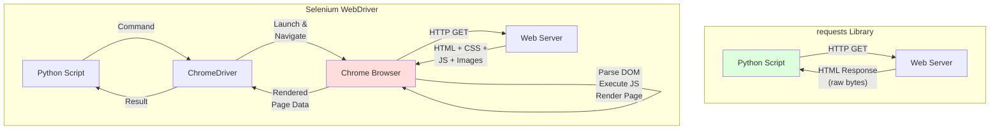
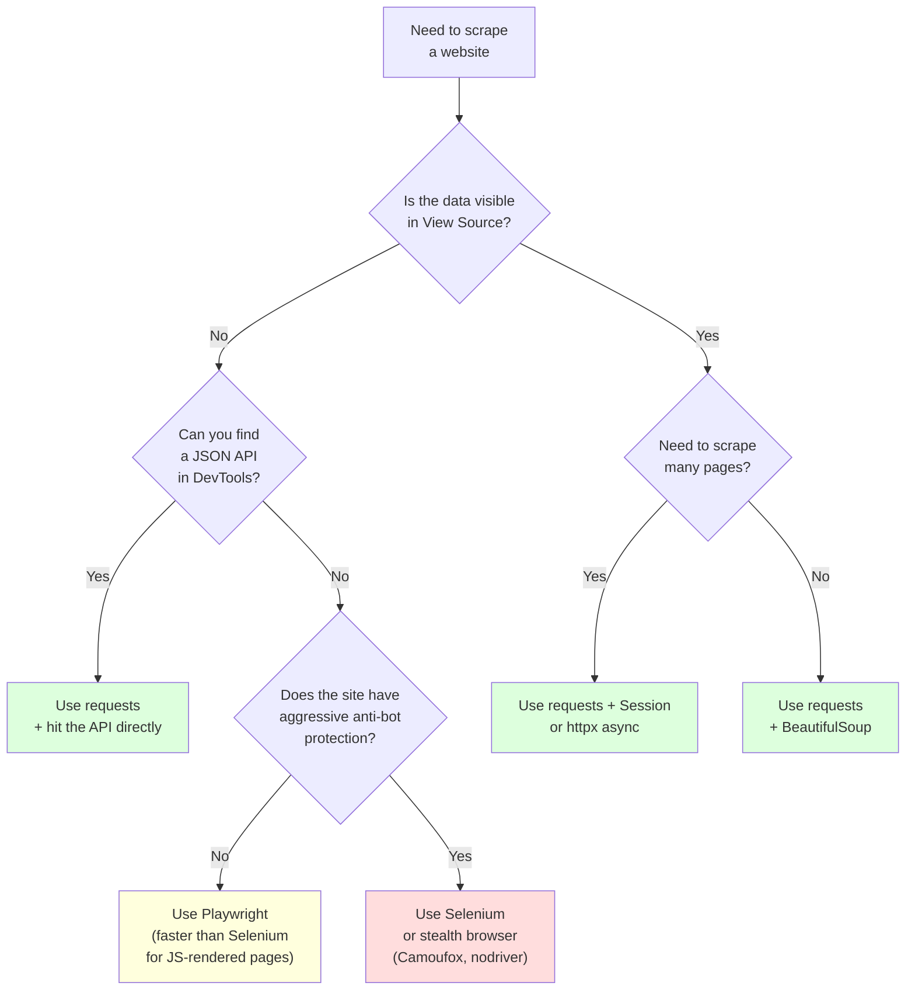

Python's `requests` library is 10 to 50 times faster than Selenium for fetching static web pages. That is not an exaggeration -- it is a measurable, repeatable result that anyone can verify with a stopwatch and a for loop. But raw speed is only one dimension of a scraping tool. Selenium exists because many pages cannot be scraped with a simple HTTP request, and choosing the wrong tool for the job means either wasting compute resources or getting empty results.

This post puts real numbers on the performance gap between `requests` and Selenium, explains why the gap exists, shows working code for both approaches, and gives you a decision framework for picking the right tool for your specific scraping task.

## Why They Are Fundamentally Different

The performance difference between `requests` and Selenium is not a matter of optimization or configuration. It is a consequence of what each tool actually does.

**requests** is a Python HTTP client. It sends an HTTP request to a server, receives the response bytes, and hands them to you. It does not parse HTML, execute JavaScript, load images, apply CSS, or render anything. It is the programmatic equivalent of `curl`.

**[Selenium](/posts/puppeteer-vs-selenium-which-should-you-pick/)** drives a full web browser. When you call `driver.get(url)`, Selenium launches Chrome (or Firefox, or Edge), navigates to the URL, downloads the HTML, parses it into a DOM, fetches every linked resource -- stylesheets, scripts, images, fonts -- executes all JavaScript, waits for the page to reach a loadable state, and then gives you access to the fully rendered page. It does everything a human user's browser does.

That difference in scope explains every performance number in this post.



With `requests`, the network round-trip is essentially the entire operation. With Selenium, the network round-trip is just the beginning -- the browser then does a significant amount of work before Selenium reports that the page is ready.

## Performance Benchmarks

The numbers below come from practical scraping scenarios. Your exact results will vary depending on network latency, page complexity, and hardware, but the ratios are consistent across environments.

### Single Page Fetch

| Metric | requests | Selenium (headless Chrome) |
|--------|----------|----------------------------|
| **Average latency** | 30-80ms | 500-2000ms |
| **Median latency** | ~50ms | ~800ms |
| **Includes JS execution** | No | Yes |
| **Includes resource loading** | No | Yes (CSS, images, fonts) |

A single `requests.get()` call completes in roughly 50 milliseconds for a typical page. The same page loaded through Selenium takes 500 to 2000 milliseconds because the browser must download and process every resource the page references.

### 100 Pages Sequentially

| Metric | requests | Selenium (headless Chrome) |
|--------|----------|----------------------------|
| **Total time** | ~5 seconds | 100-200 seconds |
| **Average per page** | ~50ms | ~1000-2000ms |
| **Bottleneck** | Network I/O | Browser rendering |

At scale, the gap compounds. Fetching 100 pages with `requests` in a sequential loop takes roughly 5 seconds. The same 100 pages through Selenium takes over 100 seconds because each page load involves full browser rendering.

### Memory Usage

| Metric | requests | Selenium (headless Chrome) |
|--------|----------|----------------------------|
| **Baseline memory** | ~30MB | ~300MB+ |
| **Per additional page** | Negligible | ~10-50MB (browser tab overhead) |
| **Peak with 10 concurrent** | ~50MB | ~1-3GB |

Memory is where the difference becomes operationally painful. A `requests`-based scraper runs comfortably in a small container or serverless function. A Selenium-based scraper needs a machine with real resources -- headless Chrome is still Chrome, and Chrome is not known for its modest memory appetite.

## Code Comparison: Same Task, Both Tools

Let us scrape the same page with both tools and measure the difference. The task is fetching a page and extracting all the links from it.

### Using requests + BeautifulSoup

```python
import time
import requests
from bs4 import BeautifulSoup

def scrape_with_requests(url):
    start = time.time()

    response = requests.get(url, headers={
        "User-Agent": "Mozilla/5.0 (Windows NT 10.0; Win64; x64) "
                      "AppleWebKit/537.36 (KHTML, like Gecko) "
                      "Chrome/131.0.0.0 Safari/537.36"
    })
    response.raise_for_status()

    soup = BeautifulSoup(response.text, "html.parser")
    links = [a.get("href") for a in soup.find_all("a", href=True)]

    elapsed = time.time() - start
    return links, elapsed


url = "https://example.com"
links, elapsed = scrape_with_requests(url)
print(f"requests: Found {len(links)} links in {elapsed:.3f} seconds")
```

### Using Selenium

```python
import time
from selenium import webdriver
from selenium.webdriver.chrome.options import Options
from selenium.webdriver.common.by import By

def scrape_with_selenium(url):
    options = Options()
    options.add_argument("--headless=new")
    options.add_argument("--disable-gpu")
    options.add_argument("--no-sandbox")

    start = time.time()

    driver = webdriver.Chrome(options=options)
    try:
        driver.get(url)
        elements = driver.find_elements(By.TAG_NAME, "a")
        links = [el.get_attribute("href") for el in elements]
    finally:
        driver.quit()

    elapsed = time.time() - start
    return links, elapsed


url = "https://example.com"
links, elapsed = scrape_with_selenium(url)
print(f"Selenium: Found {len(links)} links in {elapsed:.3f} seconds")
```

### Running Both Back-to-Back

```python
import time
import requests
from bs4 import BeautifulSoup
from selenium import webdriver
from selenium.webdriver.chrome.options import Options
from selenium.webdriver.common.by import By


def benchmark_requests(url, iterations=10):
    session = requests.Session()
    session.headers.update({
        "User-Agent": "Mozilla/5.0 (Windows NT 10.0; Win64; x64) "
                      "AppleWebKit/537.36 (KHTML, like Gecko) "
                      "Chrome/131.0.0.0 Safari/537.36"
    })

    times = []
    for _ in range(iterations):
        start = time.time()
        response = session.get(url)
        soup = BeautifulSoup(response.text, "html.parser")
        links = soup.find_all("a", href=True)
        times.append(time.time() - start)

    return times


def benchmark_selenium(url, iterations=10):
    options = Options()
    options.add_argument("--headless=new")
    options.add_argument("--disable-gpu")
    options.add_argument("--no-sandbox")

    driver = webdriver.Chrome(options=options)
    times = []
    try:
        for _ in range(iterations):
            start = time.time()
            driver.get(url)
            elements = driver.find_elements(By.TAG_NAME, "a")
            times.append(time.time() - start)
    finally:
        driver.quit()

    return times


url = "https://books.toscrape.com/"
iterations = 20

req_times = benchmark_requests(url, iterations)
sel_times = benchmark_selenium(url, iterations)

req_avg = sum(req_times) / len(req_times)
sel_avg = sum(sel_times) / len(sel_times)

print(f"requests average: {req_avg:.3f}s over {iterations} runs")
print(f"Selenium average: {sel_avg:.3f}s over {iterations} runs")
print(f"Selenium is {sel_avg / req_avg:.1f}x slower than requests")
```

Typical output on a standard machine with a decent connection:

```
requests average: 0.062s over 20 runs
Selenium average: 1.134s over 20 runs
Selenium is 18.3x slower than requests
```

The ratio varies from 10x to 50x depending on the page complexity. Heavier pages with more JavaScript push the ratio higher because Selenium has more work to do while `requests` does the same amount regardless. For pages where you also need to [extract structured data with LLMs](/posts/best-llm-structured-data-extraction-html-2026/), the raw HTML from `requests` is often sufficient input.


<figure>
  
  <figcaption>HTTP is the language every scraper must speak fluently. <span class="img-credit">Photo by Google DeepMind / <a href="https://www.pexels.com" target="_blank" rel="noopener noreferrer">Pexels</a></span></figcaption>
</figure>

## When requests Wins

Use `requests` (with BeautifulSoup or lxml for parsing) when any of these conditions are true:

**The page is static HTML.** If the data you need is present in the initial HTML response -- visible when you do "View Source" in your browser -- there is no reason to spin up a full browser. Most blogs, news articles, documentation sites, and simple e-commerce listing pages fall into this category.

**You are hitting an API directly.** Many websites that appear dynamic in the browser actually load their data from a JSON API. Open your browser's DevTools, check the Network tab, and look for XHR/Fetch requests returning JSON. If you find the API endpoint, `requests` can hit it directly and skip the entire browser rendering pipeline.

```python
import requests

# Instead of loading a JavaScript-heavy property listing page in Selenium,
# hit the underlying API directly
response = requests.get(
    "https://api.example.com/properties",
    params={"city": "dubai", "page": 1, "per_page": 25},
    headers={"User-Agent": "Mozilla/5.0"}
)
data = response.json()

for property in data["results"]:
    print(f"{property['title']} - {property['price']}")
```

**You need to scrape at scale.** When you are fetching thousands or tens of thousands of pages, the 10-50x speed advantage of `requests` translates into the difference between a job that finishes in minutes versus one that takes hours. Combined with the memory savings, `requests` lets you run scrapers on smaller, cheaper infrastructure.

**You are building data pipelines.** For recurring scraping jobs that run on a schedule, the operational simplicity of `requests` matters. No browser binaries to install, no ChromeDriver version mismatches, no zombie browser processes consuming memory. A `requests`-based scraper is a straightforward Python script with minimal dependencies.

## When Selenium Wins

Use Selenium when the data genuinely requires a browser to access:

**JavaScript-rendered content.** Single-page applications (SPAs) built with React, Angular, or Vue often deliver an empty HTML shell and populate the page content entirely through JavaScript. If "View Source" shows a mostly empty page with a `<div id="app"></div>`, you need a browser.

```python
from selenium import webdriver
from selenium.webdriver.chrome.options import Options
from selenium.webdriver.common.by import By
from selenium.webdriver.support.ui import WebDriverWait
from selenium.webdriver.support import expected_conditions as EC

options = Options()
options.add_argument("--headless=new")
driver = webdriver.Chrome(options=options)

try:
    driver.get("https://spa-example.com/listings")

    # Wait for JavaScript to render the property cards
    WebDriverWait(driver, 10).until(
        EC.presence_of_all_elements_located(
            (By.CSS_SELECTOR, ".property-card")
        )
    )

    cards = driver.find_elements(By.CSS_SELECTOR, ".property-card")
    for card in cards:
        title = card.find_element(By.CSS_SELECTOR, ".title").text
        price = card.find_element(By.CSS_SELECTOR, ".price").text
        print(f"{title}: {price}")
finally:
    driver.quit()
```

**Infinite scroll and pagination triggered by user interaction.** Some sites load more content when you scroll to the bottom of the page or click a "Load More" button. These interactions require a browser environment.

**Sites with aggressive anti-bot protection.** Some sites use browser fingerprinting, CAPTCHAs, or JavaScript challenges that verify a real browser is making the request. The [evolution of detection methods](/posts/evolution-web-scraping-detection-methods-timeline/) over the past decade means that a plain HTTP request from `requests` will be blocked on many sites, while Selenium -- driving a real Chrome instance -- passes these checks (though dedicated anti-bot systems can still [detect Selenium specifically](/posts/playwright-vs-selenium-stealth-which-evades-detection-better/)). Services like [Cloudflare](/posts/cloudflare-ai-labyrinth-how-honeypot-pages-are-trapping-scrapers/) are increasingly sophisticated at telling automation apart from real users.

**Complex authentication flows.** Login sequences that involve OAuth redirects, multi-step forms, or JavaScript-based token generation are significantly easier to handle by driving a browser through the flow rather than reverse-engineering the underlying HTTP requests. Our guide on [automating web form filling](/posts/how-to-automate-web-form-filling-complete-guide/) covers these patterns in detail.


<figure>
  
  <figcaption>Requests and responses are the conversation between your scraper and the server. <span class="img-credit">Photo by RDNE Stock project / <a href="https://www.pexels.com" target="_blank" rel="noopener noreferrer">Pexels</a></span></figcaption>
</figure>

## The Middle Ground

The choice between `requests` and Selenium is not always binary. Several tools occupy the space between them.

**httpx** is a modern Python HTTP client that supports async requests out of the box. It does not execute JavaScript, but it handles concurrent requests far more efficiently than `requests` in a loop. If your bottleneck is network I/O across many pages, `httpx` with `asyncio` can match `requests` speed while fetching many pages in parallel.

```python
import asyncio
import httpx
from bs4 import BeautifulSoup

async def fetch_page(client, url):
    response = await client.get(url)
    soup = BeautifulSoup(response.text, "html.parser")
    return [a.get("href") for a in soup.find_all("a", href=True)]

async def main():
    urls = [f"https://books.toscrape.com/catalogue/page-{i}.html"
            for i in range(1, 51)]

    async with httpx.AsyncClient(
        headers={"User-Agent": "Mozilla/5.0"},
        follow_redirects=True,
        timeout=30.0
    ) as client:
        tasks = [fetch_page(client, url) for url in urls]
        results = await asyncio.gather(*tasks)

    total_links = sum(len(links) for links in results)
    print(f"Fetched {len(urls)} pages, found {total_links} links")

asyncio.run(main())
```

**[Playwright](/posts/playwright-vs-puppeteer-speed-stealth-developer-experience/)** is the closest thing to getting Selenium's browser rendering with better performance. It uses the Chrome DevTools Protocol directly (no WebDriver intermediary), supports async Python natively, and is generally 2-5x faster than Selenium for the same tasks. Playwright also has growing support for [AI agent workflows](/posts/playwright-for-browser-automation-in-ai-agents/) through its [MCP and CLI integrations](/posts/playwright-mcp-and-cli-making-browser-automation-ai-agent-friendly/). If you need JavaScript rendering but want better speed than Selenium offers, Playwright is the tool to evaluate -- see our [mega comparison of all four major tools](/posts/playwright-vs-puppeteer-vs-selenium-vs-scrapy-2026-mega-comparison/) for a full breakdown.

**requests-html** attempted to bridge the gap by offering limited JavaScript rendering through a built-in Chromium instance. In practice, it is no longer actively maintained and its JavaScript support is fragile. It is not recommended for new projects in 2026.

## Optimization Tips

If you have already chosen your tool, these techniques will help you get the most out of it.

### Optimizing requests

**Use a Session object.** A `requests.Session` reuses the underlying TCP connection across multiple requests to the same host. This eliminates the overhead of establishing a new connection (including TLS handshake) for every request.

```python
import requests
from bs4 import BeautifulSoup

session = requests.Session()
session.headers.update({
    "User-Agent": "Mozilla/5.0 (Windows NT 10.0; Win64; x64) "
                  "AppleWebKit/537.36 (KHTML, like Gecko) "
                  "Chrome/131.0.0.0 Safari/537.36",
    "Accept-Language": "en-US,en;q=0.9",
})

# All requests reuse the same connection pool
for page in range(1, 101):
    response = session.get(
        f"https://example.com/listings?page={page}"
    )
    soup = BeautifulSoup(response.text, "html.parser")
    # Process page...
```

**Switch to async with aiohttp or httpx.** For I/O-bound scraping across many pages, async requests can fetch dozens of pages concurrently within a single Python process.

```python
import asyncio
import aiohttp
from bs4 import BeautifulSoup

async def fetch(session, url):
    async with session.get(url) as response:
        html = await response.text()
        return BeautifulSoup(html, "html.parser")

async def main():
    connector = aiohttp.TCPConnector(limit=20)  # Max 20 concurrent connections
    async with aiohttp.ClientSession(
        connector=connector,
        headers={"User-Agent": "Mozilla/5.0"}
    ) as session:
        urls = [f"https://example.com/page/{i}" for i in range(1, 201)]
        tasks = [fetch(session, url) for url in urls]
        pages = await asyncio.gather(*tasks)
        print(f"Fetched {len(pages)} pages concurrently")

asyncio.run(main())
```

**Use lxml instead of html.parser.** The `lxml` parser is significantly faster than Python's built-in `html.parser` for large documents. Install it with `pip install lxml` and pass `"lxml"` as the parser argument to BeautifulSoup.

```python
# html.parser (slower, no extra dependency)
soup = BeautifulSoup(html, "html.parser")

# lxml (faster, requires pip install lxml)
soup = BeautifulSoup(html, "lxml")
```

### Optimizing Selenium

**Run headless.** Headless mode skips rendering pixels to a display, which saves GPU and CPU overhead. Always use headless mode in production.

```python
options = Options()
options.add_argument("--headless=new")
```

**Disable images, CSS, and fonts.** If you only need text content, blocking unnecessary resources cuts page load time significantly.

```python
from selenium import webdriver
from selenium.webdriver.chrome.options import Options

options = Options()
options.add_argument("--headless=new")

# Disable images
prefs = {
    "profile.managed_default_content_settings.images": 2,
    "profile.managed_default_content_settings.stylesheets": 2,
    "profile.managed_default_content_settings.fonts": 2,
}
options.add_experimental_option("prefs", prefs)

driver = webdriver.Chrome(options=options)
```

**Reuse the browser instance.** Launching and quitting Chrome for every page is the single biggest performance killer in Selenium scripts. Launch once, navigate repeatedly.

```python
from selenium import webdriver
from selenium.webdriver.chrome.options import Options
from selenium.webdriver.common.by import By

options = Options()
options.add_argument("--headless=new")
options.add_argument("--disable-gpu")

# Launch once
driver = webdriver.Chrome(options=options)

try:
    for page_num in range(1, 101):
        driver.get(f"https://example.com/listings?page={page_num}")
        items = driver.find_elements(By.CSS_SELECTOR, ".listing-item")
        for item in items:
            title = item.find_element(By.CSS_SELECTOR, ".title").text
            print(title)
finally:
    # Quit once
    driver.quit()
```

**Use explicit waits instead of sleep.** Never use `time.sleep()` to wait for content. Explicit waits check for a condition and proceed as soon as it is met, rather than always waiting a fixed duration.

```python
from selenium.webdriver.support.ui import WebDriverWait
from selenium.webdriver.support import expected_conditions as EC
from selenium.webdriver.common.by import By

# Bad: always waits 5 seconds even if content loads in 0.5 seconds
import time
time.sleep(5)

# Good: waits up to 10 seconds, proceeds as soon as element appears
element = WebDriverWait(driver, 10).until(
    EC.presence_of_element_located((By.CSS_SELECTOR, ".results"))
)
```

## Decision Framework

Use this flowchart to determine which tool fits your scraping task.



The flowchart captures the general rule: start with the simplest tool that can get the data. `requests` is that tool for static pages and exposed APIs. Selenium (or Playwright) is necessary when JavaScript rendering or browser-level interaction is required. For sites with the most aggressive anti-bot measures, [stealth browsers like Camoufox and nodriver](/posts/stealth-browsers-in-2026-camoufox-nodriver-and-the-anti-detection-arms-race/) go further -- see our [complete nodriver guide](/posts/nodriver-complete-guide-undetected-browser-automation-python/) and [getting started tutorial](/posts/getting-started-nodriver-python-installation-first-script/) to get up and running quickly. There are also [browser agent frameworks](/posts/browser-agent-frameworks-compared-browser-use-vs-stagehand-vs-skyvern/) that add AI-driven navigation on top of these browser tools, and [alternatives to Puppeteer](/posts/top-puppeteer-alternatives-what-to-use-instead/) worth considering if you work across languages. The middle-ground tools like `httpx` help when you need `requests`-level simplicity with better concurrency.

## Summary of Tradeoffs

| Dimension | requests | Selenium |
|-----------|----------|----------|
| **Speed (single page)** | ~50ms | ~500-2000ms |
| **Speed (100 pages)** | ~5s | ~100-200s |
| **Memory usage** | ~30MB | ~300MB+ |
| **JavaScript support** | None | Full |
| **Setup complexity** | `pip install requests` | Browser + driver binary |
| **Anti-bot resilience** | Low (no browser fingerprint) | Medium (real browser) |
| **Async support** | Via aiohttp/httpx | Limited (Selenium 4 has some) |
| **Best for** | Static pages, APIs, scale | SPAs, JS-rendered content, interactions |

The performance gap between `requests` and Selenium is real and significant. But it is a gap between two tools designed for different jobs. A `requests`-based scraper that gets empty pages because the content is JavaScript-rendered is not faster -- it is broken. A [Selenium-based scraper](/posts/selenium-vs-puppeteer-definitive-comparison-web-scraping/) that loads a full browser to fetch static HTML pages that `requests` could handle is not more thorough -- it is wasteful.

Match the tool to the task. Start with `requests`. Escalate to Selenium or Playwright only when the page demands it. Your scraping jobs will be faster, your infrastructure costs lower, and your code simpler.
