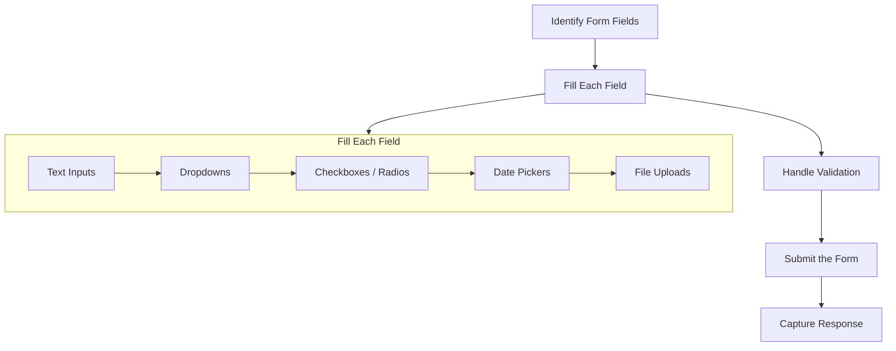
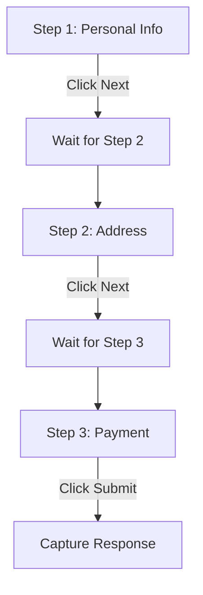

Filling out web forms by hand is one of those tasks that feels productive for the first three submissions and soul-crushing by the thirtieth. Whether you are performing bulk data entry, running end-to-end tests against a web application, creating accounts at scale, or scraping data that sits behind a form submission, automating the process saves hours and eliminates human error. Modern browser automation tools handle form filling well once you know the patterns — the challenge is that every form element type has its own quirks.

This guide walks through every common form element type -- text inputs, dropdowns, checkboxes, radio buttons, date pickers, file uploads, and multi-step wizards -- with working code examples in both [Playwright and Selenium](/posts/playwright-vs-puppeteer-speed-stealth-developer-experience/) for Python. By the end, you will have a repeatable playbook for automating any web form you encounter.

## The Form Automation Workflow

Before writing any code, it helps to understand the general workflow that every form automation script follows. The process is the same regardless of the tool you choose.



The first step is inspecting the form in your browser's DevTools to identify each field's selector -- its `name` attribute, `id`, CSS class, or a combination. Once you have selectors for every field, you fill them in order, handle any validation that fires along the way, submit the form, and capture whatever the server returns.

## Setting Up Your Environment

Both [Playwright](/posts/playwright-for-browser-automation-in-ai-agents/) and Selenium require a quick install before you can start automating.

```bash
# Playwright
pip install playwright
playwright install chromium

# Selenium
pip install selenium webdriver-manager
```

The examples below use synchronous Playwright and standard Selenium with Chrome. Both tools support async patterns and other browsers, but synchronous code is easier to follow in a tutorial.

## Filling Text Inputs

Text inputs are the most common form element. They include standard text fields, email fields, password fields, phone number fields, and textareas. The automation approach is the same for all of them: locate the element and set its value.

### Playwright

Playwright's `page.fill()` method clears any existing value in the field before typing the new one. (Playwright also integrates well with [MCP and CLI tooling](/posts/playwright-mcp-and-cli-making-browser-automation-ai-agent-friendly/) if you are building AI-driven automation.) This is important because some forms pre-populate fields with default values that you need to overwrite.

```python
from playwright.sync_api import sync_playwright

with sync_playwright() as p:
    browser = p.chromium.launch(headless=False)
    page = browser.new_page()
    page.goto("https://example.com/signup")

    # Fill text inputs -- fill() clears existing values automatically
    page.fill('input[name="first_name"]', "Jane")
    page.fill('input[name="last_name"]', "Smith")
    page.fill('input[name="email"]', "jane.smith@example.com")
    page.fill('input[name="password"]', "s3cure-Pa55!")

    # Fill a textarea
    page.fill('textarea[name="bio"]', "Software engineer based in Austin.")

    browser.close()
```

If you need to simulate real keystrokes one character at a time -- for example, because the form runs validation on every keypress -- use `page.type()` instead.

```python
# Type character by character with a small delay between each keystroke
page.type('input[name="search"]', "automated query", delay=50)
```

### Selenium

[Selenium's](/posts/puppeteer-vs-selenium-which-should-you-pick/) `send_keys()` appends text to whatever is already in the field, so you need to clear it first if the field has a default value.

```python
from selenium import webdriver
from selenium.webdriver.common.by import By
from selenium.webdriver.chrome.service import Service
from webdriver_manager.chrome import ChromeDriverManager

driver = webdriver.Chrome(service=Service(ChromeDriverManager().install()))
driver.get("https://example.com/signup")

# Clear and fill text inputs
first_name = driver.find_element(By.NAME, "first_name")
first_name.clear()
first_name.send_keys("Jane")

last_name = driver.find_element(By.NAME, "last_name")
last_name.clear()
last_name.send_keys("Smith")

email = driver.find_element(By.NAME, "email")
email.clear()
email.send_keys("jane.smith@example.com")

password = driver.find_element(By.NAME, "password")
password.clear()
password.send_keys("s3cure-Pa55!")

# Fill a textarea
bio = driver.find_element(By.NAME, "bio")
bio.clear()
bio.send_keys("Software engineer based in Austin.")

driver.quit()
```

## Dropdowns and Select Elements

HTML `<select>` elements require a different approach than text inputs. You cannot type into them. Instead, you choose an option by its `value` attribute, its visible text, or its index.

### Playwright

Playwright's `page.select_option()` accepts several argument forms.

```python
# Select by value attribute
page.select_option('select[name="country"]', value="US")

# Select by visible label text
page.select_option('select[name="country"]', label="United States")

# Select by zero-based index
page.select_option('select[name="country"]', index=5)

# Select multiple options in a multi-select
page.select_option('select[name="languages"]', value=["en", "es", "fr"])
```

### Selenium

[Selenium](/posts/selenium-vs-puppeteer-definitive-comparison-web-scraping/) provides the `Select` helper class for working with dropdowns.

```python
from selenium.webdriver.support.ui import Select

dropdown = Select(driver.find_element(By.NAME, "country"))

# Select by value attribute
dropdown.select_by_value("US")

# Select by visible text
dropdown.select_by_visible_text("United States")

# Select by zero-based index
dropdown.select_by_index(5)
```

### Custom Dropdown Components

Many modern sites use custom dropdowns built with `<div>` elements rather than native `<select>` elements -- sometimes even rendered inside [shadow DOM](/posts/shadow-dom-the-silent-killer-of-ai-web-scraping/) boundaries. These require a click-then-select pattern.

```python
# Playwright -- custom dropdown
page.click('div.custom-select')  # Open the dropdown
page.click('li[data-value="US"]')  # Click the desired option

# Selenium -- custom dropdown
driver.find_element(By.CSS_SELECTOR, "div.custom-select").click()
driver.find_element(By.CSS_SELECTOR, 'li[data-value="US"]').click()
```

## Checkboxes and Radio Buttons

Checkboxes and radio buttons share a similar automation pattern. The key difference is that checkboxes can be toggled independently while radio buttons within the same group are mutually exclusive.

### Playwright

Playwright provides `page.check()` and `page.uncheck()` for checkboxes, plus `page.is_checked()` to read the current state.

```python
# Check a checkbox
page.check('input[name="agree_terms"]')

# Uncheck a checkbox
page.uncheck('input[name="subscribe_newsletter"]')

# Only check if not already checked
if not page.is_checked('input[name="agree_terms"]'):
    page.check('input[name="agree_terms"]')

# Select a radio button
page.check('input[name="plan"][value="premium"]')
```

### Selenium

Selenium uses `click()` for both checkboxes and radio buttons (see our broader [Selenium vs Requests speed comparison](/posts/python-requests-vs-selenium-speed-performance-comparison/) for when a full browser is actually necessary). Check the state with `is_selected()` to avoid toggling a checkbox off when you intended to turn it on.

```python
# Check a checkbox (only if not already checked)
terms = driver.find_element(By.NAME, "agree_terms")
if not terms.is_selected():
    terms.click()

# Uncheck a checkbox (only if currently checked)
newsletter = driver.find_element(By.NAME, "subscribe_newsletter")
if newsletter.is_selected():
    newsletter.click()

# Select a radio button
driver.find_element(By.CSS_SELECTOR, 'input[name="plan"][value="premium"]').click()
```


<figure>
  
  <figcaption>The nativeSetter trick bypasses React's synthetic event system to set date values directly. <span class="img-credit">Photo by ThisIsEngineering / <a href="https://www.pexels.com" target="_blank" rel="noopener noreferrer">Pexels</a></span></figcaption>
</figure>

## Date Pickers

Date pickers are one of the trickiest form elements to automate. Some accept direct text input, while others use JavaScript-powered calendar widgets that refuse typed input entirely.

### Strategy 1: Direct Input

If the date field is a standard `<input type="date">` or a text input that accepts typed dates, you can fill it directly.

```python
# Playwright
page.fill('input[name="start_date"]', "2026-03-15")

# Selenium
date_field = driver.find_element(By.NAME, "start_date")
date_field.clear()
date_field.send_keys("03/15/2026")
```

### Strategy 2: JavaScript Injection

When a date picker widget intercepts all keyboard input and only allows selection through its calendar UI, the fastest approach is to set the value directly via JavaScript. This bypasses the widget entirely.

```python
# Playwright
page.evaluate('''
    const input = document.querySelector('input[name="start_date"]');
    const nativeSetter = Object.getOwnPropertyDescriptor(
        window.HTMLInputElement.prototype, 'value'
    ).set;
    nativeSetter.call(input, '2026-03-15');
    input.dispatchEvent(new Event('input', { bubbles: true }));
    input.dispatchEvent(new Event('change', { bubbles: true }));
''')

# Selenium
driver.execute_script("""
    var input = document.querySelector('input[name="start_date"]');
    var nativeSetter = Object.getOwnPropertyDescriptor(
        window.HTMLInputElement.prototype, 'value'
    ).set;
    nativeSetter.call(input, '2026-03-15');
    input.dispatchEvent(new Event('input', { bubbles: true }));
    input.dispatchEvent(new Event('change', { bubbles: true }));
""")
```

The `nativeSetter` trick is necessary because many React and Angular apps override the input's `value` setter. Using the native setter followed by dispatching `input` and `change` events ensures the framework's state updates correctly.

### Strategy 3: Clicking Through the Calendar

If JavaScript injection does not work -- some frameworks validate server-side that the date was selected through the UI -- you can automate clicking through the calendar.

```python
# Playwright -- navigate a calendar widget
page.click('input[name="start_date"]')  # Open the date picker
page.click('button.next-month')  # Navigate to the target month
page.click('td[data-date="2026-03-15"]')  # Click the target day
```

## File Uploads

File upload fields use `<input type="file">` elements. Both Playwright and Selenium provide dedicated methods for setting file paths without needing to interact with the OS file dialog.

### Playwright

Playwright's `page.set_input_files()` accepts a file path or a list of file paths.

```python
# Upload a single file
page.set_input_files('input[type="file"]', "/path/to/document.pdf")

# Upload multiple files
page.set_input_files('input[type="file"]', [
    "/path/to/photo1.jpg",
    "/path/to/photo2.jpg",
    "/path/to/photo3.jpg"
])

# Clear a file upload field
page.set_input_files('input[type="file"]', [])
```

### Selenium

In Selenium, you send the file path as text to the file input element. The element does not need to be visible.

```python
# Upload a single file
file_input = driver.find_element(By.CSS_SELECTOR, 'input[type="file"]')
file_input.send_keys("/path/to/document.pdf")

# Upload multiple files (if the input has the "multiple" attribute)
file_input.send_keys("/path/to/photo1.jpg\n/path/to/photo2.jpg\n/path/to/photo3.jpg")
```

### Hidden File Inputs

Some sites hide the actual `<input type="file">` element behind a styled button. In Playwright, `set_input_files()` works on hidden inputs. In Selenium, you may need to make the element visible first with JavaScript.

```python
# Selenium -- reveal a hidden file input
driver.execute_script(
    "document.querySelector('input[type=\"file\"]').style.display = 'block';"
)
file_input = driver.find_element(By.CSS_SELECTOR, 'input[type="file"]')
file_input.send_keys("/path/to/document.pdf")
```

## Multi-Step Forms

Multi-step forms split the submission process across several pages or sections. Each step typically requires filling fields, clicking a "Next" or "Continue" button, and waiting for the next set of fields to appear before proceeding.



### Playwright

```python
from playwright.sync_api import sync_playwright

with sync_playwright() as p:
    browser = p.chromium.launch(headless=False)
    page = browser.new_page()
    page.goto("https://example.com/checkout")

    # Step 1: Personal information
    page.fill('input[name="full_name"]', "Jane Smith")
    page.fill('input[name="email"]', "jane@example.com")
    page.fill('input[name="phone"]', "+1-555-0123")
    page.click('button:text("Next")')

    # Wait for step 2 to load
    page.wait_for_selector('input[name="address_line_1"]', state="visible")

    # Step 2: Address
    page.fill('input[name="address_line_1"]', "123 Main St")
    page.fill('input[name="city"]', "Austin")
    page.select_option('select[name="state"]', value="TX")
    page.fill('input[name="zip"]', "78701")
    page.click('button:text("Next")')

    # Wait for step 3 to load
    page.wait_for_selector('input[name="card_number"]', state="visible")

    # Step 3: Payment
    page.fill('input[name="card_number"]', "4111111111111111")
    page.fill('input[name="expiry"]', "12/28")
    page.fill('input[name="cvv"]', "123")
    page.click('button:text("Submit Order")')

    # Capture the response
    page.wait_for_selector('.order-confirmation', state="visible")
    confirmation = page.text_content('.order-confirmation')
    print(f"Order result: {confirmation}")

    browser.close()
```

### Selenium

```python
from selenium import webdriver
from selenium.webdriver.common.by import By
from selenium.webdriver.support.ui import WebDriverWait, Select
from selenium.webdriver.support import expected_conditions as EC
from selenium.webdriver.chrome.service import Service
from webdriver_manager.chrome import ChromeDriverManager

driver = webdriver.Chrome(service=Service(ChromeDriverManager().install()))
wait = WebDriverWait(driver, 10)

driver.get("https://example.com/checkout")

# Step 1: Personal information
driver.find_element(By.NAME, "full_name").send_keys("Jane Smith")
driver.find_element(By.NAME, "email").send_keys("jane@example.com")
driver.find_element(By.NAME, "phone").send_keys("+1-555-0123")
driver.find_element(By.XPATH, '//button[text()="Next"]').click()

# Wait for step 2
wait.until(EC.visibility_of_element_located((By.NAME, "address_line_1")))

# Step 2: Address
driver.find_element(By.NAME, "address_line_1").send_keys("123 Main St")
driver.find_element(By.NAME, "city").send_keys("Austin")
Select(driver.find_element(By.NAME, "state")).select_by_value("TX")
driver.find_element(By.NAME, "zip").send_keys("78701")
driver.find_element(By.XPATH, '//button[text()="Next"]').click()

# Wait for step 3
wait.until(EC.visibility_of_element_located((By.NAME, "card_number")))

# Step 3: Payment
driver.find_element(By.NAME, "card_number").send_keys("4111111111111111")
driver.find_element(By.NAME, "expiry").send_keys("12/28")
driver.find_element(By.NAME, "cvv").send_keys("123")
driver.find_element(By.XPATH, '//button[text()="Submit Order"]').click()

# Capture the response
confirmation = wait.until(
    EC.visibility_of_element_located((By.CSS_SELECTOR, ".order-confirmation"))
)
print(f"Order result: {confirmation.text}")

driver.quit()
```

Multi-step forms break most scripts because they skip the wait between steps. Using `wait_for_selector` (Playwright) or `WebDriverWait` with `expected_conditions` (Selenium) ensures the next set of fields is fully rendered before your script tries to interact with them. Without these waits, your script will throw "element not found" errors intermittently.

## Handling Form Validation Errors

Forms validate input on the client side, the server side, or both. Your automation script needs to detect and respond to validation errors rather than blindly proceeding.

### Detecting Inline Validation

```python
# Playwright -- check for validation error messages after filling a field
page.fill('input[name="email"]', "not-an-email")
page.click('input[name="password"]')  # Move focus to trigger validation

# Check if an error message appeared
error = page.query_selector('.field-error[data-field="email"]')
if error:
    error_text = error.text_content()
    print(f"Validation error: {error_text}")
    # Fix the input
    page.fill('input[name="email"]', "valid@example.com")
```

### Detecting Server-Side Errors After Submission

```python
# Playwright -- handle server-side validation
page.click('button[type="submit"]')

# Wait for either a success message or an error message
result = page.wait_for_selector(
    '.success-message, .error-summary',
    state="visible",
    timeout=15000
)

if 'error-summary' in result.get_attribute('class'):
    errors = page.query_selector_all('.error-summary li')
    for err in errors:
        print(f"Server error: {err.text_content()}")
else:
    print("Form submitted successfully")
```

```python
# Selenium -- handle server-side validation
driver.find_element(By.CSS_SELECTOR, 'button[type="submit"]').click()

try:
    success = wait.until(
        EC.visibility_of_element_located((By.CSS_SELECTOR, ".success-message"))
    )
    print("Form submitted successfully")
except:
    errors = driver.find_elements(By.CSS_SELECTOR, ".error-summary li")
    for err in errors:
        print(f"Server error: {err.text}")
```


<figure>
  
  <figcaption>Network interception captures the actual API payload after form submission — more reliable than scraping the confirmation page. <span class="img-credit">Photo by MASUD GAANWALA / <a href="https://www.pexels.com" target="_blank" rel="noopener noreferrer">Pexels</a></span></figcaption>
</figure>

## CAPTCHA Considerations

CAPTCHAs are designed specifically to prevent automated form submissions, and there is no clean way to bypass them programmatically. Tools like [nodriver](/posts/nodriver-complete-guide-undetected-browser-automation-python/) can help avoid triggering CAPTCHAs in the first place by reducing your automation's detection footprint. Here is what you can and cannot do.

**What you can automate:**
- Detecting whether a CAPTCHA is present on the form before attempting to fill it
- Pausing your script and waiting for a human to solve the CAPTCHA manually
- Integrating with third-party CAPTCHA solving services (like 2Captcha or Anti-Captcha) that use human workers, or using [browser agent frameworks](/posts/browser-agent-frameworks-compared-browser-use-vs-stagehand-vs-skyvern/) like Skyvern that can handle some forms end-to-end

**What you cannot reliably automate:**
- Solving image-based CAPTCHAs (select all traffic lights, etc.)
- Bypassing reCAPTCHA v3's invisible scoring system (which is part of the broader [evolution of web scraping detection](/posts/evolution-web-scraping-detection-methods-timeline/))
- Circumventing hCaptcha or [Cloudflare Turnstile](/posts/cloudflare-ai-labyrinth-how-honeypot-pages-are-trapping-scrapers/) challenges

```python
# Playwright -- pause for manual CAPTCHA solving
page.fill('input[name="username"]', "jane")
page.fill('input[name="password"]', "s3cure-Pa55!")

# Check if CAPTCHA is present
captcha = page.query_selector('iframe[src*="recaptcha"], .h-captcha')
if captcha:
    print("CAPTCHA detected -- please solve it manually in the browser window")
    page.pause()  # Opens Playwright Inspector; script resumes when you click "Resume"

page.click('button[type="submit"]')
```

For sites with aggressive anti-detection, consider [stealth browsers like Camoufox or nodriver](/posts/stealth-browsers-in-2026-camoufox-nodriver-and-the-anti-detection-arms-race/) that are harder for anti-bot systems to fingerprint. For Selenium, you can use `input()` to pause the script and wait for the operator to solve the CAPTCHA in the browser window.

```python
# Selenium -- pause for manual CAPTCHA solving
captcha = driver.find_elements(By.CSS_SELECTOR, 'iframe[src*="recaptcha"], .h-captcha')
if captcha:
    input("CAPTCHA detected. Solve it in the browser, then press Enter here...")

driver.find_element(By.CSS_SELECTOR, 'button[type="submit"]').click()
```

## Submitting and Capturing the Response

After filling all fields, submitting the form and capturing what comes back is the final step. Depending on the form, the response might be a new page, a JSON payload, or an inline success message.

### Capturing a Page Redirect

```python
# Playwright
page.click('button[type="submit"]')
page.wait_for_url("**/confirmation**")
confirmation_text = page.text_content('.confirmation-details')
print(confirmation_text)
```

```python
# Selenium
driver.find_element(By.CSS_SELECTOR, 'button[type="submit"]').click()
wait.until(EC.url_contains("/confirmation"))
confirmation_text = driver.find_element(By.CSS_SELECTOR, ".confirmation-details").text
print(confirmation_text)
```

### Intercepting the Network Response

Sometimes the form submits via AJAX and the useful data is in the network response rather than the DOM. Playwright makes it easy to intercept this.

```python
# Playwright -- capture the API response from a form submission
with page.expect_response("**/api/submit") as response_info:
    page.click('button[type="submit"]')

response = response_info.value
data = response.json()
print(f"Status: {response.status}")
print(f"Response body: {data}")
```

In Selenium, you cannot intercept network requests natively. You would need to use a proxy like `selenium-wire` or parse the DOM for the response.

```python
# Selenium with selenium-wire for network interception
from seleniumwire import webdriver as sw_webdriver

driver = sw_webdriver.Chrome(service=Service(ChromeDriverManager().install()))
driver.get("https://example.com/form")

# Fill form fields...

driver.find_element(By.CSS_SELECTOR, 'button[type="submit"]').click()

# Inspect captured requests
import time
time.sleep(3)

for request in driver.requests:
    if "api/submit" in request.url and request.response:
        print(f"Status: {request.response.status_code}")
        print(f"Body: {request.response.body.decode('utf-8')}")

driver.quit()
```

## Putting It All Together

Here is a complete Playwright script that demonstrates the full workflow: navigating to a form, filling every common field type, handling potential errors, submitting, and capturing the result.

```python
from playwright.sync_api import sync_playwright

def automate_registration_form():
    with sync_playwright() as p:
        browser = p.chromium.launch(headless=False)
        page = browser.new_page()
        page.goto("https://example.com/register")

        # Text inputs
        page.fill('input[name="first_name"]', "Jane")
        page.fill('input[name="last_name"]', "Smith")
        page.fill('input[name="email"]', "jane.smith@example.com")
        page.fill('input[name="password"]', "s3cure-Pa55!")

        # Dropdown
        page.select_option('select[name="country"]', label="United States")

        # Checkbox
        page.check('input[name="agree_terms"]')

        # Radio button
        page.check('input[name="account_type"][value="business"]')

        # Date picker via JavaScript injection
        page.evaluate('''
            const input = document.querySelector('input[name="birth_date"]');
            const nativeSetter = Object.getOwnPropertyDescriptor(
                window.HTMLInputElement.prototype, 'value'
            ).set;
            nativeSetter.call(input, '1990-06-15');
            input.dispatchEvent(new Event('input', { bubbles: true }));
            input.dispatchEvent(new Event('change', { bubbles: true }));
        ''')

        # File upload
        page.set_input_files('input[name="avatar"]', "/path/to/avatar.jpg")

        # Check for CAPTCHA
        captcha = page.query_selector('iframe[src*="recaptcha"]')
        if captcha:
            print("CAPTCHA detected -- solve it manually")
            page.pause()

        # Submit
        page.click('button[type="submit"]')

        # Wait for result
        result = page.wait_for_selector(
            '.success-message, .error-summary',
            state="visible",
            timeout=15000
        )

        if 'error-summary' in (result.get_attribute('class') or ''):
            errors = page.query_selector_all('.error-summary li')
            for err in errors:
                print(f"Error: {err.text_content()}")
        else:
            print(f"Success: {result.text_content()}")

        browser.close()

if __name__ == "__main__":
    automate_registration_form()
```

## Tips for Reliable Form Automation

A few patterns that will save you debugging time:

- **Always wait for elements before interacting.** Use `page.wait_for_selector()` or `WebDriverWait` rather than hard-coded `time.sleep()` calls. Sleeps are fragile and slow.
- **Use specific selectors.** Prefer `input[name="email"]` over generic selectors like `input.form-control`. Name attributes rarely change between deploys.
- **Clear before filling in Selenium.** Unlike Playwright's `fill()`, Selenium's `send_keys()` appends to existing values. Always call `clear()` first.
- **Check state before toggling checkboxes in Selenium.** Calling `click()` on an already-checked checkbox will uncheck it. Verify with `is_selected()` first.
- **Handle iframes.** If the form is inside an iframe, you must switch context before interacting with its elements. In Playwright, use `page.frame_locator()`. In Selenium, use `driver.switch_to.frame()`.
- **Slow down when you hit issues.** If a form uses aggressive JavaScript validation or [bot detection](/posts/playwright-vs-selenium-stealth-which-evades-detection-better/), try adding small delays between field fills using `page.wait_for_timeout(200)` or Selenium's `time.sleep(0.2)`.
- **Screenshot on failure.** Save a screenshot when an error occurs so you can see exactly what the page looked like when things went wrong.

```python
# Playwright -- screenshot on error
try:
    page.click('button[type="submit"]')
    page.wait_for_selector('.success-message', timeout=10000)
except Exception as e:
    page.screenshot(path="form_error.png")
    print(f"Failed: {e}")
```

```python
# Selenium -- screenshot on error
try:
    driver.find_element(By.CSS_SELECTOR, 'button[type="submit"]').click()
    wait.until(EC.visibility_of_element_located((By.CSS_SELECTOR, ".success-message")))
except Exception as e:
    driver.save_screenshot("form_error.png")
    print(f"Failed: {e}")
```

If you are still deciding between automation tools, our [mega comparison of Playwright, Puppeteer, Selenium, and Scrapy](/posts/playwright-vs-puppeteer-vs-selenium-vs-scrapy-2026-mega-comparison/) can help you choose. Most form automation failures come down to two things: not waiting for elements to be interactive, and not handling the difference between setting a value and triggering the change event. Get those right, and the rest is just knowing which API call matches which input type.
