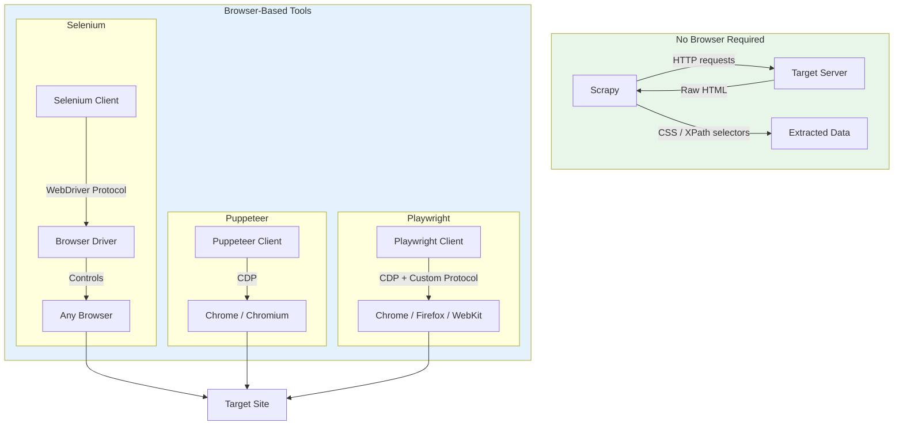
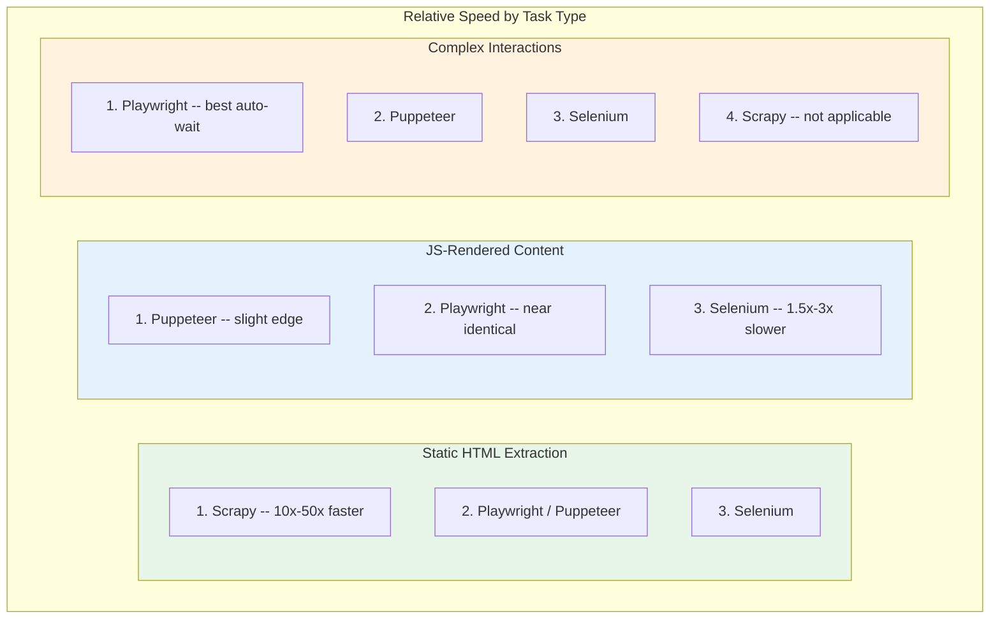
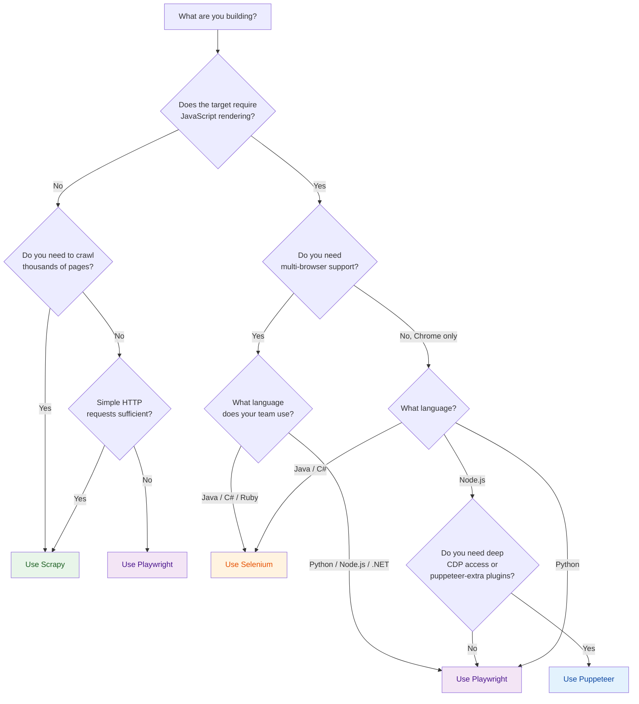

Four tools dominate scraping and browser automation in 2026, and each one reflects a fundamentally different philosophy about how to extract data from the web. **Scrapy** is a pure crawler framework that never opens a browser. **Selenium** wraps the WebDriver protocol to control real browsers across languages. **Puppeteer** speaks Chrome DevTools Protocol (CDP) natively for tight Chrome integration. And **Playwright** takes the CDP approach further with multi-browser support and a developer experience that has made it the default choice for many teams. Choosing between them is not about which is "best" -- it is about which philosophy matches your problem. This post breaks down every dimension that matters.

## Architecture Overview

Before comparing features, it helps to understand how each tool actually works under the hood. The fundamental split is between tools that need a browser and tools that do not.



**Scrapy** operates at the HTTP layer. It sends requests, receives HTML, and parses it -- no DOM rendering, no JavaScript execution. For simple targets, you can even [extract data with regex alone](/posts/regex-for-web-scraping-extracting-data-without-parser/) and skip a parser entirely. This makes Scrapy extremely fast but blind to any content that requires a browser to appear.

**Selenium** uses the W3C WebDriver protocol, which means it communicates with browsers through an intermediary driver binary (ChromeDriver, GeckoDriver, etc.). This adds a layer of indirection but provides the broadest browser and language support. For a head-to-head breakdown of these two, see our [Selenium vs Puppeteer definitive comparison](/posts/selenium-vs-puppeteer-definitive-comparison-web-scraping/).

**Puppeteer** connects directly to Chrome's DevTools Protocol, eliminating the middleman. This gives it lower latency and deeper access to browser internals like network interception, coverage analysis, and performance tracing.

**Playwright** builds on the same CDP foundation for Chromium but adds custom protocol bridges for Firefox and WebKit. The result is multi-browser support without the overhead of WebDriver's generic abstraction.

## Scrapy: The High-Volume Crawler

Scrapy is not a browser automation tool. It is a full-featured crawling framework with built-in support for request scheduling, rate limiting, middleware pipelines, item processing, and export formats. If your target serves HTML that contains the data you need without JavaScript rendering, Scrapy will outperform every browser-based tool by an order of magnitude.

**Sweet spot:** Large-scale crawls across thousands or millions of pages where JavaScript rendering is not required. E-commerce catalogs served as static HTML. API response scraping. Sitemap-based data collection. Any scenario where you need structured pipelines, automatic retries, and concurrent request management out of the box.

**Limitations:** No JavaScript rendering (unless you bolt on Splash or a Playwright integration). No interaction with page elements. Cannot handle SPAs, infinite scroll, or client-side routing.

## Selenium: The Battle-Tested Veteran

Selenium has been around since 2004 and remains the most widely deployed browser automation tool in the world. Its WebDriver protocol is a W3C standard, and client libraries exist for Python, Java, C#, Ruby, JavaScript, and Kotlin. If your team writes Java or C# and needs browser automation, Selenium is often the only realistic option.

**Sweet spot:** Cross-browser testing in enterprise environments. Teams using Java, C#, or Ruby. If you are weighing [Puppeteer vs Selenium](/posts/puppeteer-vs-selenium-which-should-you-pick/) specifically, language support is often the deciding factor. Legacy automation suites that predate newer tools. Scenarios requiring IE or Edge-specific behavior. Organizations where the W3C standard compliance matters for procurement.

**Limitations:** Slower than CDP-based tools due to WebDriver overhead. Auto-wait and selector strategies are less sophisticated than Playwright. The API surface has accumulated decades of design decisions that can feel inconsistent. Stealth is harder -- WebDriver leaves detectable traces that anti-bot systems flag, as the [evolution of detection methods](/posts/evolution-web-scraping-detection-methods-timeline/) makes clear.

## Puppeteer: Chrome's Native Automation Layer

Puppeteer is maintained by the Chrome DevTools team and provides first-party access to everything Chrome can do. Network interception, JavaScript coverage, accessibility tree snapshots, PDF generation, and performance tracing all work natively. The `puppeteer-extra` ecosystem adds stealth plugins, ad blocking, and other community extensions.

**Sweet spot:** Chrome-specific automation where you need deep browser access. Performance auditing. PDF generation. Screenshot pipelines. Node.js-centric teams that do not need multi-browser support. Scenarios where `puppeteer-extra-plugin-stealth` provides sufficient anti-detection. For a detailed comparison of Playwright and Puppeteer across speed, stealth, and DX, see our [Playwright vs Puppeteer breakdown](/posts/playwright-vs-puppeteer-speed-stealth-developer-experience/).

**Limitations:** Chrome and Firefox only (Firefox support is experimental). Node.js only -- no Python, Java, or other language bindings. If these constraints are a problem, our guide to [top Puppeteer alternatives](/posts/top-puppeteer-alternatives-what-to-use-instead/) covers what to use instead. Multi-browser coverage is not a realistic option. The project's scope is intentionally narrow, focused on Chrome rather than being a general automation framework.


<figure>
  
  <figcaption>Four tools, four architectures — Scrapy uses no browser at all, while the rest drive real ones. <span class="img-credit">Photo by ThisIsEngineering / <a href="https://www.pexels.com" target="_blank" rel="noopener noreferrer">Pexels</a></span></figcaption>
</figure>

## Playwright: The Modern All-Rounder

Playwright has become the default recommendation for new browser automation projects in 2026. It supports Chromium, Firefox, and WebKit from a single API. It ships with auto-waiting, built-in assertions, tracing, and codegen tooling. Client libraries exist for Python, Node.js, Java, and .NET. Its selector engine supports CSS, XPath, text content, ARIA roles, and chained selectors.

**Sweet spot:** New automation projects of any size. Teams that need multi-browser coverage. Python and Node.js ecosystems. Projects requiring robust auto-waiting and retry logic. AI agent integrations ([Playwright MCP](/posts/playwright-mcp-and-cli-making-browser-automation-ai-agent-friendly/), Playwright CLI). Scenarios where developer experience and debugging tools matter.

**Limitations:** Heavier resource footprint than Scrapy for non-JS pages. Stealth requires additional work (though `playwright-stealth` and `camoufox` help). The framework's rapid release cycle means breaking changes occasionally appear in minor versions.

## Performance Comparison

Performance depends heavily on the task, but the general hierarchy is consistent across workloads.



**Scrapy** avoids the overhead of launching a browser entirely. For static HTML pages, it can process hundreds of pages per second on modest hardware. Browser-based tools are limited by rendering time, which typically means 1-5 pages per second per browser context.

**Playwright and Puppeteer** perform nearly identically for browser-based tasks because both use CDP to communicate with Chromium. Playwright's custom protocol for Firefox and WebKit introduces minimal overhead. In benchmarks, the difference between the two is typically within measurement noise.

**Selenium** is consistently the slowest browser-based option, a point reinforced by our [Python requests vs Selenium speed comparison](/posts/python-requests-vs-selenium-speed-performance-comparison/). The WebDriver protocol requires serialization and deserialization of every command through the driver binary. Each action involves more round trips than CDP-based communication. For a sequence of 100 page interactions, Selenium can be 1.5x to 3x slower than Playwright or Puppeteer.

## Code Comparison: Extracting Product Data

The following examples all extract a product name and price from a hypothetical e-commerce page. Each example is kept minimal to highlight the API differences.

### Scrapy

```python
import scrapy

class ProductSpider(scrapy.Spider):
    name = "products"
    start_urls = ["https://example.com/products"]

    def parse(self, response):
        for product in response.css("div.product-card"):
            yield {
                "name": product.css("h2.product-name::text").get(),
                "price": product.css("span.price::text").get(),
            }

        next_page = response.css("a.next-page::attr(href)").get()
        if next_page:
            yield response.follow(next_page, self.parse)
```

### Selenium

```python
from selenium import webdriver
from selenium.webdriver.common.by import By
from selenium.webdriver.chrome.options import Options

options = Options()
options.add_argument("--headless=new")
driver = webdriver.Chrome(options=options)
driver.get("https://example.com/products")

products = driver.find_elements(By.CSS_SELECTOR, "div.product-card")
for product in products:
    name = product.find_element(By.CSS_SELECTOR, "h2.product-name").text
    price = product.find_element(By.CSS_SELECTOR, "span.price").text
    print(f"{name}: {price}")

driver.quit()
```

### Puppeteer

```javascript
const puppeteer = require("puppeteer");

(async () => {
  const browser = await puppeteer.launch({ headless: true });
  const page = await browser.newPage();
  await page.goto("https://example.com/products", { waitUntil: "networkidle2" });

  const products = await page.$$eval("div.product-card", (cards) =>
    cards.map((card) => ({
      name: card.querySelector("h2.product-name")?.textContent,
      price: card.querySelector("span.price")?.textContent,
    }))
  );

  console.log(products);
  await browser.close();
})();
```

### Playwright

```python
from playwright.sync_api import sync_playwright

with sync_playwright() as p:
    browser = p.chromium.launch(headless=True)
    page = browser.new_page()
    page.goto("https://example.com/products")

    for card in page.locator("div.product-card").all():
        name = card.locator("h2.product-name").text_content()
        price = card.locator("span.price").text_content()
        print(f"{name}: {price}")

    browser.close()
```

Notice the differences. Scrapy never opens a browser -- it works directly with the HTML response. Selenium uses `find_element` and `.text`. Puppeteer evaluates JavaScript in the page context with `$$eval`. Playwright uses its locator API with auto-waiting built in.


<figure>
  
  <figcaption>Scrapy processes hundreds of thousands of pages where browser tools would choke on the memory. <span class="img-credit">Photo by MASUD GAANWALA / <a href="https://www.pexels.com" target="_blank" rel="noopener noreferrer">Pexels</a></span></figcaption>
</figure>

## The Mega-Comparison Table

| Dimension | Scrapy | Selenium | Puppeteer | Playwright |
|---|---|---|---|---|
| **Primary language** | Python | Python, Java, C#, Ruby, JS, Kotlin | Node.js | Python, Node.js, Java, .NET |
| **Browser support** | None (HTTP only) | Chrome, Firefox, Edge, Safari | Chrome, Firefox (experimental) | Chromium, Firefox, WebKit |
| **JS rendering** | No (requires Splash/plugin) | Yes | Yes | Yes |
| **Protocol** | HTTP | W3C WebDriver | CDP | CDP + custom bridges |
| **Speed (static pages)** | Fastest (no browser overhead) | Slow | N/A (overkill) | N/A (overkill) |
| **Speed (JS pages)** | N/A | Slowest | Fast | Fast |
| **Auto-waiting** | N/A | Basic (explicit waits) | Manual | Built-in, robust |
| **Stealth capability** | Good (no browser fingerprint) | Poor ([WebDriver detectable](/posts/playwright-vs-selenium-stealth-which-evades-detection-better/)) | Good (with stealth plugin) | Moderate (with stealth plugin) |
| **Network interception** | Built-in middleware | Limited | Full CDP access | Full, clean API |
| **Parallel execution** | Async by default, excellent | Requires Grid or threading | Manual, per-context | Browser contexts, built-in |
| **Learning curve** | Moderate (framework concepts) | Low (simple API) | Low (JS-native) | Low (best docs) |
| **Community size** | Large (50k+ GitHub stars) | Largest (30k+ stars, decades of use) | Large (89k+ stars) | Very large (70k+ stars) |
| **Built-in pipelines** | Yes (items, pipelines, feeds) | No | No | No |
| **Test framework** | No | TestNG, JUnit integration | Jest integration | @playwright/test built-in |
| **Debugging tools** | Scrapy shell | Browser DevTools | CDP inspector | Trace viewer, codegen |
| **Best for** | High-volume static crawling | Cross-browser enterprise testing | Chrome-specific Node.js tasks | Modern scraping and automation |

## Decision Flowchart

Use this flowchart to narrow down your choice based on your specific requirements.



## Practical Recommendations by Use Case

### You are building a price monitoring system

Your targets are e-commerce sites with hundreds of thousands of product pages. Most serve prices in static HTML or in JSON-LD structured data. A minority use client-side rendering.

**Recommendation:** Start with **Scrapy** for the bulk of your crawl. Use its middleware system for proxy rotation, rate limiting, and retry logic. For the subset of sites that require JavaScript rendering, integrate **Playwright** via `scrapy-playwright` to selectively render only those pages (see how [Crawl4AI handles similar hybrid approaches](/posts/crawl4ai-v08-crash-recovery-prefetch-mode-and-whats-new/)). This hybrid approach gives you Scrapy's throughput for the easy targets and Playwright's rendering for the hard ones.

### You are automating a complex web application workflow

You need to log in, navigate [multi-step forms](/posts/how-to-automate-web-form-filling-complete-guide/), handle file uploads, and verify that certain elements appear after each action. The application runs on Chrome, Firefox, and Safari.

**Recommendation:** **Playwright** is the clear choice. Its auto-waiting eliminates the flaky timing issues that plague Selenium scripts. Its multi-browser support covers all three targets. The `@playwright/test` runner (or `pytest-playwright` for Python) provides built-in assertions, parallel execution, and trace files for debugging failures.

### You maintain a legacy test suite in Java

Your organization has thousands of Selenium tests in Java, integrated with TestNG and your CI pipeline. Rewriting is not an option.

**Recommendation:** Stay with **Selenium**. The Selenium 4.x series has improved significantly, and the WebDriver BiDi protocol is bringing CDP-like capabilities to the WebDriver world. Migrating to Playwright Java is possible but rarely worth the cost if your existing suite is stable. Focus on upgrading to the latest Selenium version and adopting the `WebDriverWait` patterns for reliability.

### You are building an AI agent that browses the web

Your agent needs to navigate arbitrary websites, extract information, fill forms, and handle dynamic content. It uses an LLM to decide what actions to take.

**Recommendation:** **Playwright** has the strongest AI agent ecosystem in 2026. Playwright MCP provides a Model Context Protocol server that AI agents can drive directly. The accessibility tree snapshot feature gives LLMs a [structured representation of page content](/posts/best-llm-structured-data-extraction-html-2026/), though [shadow DOM can complicate extraction](/posts/shadow-dom-the-silent-killer-of-ai-web-scraping/). For a survey of the agent landscape, see our comparisons of [Playwright for browser automation in AI agents](/posts/playwright-for-browser-automation-in-ai-agents/) and [browser agent frameworks like Browser Use, Stagehand, and Skyvern](/posts/browser-agent-frameworks-compared-browser-use-vs-stagehand-vs-skyvern/). Playwright's codegen and tracing tools make debugging agent behavior practical. Puppeteer is a viable alternative if you are locked into Node.js, but Playwright's Python support and broader tooling make it the default. Features like [Google Chrome's auto-browse mode](/posts/google-chrome-auto-browse-what-it-means-for-web-scraping/) are also reshaping how agents interact with the web.

### You need maximum stealth for anti-bot-protected sites

Your targets run Cloudflare, Akamai, or DataDome. Detection avoidance is the primary concern.

**Recommendation:** **Scrapy** with `httpmorph` or `curl_cffi` for static targets -- no browser fingerprint means no browser-based detection. With [AI bot traffic surging](/posts/the-ai-bot-traffic-explosion-what-1-bot-per-31-humans-means-for-the-web/), anti-bot systems like [Cloudflare's AI Labyrinth](/posts/cloudflare-ai-labyrinth-how-honeypot-pages-are-trapping-scrapers/) are getting more aggressive. For sites that require a browser, consider **Puppeteer** with `puppeteer-extra-plugin-stealth`, or **Playwright** with [Camoufox](/posts/stealth-browsers-in-2026-camoufox-nodriver-and-the-anti-detection-arms-race/) (a modified Firefox build designed for stealth). [Nodriver](/posts/nodriver-complete-guide-undetected-browser-automation-python/) is another strong option for maximum stealth. Selenium is the worst option for stealth -- the WebDriver flag and navigator properties are trivially detected, and patching them all is an endless game of whack-a-mole.

### You want the simplest possible setup for a small project

You have one site to scrape, it uses JavaScript rendering, and you want minimal dependencies.

**Recommendation:** **Playwright** with Python. Install with `pip install playwright && playwright install chromium`. The sync API reads like sequential code, auto-waiting handles timing, and the built-in codegen tool (`playwright codegen`) can generate your initial script by recording your manual actions. Total time from zero to working scraper: minutes.

## The Bottom Line

There is no single best tool. The right answer depends on your targets, your team's language, your scale requirements, and whether you need a browser at all.

**Scrapy** wins when you do not need JavaScript and you need to crawl at scale. It is not competing with the browser tools -- it operates in a different category entirely.

**Selenium** wins when your team writes Java or C#, when you have an existing test suite, or when W3C standards compliance is a requirement. It is the slowest and least ergonomic option for new projects, but it is not going away.

**Puppeteer** wins when you need deep Chrome integration in Node.js and you benefit from the `puppeteer-extra` plugin ecosystem. Its scope is intentionally narrow, and that focus is a strength for Chrome-specific work.

**Playwright** wins in the most scenarios. Multi-browser support, multi-language support, excellent auto-waiting, strong debugging tools, and the best AI agent integration story make it the default recommendation for new projects in 2026. If you are starting fresh and you are not sure which tool to pick, start here.

The tools are not mutually exclusive. Some of the most effective scraping architectures combine Scrapy for the crawl layer with Playwright for the rendering layer, using each tool where its philosophy aligns with the problem at hand.
