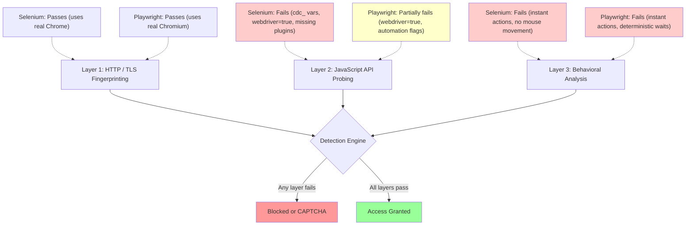

Neither Playwright nor Selenium is stealthy out of the box. Both leak automation signals that any competent anti-bot system will catch within milliseconds. The real question is not which tool is invisible by default --- it is which tool can be made harder to detect with the least effort, and which one still has cracks that no plugin can fully seal. This post breaks down the detection fingerprints each tool exposes, the stealth patches available for both, and how they compare against real-world anti-bot systems like Cloudflare, DataDome, and Akamai.

## What Selenium Leaks by Default

Selenium was never designed for stealth. It was built for testing, and its architecture announces automation at multiple levels. Here are the signals a default Selenium session exposes.

### navigator.webdriver

The most well-known flag. When Selenium controls Chrome, `navigator.webdriver` returns `true`. Every detection script on the internet checks this property first.

```javascript
// Detection script running on the target page
if (navigator.webdriver) {
  // Flag as bot
  reportAutomation('webdriver_detected');
}
```

### ChromeDriver Artifacts (cdc_ variables)

ChromeDriver injects internal variables into the DOM to communicate with the browser. These variables follow a pattern like `$cdc_asdjflasutopfhvcZLmcfl_` --- a dollar sign, the prefix `cdc_`, and a random string. Detection scripts enumerate properties on the `document` object looking for anything matching this pattern.

```javascript
// How detection scripts find cdc_ variables
for (const key in document) {
  if (key.match(/\$cdc_/)) {
    reportAutomation('chromedriver_artifact_found');
  }
}
```

### WebDriver HTTP Headers

Older versions of Selenium sent headers that explicitly identified WebDriver traffic. While modern versions have cleaned this up, some configurations still leak `Sec-WebDriver` or non-standard header orderings.

### Missing Browser Properties

For a broader look at how these tools compare beyond stealth, see our [Selenium vs Puppeteer definitive comparison](/posts/selenium-vs-puppeteer-definitive-comparison-web-scraping/). A default Selenium session may lack properties that real browsers have, such as `window.chrome`, correct `navigator.plugins` entries, or proper `navigator.languages` arrays. These omissions are easy to detect because the detection script simply checks whether expected properties exist.

```python
from selenium import webdriver

# Default Selenium session --- detectable in seconds
driver = webdriver.Chrome()
driver.get("https://example.com")

# Check what the browser leaks
is_webdriver = driver.execute_script("return navigator.webdriver")
has_chrome = driver.execute_script("return !!window.chrome")
plugins_count = driver.execute_script("return navigator.plugins.length")

print(f"webdriver flag: {is_webdriver}")     # True
print(f"window.chrome: {has_chrome}")         # May be True
print(f"plugins count: {plugins_count}")      # Often 0 or abnormal
```

## What Playwright Leaks by Default

Playwright is newer and was designed with more awareness of how browsers are probed. Its default fingerprint is smaller than Selenium's, but it is far from clean.

### navigator.webdriver

Same as Selenium. Playwright sets `navigator.webdriver` to `true` by default. This alone is enough for most detection scripts.

### Fewer DOM Artifacts

Unlike Selenium, Playwright does not inject `cdc_` variables or equivalent markers into the DOM. It communicates with the browser through the Chrome DevTools Protocol (CDP) over a WebSocket connection, which leaves no global variables behind. This is a meaningful advantage.

### Automation-Related Browser Flags

Playwright launches Chromium with automation-related command-line flags like `--enable-automation`. These flags can be detected by inspecting `navigator.userAgent` for "HeadlessChrome" strings or by probing `chrome.runtime` for inconsistencies.

```python
from playwright.sync_api import sync_playwright

# Default Playwright session --- detectable but cleaner than Selenium
with sync_playwright() as p:
    browser = p.chromium.launch(headless=False)
    page = browser.new_page()
    page.goto("https://example.com")

    is_webdriver = page.evaluate("navigator.webdriver")
    has_chrome = page.evaluate("!!window.chrome")
    plugins_count = page.evaluate("navigator.plugins.length")

    print(f"webdriver flag: {is_webdriver}")     # True
    print(f"window.chrome: {has_chrome}")         # True
    print(f"plugins count: {plugins_count}")      # More realistic than Selenium
```

## Detection Layers: Where Each Tool Fails

Modern anti-bot systems stack multiple detection layers. The following diagram shows which layers catch Selenium and Playwright in their default configurations.



Both tools pass the TLS layer because they drive real browser engines. Both fail behavioral analysis by default. Understanding how [detection methods have evolved over time](/posts/evolution-web-scraping-detection-methods-timeline/) explains why these layers exist. The key difference is at the JavaScript probing layer, where Playwright leaks fewer artifacts than Selenium.

## Stealth Plugins for Selenium

The Selenium ecosystem has developed several stealth solutions over the years. Each takes a different approach to hiding automation signals.

### selenium-stealth

The `selenium-stealth` package patches JavaScript properties after page load. It overrides `navigator.webdriver`, injects `window.chrome`, fixes `navigator.plugins`, and adjusts other commonly checked properties.

```python
from selenium import webdriver
from selenium_stealth import stealth

options = webdriver.ChromeOptions()
options.add_argument("--disable-blink-features=AutomationControlled")
options.add_experimental_option("excludeSwitches", ["enable-automation"])
options.add_experimental_option("useAutomationExtension", False)

driver = webdriver.Chrome(options=options)

stealth(driver,
    languages=["en-US", "en"],
    vendor="Google Inc.",
    platform="Win32",
    webgl_vendor="Intel Inc.",
    renderer="Intel Iris OpenGL Engine",
    fix_hairline=True,
)

driver.get("https://example.com")

# navigator.webdriver is now false
print(driver.execute_script("return navigator.webdriver"))  # False
```

The problem with `selenium-stealth` is that it applies patches via JavaScript injection, which can be detected by advanced probing scripts that check whether property descriptors have been modified.

### undetected-chromedriver

This is a more aggressive approach. `undetected-chromedriver` patches the ChromeDriver binary itself to remove `cdc_` variables, and it launches Chrome without automation flags.

```python
import undetected_chromedriver as uc

# Patches ChromeDriver binary and launches clean Chrome
driver = uc.Chrome(headless=False, version_main=133)

driver.get("https://nowsecure.nl")

# cdc_ variables are removed at the binary level
# navigator.webdriver is patched
# Chrome launches without --enable-automation
```

`undetected-chromedriver` is effective against many detection systems but can lag behind Chrome version updates. When Chrome releases a new version, there is sometimes a window where the patches are not yet compatible.

### SeleniumBase UC Mode

SeleniumBase wraps undetected-chromedriver concepts into a larger framework with additional stealth features like automatic CAPTCHA handling, reconnect patterns, and built-in proxy support.

```python
from seleniumbase import SB

with SB(uc=True, headless=False) as sb:
    sb.uc_open_with_reconnect("https://nowsecure.nl", reconnect_time=3)

    # UC Mode handles Chrome patches, flag removal,
    # and reconnection after Cloudflare challenges
    if sb.is_text_visible("nowsecure.nl passed", "h1"):
        print("Passed anti-bot check")

    sb.uc_click("button#some-button")
```


<figure>
  
  <figcaption>Selenium leaks cdc_ variables on every DOM element — Playwright's automation flags are easier to patch. <span class="img-credit">Photo by ThisIsEngineering / <a href="https://www.pexels.com" target="_blank" rel="noopener noreferrer">Pexels</a></span></figcaption>
</figure>

## Stealth Plugins for Playwright

Playwright's stealth ecosystem is smaller but benefits from the tool's cleaner baseline.

### playwright-stealth (npm)

The Node.js `playwright-stealth` package (from `puppeteer-extra-plugin-stealth`, adapted for Playwright) applies evasion scripts that mask automation indicators.

```javascript
const { chromium } = require('playwright');
const { newInjectedContext } = require('playwright-extra');
const stealth = require('puppeteer-extra-plugin-stealth');

// Using playwright-extra with stealth plugin
const browser = await chromium.launch({ headless: false });
const context = await newInjectedContext(browser, {
  plugins: [stealth()],
});

const page = await context.newPage();
await page.goto('https://example.com');

// Stealth patches applied: webdriver, chrome.runtime,
// plugins, languages, WebGL, etc.
const isWebdriver = await page.evaluate(() => navigator.webdriver);
console.log(`webdriver: ${isWebdriver}`); // false
```

### playwright-stealth (Python)

For Python users, the `playwright-stealth` package provides similar functionality.

```python
from playwright.sync_api import sync_playwright
from playwright_stealth import stealth_sync

with sync_playwright() as p:
    browser = p.chromium.launch(headless=False)
    page = browser.new_page()

    # Apply stealth patches before navigation
    stealth_sync(page)

    page.goto("https://example.com")

    is_webdriver = page.evaluate("navigator.webdriver")
    print(f"webdriver: {is_webdriver}")  # False

    # Check other properties
    result = page.evaluate("""() => {
        return {
            webdriver: navigator.webdriver,
            chrome: !!window.chrome,
            plugins: navigator.plugins.length,
            languages: navigator.languages,
        }
    }""")
    print(result)
```

### playwright-extra

The `playwright-extra` package brings the plugin architecture from `puppeteer-extra` to Playwright. The plugin architecture loads stealth patches and other extensions modularly.

```javascript
const { chromium } = require('playwright-extra');
const stealth = require('puppeteer-extra-plugin-stealth');

// Add stealth plugin
chromium.use(stealth());

const browser = await chromium.launch({ headless: false });
const page = await browser.newPage();
await page.goto('https://bot.sannysoft.com');

// Take a screenshot to verify stealth patches
await page.screenshot({ path: 'stealth-test.png', fullPage: true });
await browser.close();
```

## Testing Your Stealth Setup

Before pointing your stealth browser at a production target, verify that the common detection vectors are neutralized. Here is a script that checks the most important properties.

```python
from playwright.sync_api import sync_playwright
from playwright_stealth import stealth_sync

def run_detection_audit(page):
    """Check common detection vectors."""
    results = page.evaluate("""() => {
        const checks = {};

        // 1. navigator.webdriver
        checks.webdriver = navigator.webdriver;

        // 2. window.chrome object
        checks.hasChrome = !!window.chrome;
        checks.hasChromeRuntime = !!(window.chrome && window.chrome.runtime);

        // 3. Plugins
        checks.pluginCount = navigator.plugins.length;
        checks.pluginNames = Array.from(navigator.plugins).map(p => p.name);

        // 4. Languages
        checks.languages = navigator.languages;

        // 5. Platform consistency
        checks.platform = navigator.platform;
        checks.userAgent = navigator.userAgent;

        // 6. WebGL renderer
        try {
            const canvas = document.createElement('canvas');
            const gl = canvas.getContext('webgl');
            const debugInfo = gl.getExtension('WEBGL_debug_renderer_info');
            checks.webglVendor = gl.getParameter(debugInfo.UNMASKED_VENDOR_WEBGL);
            checks.webglRenderer = gl.getParameter(debugInfo.UNMASKED_RENDERER_WEBGL);
        } catch (e) {
            checks.webglError = e.message;
        }

        // 7. Permissions API inconsistency
        checks.permissionsAvailable = !!navigator.permissions;

        // 8. Connection info
        checks.hardwareConcurrency = navigator.hardwareConcurrency;
        checks.deviceMemory = navigator.deviceMemory;

        return checks;
    }""")
    return results

with sync_playwright() as p:
    browser = p.chromium.launch(headless=False)
    page = browser.new_page()
    stealth_sync(page)
    page.goto("https://bot.sannysoft.com")

    audit = run_detection_audit(page)
    for key, value in audit.items():
        status = "PASS" if key == "webdriver" and not value else ""
        print(f"  {key}: {value} {status}")
```

You can also use dedicated test sites to see what anti-bot systems detect:

```python
# Test against multiple detection services
test_urls = [
    "https://bot.sannysoft.com",
    "https://abrahamjuliot.github.io/creepjs/",
    "https://nowsecure.nl",
    "https://www.browserscan.net/bot-detection",
]

for url in test_urls:
    page.goto(url, wait_until="networkidle")
    page.screenshot(path=f"test-{url.split('/')[-1]}.png", full_page=True)
    print(f"Screenshot saved for {url}")
```

## TLS Fingerprinting: A Draw with Caveats

Both Selenium and Playwright drive real browser engines, so their TLS handshakes come from actual Chrome or Chromium network stacks. This means both produce legitimate TLS fingerprints that match known browser signatures. Neither tool suffers from the Python `requests` or `httpx` problem where the TLS handshake immediately identifies the client as non-browser software --- a gap we explore in our [Python requests vs Selenium speed comparison](/posts/python-requests-vs-selenium-speed-performance-comparison/).

However, there is a nuance. Playwright bundles its own Chromium build, which may lag behind the latest stable Chrome release. If the detection system fingerprints TLS by Chrome version and Playwright's bundled Chromium is a few versions behind, the JA4 fingerprint might not match the latest expected signature. Selenium, by default, uses whatever Chrome is installed on the system, which is typically up to date.

```python
# Playwright uses a bundled Chromium
from playwright.sync_api import sync_playwright

with sync_playwright() as p:
    # This uses Playwright's bundled Chromium, which may not match
    # the latest Chrome stable release
    browser = p.chromium.launch()
    page = browser.new_page()
    ua = page.evaluate("navigator.userAgent")
    print(f"Playwright Chromium UA: {ua}")
    # Might show Chrome/130 when stable Chrome is at 133

    # To use system Chrome instead (closer to real user TLS):
    browser2 = p.chromium.launch(channel="chrome")
    page2 = browser2.new_page()
    ua2 = page2.evaluate("navigator.userAgent")
    print(f"System Chrome UA: {ua2}")
    # Shows Chrome/133 matching the installed version
```

```python
# Selenium uses system Chrome by default
from selenium import webdriver

driver = webdriver.Chrome()
ua = driver.execute_script("return navigator.userAgent")
print(f"Selenium Chrome UA: {ua}")
# Uses the installed Chrome version, so TLS fingerprint matches
```

For TLS fingerprinting purposes, using `channel="chrome"` in Playwright levels the playing field. Both tools then use the same browser binary and produce identical TLS fingerprints.

## Behavioral Detection: Playwright's Subtle Advantage

Beyond static fingerprints, anti-bot systems analyze how your automation interacts with the page. This is where the tools diverge in interesting ways.

### Playwright's Auto-Wait

Playwright automatically waits for elements to be actionable before interacting with them. When you call `page.click()`, Playwright waits for the element to be visible, stable, enabled, and not obscured. This produces more natural-looking timing because actions do not fire the instant the DOM element exists.

```python
# Playwright: auto-wait produces more natural timing
page.goto("https://example.com/login")
page.fill("#username", "user@example.com")   # Waits for field to be ready
page.fill("#password", "password123")         # Natural delay between fields
page.click("button[type=submit]")            # Waits for button to be clickable
# For a deeper dive into automating login flows, see our guide on
# [how to automate web form filling](/posts/how-to-automate-web-form-filling-complete-guide/)
```

### Selenium's Explicit Waits

Selenium requires explicit wait conditions. Without them, actions fire immediately, producing inhuman timing. With them, the waits tend to be either too short (instant) or too long (fixed sleep), neither of which looks natural.

```python
from selenium.webdriver.common.by import By
from selenium.webdriver.support.ui import WebDriverWait
from selenium.webdriver.support import expected_conditions as EC

driver.get("https://example.com/login")

# Without explicit waits, actions are instantaneous
username = WebDriverWait(driver, 10).until(
    EC.presence_of_element_located((By.ID, "username"))
)
username.send_keys("user@example.com")  # Types instantly

password = driver.find_element(By.ID, "password")
password.send_keys("password123")  # Types instantly, zero delay

driver.find_element(By.CSS_SELECTOR, "button[type=submit]").click()
```

Neither tool simulates realistic human typing speed or mouse movement by default. Both require additional code to add randomized delays, gradual cursor movement, and variable typing speed. But Playwright's auto-wait mechanism means that even without extra effort, the timing between actions is slightly less robotic than Selenium's instant-fire pattern.

### Adding Human-Like Behavior

For serious stealth, both tools need explicit humanization:

```python
import random
import asyncio
from playwright.async_api import async_playwright

async def human_type(page, selector, text):
    """Type with randomized delays between keystrokes."""
    await page.click(selector)
    for char in text:
        await page.keyboard.type(char, delay=random.randint(50, 200))
        if random.random() < 0.05:  # 5% chance of a longer pause
            await asyncio.sleep(random.uniform(0.3, 0.8))

async def human_click(page, selector):
    """Move to element with a slight offset and click."""
    element = await page.query_selector(selector)
    box = await element.bounding_box()
    # Click at a random point within the element, not dead center
    x = box['x'] + random.uniform(box['width'] * 0.2, box['width'] * 0.8)
    y = box['y'] + random.uniform(box['height'] * 0.2, box['height'] * 0.8)
    await page.mouse.move(x, y, steps=random.randint(10, 25))
    await asyncio.sleep(random.uniform(0.1, 0.3))
    await page.mouse.click(x, y)
```

## Real-World Results Against Anti-Bot Systems

Here is how each tool fares against common anti-bot services, both in default configuration and with stealth patches applied.

### Default Configuration (No Stealth Patches)

| Anti-Bot System  | Selenium Default | Playwright Default |
|:-----------------|:-----------------|:-------------------|
| Cloudflare       | Blocked          | Blocked            |
| DataDome         | Blocked          | Blocked            |
| Akamai Bot Manager | Blocked        | Blocked            |
| PerimeterX       | Blocked          | Blocked            |
| Sannysoft Test   | Multiple fails   | Fewer fails        |

Neither tool passes any serious anti-bot system in its default state. With [AI bot traffic now hitting 1 bot per 31 humans](/posts/the-ai-bot-traffic-explosion-what-1-bot-per-31-humans-means-for-the-web/), anti-bot vendors have every incentive to catch default configurations.

### With Stealth Patches Applied

| Anti-Bot System  | Selenium + UC    | Playwright + Stealth |
|:-----------------|:-----------------|:---------------------|
| Cloudflare (standard) | Usually passes | Usually passes |
| [Cloudflare](/posts/cloudflare-ai-labyrinth-how-honeypot-pages-are-trapping-scrapers/) (aggressive) | Often blocked | Sometimes passes |
| DataDome         | Often blocked    | Sometimes passes     |
| Akamai Bot Manager | Mixed results  | Mixed results        |
| PerimeterX       | Often blocked    | Mixed results        |
| Sannysoft Test   | All pass         | All pass             |

Playwright with stealth patches has a slight edge because its baseline is cleaner. For a full breakdown across more dimensions, see the [Playwright vs Puppeteer vs Selenium vs Scrapy mega-comparison](/posts/playwright-vs-puppeteer-vs-selenium-vs-scrapy-2026-mega-comparison/). There are fewer artifacts to patch, which means fewer inconsistencies for detection scripts to find. Selenium's `cdc_` variable removal via `undetected-chromedriver` is effective but relies on binary patching that can break with Chrome updates.

## The Verdict

Playwright has a measurable advantage over Selenium for stealth work, but as our [Playwright vs Puppeteer comparison](/posts/playwright-vs-puppeteer-speed-stealth-developer-experience/) shows, the gap is narrower than you might expect. Here is the breakdown.

**Playwright wins on:**
- Fewer DOM artifacts by default (no `cdc_` variables)
- Cleaner browser launch flags
- Auto-wait behavior that produces slightly more natural timing
- Better async API design for adding humanization
- Smaller attack surface for detection scripts

**Selenium wins on:**
- Uses system Chrome by default (always current TLS fingerprint)
- More mature stealth ecosystem (undetected-chromedriver, SeleniumBase UC)
- Wider community knowledge and troubleshooting resources
- SeleniumBase UC Mode handles some anti-bot challenges automatically

**Both require:**
- Proxy rotation for IP-level defenses
- Regular maintenance as detection systems update

If you are starting a new stealth automation project and have no existing codebase to maintain, Playwright with `playwright-stealth` and `channel="chrome"` is the better foundation. You start with fewer leaks and a more modern API. If you already have a Selenium codebase, SeleniumBase UC Mode or `undetected-chromedriver` can bring you to a comparable level of stealth without a full rewrite.

## When to Skip Both Entirely

For targets with aggressive anti-bot protection --- Cloudflare's strictest settings, DataDome, or PerimeterX on high-security mode --- both Playwright and Selenium with stealth patches may not be enough. At that point, consider purpose-built stealth tools.

**[Nodriver](/posts/getting-started-nodriver-python-installation-first-script/)** communicates with Chrome through raw DevTools Protocol with no automation framework in between. There is no WebDriver, no ChromeDriver binary, and no injected variables. The browser does not know it is being automated.

```python
import nodriver as uc

async def main():
    browser = await uc.start()
    page = await browser.get("https://nowsecure.nl")

    # No automation artifacts exist at any layer
    # The browser is a completely normal Chrome instance
    content = await page.evaluate("document.documentElement.outerHTML")
    print(content[:200])

uc.loop().run_until_complete(main())
```

For a deeper look at Nodriver's capabilities, see our [complete Nodriver guide](/posts/nodriver-complete-guide-undetected-browser-automation-python/).

**Camoufox** modifies Firefox at the C++ engine level. Detection scripts cannot find inconsistencies between JavaScript patches and engine behavior because the engine itself is different.

```python
from camoufox.sync_api import Camoufox

with Camoufox(headless=True) as browser:
    page = browser.new_page()
    page.goto("https://nowsecure.nl")

    # Engine-level stealth --- no patches to detect
    print(page.title())
```

Both tools are part of a growing category of [stealth browsers built specifically for anti-detection](/posts/stealth-browsers-in-2026-camoufox-nodriver-and-the-anti-detection-arms-race/). They achieve better detection evasion than patched Playwright or Selenium because they eliminate the fundamental problem: a browser that knows it is being automated. For scraping tasks where stealth is the primary concern, these tools are increasingly the right choice.

The stealth landscape changes constantly. What passes Cloudflare today might fail next month. The best approach is to test your specific setup against your specific target regularly, and be prepared to switch tools when detection systems catch up.
