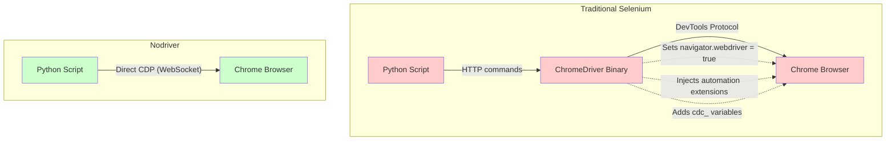

For years, undetected-chromedriver was the go-to Python library for bypassing bot detection while automating Chrome, and a strong [alternative to Puppeteer](/posts/top-puppeteer-alternatives-what-to-use-instead/) for Python developers. It worked by patching the ChromeDriver binary to remove telltale automation flags. But the approach had fundamental limits: every Chrome update could break the patches, Selenium's architecture left detectable traces, and the ChromeDriver binary itself was a liability. In late 2023, the same author released nodriver as a complete rewrite that throws out Selenium and ChromeDriver entirely. Instead of patching around detection, nodriver avoids it by design.

Nodriver communicates with Chrome directly through the Chrome DevTools Protocol. There is no ChromeDriver binary to fingerprint, no Selenium WebDriver flag to hide, and no automation-specific HTTP headers leaking into requests. The result is a Python browser automation library that starts undetected out of the box, with a clean async API that feels closer to Playwright than to Selenium. If you are new to the library, the [beginner tutorial on getting started with nodriver](/posts/getting-started-nodriver-python-installation-first-script/) walks through installation and your first script.

This guide covers everything you need to use nodriver effectively: installation, core API, selectors, JavaScript execution, tab management, configuration, and the pitfalls that trip up newcomers.

## How Nodriver Works

The key architectural difference between nodriver and traditional Selenium is the removal of every intermediary that leaves a detectable fingerprint. This distinction between [CDP and WebDriver-based tools](/posts/selenium-vs-puppeteer-definitive-comparison-web-scraping/) is fundamental. Selenium works through a chain: your Python script talks to the Selenium client library, which talks to the ChromeDriver binary over HTTP, which talks to Chrome over the DevTools Protocol. Each link in that chain introduces artifacts that detection systems look for.

Nodriver collapses that chain to a single hop.



Here is what each layer eliminates:

- **No ChromeDriver binary** --- Detection systems scan for the ChromeDriver process and its characteristic `cdc_` variables injected into the page. Nodriver never launches ChromeDriver, so these artifacts do not exist.
- **No Selenium WebDriver** --- Selenium sets `navigator.webdriver` to `true` by default. Even with patches, residual traces often remain. Nodriver does not use Selenium at all, so this property stays at its default `undefined` state.
- **No automation flags** --- ChromeDriver passes `--enable-automation` and related flags to Chrome. Nodriver launches Chrome with a clean set of arguments, the same way a regular user would.
- **Direct CDP communication** --- Nodriver connects to Chrome over a WebSocket using the Chrome DevTools Protocol. This is the same protocol that Chrome DevTools itself uses, making the connection indistinguishable from a developer inspecting their own browser.

The practical result is that a fresh nodriver session passes most common bot detection checks without any additional configuration. You do not need stealth plugins, JavaScript overrides, or custom browser builds --- a stark contrast to the [stealth challenges facing Selenium and Playwright](/posts/playwright-vs-selenium-stealth-which-evades-detection-better/).

## Installation

Nodriver is a pure Python package with minimal dependencies. Install it with pip:

```bash
pip install nodriver
```

That is the entire setup. There is no binary to download, no browser to install separately (as long as you have Chrome or Chromium on your system), and no driver version to match. Nodriver finds your installed Chrome automatically.

Requirements:
- **Python 3.9+** with asyncio support
- **Google Chrome or Chromium** installed on your system
- **No additional binaries** --- nodriver handles the browser connection directly

## Basic Usage: Launch, Navigate, Extract

Nodriver is fully async, built on Python's `asyncio`. Every interaction with the browser uses `await`. Here is a complete working example that launches Chrome, navigates to a page, and extracts text:

```python
import nodriver as uc


async def main():
    # Launch a browser instance
    browser = await uc.start()

    # Open a page
    page = await browser.get("https://example.com")

    # Find an element and extract its text
    heading = await page.select("h1")
    heading_text = heading.text
    print(f"Page heading: {heading_text}")

    # Extract all paragraph text
    paragraphs = await page.select_all("p")
    for p in paragraphs:
        print(p.text)

    # Close the browser
    browser.stop()


if __name__ == "__main__":
    uc.loop().run_until_complete(main())
```

A few things to note about this example:

- **`uc.start()`** launches a new Chrome instance and returns a `Browser` object. No driver binary is downloaded or started.
- **`browser.get(url)`** navigates to the URL and returns a `Tab` object (referred to as `page` by convention).
- **`page.select(selector)`** finds the first element matching a CSS selector.
- **`element.text`** returns the text content of the element as a property, not an awaitable.
- **`uc.loop()`** provides the asyncio event loop. You can also use `asyncio.run(main())` in Python 3.10+.

## Selectors: Finding Elements

Nodriver provides three primary methods for locating elements on a page. Each serves a different use case.

### page.select() --- CSS Selector for Single Elements

`select()` finds the first element that matches a CSS selector. It returns a single element or raises an exception if nothing is found.

```python
import nodriver as uc


async def main():
    browser = await uc.start()
    page = await browser.get("https://quotes.toscrape.com")

    # Select by class
    first_quote = await page.select(".quote .text")
    print(f"First quote: {first_quote.text}")

    # Select by tag
    title = await page.select("h1")
    print(f"Title: {title.text}")

    # Select by attribute
    link = await page.select("a[href='/login']")
    print(f"Login link text: {link.text}")

    browser.stop()


if __name__ == "__main__":
    uc.loop().run_until_complete(main())
```

### page.select_all() --- CSS Selector for Multiple Elements

`select_all()` returns a list of all elements matching a CSS selector. Use this when you need to iterate over repeated structures like product listings, table rows, or search results.

```python
import nodriver as uc


async def main():
    browser = await uc.start()
    page = await browser.get("https://quotes.toscrape.com")

    # Get all quotes on the page
    quotes = await page.select_all(".quote")

    quote_data = await page.evaluate("""
        Array.from(document.querySelectorAll('.quote')).map(q => ({
            text: q.querySelector('.text').innerText,
            author: q.querySelector('.author').innerText
        }))
    """)
    for q in quote_data:
        print(f"{q['text']} -- {q['author']}")

    browser.stop()


if __name__ == "__main__":
    uc.loop().run_until_complete(main())
```

### page.find() --- Text-Based Search

`find()` locates elements by their visible text content. This is useful when you do not know the exact CSS structure but you know what text appears on the page.

```python
import nodriver as uc


async def main():
    browser = await uc.start()
    page = await browser.get("https://quotes.toscrape.com")

    # Find an element by its text content
    login_link = await page.find("Login")
    print(f"Found element: {login_link.tag_name}")

    # Find and click a button by text
    next_button = await page.find("Next")
    await next_button.click()

    # Verify we navigated
    print(f"Current URL: {page.url}")

    browser.stop()


if __name__ == "__main__":
    uc.loop().run_until_complete(main())
```

`find()` performs a case-sensitive search through visible text. It is particularly handy for clicking buttons and links where the text label is stable but the CSS class might change between deployments.


<figure>
  
  <figcaption>Nodriver skips WebDriver entirely — one direct CDP connection means fewer artifacts to detect. <span class="img-credit">Photo by Maxim Landolfi / <a href="https://www.pexels.com" target="_blank" rel="noopener noreferrer">Pexels</a></span></figcaption>
</figure>

## Waiting for Elements

Web pages load asynchronously. Content might arrive after the initial page load, rendered by JavaScript or fetched from an API. Nodriver does not have a built-in explicit wait-for-selector mechanism like Playwright's `wait_for_selector`. Instead, you combine `page.sleep()` with retry patterns.

### Simple Delay

```python
import nodriver as uc


async def main():
    browser = await uc.start()
    page = await browser.get("https://example.com/spa-page")

    # Wait for JavaScript to render content
    await page.sleep(2)

    # Now try to find dynamically loaded content
    content = await page.select(".dynamic-content")
    print(content.text)

    browser.stop()


if __name__ == "__main__":
    uc.loop().run_until_complete(main())
```

### Retry Pattern for Dynamic Content

For more reliable waiting, implement a retry loop:

```python
import nodriver as uc


async def wait_for_element(page, selector, timeout=10, interval=0.5):
    """Poll for an element until it appears or timeout is reached."""
    elapsed = 0
    while elapsed < timeout:
        try:
            element = await page.select(selector)
            if element:
                return element
        except Exception:
            pass
        await page.sleep(interval)
        elapsed += interval
    raise TimeoutError(f"Element '{selector}' not found within {timeout}s")


async def main():
    browser = await uc.start()
    page = await browser.get("https://example.com/dynamic-page")

    # Wait up to 15 seconds for the element to appear
    element = await wait_for_element(page, ".lazy-loaded-data", timeout=15)
    print(element.text)

    browser.stop()


if __name__ == "__main__":
    uc.loop().run_until_complete(main())
```

### Waiting for Navigation

After clicking a link or submitting a form, you often need to wait for the new page to load.

```python
import nodriver as uc


async def main():
    browser = await uc.start()
    page = await browser.get("https://quotes.toscrape.com")

    # Click next page
    next_link = await page.find("Next")
    await next_link.click()

    # Wait for navigation to complete
    await page.sleep(2)

    # Extract from the new page
    quotes = await page.select_all(".quote .text")
    for q in quotes:
        print(q.text)

    browser.stop()


if __name__ == "__main__":
    uc.loop().run_until_complete(main())
```

## JavaScript Evaluation

For complex extraction scenarios or when you need to interact with the page at a deeper level, nodriver lets you run arbitrary JavaScript in the browser context using `page.evaluate()`.

### Extracting Data with JavaScript

```python
import nodriver as uc


async def main():
    browser = await uc.start()
    page = await browser.get("https://quotes.toscrape.com")

    # Execute JavaScript and get the return value
    quote_data = await page.evaluate("""
        Array.from(document.querySelectorAll('.quote')).map(q => ({
            text: q.querySelector('.text').innerText,
            author: q.querySelector('.author').innerText,
            tags: Array.from(q.querySelectorAll('.tag')).map(t => t.innerText)
        }))
    """)

    for quote in quote_data:
        print(f"{quote['text']}")
        print(f"  -- {quote['author']}")
        print(f"  Tags: {', '.join(quote['tags'])}")
        print()

    browser.stop()


if __name__ == "__main__":
    uc.loop().run_until_complete(main())
```

### Scrolling and Triggering Lazy Load

```python
import nodriver as uc


async def main():
    browser = await uc.start()
    page = await browser.get("https://example.com/infinite-scroll")

    # Scroll to bottom to trigger lazy loading
    for _ in range(5):
        await page.evaluate("window.scrollTo(0, document.body.scrollHeight)")
        await page.sleep(1)

    # Now extract all the loaded items
    items = await page.select_all(".item")
    print(f"Total items loaded: {len(items)}")

    browser.stop()


if __name__ == "__main__":
    uc.loop().run_until_complete(main())
```

### Checking Detection Status

You can verify that your browser session is not flagged by probing the same properties that [detection scripts have evolved to check](/posts/evolution-web-scraping-detection-methods-timeline/):

```python
import nodriver as uc


async def main():
    browser = await uc.start()
    page = await browser.get("https://example.com")

    # Check common detection vectors
    webdriver_flag = await page.evaluate("navigator.webdriver")
    chrome_obj = await page.evaluate("!!window.chrome")
    plugins_count = await page.evaluate("navigator.plugins.length")

    print(f"navigator.webdriver: {webdriver_flag}")
    print(f"window.chrome exists: {chrome_obj}")
    print(f"Plugin count: {plugins_count}")

    browser.stop()


if __name__ == "__main__":
    uc.loop().run_until_complete(main())
```

With nodriver, `navigator.webdriver` should return `undefined` or `false`, `window.chrome` should exist, and the plugin count should be non-zero --- all matching a legitimate Chrome session.

## Handling Multiple Tabs

Nodriver supports working with multiple tabs in a single browser session. This is useful for parallel scraping or for handling flows that open new windows.

### Opening New Tabs

```python
import nodriver as uc


async def main():
    browser = await uc.start()

    # Open first page
    page1 = await browser.get("https://example.com")
    print(f"Tab 1 title: {await page1.evaluate('document.title')}")

    # Open a second tab with a new URL
    page2 = await browser.get("https://quotes.toscrape.com", new_tab=True)
    print(f"Tab 2 title: {await page2.evaluate('document.title')}")

    # Both tabs remain accessible
    heading = await page1.select("h1")
    print(f"Tab 1 heading: {heading.text}")

    quote = await page2.select(".quote .text")
    print(f"Tab 2 first quote: {quote.text}")

    browser.stop()


if __name__ == "__main__":
    uc.loop().run_until_complete(main())
```

The `new_tab=True` parameter in `browser.get()` opens the URL in a new tab instead of replacing the current one. Each tab returns its own `Tab` object that you can interact with independently.

### Iterating Over Open Tabs

```python
import nodriver as uc


async def main():
    browser = await uc.start()

    urls = [
        "https://example.com",
        "https://quotes.toscrape.com",
        "https://httpbin.org/headers",
    ]

    tabs = []
    for i, url in enumerate(urls):
        tab = await browser.get(url, new_tab=(i > 0))
        tabs.append(tab)

    # Process all tabs
    for tab in tabs:
        title = await tab.evaluate("document.title")
        print(f"URL: {tab.url} | Title: {title}")

    browser.stop()


if __name__ == "__main__":
    uc.loop().run_until_complete(main())
```


<figure>
  
  <figcaption>Headless mode leaks signals like empty navigator.plugins and zero outerHeight — headed mode avoids this. <span class="img-credit">Photo by Rafael Rendon / <a href="https://www.pexels.com" target="_blank" rel="noopener noreferrer">Pexels</a></span></figcaption>
</figure>

## Configuration Options

Nodriver accepts several configuration parameters through `uc.start()` that control how Chrome launches and behaves.

### Headless Mode

```python
import nodriver as uc


async def main():
    # Launch in headless mode
    browser = await uc.start(headless=True)

    page = await browser.get("https://example.com")
    title = await page.evaluate("document.title")
    print(f"Title: {title}")

    browser.stop()


if __name__ == "__main__":
    uc.loop().run_until_complete(main())
```

### Custom Browser Arguments

You can pass additional Chrome command-line arguments through `browser_args`:

```python
import nodriver as uc


async def main():
    browser = await uc.start(
        browser_args=[
            "--window-size=1920,1080",
            "--disable-gpu",
            "--lang=en-US",
        ]
    )

    page = await browser.get("https://httpbin.org/headers")
    content = await page.select("pre")
    print(content.text)

    browser.stop()


if __name__ == "__main__":
    uc.loop().run_until_complete(main())
```

### Persistent Profiles with user_data_dir

By specifying a `user_data_dir`, you can persist cookies, local storage, and login sessions across browser launches. This is critical for workflows where you need to stay logged in:

```python
import nodriver as uc


async def main():
    # Use a persistent profile directory
    browser = await uc.start(
        user_data_dir="/tmp/my_chrome_profile"
    )

    page = await browser.get("https://example.com/dashboard")

    # On first run, log in manually or programmatically
    # On subsequent runs, the session cookies are already present

    title = await page.evaluate("document.title")
    print(f"Title: {title}")

    browser.stop()


if __name__ == "__main__":
    uc.loop().run_until_complete(main())
```

### Specifying a Chrome Binary

If you have multiple Chrome installations or want to use a specific version:

```python
import nodriver as uc


async def main():
    browser = await uc.start(
        browser_executable_path="/usr/bin/google-chrome-stable"
    )

    page = await browser.get("https://example.com")
    version = await page.evaluate("navigator.userAgent")
    print(f"User Agent: {version}")

    browser.stop()


if __name__ == "__main__":
    uc.loop().run_until_complete(main())
```

## Common Pitfalls

Nodriver is straightforward to use, but several issues catch newcomers off guard.

### Headless Mode Is More Detectable

Chrome's headless mode behaves differently from headed mode in subtle ways. The `navigator.plugins` array may be empty, the `window.outerHeight` and `window.outerWidth` values may be zero, and certain rendering behaviors differ. Advanced detection systems check for these discrepancies.

If you are getting blocked in headless mode but not in headed mode, this is likely the reason. For maximum stealth, run in headed mode on a server using a virtual display like Xvfb:

```python
# On a Linux server, run with Xvfb:
# xvfb-run python my_script.py

# Or within Docker, set up a virtual display
# apt-get install -y xvfb
# Xvfb :99 -screen 0 1920x1080x24 &
# export DISPLAY=:99
```

### Everything Is Async

Every interaction with the browser must use `await`. Forgetting `await` is the single most common mistake, and it produces confusing errors because you get a coroutine object instead of the expected result:

```python
# Wrong - returns a coroutine object, not an element
element = page.select("h1")

# Correct
element = await page.select("h1")
```

If your code prints something like `<coroutine object Tab.select at 0x...>` instead of actual data, you forgot an `await`.

### Chrome Version Compatibility

Nodriver works with the Chrome version installed on your system. Occasionally, a major Chrome update changes CDP behavior in ways that break nodriver. If the library stops working after a Chrome update:

1. Check the nodriver GitHub repository for open issues
2. Update nodriver: `pip install --upgrade nodriver`
3. As a temporary fix, you can pin your Chrome version

### Browser Not Found

Nodriver auto-detects Chrome on standard installation paths. If it cannot find your browser, pass the path explicitly:

```python
browser = await uc.start(
    browser_executable_path="/path/to/your/chrome"
)
```

### Stale Element References

If the page re-renders (due to navigation or JavaScript updates), previously selected elements may become stale. Always re-select elements after any action that could change the DOM:

```python
import nodriver as uc


async def main():
    browser = await uc.start()
    page = await browser.get("https://example.com/dynamic")

    # Select an element
    button = await page.find("Load More")
    await button.click()

    # Wait for the page to update
    await page.sleep(2)

    # Re-select elements after the DOM has changed
    items = await page.select_all(".item")
    print(f"Items after load: {len(items)}")

    browser.stop()


if __name__ == "__main__":
    uc.loop().run_until_complete(main())
```

## Comparison with Alternatives

Nodriver is not the only option for stealth browser automation. Here is how it compares to the main alternatives across the dimensions that matter most (for a broader breakdown, see the [full mega-comparison of Playwright, Puppeteer, Selenium, and Scrapy](/posts/playwright-vs-puppeteer-vs-selenium-vs-scrapy-2026-mega-comparison/)):

| Feature | Nodriver | Selenium | Playwright | Camoufox |
|---|---|---|---|---|
| **Language** | Python only | Python, Java, JS, C# | Python, JS, Java, .NET | Python (Playwright API) |
| **Stealth by default** | Yes | No | No | Yes |
| **Requires driver binary** | No | Yes (ChromeDriver) | No (bundled) | No (custom Firefox) |
| **Browser support** | Chrome/Chromium | Chrome, Firefox, Edge, Safari | Chromium, Firefox, WebKit | Firefox only |
| **Async native** | Yes | No | Yes | Yes |
| **Headless detection risk** | Moderate | High | Moderate | Low |
| **Learning curve** | Low | Low | Low | Low |
| **Community size** | Small | Very large | Large | Small |
| **Best for** | Stealth scraping in Python | Cross-browser testing | Modern automation and AI agents | Maximum anti-detection |

**Choose nodriver when** you need a lightweight, Python-only solution that bypasses common bot detection without external dependencies. It is the fastest path from zero to an undetected browser session.

**Choose Selenium when** you need cross-browser and cross-language support, or your team already has a Selenium codebase. Add SeleniumBase UC Mode for stealth capabilities.

**Choose Playwright when** you need a full-featured automation framework with robust waiting, network interception, multi-browser support, or [AI agent integration](/posts/playwright-for-browser-automation-in-ai-agents/). It is not stealthy by default, but it is the most capable general-purpose tool.

**Choose Camoufox when** you face the most aggressive detection systems. As covered in our look at [stealth browsers in 2026](/posts/stealth-browsers-in-2026-camoufox-nodriver-and-the-anti-detection-arms-race/), engine-level fingerprint spoofing defeats checks that all other tools fail. The tradeoff is Firefox-only support and a larger installation footprint.

## Practical Recommendations

Nodriver fills a specific and valuable niche: undetected Chrome automation in Python with minimal setup. Here is how to get the most out of it.

**Start with headed mode.** Run headed during development so you can see what the browser is doing. Switch to headless only when deploying, and test thoroughly after the switch. If detection increases in headless mode, use Xvfb instead.

**Use persistent profiles.** Setting `user_data_dir` saves you from re-authenticating on every run. It also makes your browser session look more realistic, since real users have cookies, history, and cached data.

**Combine selectors.** Use `page.select()` for precise CSS targeting, `page.find()` for text-based discovery, and `page.evaluate()` for complex extraction that would be cumbersome with element-by-element querying.

**Add human-like delays.** Even though nodriver is undetected at the browser level, sending requests at machine speed can trigger rate-based detection. Add randomized delays between actions using `await page.sleep()` with varying intervals.

**Keep nodriver updated.** The library is actively maintained to keep pace with Chrome updates and new detection techniques. Run `pip install --upgrade nodriver` regularly.

**Know when to move on.** If you hit sites with advanced behavioral analysis or enterprise-grade anti-bot systems like [Cloudflare's AI Labyrinth](/posts/cloudflare-ai-labyrinth-how-honeypot-pages-are-trapping-scrapers/) that nodriver cannot bypass, step up to Camoufox for engine-level stealth or consider a residential proxy layer to address network-level detection.
