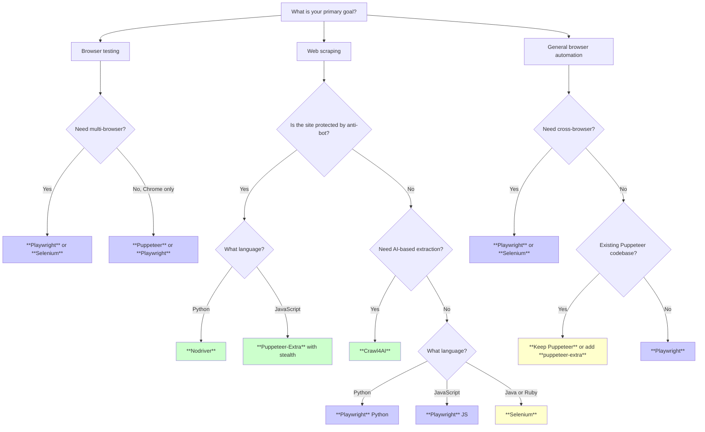

Puppeteer changed the game when Google released it in 2017. For the first time, developers had a high-level Node.js API for controlling Chrome through the DevTools Protocol, and it quickly became the default tool for headless browser automation. But the web has moved on, and so have the tools. In 2026, developers searching for a Puppeteer alternative have more options than ever, and several of them are better fits depending on the job.

The reasons people move away from Puppeteer tend to cluster around a few recurring pain points. Puppeteer only supports Chromium-based browsers, which means you cannot test or scrape in Firefox or WebKit without reaching for a second tool. It requires Node.js, shutting out Python and Java teams. Its stealth story is weak out of the box, making it easy for anti-bot systems to detect. And the team that originally built Puppeteer at Google later moved to Microsoft and built Playwright, which many consider a direct upgrade.

This post walks through the top alternatives, compares them on the dimensions that matter, and helps you decide which tool fits your project.

## Playwright: The Direct Upgrade

Playwright is the most natural replacement for Puppeteer. Several of its core developers previously worked on the Puppeteer project at Google before joining Microsoft, and the API design reflects that lineage. If you know Puppeteer, Playwright will feel familiar immediately, but with capabilities that go further.

**Why Playwright wins over Puppeteer:**

- **Multi-browser support** -- Chromium, Firefox, and WebKit from a single API
- **Multi-language** -- official bindings for JavaScript, TypeScript, Python, Java, and .NET
- **Auto-waiting** -- built-in intelligent waits that eliminate most `waitForSelector` calls
- **Browser contexts** -- lightweight isolated sessions that are faster than launching new browser instances
- **Tracing and debugging** -- built-in trace viewer, codegen tool, and VS Code extension

### Side-by-Side: Puppeteer vs Playwright

Here is the same task -- navigating to a page, waiting for content, and extracting text -- in both tools.

**Puppeteer (Node.js):**

```javascript
const puppeteer = require("puppeteer");

(async () => {
  const browser = await puppeteer.launch({ headless: true });
  const page = await browser.newPage();

  await page.goto("https://example.com/products", {
    waitUntil: "networkidle2",
  });

  await page.waitForSelector(".product-card");

  const titles = await page.$$eval(".product-card h2", (elements) =>
    elements.map((el) => el.textContent.trim())
  );

  console.log(titles);
  await browser.close();
})();
```

**Playwright (Node.js):**

```javascript
const { chromium } = require("playwright");

(async () => {
  const browser = await chromium.launch({ headless: true });
  const page = await browser.newPage();

  await page.goto("https://example.com/products");

  // Auto-waiting: Playwright waits for the selector automatically
  const titles = await page
    .locator(".product-card h2")
    .allTextContents();

  console.log(titles);
  await browser.close();
})();
```

**Playwright (Python):**

```python
from playwright.sync_api import sync_playwright

with sync_playwright() as p:
    browser = p.chromium.launch(headless=True)
    page = browser.new_page()

    page.goto("https://example.com/products")

    titles = page.locator(".product-card h2").all_text_contents()

    print(titles)
    browser.close()
```

The differences are subtle but meaningful. Playwright's `locator` API automatically waits for elements to appear before interacting with them. You do not need `waitUntil: "networkidle2"` in most cases because Playwright's navigation defaults handle common scenarios. And the same logic works across Chromium, Firefox, and WebKit by swapping a single import.

### When to Choose Playwright Over Puppeteer

Playwright is the right choice when you need multi-browser support, when your team works in Python or Java, or when you want a more modern API with better defaults. For a detailed breakdown of how the two compare on [speed, stealth, and developer experience](/posts/playwright-vs-puppeteer-speed-stealth-developer-experience/), see our head-to-head comparison. For new projects in 2026, there is rarely a reason to start with Puppeteer over Playwright unless you have an existing Puppeteer codebase you do not want to migrate.

## Selenium: The Established Workhorse

Selenium predates both Puppeteer and Playwright by over a decade. It uses the WebDriver protocol rather than the Chrome DevTools Protocol, and it supports every major browser through a standardized interface. Our [definitive Selenium vs Puppeteer comparison](/posts/selenium-vs-puppeteer-definitive-comparison-web-scraping/) covers the architectural differences in depth. If you need to automate Internet Explorer or legacy Edge, Selenium is still the only option. If your team works in Java, C#, Ruby, or Python and prefers a tool with the deepest ecosystem of documentation and community answers, Selenium delivers.

**Where Selenium fits:**

- **Multi-language** -- Java, Python, C#, Ruby, JavaScript, Kotlin
- **Multi-browser** -- Chrome, Firefox, Safari, Edge, and legacy browsers
- **Selenium Grid** -- built-in distributed execution across multiple machines
- **Massive ecosystem** -- the largest community, most Stack Overflow answers, and broadest CI/CD integration support

```python
from selenium import webdriver
from selenium.webdriver.common.by import By
from selenium.webdriver.support.ui import WebDriverWait
from selenium.webdriver.support import expected_conditions as EC

driver = webdriver.Chrome()

driver.get("https://example.com/products")

WebDriverWait(driver, 10).until(
    EC.presence_of_all_elements_located((By.CSS_SELECTOR, ".product-card h2"))
)

titles = [
    el.text
    for el in driver.find_elements(By.CSS_SELECTOR, ".product-card h2")
]

print(titles)
driver.quit()
```

Selenium's API is more verbose than Playwright's. You need explicit waits, separate driver management (though Selenium Manager now handles driver downloads automatically), and more boilerplate. But the tradeoff is a tool that has been battle-tested across every conceivable environment and has the largest pool of existing knowledge.

### When to Choose Selenium

Choose Selenium when your team already uses it, when you need Java or Ruby bindings, when you are running distributed tests across Selenium Grid, or when you need to support legacy browsers. If you are still deciding between the two, our guide on [which one to pick for your project](/posts/puppeteer-vs-selenium-which-should-you-pick/) can help. For pure web scraping, Playwright or a stealth-focused tool will usually be a better fit.

## Nodriver: When Stealth Is the Priority

Nodriver is a Python library that communicates with Chrome through the raw DevTools Protocol without injecting any automation flags. Our [complete guide to Nodriver](/posts/nodriver-complete-guide-undetected-browser-automation-python/) covers its architecture and advanced usage in detail. Unlike Puppeteer and Playwright, which set `navigator.webdriver` to `true` and leave other detectable traces, Nodriver produces a browser session that looks identical to a human-operated Chrome instance.

**What makes Nodriver different:**

- **Zero automation fingerprints** -- does not set `navigator.webdriver`, does not inject automation extensions
- **Direct CDP communication** -- talks to Chrome over the DevTools Protocol without a middle layer that detection scripts can identify
- **Python-native** -- designed for the Python ecosystem from the ground up
- **Lightweight** -- minimal dependencies, fast startup (see our [getting started tutorial](/posts/getting-started-nodriver-python-installation-first-script/) to have it running in minutes)

```python
import nodriver as uc

async def main():
    browser = await uc.start()
    page = await browser.get("https://example.com/products")

    # Wait for elements and extract text
    cards = await page.select_all(".product-card h2")
    titles = [card.text for card in cards]

    print(titles)
    browser.stop()

if __name__ == "__main__":
    uc.loop().run_until_complete(main())
```

Nodriver is the successor to the popular `undetected-chromedriver` project. Where `undetected-chromedriver` patched Selenium to remove detection signals, Nodriver takes a cleaner approach by bypassing Selenium entirely and communicating with Chrome directly. The result is a smaller surface area for detection scripts to probe.

### When to Choose Nodriver

Choose Nodriver when you are scraping sites protected by [Cloudflare](/posts/cloudflare-ai-labyrinth-how-honeypot-pages-are-trapping-scrapers/), DataDome, or similar anti-bot systems and you need to avoid detection without proxies or CAPTCHA-solving services. It is part of a broader wave of [stealth browsers](/posts/stealth-browsers-in-2026-camoufox-nodriver-and-the-anti-detection-arms-race/) designed to stay ahead of detection. It trades multi-browser support and a rich feature set for a near-invisible automation footprint.

## Puppeteer-Extra: Enhancing Rather Than Replacing

If you have an existing Puppeteer codebase and do not want to rewrite it, puppeteer-extra lets you bolt on capabilities through a plugin system. The two most popular plugins address Puppeteer's biggest weakness: detectability.

**Key plugins:**

- **puppeteer-extra-plugin-stealth** -- patches dozens of detection vectors including `navigator.webdriver`, Chrome runtime checks, iframe detection, and WebGL fingerprints
- **puppeteer-extra-plugin-adblocker** -- blocks ads and trackers, which speeds up page loads and reduces noise in scraped data

```javascript
const puppeteer = require("puppeteer-extra");
const StealthPlugin = require("puppeteer-extra-plugin-stealth");
const AdblockerPlugin = require("puppeteer-extra-plugin-adblocker");

// Add plugins before launching
puppeteer.use(StealthPlugin());
puppeteer.use(AdblockerPlugin({ blockTrackers: true }));

(async () => {
  const browser = await puppeteer.launch({ headless: true });
  const page = await browser.newPage();

  await page.goto("https://example.com/products", {
    waitUntil: "networkidle2",
  });

  const titles = await page.$$eval(".product-card h2", (elements) =>
    elements.map((el) => el.textContent.trim())
  );

  console.log(titles);
  await browser.close();
})();
```

The stealth plugin works by overriding JavaScript properties and patching browser behaviors that anti-bot scripts check. It is effective against many [detection systems](/posts/evolution-web-scraping-detection-methods-timeline/), but advanced anti-bot vendors like Cloudflare's latest challenges can still detect it because the patches operate at the JavaScript level rather than at the browser engine level. For a deeper look at how stealth approaches compare across tools, see our [Playwright vs Selenium stealth comparison](/posts/playwright-vs-selenium-stealth-which-evades-detection-better/).

### When to Choose Puppeteer-Extra

Choose puppeteer-extra when you already have a working Puppeteer project and need to add stealth or ad-blocking without migrating to a different framework. It is an incremental improvement, not a full replacement.


<figure>
  
  <figcaption>Playwright inherited Puppeteer's design and added multi-browser support on top. <span class="img-credit">Photo by Bibek ghosh / <a href="https://www.pexels.com" target="_blank" rel="noopener noreferrer">Pexels</a></span></figcaption>
</figure>

## Crawl4AI: AI-Powered Scraping on Playwright

Crawl4AI is an open-source Python framework built on top of Playwright that adds AI-powered data extraction. Rather than writing selectors by hand, you can define a [schema for the data you want](/posts/schema-driven-scraping-llms-pydantic-zod-structured-output/), and Crawl4AI uses [large language models to extract structured data](/posts/best-llm-structured-data-extraction-html-2026/) from pages. Check out our [Crawl4AI v0.8 overview](/posts/crawl4ai-v08-crash-recovery-prefetch-mode-and-whats-new/) for the latest features including crash recovery and prefetch mode.

**What Crawl4AI offers:**

- **LLM-based extraction** -- define a JSON schema and let the model figure out selectors
- **Markdown conversion** -- converts pages to clean Markdown for LLM consumption
- **Session management** -- handles multi-page workflows with persistent browser contexts
- **Built on Playwright** -- inherits multi-browser support and auto-waiting

```python
import asyncio
from crawl4ai import AsyncWebCrawler, BrowserConfig, CrawlerRunConfig
from crawl4ai.extraction_strategy import LLMExtractionStrategy

async def main():
    browser_config = BrowserConfig(headless=True)
    run_config = CrawlerRunConfig(
        extraction_strategy=LLMExtractionStrategy(
            provider="openai/gpt-4o",
            instruction="Extract all product names and prices from this page.",
        )
    )

    async with AsyncWebCrawler(config=browser_config) as crawler:
        result = await crawler.arun(
            url="https://example.com/products",
            config=run_config,
        )

        print(result.extracted_content)

asyncio.run(main())
```

Crawl4AI is not a general-purpose browser automation tool. It is purpose-built for data extraction, and it works best on sites where the HTML structure changes frequently — for example, an e-commerce site that restructures its product cards weekly — or where the data sits in irregular layouts that resist stable CSS selectors.

### When to Choose Crawl4AI

Choose Crawl4AI when your goal is data extraction rather than browser automation, when page structures change frequently and you want an LLM to adapt, or when you need to convert web pages to Markdown for ingestion into [AI pipelines](/posts/playwright-for-browser-automation-in-ai-agents/).

## Comparison Table

For an even more comprehensive breakdown that includes Scrapy and other frameworks, see our [mega comparison of all major browser automation tools](/posts/playwright-vs-puppeteer-vs-selenium-vs-scrapy-2026-mega-comparison/).

| Feature | **Puppeteer** | **Playwright** | **Selenium** | **Nodriver** | **Puppeteer-Extra** | **Crawl4AI** |
|---|---|---|---|---|---|---|
| **Languages** | JavaScript | JS, Python, Java, .NET | JS, Python, Java, Ruby, C# | Python | JavaScript | Python |
| **Browsers** | Chromium | Chromium, Firefox, WebKit | Chrome, Firefox, Safari, Edge | Chrome | Chromium | Chromium, Firefox, WebKit |
| **Stealth** | Poor | Poor | Poor | Excellent | Good | Depends on config |
| **Speed** | Fast | Fast | Moderate | Fast | Fast | Moderate |
| **Learning curve** | Low | Low | Medium | Low | Low | Medium |
| **Auto-waiting** | No | Yes | No | No | No | Yes (via Playwright) |
| **Distributed execution** | No | No | Yes (Grid) | No | No | No |
| **AI extraction** | No | No | No | No | No | Yes |
| **Active maintenance** | Yes | Yes | Yes | Yes | Inconsistent | Yes |

## Decision Flowchart

Use this flowchart to narrow down the right tool for your use case.




<figure>
  
  <figcaption>Nodriver strips away the WebDriver layer entirely, leaving one CDP connection. <span class="img-credit">Photo by Daniil Komov / <a href="https://www.pexels.com" target="_blank" rel="noopener noreferrer">Pexels</a></span></figcaption>
</figure>

## When to Stick With Puppeteer

Puppeteer is not a bad tool. It is a mature, well-documented library with a clean API, and there are legitimate reasons to keep using it.

**Stick with Puppeteer when:**

- **You have an existing Puppeteer codebase** that works and does not need multi-browser support. Migration has a cost, and if your code runs reliably, the cost may not be worth it.
- **You need low-level CDP access.** Puppeteer exposes the Chrome DevTools Protocol more directly than any other high-level tool. If you are doing performance profiling, network interception at the protocol level, or Chrome-specific debugging, Puppeteer gives you the most direct path.
- **Your team is JavaScript-only** and the project scope is Chrome automation. Puppeteer is lighter than Playwright in terms of install size because it bundles only one browser.
- **You are building Chrome extensions.** Puppeteer has first-class support for loading and testing Chrome extensions, which Playwright does not fully replicate.

```javascript
const puppeteer = require("puppeteer");

(async () => {
  // Low-level CDP session for Chrome-specific tasks
  const browser = await puppeteer.launch();
  const page = await browser.newPage();

  const client = await page.createCDPSession();

  // Enable performance domain
  await client.send("Performance.enable");

  await page.goto("https://example.com");

  // Get Chrome-specific performance metrics
  const metrics = await client.send("Performance.getMetrics");
  const entries = metrics.metrics.filter((m) =>
    ["DomContentLoaded", "NavigationStart", "JSHeapUsedSize"].includes(m.name)
  );

  console.log(entries);

  await browser.close();
})();
```

This kind of direct CDP control is Puppeteer's strongest advantage. Playwright supports CDP sessions on Chromium, but the ergonomics are better in Puppeteer for protocol-level work because it was designed around this use case from the start.

## Migration Path: Puppeteer to Playwright

If you decide to move from Puppeteer to Playwright, the migration is relatively straightforward because the APIs share conceptual DNA. Here are the key changes.

| Puppeteer | Playwright |
|---|---|
| `puppeteer.launch()` | `chromium.launch()` |
| `page.$eval(selector, fn)` | `page.locator(selector).evaluate(fn)` |
| `page.$$eval(selector, fn)` | `page.locator(selector).evaluateAll(fn)` |
| `page.waitForSelector(sel)` | Not needed (auto-wait on locator actions) |
| `page.waitForNavigation()` | `page.waitForURL(pattern)` |
| `page.click(selector)` | `page.locator(selector).click()` |
| `page.type(selector, text)` | `page.locator(selector).fill(text)` |
| `page.$$(selector)` | `page.locator(selector).all()` |

The biggest conceptual shift is moving from Puppeteer's imperative style -- where you manually wait for elements and then operate on them -- to Playwright's locator-based style, where interactions automatically wait for elements to be actionable before proceeding. This alone eliminates a large category of flaky test and scraping scripts.

## Recommendations

For most developers starting a new browser automation or web scraping project in 2026, **Playwright is the default choice**. It covers the widest set of use cases with the best developer experience, and its multi-language support means your team can use it regardless of their primary language.

If stealth is your primary concern and you work in Python, **Nodriver** gives you the cleanest undetectable browser session available. Pair it with residential proxies for sites with aggressive anti-bot protection.

If you need AI-powered extraction and want to avoid writing brittle selectors, **Crawl4AI** is the most capable open-source option in the space. It handles the browser automation layer for you and lets you focus on defining what data you need.

If you are already running Puppeteer in production and it works, **do not migrate for the sake of migrating**. Add puppeteer-extra with the stealth plugin if you need detection evasion, and consider Playwright only when you hit a limitation that Puppeteer cannot solve.

And if your organization standardizes on Selenium across multiple languages and runs distributed test suites on Selenium Grid, **Selenium remains the right tool** for that specific context. It is not the most modern option, but its ecosystem depth is unmatched.

The best Puppeteer alternative is the one that matches your language, your detection requirements, and your project scope. Use the decision flowchart above, pick the tool that fits, and move on to the actual problem you are trying to solve.
