Playwright has become the default browser engine powering the AI agent ecosystem. [Browser Use, Stagehand, and Skyvern](/posts/browser-agent-frameworks-compared-browser-use-vs-stagehand-vs-skyvern/) all built on it in different ways. The [Playwright MCP server](/posts/playwright-mcp-and-cli-making-browser-automation-ai-agent-friendly/) exposes it to coding agents like Claude Code and GitHub Copilot. Even the new Playwright CLI was designed specifically for token-efficient agent workflows.

But there is a difference between using a framework that happens to include Playwright and understanding why Playwright became the foundation for AI browser automation in the first place. This post goes deep on that question. We will cover how AI agents actually see web pages through Playwright, the architectural patterns that connect LLMs to browser actions, the three official integration paths Microsoft now offers, and the hard tradeoffs teams are discovering as they scale these systems.

## Why Playwright and Not Something Else

Before AI agents entered the picture, Playwright was already the preferred choice for modern browser automation. It launched in 2020 as Microsoft's answer to the [limitations of Selenium and Puppeteer](/posts/top-puppeteer-alternatives-what-to-use-instead/), and it brought three capabilities that turned out to matter enormously for AI use cases. In a [head-to-head comparison of all four major frameworks](/posts/playwright-vs-puppeteer-vs-selenium-vs-scrapy-2026-mega-comparison/), Playwright consistently comes out ahead for AI workloads. Its [speed and stealth advantages over Puppeteer](/posts/playwright-vs-puppeteer-speed-stealth-developer-experience/) and its [stronger detection evasion compared to Selenium](/posts/playwright-vs-selenium-stealth-which-evades-detection-better/) make it the natural foundation for agent-driven automation.

First, Playwright provides a unified API across Chromium, Firefox, and WebKit. An agent does not need to know which browser it is driving.

Second, Playwright has first-class support for async execution. AI agents frequently need to manage multiple pages, wait on network responses, and react to page mutations concurrently. Playwright's async architecture maps directly onto these requirements.

Third, and most important for AI agents, Playwright exposes the browser's accessibility tree. This is the structured, semantic representation of a page that screen readers use, though [Shadow DOM can silently break this tree](/posts/shadow-dom-the-silent-killer-of-ai-web-scraping/) if sites use it heavily. While a human sees pixels and an HTML parser sees tags, the accessibility tree provides labeled elements with roles, states, and relationships. An AI agent can read this tree and understand what is on the page without parsing raw HTML or interpreting screenshots.

**What humans see:**

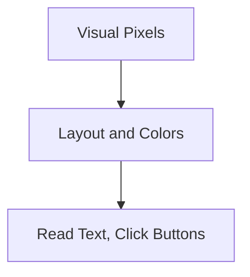

**What traditional scrapers see:**

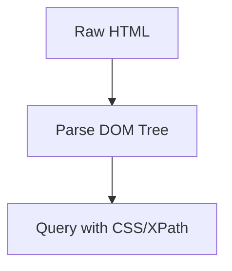

**What AI agents see via Playwright:**

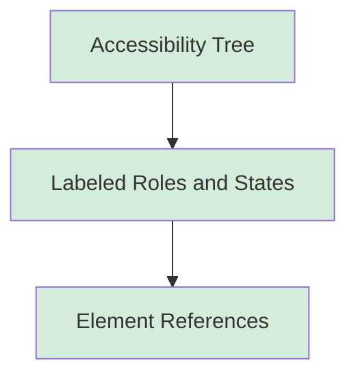

## The Accessibility Tree: How AI Agents See Web Pages

The accessibility tree is the single most important concept for understanding how AI agents interact with browsers through Playwright. When an AI agent needs to observe a page, it does not receive a screenshot or a dump of raw HTML. It receives a structured YAML representation of every interactive and semantic element on the page.

Here is what Playwright returns when you capture the accessibility snapshot of a real form page:

```python
from playwright.sync_api import sync_playwright

with sync_playwright() as p:
    browser = p.chromium.launch(headless=True)
    page = browser.new_page()

    page.goto("https://httpbin.org/forms/post")
    page.wait_for_load_state("domcontentloaded")

    # Capture what an AI agent sees
    snapshot = page.locator("body").aria_snapshot()
    print(snapshot)

    browser.close()
```

The output is a YAML-like tree:

```yaml
- paragraph:
    - text: "Customer name:"
    - textbox "Customer name:"
- paragraph:
    - text: "Telephone:"
    - textbox "Telephone:"
- paragraph:
    - text: "E-mail address:"
    - textbox "E-mail address:"
- group "Pizza Size":
    - text: Pizza Size
    - paragraph:
        - radio "Small"
        - text: Small
    - paragraph:
        - radio "Medium"
        - text: Medium
    - paragraph:
        - radio "Large"
        - text: Large
- group "Pizza Toppings":
    - text: Pizza Toppings
    - paragraph:
        - checkbox "Bacon"
        - text: Bacon
    - paragraph:
        - checkbox "Onion"
        - text: Onion
```

Compare this to the raw HTML of the same page. The accessibility tree strips away layout noise, style attributes, and structural boilerplate. What remains is a clean representation of every element the user can interact with, along with its role (textbox, radio, checkbox, button) and its accessible name. An LLM can read this snapshot and immediately understand what actions are possible without any HTML parsing. Combined with [stealth browser techniques](/posts/stealth-browsers-in-2026-camoufox-nodriver-and-the-anti-detection-arms-race/), this makes Playwright a powerful foundation for agents that need to operate on detection-sensitive sites.

After the agent fills in the form fields, the snapshot updates to reflect the new state:

```yaml
- paragraph:
    - text: "Customer name:"
    - textbox "Customer name:": AI Agent Test
- paragraph:
    - text: "Telephone:"
    - textbox "Telephone:": 555-0100
- group "Pizza Size":
    - text: Pizza Size
    - paragraph:
        - radio "Large" [checked]
        - text: Large
- group "Pizza Toppings":
    - paragraph:
        - checkbox "Bacon" [checked]
        - text: Bacon
    - paragraph:
        - checkbox "Onion" [checked]
        - text: Onion
```

The `[checked]` attributes confirm that the agent's actions took effect. This observe-act-observe loop, powered by accessibility snapshots, is the foundation of every major browser agent framework.

## The Observe-Decide-Act Loop

Every AI browser agent, regardless of the framework, follows the same core pattern. The agent observes the page state through an accessibility snapshot, sends that state to an LLM which decides what to do next, executes the chosen action through Playwright, and then observes the new state to confirm the result.

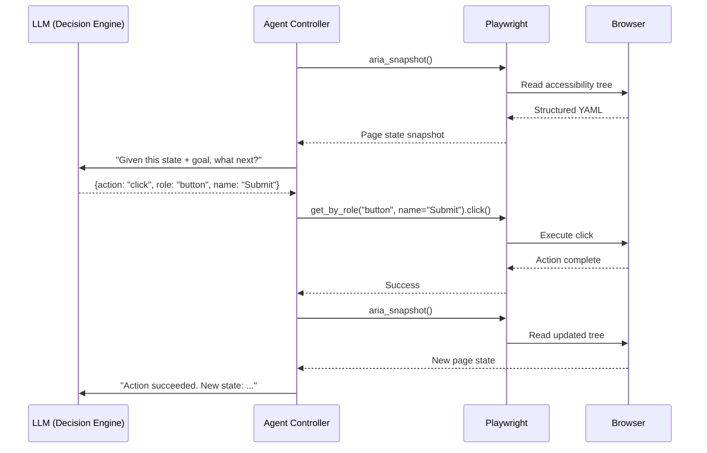

Here is a working implementation of this loop. The `decide_next_action` function simulates what an LLM does in production -- it reads the page state and returns a structured action. In a real system, this function would call an LLM API with the accessibility snapshot and the goal as context.

```python
import json
from playwright.sync_api import sync_playwright


def decide_next_action(snapshot: str, goal: str, history: list) -> dict:
    """
    Simulate LLM decision-making. In production, this calls an LLM API:

    response = client.chat.completions.create(
        model="gpt-4o",
        messages=[
            {"role": "system", "content": "You are a browser automation agent."},
            {"role": "user", "content": f"Goal: {goal}\nPage state:\n{snapshot}\n"
                                        f"History: {history}\nWhat action next?"}
        ],
        tools=BROWSER_TOOLS,
    )
    """
    step = len(history)

    if step == 0:
        return {
            "action": "navigate",
            "url": "https://news.ycombinator.com",
            "reasoning": "Navigate to target site to begin extraction",
        }
    elif step == 1:
        return {
            "action": "extract",
            "selector": ".titleline > a",
            "reasoning": "Page loaded. Extract story titles from front page",
        }
    elif step == 2:
        return {
            "action": "click",
            "selector": "a.morelink",
            "reasoning": "Click More to get additional stories",
        }
    elif step == 3:
        return {
            "action": "extract",
            "selector": ".titleline > a",
            "reasoning": "Extract stories from second page",
        }
    else:
        return {"action": "done", "reasoning": "Goal complete."}


def execute_action(page, action: dict) -> str:
    if action["action"] == "navigate":
        page.goto(action["url"], wait_until="domcontentloaded")
        snapshot = page.locator("body").aria_snapshot()
        return f"Navigated. Page has {len(snapshot.splitlines())} elements."

    elif action["action"] == "extract":
        elements = page.query_selector_all(action["selector"])
        return json.dumps([el.inner_text() for el in elements[:10]], indent=2)

    elif action["action"] == "click":
        page.click(action["selector"])
        page.wait_for_load_state("domcontentloaded")
        return "Clicked successfully."

    elif action["action"] == "done":
        return "Task complete."

    return "Unknown action."


def run_agent():
    goal = "Collect story titles from the first two pages of Hacker News"

    with sync_playwright() as p:
        browser = p.chromium.launch(headless=True)
        page = browser.new_page()
        history = []

        for step in range(10):  # Safety limit
            if page.url != "about:blank":
                snapshot = page.locator("body").aria_snapshot()
            else:
                snapshot = "(blank page)"

            action = decide_next_action(snapshot, goal, history)
            print(f"Step {step + 1}: {action['action'].upper()}")
            print(f"  Reasoning: {action['reasoning']}")

            result = execute_action(page, action)
            print(f"  Result: {result[:150]}")

            history.append({"action": action, "result": result})
            if action["action"] == "done":
                break

        browser.close()
        print(f"\nCompleted in {len(history)} steps.")


if __name__ == "__main__":
    run_agent()
```

```
Step 1: NAVIGATE
  Reasoning: Navigate to target site to begin extraction
  Result: Navigated. Page has 879 elements.

Step 2: EXTRACT
  Reasoning: Page loaded. Extract story titles from front page
  Result: ["Story Title 1", "Story Title 2", ...]

Step 3: CLICK
  Reasoning: Click More to get additional stories
  Result: Clicked successfully.

Step 4: EXTRACT
  Reasoning: Extract stories from second page
  Result: ["Story Title 31", "Story Title 32", ...]

Step 5: DONE
  Reasoning: Goal complete.
  Result: Task complete.

Completed in 5 steps.
```


<figure>
  
  <figcaption>The accessibility tree gives AI agents a structured view of the page — no HTML parsing needed. <span class="img-credit">Photo by ThisIsEngineering / <a href="https://www.pexels.com" target="_blank" rel="noopener noreferrer">Pexels</a></span></figcaption>
</figure>

## Defining Browser Tools for LLM Function Calling

In production AI agents, the LLM does not call Playwright functions directly. Instead, you define a set of browser tools that the LLM can invoke through function calling (also called tool use). This is the same [structured output pattern](/posts/schema-driven-scraping-llms-pydantic-zod-structured-output/) used in [LLM-powered data extraction](/posts/llm-powered-data-extraction-schema-driven-scraping-with-structured-output/), where the model returns typed, validated responses. Each tool maps to a specific Playwright operation, and the agent controller translates the LLM's tool calls into browser actions. For a deeper look at how LLMs handle [structured data extraction from HTML](/posts/best-llm-structured-data-extraction-html-2026/), see our dedicated comparison.

```python
import json
from playwright.sync_api import sync_playwright

# Tool definitions following the standard function calling schema
# used by OpenAI, Anthropic, and other LLM providers
BROWSER_TOOLS = [
    {
        "name": "browser_navigate",
        "description": "Navigate the browser to a URL",
        "parameters": {
            "type": "object",
            "properties": {
                "url": {"type": "string", "description": "The URL to navigate to"}
            },
            "required": ["url"],
        },
    },
    {
        "name": "browser_snapshot",
        "description": (
            "Capture the accessibility tree of the current page. Returns a "
            "structured YAML with roles, names, and states of all elements."
        ),
        "parameters": {"type": "object", "properties": {}},
    },
    {
        "name": "browser_click",
        "description": "Click an element by its accessible role and name",
        "parameters": {
            "type": "object",
            "properties": {
                "role": {"type": "string", "description": "ARIA role"},
                "name": {"type": "string", "description": "Accessible name"},
            },
            "required": ["role", "name"],
        },
    },
    {
        "name": "browser_type",
        "description": "Type text into an input field by its accessible name",
        "parameters": {
            "type": "object",
            "properties": {
                "name": {"type": "string", "description": "Field label"},
                "text": {"type": "string", "description": "Text to type"},
            },
            "required": ["name", "text"],
        },
    },
]


def execute_tool(page, tool_name: str, args: dict) -> str:
    if tool_name == "browser_navigate":
        page.goto(args["url"], wait_until="domcontentloaded")
        return f"Navigated to {args['url']}. Title: {page.title()}"

    elif tool_name == "browser_snapshot":
        return page.locator("body").aria_snapshot()

    elif tool_name == "browser_click":
        page.get_by_role(args["role"], name=args["name"]).click()
        page.wait_for_load_state("domcontentloaded")
        return f"Clicked {args['role']} '{args['name']}'"

    elif tool_name == "browser_type":
        page.get_by_label(args["name"]).fill(args["text"])
        return f"Typed into '{args['name']}'"

    return f"Unknown tool: {tool_name}"


# Simulated sequence of LLM tool calls for a form-filling task
tool_calls = [
    ("browser_navigate", {"url": "https://httpbin.org/forms/post"}),
    ("browser_snapshot", {}),
    ("browser_type", {"name": "Customer name", "text": "AI Agent"}),
    ("browser_type", {"name": "Telephone", "text": "555-0199"}),
    ("browser_type", {"name": "E-mail address", "text": "ai@test.com"}),
    ("browser_snapshot", {}),
]

with sync_playwright() as p:
    browser = p.chromium.launch(headless=True)
    page = browser.new_page()

    for tool_name, args in tool_calls:
        print(f"LLM calls: {tool_name}({json.dumps(args)})")
        result = execute_tool(page, tool_name, args)
        preview = result[:120].replace("\n", " | ")
        print(f"  -> {preview}\n")

    browser.close()
```

This pattern -- tool definitions, an execution layer, and structured results flowing back to the LLM -- is exactly what frameworks like Browser Use, Stagehand, and the Playwright MCP server implement at scale.

## The Three Integration Paths: MCP, CLI, and Test Agents

Microsoft now provides three distinct ways to connect Playwright to AI agents, each designed for a different use case.

**Playwright MCP Server** -- ~114K tokens/task, best for coding agents (Claude Code, Copilot, Cursor):

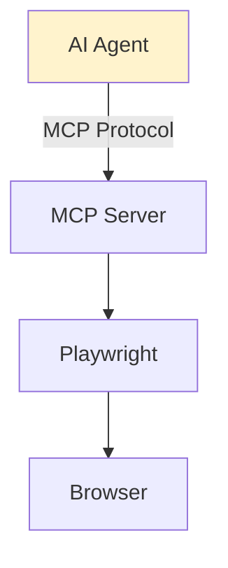

**Playwright CLI** -- ~27K tokens/task, best for long multi-step workflows:

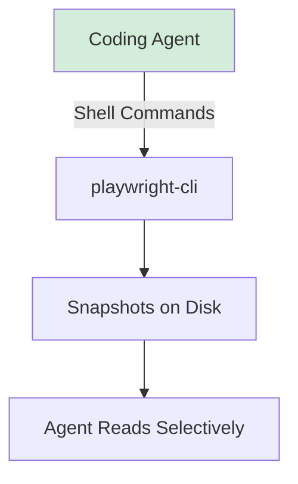

**Playwright Test Agents** -- built-in to v1.56+, best for test generation and maintenance:

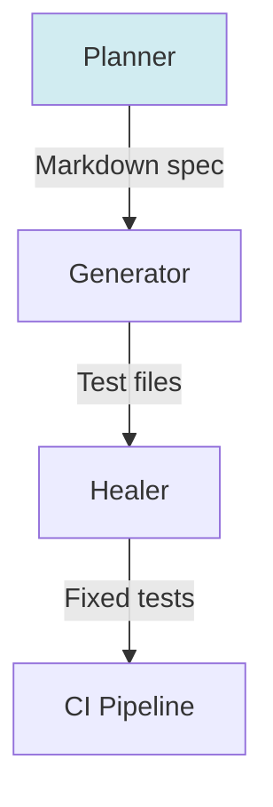

### Path 1: Playwright MCP Server

The Model Context Protocol server is the most widely adopted integration path. It runs as a standalone process that any MCP-compatible AI agent connects to, exposing 15+ browser automation tools through a standardized protocol. The agent sends tool calls like `browser_navigate` or `browser_click`, and the MCP server translates them into Playwright operations.

Setup for Claude Code (see also [how AI file agents like Claude use MCP for automation](/posts/ai-file-agents-claude-cowork-and-the-new-automation-frontier/)):

```bash
claude mcp add playwright -- npx @playwright/mcp@latest
```

Setup for Cursor or other MCP-compatible tools:

```json
{
  "mcpServers": {
    "playwright": {
      "command": "npx",
      "args": ["@playwright/mcp@latest"]
    }
  }
}
```

The MCP server operates in two modes. Snapshot mode (the default) uses the accessibility tree and is entirely text-based. Vision mode switches to screenshots and coordinate-based interactions, useful when the accessibility tree is inadequate.

The key limitation is token consumption. The MCP server streams the full accessibility snapshot after every action, which accumulates in the LLM's context window. A typical task consumes around 114,000 tokens. For a login page alone, the snapshot can run to 3,800 tokens.

### Path 2: Playwright CLI

The CLI was designed specifically for token efficiency. Instead of streaming snapshots into the LLM's context, it saves them as YAML files to disk. The agent sees a one-line file path and decides whether to read the snapshot or not.

```bash
# Install
npm install -g @playwright/cli@latest

# Take an accessibility snapshot -- saved to disk, not inline
playwright-cli snapshot https://example.com

# Click an element using its reference from the snapshot
playwright-cli click e21

# Take a screenshot -- saved to disk
playwright-cli screenshot
```

The benchmark results are significant: 27,000 tokens per task with CLI versus 114,000 with MCP. That 4x reduction comes from the fact that snapshots never enter the context window unless the agent explicitly reads them. For long workflows exceeding 15 steps, MCP's context window begins to degrade as accumulated snapshots crowd out useful history. CLI maintains a flat context across 50+ steps.

Use CLI when your agent has filesystem access and shell execution capability. This is the case for all major coding agents.

### Path 3: Playwright Test Agents

Released with Playwright 1.56 in October 2025, test agents represent a fundamentally different use of AI in the Playwright ecosystem. Rather than giving an LLM direct browser control, test agents decompose the testing workflow into three specialized roles.

The **Planner** explores your application and produces a Markdown test plan:

```bash
npx playwright init-agents --loop=claude
```

This creates a project structure:

```
repo/
  .github/             # agent definitions
  specs/               # human-readable test plans
    basic-operations.md
  tests/               # generated tests
    seed.spec.ts       # environment setup
  playwright.config.ts
```

The **Generator** transforms the Markdown plan into executable Playwright test files. It communicates with the live application to verify selectors and build reliable locators.

The **Healer** executes the generated test suite and automatically repairs failing tests. It inspects the current UI, finds substitute selectors when elements change, adjusts waits, and updates flows when application behavior differs from the plan.

These three agents can run independently or in a continuous loop: plan, generate, run, heal, repeat. The shift is from writing test code to describing test intent.

## Async Execution and Concurrent Page Management

AI agents often need to interact with multiple pages or tabs simultaneously. A research agent might check several sources in parallel. A monitoring agent might track multiple dashboards. Playwright's async API handles this naturally.

```python
import asyncio
from playwright.async_api import async_playwright


async def extract_from_page(context, url, label):
    """Extract the page title and accessibility tree size from a URL."""
    page = await context.new_page()
    await page.goto(url, wait_until="domcontentloaded")
    title = await page.title()

    snapshot = await page.locator("body").aria_snapshot()
    line_count = len(snapshot.splitlines())

    await page.close()
    return {"label": label, "title": title, "snapshot_lines": line_count}


async def main():
    async with async_playwright() as p:
        browser = await p.chromium.launch(headless=True)
        context = await browser.new_context()

        targets = [
            ("https://example.com", "Example"),
            ("https://httpbin.org/html", "HTTPBin"),
            ("https://news.ycombinator.com", "Hacker News"),
        ]

        # All three pages load and extract concurrently
        tasks = [
            extract_from_page(context, url, label)
            for url, label in targets
        ]
        results = await asyncio.gather(*tasks)

        for r in results:
            print(f"[{r['label']}] {r['title']} "
                  f"({r['snapshot_lines']} accessible elements)")

        await browser.close()


asyncio.run(main())
```

```
[Example] Example Domain (5 accessible elements)
[HTTPBin] Herman Melville - Moby Dick (2 accessible elements)
[Hacker News] Hacker News (879 accessible elements)
```

The difference in accessibility tree size is instructive. A simple page like example.com produces 5 lines. A content-rich page like Hacker News produces 879. An LLM processing these snapshots pays per token, so the token cost of observing a page scales directly with page complexity.

## Form Interaction: The Complete Agent Workflow

Form filling is one of the most common tasks for AI browser agents and is covered in depth in our [complete guide to automating web form filling](/posts/how-to-automate-web-form-filling-complete-guide/). It demonstrates the full observe-act-observe cycle and shows how accessibility-friendly locators eliminate the fragile CSS selectors that break traditional scrapers.

```python
from playwright.sync_api import sync_playwright

with sync_playwright() as p:
    browser = p.chromium.launch(headless=True)
    page = browser.new_page()
    page.goto("https://httpbin.org/forms/post")
    page.wait_for_load_state("domcontentloaded")

    # Step 1: Observe -- the agent reads the accessibility tree
    # and understands what fields exist and what they expect
    snapshot = page.locator("body").aria_snapshot()

    # Step 2: Act -- fill fields using accessibility-friendly locators
    # These match by label text, not fragile CSS selectors
    page.get_by_label("Customer name").fill("AI Agent Test")
    page.get_by_label("Telephone").fill("555-0100")
    page.get_by_label("E-mail address").fill("agent@example.com")
    page.get_by_label("Large").check()
    page.get_by_label("Bacon").check()
    page.get_by_label("Onion").check()
    page.get_by_label("Delivery instructions").fill("Ring the doorbell twice")

    # Step 3: Observe again -- confirm fields are filled
    filled_snapshot = page.locator("form").aria_snapshot()
    # The snapshot now shows values like:
    #   textbox "Customer name:": AI Agent Test
    #   radio "Large" [checked]
    #   checkbox "Bacon" [checked]

    # Step 4: Act -- submit
    page.get_by_role("button", name="Submit order").click()
    page.wait_for_load_state("domcontentloaded")

    # Step 5: Observe -- verify the result
    result = page.locator("body").inner_text()
    print(result[:300])

    browser.close()
```

```json
{
  "form": {
    "comments": "Ring the doorbell twice",
    "custemail": "agent@example.com",
    "custname": "AI Agent Test",
    "custtel": "555-0100",
    "size": "large",
    "topping": ["bacon", "onion"]
  }
}
```

Notice that `get_by_label`, `get_by_role`, and the accessibility snapshot all use the same semantic vocabulary. The LLM reads the snapshot, sees `textbox "Customer name:"`, and knows to call `browser_type` with `name="Customer name"`. There is no translation layer between what the agent sees and what it can do. This is by design.


<figure>
  
  <figcaption>Browser Use moved from CDP to Playwright's API after hitting screenshot crashes and dialog handling bugs. <span class="img-credit">Photo by Daniil Komov / <a href="https://www.pexels.com" target="_blank" rel="noopener noreferrer">Pexels</a></span></figcaption>
</figure>

## The CDP Question: Why Browser Use Left Playwright

In early 2026, Browser Use -- the most popular open-source AI browser agent framework -- announced it was dropping Playwright entirely and moving to direct Chrome DevTools Protocol (CDP) communication. The reasons illuminate the real limitations of using Playwright as an AI agent's browser layer.

The core issue was Playwright's client-server architecture. Playwright routes all browser communication through a Node.js relay server. For testing, this extra hop is invisible. But for AI agents executing thousands of CDP calls per task -- checking element positions, opacity, paint order, event listeners -- the relay introduced measurable latency on every call.

State drift was the second problem. The double RPC layer between the Python client, Node.js relay, and browser created synchronization edge cases. In certain failure modes, the relay would hang indefinitely waiting for browser responses while the Python client needed to send expected CDP calls. Recovery required killing the process entirely.

Specific failure modes included full-page screenshots over 16,000 pixels reliably crashing Playwright, alert and confirm dialog handling failing without proper page focus, inadequate cross-origin iframe support, and scattered crash detection logic that could not be centralized.

By switching to [raw CDP](/posts/nodriver-complete-guide-undetected-browser-automation-python/), Browser Use reported significant speed improvements in element extraction, screenshots, and all default actions. The performance gap between Playwright's relay model and direct protocol access mirrors the [differences between Selenium and Puppeteer](/posts/selenium-vs-puppeteer-definitive-comparison-web-scraping/) at the architectural level. They also gained event-driven architecture for monitoring browser crashes and downloads, and proper support for cross-origin iframes through CDP's target and frame routing.

**Playwright architecture:**

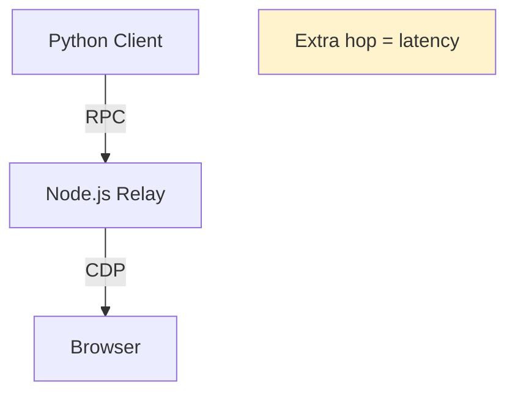

**Direct CDP architecture:**

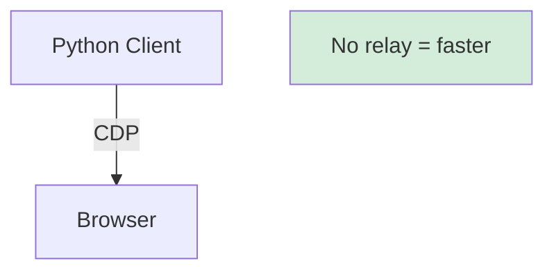

This does not mean Playwright is the wrong choice for AI agents. It means that at Browser Use's scale -- running thousands of agent tasks per day with complex multi-step workflows -- the abstraction layer's overhead became significant enough to justify building a custom CDP client. For most teams, Playwright's stability, documentation, and ecosystem make it the practical choice. The CDP path makes sense only when you have hit Playwright's ceiling and have the engineering capacity to maintain a protocol-level integration.

## Token Economics and the Real Cost of Browser Observation

Every time an AI agent observes a page through Playwright, it pays in tokens. The accessibility snapshot of a login page runs around 3,800 tokens. A content-rich news page can exceed 4,000 tokens per snapshot. The tool schema overhead for browser tools adds another 4,200 tokens.

These numbers accumulate fast. In a typical MCP workflow where the agent snapshots after every action, a 10-step task generates roughly 114,000 tokens. With the CLI approach saving snapshots to disk and letting the agent choose when to read them, the same task drops to 27,000 tokens.

| Approach | Tokens per task | Context window impact | Best for |
|----------|----------------|-----------------------|----------|
| MCP (snapshot mode) | ~114,000 | Degrades after ~15 steps | Short tasks, coding agents |
| MCP (vision mode) | ~150,000+ | Degrades faster (image tokens) | Pages with poor accessibility |
| CLI | ~27,000 | Flat across 50+ steps | Long workflows, budget-conscious |
| Direct Playwright | Varies | Developer-controlled | Custom agent implementations |

The choice between these approaches is not just about cost. It is about context window management. An LLM's reasoning quality degrades as its context fills up. If 80% of the context is accumulated page snapshots from 15 prior actions, the LLM has less room for reasoning about the current state and the overall goal. The CLI approach avoids this by keeping snapshots out of the context entirely.

## The Ecosystem Map

The Playwright AI ecosystem in 2026 has grown beyond Microsoft's official tools into a landscape of frameworks, each choosing different points on the control-versus-autonomy spectrum.

**Official Microsoft integrations:**

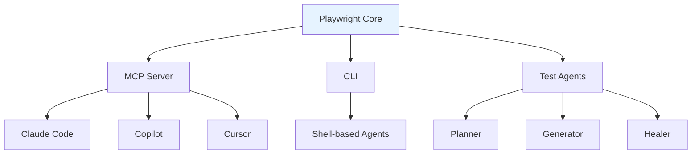

**Third-party frameworks built on Playwright:**

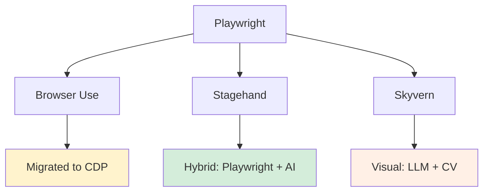

**Official Microsoft tools:** MCP, CLI, and Test Agents cover the three main use cases -- coding agent integration, token-efficient automation, and test generation.

**Browser Use** started on Playwright but migrated to direct CDP in 2026 for performance-critical AI agent workloads. It remains the highest-performing framework on the WebVoyager benchmark at 89.1%. Tools like [Crawl4AI](/posts/crawl4ai-v08-crash-recovery-prefetch-mode-and-whats-new/) are also expanding the ecosystem with crash recovery and prefetch capabilities.

**Stagehand** extends Playwright with `act()`, `observe()`, and `extract()` AI primitives while keeping deterministic Playwright code for stable parts of the workflow. Its hybrid approach means approximately 85% of generated code is standard Playwright.

**Skyvern** uses Playwright for page rendering but adds computer vision on top, making it strong for form-heavy tasks where visual layout matters more than DOM structure.

## What Still Does Not Work

AI browser automation through Playwright has real limitations that no framework has fully solved. Many of these are [unsolved problems of AI web scraping](/posts/the-unsolved-problems-of-ai-web-scraping-in-2026/) that persist across every tool in the space.

**Business logic verification.** An AI agent can fill a form and submit it, but it cannot determine whether the returned insurance quote is correct. It cannot validate that a displayed price matches the backend calculation. The agent can observe and act, but it cannot reason about domain-specific correctness without human-defined rules.

**Complex stateful flows.** Multi-step onboarding, authentication chains, and flows that depend on backend state continue to break automated reasoning. The agent sees the current page but has limited visibility into server-side state changes.

**Test explosion.** As AI-powered test generation accelerates, teams discover a governance problem. Which tests belong in CI? Which are redundant? How do you prevent the agent from generating hundreds of tests that provide diminishing coverage?

**Architectural drift.** Without guardrails, AI agents introduce inconsistent patterns -- mixed locator strategies, different waiting approaches, redundant assertions. The automation works, but it becomes unmaintainable.

**Hallucination in debugging.** When a test fails, AI agents can provide confident but incorrect root-cause explanations. A flaky test might be attributed to a network issue when the real cause is a race condition. Human review gates remain essential.

## Where This Is Going

The trajectory is clear, and initiatives like [Google Chrome's Auto Browse](/posts/google-chrome-auto-browse-what-it-means-for-web-scraping/) suggest that browser vendors themselves are moving in the same direction. Playwright is evolving from a browser automation library into an AI agent interface layer. The accessibility tree is becoming the primary representation that AI systems use to understand web pages. Tool-based interaction through MCP and CLI is replacing programmatic Playwright scripting for agent use cases.

For teams building AI-powered browser automation today:

- Start with Playwright MCP for short tasks and prototype workflows
- Move to CLI for production workloads where token costs matter
- Use test agents for automated test generation and maintenance
- Consider direct CDP only when you have measurably outgrown Playwright's abstraction layer

Playwright sits at the center of the AI browser automation ecosystem for good reason. The teams building reliable agents are the ones who understand the accessibility tree and tool definitions underneath — not just the API surface.
