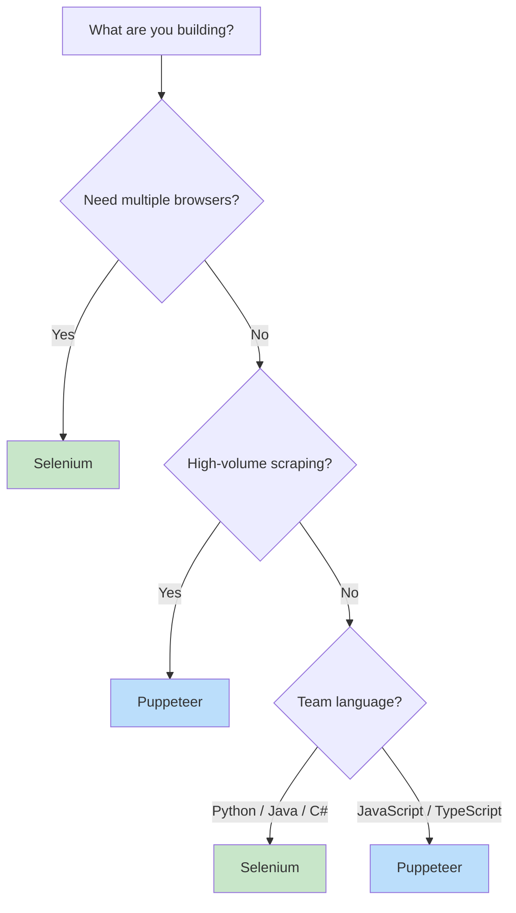
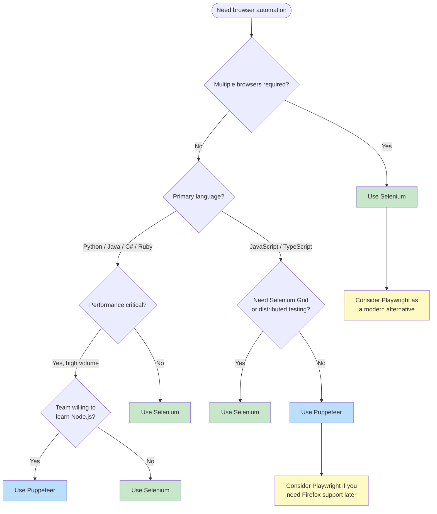

You have a browser automation task in front of you, and you need to pick a tool. Puppeteer and Selenium are two of the most established options, and the internet is full of feature-by-feature comparisons between them. ([For deep technical benchmarks, see our definitive comparison](/posts/selenium-vs-puppeteer-definitive-comparison-web-scraping/).) But feature lists do not make decisions for you. What actually matters is your specific situation: what you are building, who is building it, and what trade-offs you can live with. This guide is designed to help you make that call.

## What Are You Building?

The single most important factor in choosing between Puppeteer and Selenium is the nature of your project. These tools evolved from different origins, and those origins still shape where each one excels.

- **Web scraping at scale** -- If you are extracting data from thousands of pages, speed and resource efficiency dominate your concerns. Puppeteer communicates with Chrome over the DevTools Protocol (CDP), a direct binary WebSocket connection with no HTTP overhead. This gives it a measurable speed advantage for high-throughput scraping pipelines.

- **Cross-browser testing** -- If your job is verifying that a web application works correctly on Chrome, Firefox, Safari, and Edge, Selenium is the natural choice. Its WebDriver protocol is a W3C standard implemented by every major browser vendor. Puppeteer is primarily a Chrome and Chromium tool. Firefox support exists experimentally, but it is not production-ready.

- **General browser automation** -- [Filling forms](/posts/how-to-automate-web-form-filling-complete-guide/), clicking through workflows, taking screenshots, generating PDFs. Both tools handle these well. The deciding factor here is usually your team's language and existing stack.

- **End-to-end testing for a web app** -- Selenium has a deeper history in QA and testing. It integrates with test runners across multiple languages and has mature patterns for test organization. Puppeteer works for testing too, but its ecosystem is more scraping-oriented.



## Team and Language Considerations

Selenium supports Python, Java, JavaScript, C#, Ruby, and Kotlin through official bindings. If your team already works in Python or Java, Selenium lets everyone use a language they know. There is no context-switching cost.

Puppeteer is a Node.js library. It is JavaScript (or TypeScript) only. If your automation engineers are comfortable with async/await patterns in Node.js, Puppeteer will feel natural. If they are not, the learning curve extends beyond the API to async patterns, the Node.js ecosystem, and callback-driven debugging.

This is not a minor consideration. A tool your team can maintain confidently is worth more than a tool that benchmarks 20% faster but requires hiring new expertise or retraining.

### Language ecosystem overlap

There is another practical angle here. If your scraping pipeline already uses Node.js for other tasks -- maybe you parse JSON APIs, run a web server, or use other npm packages -- then Puppeteer fits into that ecosystem without adding a new runtime. Similarly, if your infrastructure is built around Python (using [requests, BeautifulSoup, pandas](/posts/python-requests-vs-selenium-speed-performance-comparison/) for data processing), Selenium slots in without friction.

## The Speed Question

Puppeteer is faster than Selenium. This is well-documented and stems from a fundamental architectural difference.

Selenium sends commands over HTTP to a WebDriver server (like ChromeDriver), which then translates those commands into browser actions. Each command is a separate HTTP request-response cycle. Puppeteer sends commands over a WebSocket connection using the Chrome DevTools Protocol, which is persistent and bidirectional. There is no per-command HTTP overhead.

In practice, what does this mean?

- **High-volume scraping (thousands of pages per hour):** The speed difference is significant. Puppeteer can navigate, extract, and move on faster. When you multiply a 50-100ms per-command advantage across millions of operations, you save hours.

- **Interactive automation (filling a form, clicking a few buttons):** The speed difference is negligible. If your script visits 10 pages and performs 30 actions total, saving 50ms per action gains you 1.5 seconds. That does not justify choosing a tool your team is less comfortable with.

- **Parallel execution:** Both tools support running multiple browser instances in parallel. But Puppeteer's lighter resource footprint per instance means you can often run more concurrent browsers on the same hardware.

The takeaway: speed matters when volume is high. For low-volume or occasional automation, pick the tool that is easier for your team to work with.

## The Flexibility Question

Selenium's multi-browser support is its strongest differentiator. Through the WebDriver protocol, you can automate Chrome, Firefox, Safari, Edge, and even Internet Explorer (for those still maintaining legacy systems).

When does this matter?

- **QA and cross-browser testing:** You absolutely need multiple browsers. A bug that appears only in Safari will not show up in Chrome-only testing. Selenium is the right tool here.
- **Enterprise environments with browser mandates:** Some organizations require support for specific browsers. Selenium accommodates this.

When does it not matter?

- **Web scraping:** Websites render the same data regardless of which browser requests it. Running Chrome or Chromium is sufficient for virtually all scraping tasks. Puppeteer's Chrome-only focus is not a limitation here -- it is a simplification.
- **Internal tool automation:** If you are automating your own internal web application and everyone uses Chrome, multi-browser support is overhead you do not need.

## Code Comparison: Login, Navigate, Extract

Here is the same realistic task implemented in both tools: log into a site, navigate to a dashboard page, and extract data from a table. This shows how the day-to-day developer experience differs.

### Puppeteer (JavaScript)

```javascript
const puppeteer = require('puppeteer');

(async () => {
  const browser = await puppeteer.launch({ headless: true });
  const page = await browser.newPage();

  // Navigate to login page
  await page.goto('https://example.com/login', {
    waitUntil: 'networkidle2',
  });

  // Fill in credentials and submit
  await page.type('#username', 'demo_user');
  await page.type('#password', 'demo_pass');
  await page.click('#login-button');

  // Wait for navigation to dashboard
  await page.waitForNavigation({ waitUntil: 'networkidle2' });

  // Navigate to the data page
  await page.goto('https://example.com/dashboard/reports', {
    waitUntil: 'networkidle2',
  });

  // Wait for the table to render
  await page.waitForSelector('table.report-data tbody tr');

  // Extract table rows
  const data = await page.evaluate(() => {
    const rows = document.querySelectorAll('table.report-data tbody tr');
    return Array.from(rows).map(row => {
      const cells = row.querySelectorAll('td');
      return {
        name: cells[0]?.textContent.trim(),
        value: cells[1]?.textContent.trim(),
        date: cells[2]?.textContent.trim(),
      };
    });
  });

  console.log(`Extracted ${data.length} rows`);
  console.log(data);

  await browser.close();
})();
```

### Selenium (Python)

```python
from selenium import webdriver
from selenium.webdriver.common.by import By
from selenium.webdriver.support.ui import WebDriverWait
from selenium.webdriver.support import expected_conditions as EC

driver = webdriver.Chrome()

try:
    # Navigate to login page
    driver.get("https://example.com/login")

    # Wait for and fill in credentials
    wait = WebDriverWait(driver, 10)
    username_field = wait.until(
        EC.presence_of_element_located((By.ID, "username"))
    )
    username_field.send_keys("demo_user")
    driver.find_element(By.ID, "password").send_keys("demo_pass")
    driver.find_element(By.ID, "login-button").click()

    # Wait for navigation to dashboard
    wait.until(EC.url_contains("/dashboard"))

    # Navigate to the data page
    driver.get("https://example.com/dashboard/reports")

    # Wait for the table to render
    wait.until(
        EC.presence_of_all_elements_located(
            (By.CSS_SELECTOR, "table.report-data tbody tr")
        )
    )

    # Extract table rows
    rows = driver.find_elements(By.CSS_SELECTOR, "table.report-data tbody tr")
    data = []
    for row in rows:
        cells = row.find_elements(By.TAG_NAME, "td")
        data.append({
            "name": cells[0].text.strip(),
            "value": cells[1].text.strip(),
            "date": cells[2].text.strip(),
        })

    print(f"Extracted {len(data)} rows")
    for entry in data:
        print(entry)

finally:
    driver.quit()
```

### What to notice

Both accomplish the same thing. The structural differences worth paying attention to:

- **Waiting patterns:** Puppeteer uses `waitForNavigation` and `waitForSelector` as part of its navigation flow. Selenium uses explicit `WebDriverWait` with expected conditions. Both are effective, but Selenium's approach is more verbose.
- **Data extraction:** Puppeteer's `page.evaluate()` runs JavaScript directly in the browser context, giving you full access to the DOM API. Selenium extracts element properties through its WebDriver bindings, which means each property access is a separate command across the wire.
- **Resource cleanup:** Both require explicit cleanup. Puppeteer uses `browser.close()`. Selenium uses `driver.quit()`. In Selenium, forgetting `quit()` can leave orphaned ChromeDriver processes.

## Community and Hiring

Selenium has been around since 2004. That two-decade head start means:

- **More StackOverflow answers:** As of 2026, Selenium-related questions on StackOverflow outnumber Puppeteer-related ones by roughly 10 to 1.
- **More tutorials and courses:** Selenium is part of the standard QA curriculum. Most testing bootcamps and certification programs teach it.
- **Larger hiring pool:** If you are building a team, finding developers with Selenium experience is significantly easier than finding Puppeteer specialists.

Puppeteer, released in 2017, has a smaller but highly active community. The Node.js and JavaScript ecosystems move fast, and Puppeteer's documentation is excellent. The learning resources that exist tend to be more modern and better maintained than some of the older Selenium tutorials that reference deprecated APIs.

For an individual developer or a small team, community size matters less -- good documentation and a responsive GitHub issues page are enough. For a large organization hiring across multiple roles, Selenium's larger talent pool is a real advantage.


<figure>
  
  <figcaption>Puppeteer talks directly to Chrome over CDP — Selenium routes through WebDriver, adding overhead. <span class="img-credit">Photo by Bibek ghosh / <a href="https://www.pexels.com" target="_blank" rel="noopener noreferrer">Pexels</a></span></figcaption>
</figure>

## The Maintenance Burden

This is where Puppeteer has a clear, unambiguous advantage for most use cases.

### Puppeteer: Batteries included

When you install Puppeteer via npm, it downloads a compatible version of Chromium automatically. The library and the browser are versioned together. You run `npm install puppeteer`, and everything works. When you update Puppeteer, you get a matching Chromium version. There is no version mismatch to debug.

```javascript
// This is all you need. Chromium is bundled.
const puppeteer = require('puppeteer');
const browser = await puppeteer.launch();
```

If you want to use your own Chrome installation instead of the bundled Chromium, Puppeteer supports that too via `puppeteer-core`. But the default path is zero-configuration.

### Selenium: Assembly required

Selenium requires a separate browser driver binary (ChromeDriver for Chrome, GeckoDriver for Firefox, etc.) that must match your installed browser version. When Chrome auto-updates -- which it does frequently -- your ChromeDriver can suddenly stop working.

Selenium 4.6+ introduced Selenium Manager, which handles driver downloads automatically and has improved this situation considerably. But the underlying complexity remains. You are managing compatibility between three moving pieces: Selenium, the browser driver, and the browser itself.

```python
# Modern Selenium with Selenium Manager (auto-downloads driver)
from selenium import webdriver

driver = webdriver.Chrome()  # Selenium Manager handles ChromeDriver

# But you may still encounter version mismatches
# if Chrome updates between test runs
```

In CI/CD pipelines and Docker containers, this driver management historically caused significant friction. Puppeteer's bundled approach avoids the problem entirely.

## Decision Flowchart

Use this flowchart to walk through the decision based on your actual requirements.



## Quick Answer Summary

If feature-by-feature tables are what you need, here is the condensed version.

| If you need... | Use... | Why |
|---|---|---|
| **Cross-browser testing** | Selenium | Only tool with true multi-browser WebDriver support |
| **High-volume web scraping** | Puppeteer | CDP protocol is faster, lower overhead per page |
| **Python or Java automation** | Selenium | Native bindings in your language, no runtime switching |
| **JavaScript/Node.js project** | Puppeteer | Native fit, same ecosystem, async-first design |
| **Zero-config browser setup** | Puppeteer | Bundles Chromium, no driver management needed |
| **Large QA team hiring** | Selenium | Much larger talent pool and training resources |
| **CI/CD pipeline simplicity** | Puppeteer | No browser-driver version mismatches to debug |
| **Distributed test execution** | Selenium | Selenium Grid is mature and battle-tested |
| **Chrome-only scraping tasks** | Puppeteer | Designed specifically for Chrome, nothing wasted |
| **Legacy browser support** | Selenium | Still supports older browsers including IE |

## The Playwright Factor

No honest comparison of Puppeteer and Selenium in 2026 can skip Playwright. Developed by Microsoft (by several of the engineers who originally built Puppeteer at Google), Playwright combines many of the strengths of both tools — see our [Playwright vs Puppeteer breakdown on speed, stealth, and developer experience](/posts/playwright-vs-puppeteer-speed-stealth-developer-experience/) and our [mega comparison of Playwright, Puppeteer, Selenium, and Scrapy](/posts/playwright-vs-puppeteer-vs-selenium-vs-scrapy-2026-mega-comparison/):

- **Multi-browser support** like Selenium (Chrome, Firefox, WebKit)
- **CDP-based speed** like Puppeteer
- **Auto-waiting and bundled browsers** that reduce maintenance burden
- **Python, JavaScript, Java, and C# bindings**

If you are starting a new project with no existing codebase to integrate with, Playwright deserves serious consideration as a third option (and if you are leaning away from Puppeteer entirely, check out the [top Puppeteer alternatives](/posts/top-puppeteer-alternatives-what-to-use-instead/)). It has effectively become the tool that bridges the gap between Puppeteer's performance and Selenium's flexibility.

That said, Puppeteer and Selenium both remain excellent choices in their respective sweet spots. Selenium's ecosystem depth and Puppeteer's simplicity for Chrome-focused tasks are strengths that Playwright does not fully replicate. If detection evasion is a priority, our [Playwright vs Selenium stealth comparison](/posts/playwright-vs-selenium-stealth-which-evades-detection-better/) covers that angle in depth.

## Practical Recommendations

**Choose Selenium if:**
- Your team works primarily in Python, Java, or C#
- You need to test across multiple browsers
- You are hiring for QA roles and want the widest candidate pool
- You need Selenium Grid for distributed test execution
- You are maintaining an existing Selenium test suite (migration cost rarely justifies the switch)

**Choose Puppeteer if:**
- Your stack is JavaScript/TypeScript and Node.js
- You are building a scraping pipeline where speed and efficiency matter
- You want the simplest possible setup with no driver management
- You only need Chrome or Chromium
- You want tight integration with Chrome DevTools features (network interception, performance tracing, coverage reports)

**Choose neither (consider Playwright) if:**
- You are starting from scratch with no legacy constraints
- You need multi-browser support AND modern async APIs
- You want auto-waiting built into the framework
- Your team uses Python or JavaScript and you want the best of both worlds

The best tool is the one that fits your project, your team, and your constraints. Start with what you are building and who is building it. The technical differences between Puppeteer and Selenium matter far less than whether your team can ship and maintain the solution reliably.
