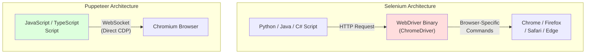
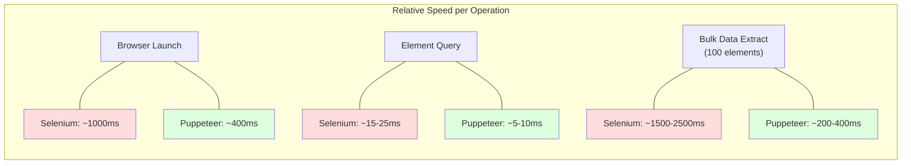
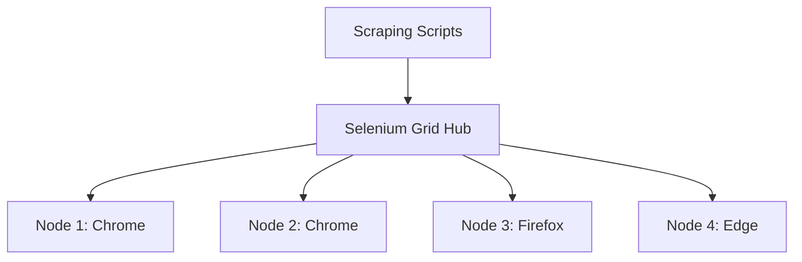
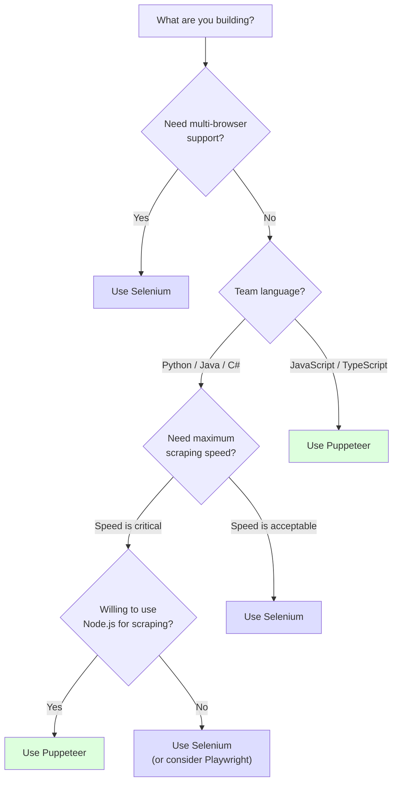

Selenium and Puppeteer remain the two most discussed browser automation tools for web scraping in 2026. Both can drive a real browser, render JavaScript-heavy pages, and extract data that static HTTP requests cannot reach. But they are built on fundamentally different architectures, support different languages, and make different tradeoffs between flexibility and performance. Choosing the wrong one for your use case means fighting the tool instead of building your scraper.

This guide breaks down every dimension that matters -- architecture, performance, language support, stealth, browser coverage, and ecosystem -- so you can make the right call for your specific project.

## Architecture: WebDriver Protocol vs Chrome DevTools Protocol

The single biggest difference between Selenium and Puppeteer is how they communicate with the browser. This architectural distinction ripples through everything else: speed, capabilities, and the types of tasks each tool handles well.

**Selenium** uses the W3C WebDriver protocol. Your scraping script sends commands to a WebDriver binary (like ChromeDriver or GeckoDriver), which translates those commands into browser-specific instructions. This adds a network hop and a translation layer between your code and the browser.

**Puppeteer** uses the Chrome DevTools Protocol (CDP) directly. Your script connects to the browser over a WebSocket and issues CDP commands with no intermediary. This is the same protocol that Chrome DevTools uses when you open the inspector panel -- and it works equally well for tasks like [automating web form filling](/posts/how-to-automate-web-form-filling-complete-guide/).



The WebDriver layer in Selenium is not just a relay -- it performs protocol translation, manages sessions, and handles cross-browser differences. That abstraction is what gives Selenium its multi-browser support, but it comes at a latency cost. Every command round-trips through the driver binary before reaching the browser.

Puppeteer skips that layer entirely. CDP commands go straight from your Node.js process to the browser process over a local WebSocket connection. The result is lower latency per command and access to low-level browser features like network interception, coverage analysis, and performance tracing that WebDriver does not expose.

## Language Support

One of Selenium's strongest advantages is its language coverage. Puppeteer is tightly bound to the JavaScript ecosystem.

| Feature | Selenium | Puppeteer |
|---------|----------|-----------|
| **Primary Languages** | Python, Java, C#, Ruby, JavaScript | JavaScript, TypeScript |
| **Community Ports** | Extensive bindings for most languages | Pyppeteer (Python, unmaintained) |
| **Package Manager** | pip, Maven, NuGet, gem, npm | npm |
| **Documentation** | Multi-language examples | JS/TS only |

If your team writes Python and has no interest in maintaining a Node.js scraping service, Selenium is the practical choice. If you are already working in JavaScript or TypeScript, Puppeteer integrates naturally into your stack.

The Python port of Puppeteer, **Pyppeteer**, saw its last meaningful update in 2021. It is pinned to an old Chromium version and lacks support for modern CDP features. Relying on it for production scraping in 2026 is not advisable. If you want CDP-based browser control from Python, [Playwright is the better option](/posts/playwright-vs-puppeteer-speed-stealth-developer-experience/) -- but that is a different comparison.

## Performance Benchmarks

Puppeteer is measurably faster than Selenium for most scraping operations. The performance gap comes directly from the architectural difference described above.

**Startup time.** Puppeteer launches a Chromium instance and establishes a CDP connection in roughly 300-500ms. Selenium must launch both the browser and the WebDriver binary, then establish an HTTP session between them, typically taking 800-1500ms.

**Command latency.** Each Selenium command (click, find element, get text) requires an HTTP round-trip to the WebDriver binary. Puppeteer sends CDP messages over a persistent WebSocket, avoiding the per-command connection overhead. For scripts that execute hundreds of DOM queries, this difference compounds.

**Page interaction speed.** Puppeteer's `page.evaluate()` runs JavaScript directly inside the browser context and returns the result in a single CDP message. Selenium's equivalent requires multiple WebDriver calls to locate elements and extract their properties individually.



The largest gap appears in bulk data extraction. (For a deeper look at how Selenium's overhead compares to lightweight HTTP clients, see our [Python Requests vs Selenium speed comparison](/posts/python-requests-vs-selenium-speed-performance-comparison/).) When scraping 100 elements from a page, Selenium typically calls `find_elements` followed by individual `text` or `get_attribute` calls for each element -- potentially hundreds of WebDriver round-trips. Puppeteer can extract everything in a single `page.evaluate()` call that runs entirely inside the browser.

## Code Comparison: Same Scraping Task

Here is the same scraping task implemented in both tools: navigate to a page, extract the title, and collect all links with their text and URLs.

### Selenium (Python)

```python
from selenium import webdriver
from selenium.webdriver.chrome.options import Options
from selenium.webdriver.common.by import By
from selenium.webdriver.support.ui import WebDriverWait
from selenium.webdriver.support import expected_conditions as EC

def scrape_with_selenium(url):
    options = Options()
    options.add_argument("--headless=new")
    options.add_argument("--no-sandbox")
    options.add_argument("--disable-dev-shm-usage")

    driver = webdriver.Chrome(options=options)

    try:
        driver.get(url)

        # Wait for body to be present
        WebDriverWait(driver, 10).until(
            EC.presence_of_element_located((By.TAG_NAME, "body"))
        )

        # Extract page title
        title = driver.title
        print(f"Page title: {title}")

        # Extract all links
        link_elements = driver.find_elements(By.TAG_NAME, "a")
        links = []
        for element in link_elements:
            href = element.get_attribute("href")
            text = element.text.strip()
            if href and text:
                links.append({"text": text, "url": href})

        print(f"Found {len(links)} links")
        for link in links[:5]:
            print(f"  {link['text']} -> {link['url']}")

        return {"title": title, "links": links}

    finally:
        driver.quit()

results = scrape_with_selenium("https://example.com")
```

### Puppeteer (JavaScript)

```javascript
const puppeteer = require("puppeteer");

async function scrapeWithPuppeteer(url) {
  const browser = await puppeteer.launch({ headless: true });
  const page = await browser.newPage();

  try {
    await page.goto(url, { waitUntil: "domcontentloaded" });

    // Extract title and all links in a single evaluate call
    const results = await page.evaluate(() => {
      const title = document.title;

      const linkElements = Array.from(document.querySelectorAll("a"));
      const links = linkElements
        .map((el) => ({
          text: el.textContent.trim(),
          url: el.href,
        }))
        .filter((link) => link.url && link.text);

      return { title, links };
    });

    console.log(`Page title: ${results.title}`);
    console.log(`Found ${results.links.length} links`);
    results.links.slice(0, 5).forEach((link) => {
      console.log(`  ${link.text} -> ${link.url}`);
    });

    return results;
  } finally {
    await browser.close();
  }
}

scrapeWithPuppeteer("https://example.com");
```

Notice the structural difference. The Selenium version makes separate calls for each element and each attribute. The Puppeteer version uses `page.evaluate()` to run a single JavaScript function inside the browser and returns all the data at once. This is why Puppeteer is faster for data extraction -- fewer round-trips, less serialization overhead.

## Stealth and Detection Avoidance

Both Selenium and Puppeteer are [detectable by default](/posts/playwright-vs-selenium-stealth-which-evades-detection-better/). Anti-bot systems look for browser fingerprint anomalies that automation tools introduce: missing APIs, inconsistent property values, and the presence of automation-specific variables like `navigator.webdriver`. These [detection methods have evolved significantly](/posts/evolution-web-scraping-detection-methods-timeline/) over the years.

### Default Detection Vectors

- **Selenium** sets `navigator.webdriver` to `true`, injects `cdc_` prefixed variables into the DOM (from ChromeDriver), and often runs with a non-standard user agent or window size
- **Puppeteer** sets `navigator.webdriver` to `true`, reports a headless Chrome user agent string, has inconsistent WebGL renderer information, and lacks certain plugins that real browsers expose

### Stealth Solutions

**puppeteer-extra-plugin-stealth** is the most mature stealth solution in the Puppeteer ecosystem. It applies a series of evasion patches -- fixing the `navigator.webdriver` flag, spoofing WebGL vendor strings, adding missing plugin entries, and more.

```javascript
const puppeteer = require("puppeteer-extra");
const StealthPlugin = require("puppeteer-extra-plugin-stealth");

puppeteer.use(StealthPlugin());

async function stealthScrape(url) {
  const browser = await puppeteer.launch({ headless: true });
  const page = await browser.newPage();
  await page.goto(url, { waitUntil: "networkidle2" });

  const content = await page.content();
  console.log(`Page loaded, HTML length: ${content.length}`);

  await browser.close();
}

stealthScrape("https://example.com");
```

**selenium-stealth** provides similar evasion capabilities for Python Selenium users.

```python
from selenium import webdriver
from selenium.webdriver.chrome.options import Options
from selenium_stealth import stealth

options = Options()
options.add_argument("--headless=new")

driver = webdriver.Chrome(options=options)

stealth(
    driver,
    languages=["en-US", "en"],
    vendor="Google Inc.",
    platform="Win32",
    webgl_vendor="Intel Inc.",
    renderer="Intel Iris OpenGL Engine",
    fix_hairline=True,
)

driver.get("https://example.com")
print(f"Page title: {driver.title}")
driver.quit()
```

Neither stealth solution is a silver bullet. Sophisticated anti-bot systems like [Cloudflare Turnstile](/posts/cloudflare-ai-labyrinth-how-honeypot-pages-are-trapping-scrapers/) and DataDome use [behavioral analysis, TLS fingerprinting](/posts/stealth-browsers-in-2026-camoufox-nodriver-and-the-anti-detection-arms-race/), and other signals that go beyond what browser-level patches can fix. But for basic bot detection checks, both plugins significantly reduce the detection surface.

## Browser Support

This is where Selenium has a clear advantage. If your scraping targets require specific browsers, your choice may already be made.

| Browser | Selenium | Puppeteer |
|---------|----------|-----------|
| **Chrome / Chromium** | Full support | Full support |
| **Firefox** | Full support | Experimental (since Puppeteer v21) |
| **Safari** | Full support (via SafariDriver) | Not supported |
| **Microsoft Edge** | Full support | Supported (Chromium-based) |
| **Opera** | Community support | Not supported |

Selenium's multi-browser support comes from the WebDriver standard being a W3C specification that all major browser vendors implement. Each browser ships its own WebDriver binary (ChromeDriver, GeckoDriver, SafariDriver, msedgedriver), and Selenium communicates with all of them through the same protocol.

Puppeteer was built specifically for Chromium. The team added experimental Firefox support by implementing a subset of the CDP interface for Firefox, but it remains incomplete and is not recommended for production use. In practice, Puppeteer means Chromium.

For most web scraping tasks, Chromium-only support is not a problem -- you are extracting data, and the browser rendering engine rarely matters. But if you need to test how a site behaves across browsers, or if a target site serves different content to different browsers, Selenium's cross-browser support becomes essential.

## Ecosystem and Advanced Features

### Selenium Grid

Selenium Grid lets you distribute scraping tasks across multiple machines and browsers in parallel. You set up a hub that receives WebDriver requests and routes them to registered nodes running different browser configurations.



This is a mature solution for running scraping workloads at scale. Docker images for Selenium Grid are officially maintained, and the infrastructure is well understood. For large-scale scraping operations that need horizontal scaling, Selenium Grid provides a ready-made distributed execution layer.

### Puppeteer's page.evaluate

Puppeteer's `page.evaluate()` is one of its most powerful features for scraping. It lets you execute arbitrary JavaScript inside the browser context and return serializable data to your Node.js script. This means you can use the full DOM API, run complex data extraction logic, and get everything back in a single call.

```javascript
const puppeteer = require("puppeteer");

async function extractStructuredData(url) {
  const browser = await puppeteer.launch({ headless: true });
  const page = await browser.newPage();
  await page.goto(url, { waitUntil: "domcontentloaded" });

  // Run complex extraction logic entirely inside the browser
  const data = await page.evaluate(() => {
    const products = Array.from(document.querySelectorAll(".product-card"));

    return products.map((card) => {
      const title = card.querySelector(".title")?.textContent?.trim() || "";
      const price = card.querySelector(".price")?.textContent?.trim() || "";
      const rating = card.querySelector(".rating")?.getAttribute("data-score") || null;
      const inStock = card.querySelector(".stock-status")?.classList.contains("in-stock") || false;

      // Access computed styles
      const priceEl = card.querySelector(".price");
      const priceColor = priceEl
        ? getComputedStyle(priceEl).color
        : null;

      return { title, price, rating, inStock, priceColor };
    });
  });

  console.log(`Extracted ${data.length} products`);
  await browser.close();
  return data;
}

extractStructuredData("https://example.com/products");
```

Selenium can achieve similar results using `driver.execute_script()`, but the integration is less seamless. Returning complex objects requires careful serialization, and mixing Python logic with JavaScript strings is more error-prone than Puppeteer's native JavaScript approach.

### Network Interception

Puppeteer offers built-in network interception through CDP's Fetch and Network domains. You can monitor requests, modify headers, block resource types, or mock API responses.

```javascript
const puppeteer = require("puppeteer");

async function scrapeWithInterception(url) {
  const browser = await puppeteer.launch({ headless: true });
  const page = await browser.newPage();

  // Block images and stylesheets to speed up scraping
  await page.setRequestInterception(true);
  page.on("request", (request) => {
    const resourceType = request.resourceType();
    if (["image", "stylesheet", "font"].includes(resourceType)) {
      request.abort();
    } else {
      request.continue();
    }
  });

  // Capture API responses
  page.on("response", async (response) => {
    if (response.url().includes("/api/")) {
      const data = await response.json().catch(() => null);
      if (data) {
        console.log(`API response from ${response.url()}:`, data);
      }
    }
  });

  await page.goto(url, { waitUntil: "networkidle2" });
  await browser.close();
}

scrapeWithInterception("https://example.com");
```

Selenium 4 added CDP support for Chromium-based browsers through `driver.execute_cdp_cmd()`, but the API is lower-level and requires constructing raw CDP commands. Network interception through Selenium is possible but significantly more verbose.


<figure>
  
  <figcaption>Puppeteer's lighter install trades multi-browser support for faster Chrome-specific workflows. <span class="img-credit">Photo by Lukas Blazek / <a href="https://www.pexels.com" target="_blank" rel="noopener noreferrer">Pexels</a></span></figcaption>
</figure>

## Full Comparison Table

| Dimension | Selenium | Puppeteer |
|-----------|----------|-----------|
| **Protocol** | W3C WebDriver | Chrome DevTools Protocol (CDP) |
| **Primary Language** | Python (most popular) | JavaScript / TypeScript |
| **Multi-Language** | Python, Java, C#, Ruby, JS | JS/TS only |
| **Browser Support** | Chrome, Firefox, Safari, Edge | Chromium (experimental Firefox) |
| **Startup Speed** | Slower (~1000ms) | Faster (~400ms) |
| **Command Latency** | Higher (HTTP round-trips) | Lower (WebSocket) |
| **Bulk Extraction** | Slower (per-element calls) | Faster (page.evaluate) |
| **Network Interception** | Limited (CDP commands in Selenium 4) | Built-in, first-class |
| **Distributed Execution** | Selenium Grid (mature) | No built-in solution |
| **Stealth Plugins** | selenium-stealth | puppeteer-extra-plugin-stealth |
| **Headless Mode** | All browsers | Chromium only |
| **Community Size** | Larger, older ecosystem | Large, active npm ecosystem |
| **Learning Resources** | Extensive (20+ years) | Good (since 2017) |
| **Maintenance** | Active (Selenium 4.x) | Active (Google-backed) |

## When to Use Each Tool

The right choice depends on your specific constraints. Here is a decision framework (for a more detailed breakdown, see our [Puppeteer vs Selenium decision guide](/posts/puppeteer-vs-selenium-which-should-you-pick/)).



### Choose Selenium When

- **Your team works in Python, Java, or C#** and you want native language bindings without maintaining a separate Node.js service
- **You need cross-browser testing** alongside your scraping -- Selenium handles Chrome, Firefox, Safari, and Edge uniformly
- **You need distributed execution** and want Selenium Grid's mature infrastructure for running scrapers across multiple machines
- **You are scraping at moderate scale** where the per-command latency overhead is not your bottleneck (network latency to target sites usually dominates)
- **Your organization already has Selenium infrastructure** -- driver management, grid clusters, and existing scripts are all sunk costs worth leveraging

### Choose Puppeteer When

- **You work in JavaScript or TypeScript** and want the most natural integration with the browser's own APIs
- **You need maximum extraction speed** for pages with many elements, where `page.evaluate()` eliminates the per-element round-trip overhead
- **You need deep browser control** -- network interception, performance tracing, coverage analysis, or access to low-level CDP features
- **Chromium-only is acceptable** for your use case, which it is for the vast majority of data extraction tasks
- **You want the puppeteer-extra ecosystem** for stealth, ad blocking, and other plugin-based capabilities

### Consider Alternatives

If neither tool fits perfectly, it is worth mentioning that **Playwright** combines many advantages of both: CDP-level performance, multi-browser support, and first-class bindings for Python, JavaScript, Java, and C#. For new projects in 2026 with no legacy constraints, Playwright is increasingly [the default recommendation](/posts/playwright-vs-puppeteer-vs-selenium-vs-scrapy-2026-mega-comparison/). But Selenium and Puppeteer remain excellent tools with massive ecosystems, and choosing either one is a reasonable decision when it matches your team's existing stack. If Puppeteer does not quite fit, there are also several [strong Puppeteer alternatives](/posts/top-puppeteer-alternatives-what-to-use-instead/) worth evaluating.

## Practical Recommendations

For teams starting a new scraping project today, here is the pragmatic advice:

1. **Use `page.evaluate()` patterns in Puppeteer.** The single biggest performance win in Puppeteer scraping is batching your extraction logic into `page.evaluate()` calls instead of making individual CDP requests for each element.

2. **Use `execute_script()` in Selenium for bulk extraction.** You can close much of the performance gap with Puppeteer by using `driver.execute_script()` to run JavaScript that extracts multiple elements at once, rather than calling `find_elements` and iterating in Python.

3. **Add stealth plugins from the start.** Whether you use `puppeteer-extra-plugin-stealth` or `selenium-stealth`, add them before you encounter bot detection -- retrofitting stealth into an existing scraper is harder than starting with it.

4. **Block unnecessary resources.** Both tools let you avoid loading images, fonts, and stylesheets. This reduces bandwidth, speeds up page loads, and makes your scraper faster regardless of which tool you choose.

5. **Plan for detection escalation.** Neither tool with stealth plugins will bypass sophisticated anti-bot systems indefinitely. Design your scraping architecture so you can swap in residential proxies, browser fingerprint rotation, or alternative tools without rewriting your extraction logic.

The Selenium vs Puppeteer debate has no universal winner. Each tool is the right choice for a different set of constraints. Match the tool to your team, your language, and your specific scraping requirements, and you will spend your time building scrapers instead of fighting your tooling.
