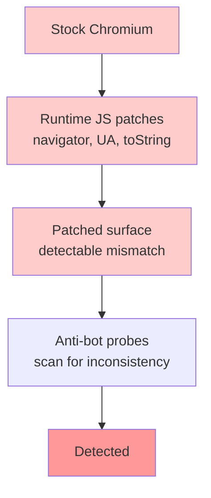
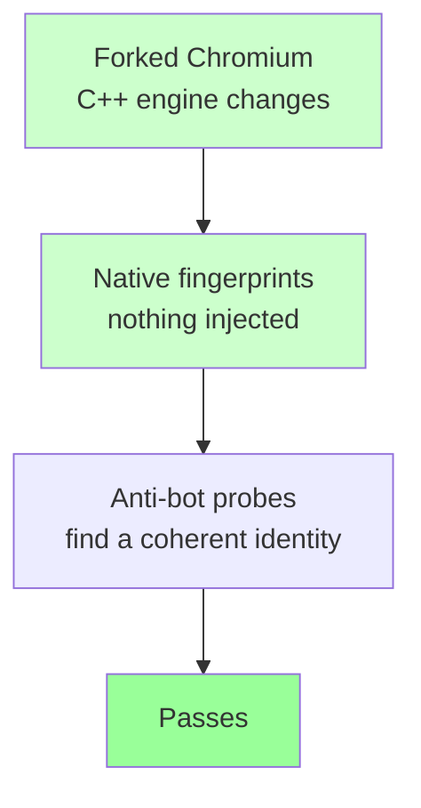

Every anti-bot fight eventually comes down to one question: **at which layer are you fighting it?** Spend enough time unblocking scrapers and you start to see that the answer decides everything. Pick the wrong layer and it does not matter how clever your disguise is — you have already lost. ChromiumFish is what I built once I got tired of losing in the same spot.

I have written before about solving fingerprinting one layer down, at the TLS handshake, with [httpmorph](/posts/httpmorph-solving-tls-fingerprinting-with-a-c-native-python-http-client/). ChromiumFish is the same idea carried up into the browser: fix the leak where it is produced, not where it is observed.

## The Layer Trap

Reach for almost any stealth tool and the mechanism is the same: it loads a browser, then injects JavaScript to rewrite the parts that look automated. Override `navigator.webdriver`, swap the User-Agent, monkey-patch a few functions, ship it. The [selenium-stealth](/posts/selenium-stealth-making-selenium-less-detectable/) and [undetected-playwright](/posts/undetected-playwright-vs-playwright-stealth-which-plugin/) families all live here.

The trouble is that injection leaves marks at the exact altitude the better detectors are scanning. Patch a built-in and `Function.prototype.toString` no longer returns what a clean function should. That mismatch *is* the signal. You went to the page wearing a disguise, but the disguise was painted on with the kind of paint the bouncer is specifically trained to spot. I tried a long list of these — free ones, paid ones — and on the targets I cared about they failed for the same reason every time. This is the whole story of the [evolution of detection methods](/posts/evolution-web-scraping-detection-methods-timeline/): every year the probes move closer to the engine.

The fix is not a better patch. It is not patching from up there at all.

The injection approach, where the disguise sits at the altitude detectors scan:



ChromiumFish, where the disguise is compiled in below where the probes can reach:



## Pushing the Disguise Down Into Chromium

ChromiumFish is a fork of Chromium where the fingerprint hardening is compiled into the C++ engine itself. Nothing is injected at runtime, so there is nothing for a tamper check to trip over. `navigator.webdriver` reads `false` even under CDP. There is no `cdc_` automation residue. `toString` returns exactly what it should, because nothing was rewritten after the fact — it was always that way. This is the same bet [Camoufox makes inside Firefox](/posts/camoufox-tutorial-setting-up-fingerprint-resistant-firefox/), and it is the dividing line in the [2026 stealth-browser landscape](/posts/stealth-browsers-in-2026-camoufox-nodriver-and-the-anti-detection-arms-race/).

From inside the engine it produces one *coherent* identity rather than a pile of independently-faked values. User-Agent and Client Hints, the WebGL vendor/renderer string (a real D3D11/ANGLE GPU, none of the Apple or Metal tells you would leak from the wrong host), fonts, audio, screen metrics, WebRTC — all consistent with each other, all settled before the first byte of page script runs.

And because the result is still genuinely Chromium, you drive it with Playwright exactly like you always have. The SDK barely does anything: it is a thin shell over `chromium.launch(executablePath=…)`. One line to install, and the matching build downloads, gets its SHA-256 verified, and caches itself on first run.

```bash
pip install chromiumfish
```

```python
from chromiumfish.sync_api import Chromiumfish

with Chromiumfish(persona_seed="alpha-7", headless=True) as browser:
    page = browser.new_page()
    page.goto("https://example.com")
    page.screenshot(path="fingerprint.png")
```

If you already have a [Playwright](/posts/playwright-for-browser-automation-in-ai-agents/) scraper, swapping in ChromiumFish is a one-import change — the rest of your `page.goto`, `page.fill`, and `page.click` code is untouched.

## Identity as a Single String

The thing I cared about most was not any one spoofed value — it was making identities **rotatable without making them incoherent.** A random scatter of properties is its own fingerprint; real machines do not look randomly assembled. Throwing a fresh [random User-Agent](/posts/changing-user-agents-playwright-why-and-how/) at every request without changing anything behind it is exactly the kind of mismatch that gets you flagged.

So ChromiumFish takes a `persona_seed`: hand it any stable string and it deterministically builds one internally consistent persona, with the correlations real hardware has — core count and RAM that make sense together, that sort of thing. Keep the seed and you are the same machine tomorrow. Swap it and you are a clean, unlinkable one. Rotation becomes a one-character edit.

Small thing that punches above its weight: set `timezone="auto"` and the browser pulls its timezone from your egress IP, so it agrees with whatever proxy you are exiting through instead of quietly announcing a mismatch.

## Letting the Browser Run the Task Itself

Beyond steering it by hand, you can describe a job in plain language and let ChromiumFish carry it out. The agent that does this is not an outside script poking the page through Playwright — it lives **inside the browser process**, in C++, for the same reason the spoofing does: an external automation channel is one more thing a site can notice. That is the gap most [AI browser agents](/posts/ai-browser-agents-playwright-for-ai-agent-automation/) and [the frameworks built on Playwright](/posts/browser-agent-frameworks-compared-browser-use-vs-stagehand-vs-skyvern/) leave open.

It loops: read the page's interactive elements, send them to your LLM (any OpenAI-compatible endpoint — OpenAI, OpenRouter, a local proxy, anything with tool calling), get back a compact JSON plan, run it, look again. Input is humanized — typing goes in key by key around 75 WPM by default, and a little overlay (a cyan box on the target, a red dot at the click) lets you watch it work in a visible window. Consent modals and "prove you're human" gates are part of what it clears on its own.

<figure>
  
  <figcaption>The native agent working a live task — cyan box on the current target, red dot at each click, typed in key by key at human speed.</figcaption>
</figure>

The detail I use the most: a finished run returns a **replayable plan.** Hand that plan back next time and it re-runs the flow deterministically, only waking the LLM when something has shifted and needs repair. Solve a flow once, replay it cheaply forever.

```python
from chromiumfish import launch_agent

with launch_agent() as agent:
    result = agent.run_task("Search DuckDuckGo for 'chromiumfish' and give me the first result's URL.")
    print(result.final_text)
```

## The Pixels I Refuse to Fake Badly

Here is where I will be plainer than most stealth projects are willing to be. Canvas and WebGL *pixels* are the one surface ChromiumFish does not spoof in the engine. On headless Linux those reads come from SwiftShader's software renderer, and a fingerprinter that hashes canvas or WebGL output can tell software rendering from a real GPU. That is a genuine gap, and I would rather name it than paper over it with noise that is its own tell.

The honest fix is to not synthesize those pixels at all — borrow real ones. That is **canvas-bridge**: a separate little Rust service you run on an actual Windows box. Switch it on and Blink forwards its canvas2d/WebGL operations over a socket to that host; the host renders them through the real Windows graphics stack — DirectWrite, D3D11, Skia — and sends the true bytes back. `toDataURL`, `getImageData`, `readPixels`, and `measureText` then return what a real Windows GPU produces, because that is literally where they came from.

<figure>
  
  <figcaption>The full picture: a Playwright-driven Chromium fork with hardening compiled into Blink, plus the optional canvas-bridge service rendering real pixels on a Windows host.</figcaption>
</figure>

It is entirely opt-in: two command-line switches and nothing more. Leave them off and the browser renders locally and never reaches out. You only need it when a specific target is hashing canvas/WebGL and treating headless-Linux output as proof of a bot. One caveat from the docs: the browser-side link is plaintext `ws://` for now, so run it across a Tailscale network or an SSH tunnel and keep the port off the open internet.

## Where the Name Comes From

It is named for the **silverfish** — a 400-million-year-old insect that has outlasted four mass extinctions by being completely unremarkable. No shell, no speed, no trail anyone bothers to follow. It survives by not being worth noticing. That is the whole brief for a browser that would prefer to go unfingerprinted.

## Try It

ChromiumFish is open source and MIT-licensed, with prebuilt binaries for macOS and Linux today and a Windows build on the way.

```bash
pip install chromiumfish
```

A word on intent, because it matters: this exists for understanding how fingerprinting works and for testing systems you own or are cleared to test. Use it inside the law and inside the ToS of wherever you send it — the same line I draw around every tool on this site.

- **Code:** [github.com/arman-bd/chromiumfish](https://github.com/arman-bd/chromiumfish)
- **Docs:** [chromiumfish.com](https://chromiumfish.com)

If something has been blocking everything you have tried, point this at it and tell me how it goes.
